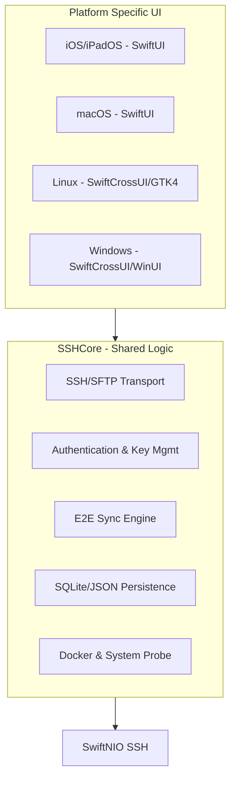
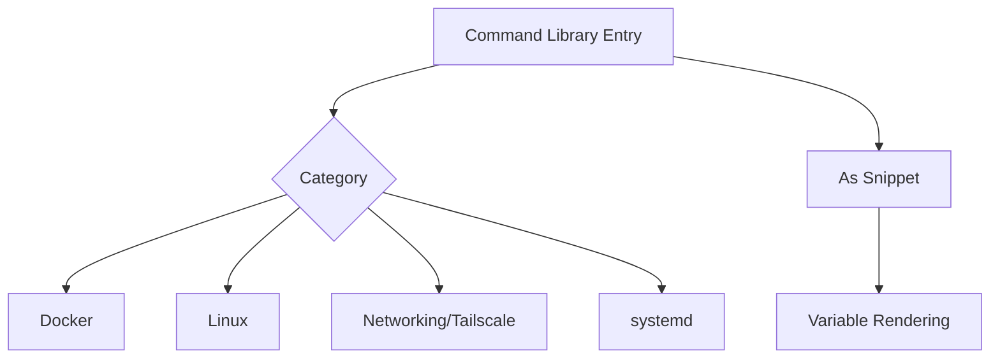

Relevant source files

The following files were used as context for generating this wiki page:

- [README.md](README.md)
- [VISION.md](VISION.md)
- [SECURITY.md](SECURITY.md)
- [App/project.yml](App/project.yml)
- [Package.swift](Package.swift)
- [Sources/SSHCore/CommandLibrary.swift](Sources/SSHCore/CommandLibrary.swift)

# Home & Overview

Bastion is a free, open-source, and standalone SSH client designed for cross-platform availability across iOS, macOS, Linux, and Windows. Built on top of Apple's `swift-nio-ssh`, it utilizes a shared core logic (`SSHCore`) to ensure consistent behavior across all supported platforms while maintaining native user interfaces for each. The project's vision is to provide a privacy-friendly alternative to commercial SSH clients like Termius, offering core features without mandatory logins, subscriptions, or advertising.

The platform emphasizes security through local encryption of keys and E2E-encrypted synchronization, as well as productivity features like a built-in Docker manager, SFTP file browser, and a comprehensive command library. It aims to be the fastest and most aesthetically pleasing client for system administrators, DevOps professionals, and homelab enthusiasts.

Sources: [README.md:1-12](README.md#L1-L12), [VISION.md:1-12](VISION.md#L1-L12)

## Architecture & Core Philosophy

Bastion is architected to separate business logic from the presentation layer. The `SSHCore` module, written in pure Swift, handles all networking, protocol implementations, and data persistence. This allows the core to be built and tested on both Linux and Apple platforms.

### High-Level Architecture
The following diagram illustrates the relationship between the shared core and the platform-specific UI layers.

The UI layer remains thin, acting as "glue" to the robust, tested logic within `SSHCore`.

Sources: [README.md:1-12](README.md#L1-L12), [VISION.md:31-42](VISION.md#L31-L42), [Package.swift:1-15](Package.swift#L1-L15)

## Cross-Platform Implementation

The project targets major operating systems using different UI frameworks while retaining the same Swift-based core.

| Platform | Core Implementation | UI Framework | Status |
| :--- | :--- | :--- | :--- |
| **iOS / iPadOS** | `SSHCore` | SwiftUI (`App/`) | Phase 1 - Active |
| **macOS** | `SSHCore` | SwiftUI (Shared with iOS) | Phase 2 - Active |
| **Linux** | `SSHCore` | SwiftCrossUI / GTK4 (`LinuxApp/`) | Phase 3 - Active |
| **Windows** | `SSHCore` | SwiftCrossUI / WinUI (`WindowsApp/`) | Phase 4 - In Progress |

Sources: [README.md:14-25](README.md#L14-L25), [VISION.md:44-50](VISION.md#L44-L50), [App/project.yml:25-35](App/project.yml#L25-L35)

### Development and Build Tools
The project utilizes several modern tools to manage cross-platform builds:
*  **SwiftPM**: Used for the root package and the dedicated Linux/Windows GUI packages.
*  **XcodeGen**: Generates the `Bastion.xcodeproj` from `project.yml` for Apple platforms.
*  **Fastlane**: Manages TestFlight uploads and signing certificates for iOS.

Sources: [README.md:152-162](README.md#L152-L162), [App/project.yml:1-10](App/project.yml#L1-L10)

## Key Features

### 1. SSH & Terminal
Bastion supports modern SSH protocols including Ed25519, ECDSA, and RSA. It provides advanced features like ProxyJump, Agent Forwarding, and YubiKey support. The terminal emulation is designed for high performance, supporting True Color, UTF-8, and custom keyboard extensions for mobile devices.

Sources: [VISION.md:52-71](VISION.md#L52-L71)

### 2. Synchronization & Privacy
The app features a "Sync without login" mechanism. The host database is merged deterministically via a `SyncEngine` and stored as a file.
*  **Transport**: Supports iCloud Drive, Dropbox, Syncthing, or Git.
*  **Encryption**: Uses `EncryptedFolderSyncProvider` with **AES-256-GCM** encryption. Keys are derived via **PBKDF2-HMAC-SHA256**.
*  **OAuth**: Implements PKCE-based OAuth2 for account integrations (Dropbox, Google Drive, OneDrive).

Sources: [README.md:27-46](README.md#L27-L46), [SECURITY.md:59-65](SECURITY.md#L59-L65)

### 3. Command Library & Snippets
The `CommandLibrary` provides a static reference for common administrative tasks, while the `SnippetStore` allows users to save custom commands with variables.

Commonly used categories include `docker compose`, `systemctl`, and `git` operations.

Sources: [Sources/SSHCore/CommandLibrary.swift:8-30](Sources/SSHCore/CommandLibrary.swift#L8-L30)

## Security Policy

Security is a primary pillar of the Bastion project. All sensitive data, including SSH keys and OAuth tokens, are stored in the system Keychain (iOS/macOS) and never stored in plaintext on disk.

### Security Best Practices
*  **No Secrets in Code**: Clients use PKCE-based OAuth; no client secrets are stored in the repository.
*  **Local Encryption**: Keys and passwords never leave the device unencrypted.
*  **Auditability**: The project is 100% open-source (MIT License) to allow for public security audits.

Sources: [SECURITY.md:1-15](SECURITY.md#L1-L15), [SECURITY.md:55-68](SECURITY.md#L55-L68), [VISION.md:118-122](VISION.md#L118-L122)

## Summary & Significance

Bastion represents a significant effort to provide a high-quality, professional SSH toolset that remains accessible and privacy-focused. By utilizing a shared Swift core across mobile, desktop, and server environments, it minimizes maintenance overhead while maximizing performance through native UI implementations. Its commitment to open-source and E2E-encrypted synchronization positions it as a competitive, user-respecting alternative in the systems administration software market.

Sources: [VISION.md:1-12](VISION.md#L1-L12), [README.md:1-12](README.md#L1-L12)
