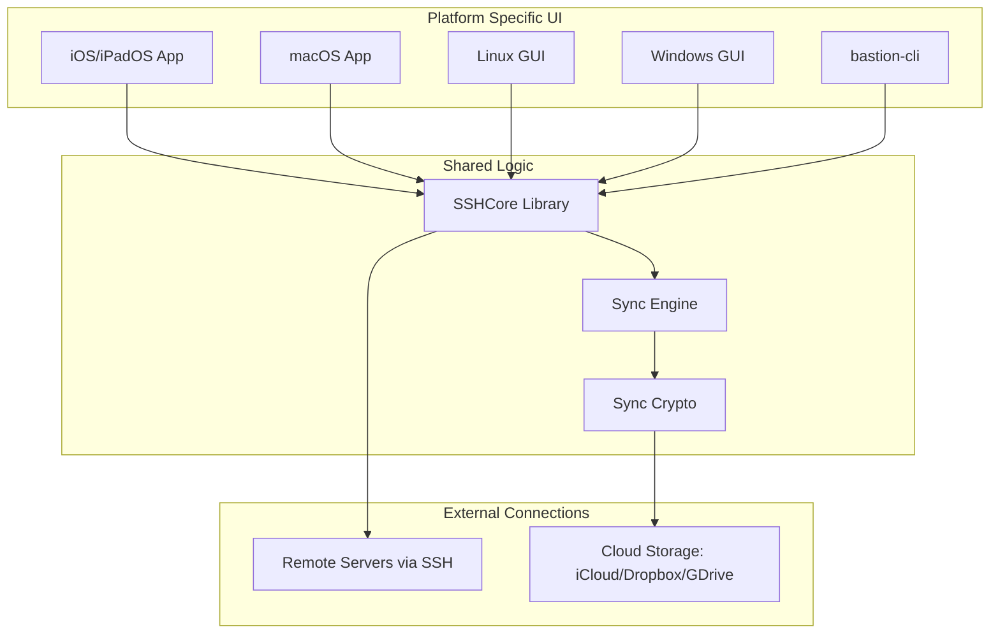
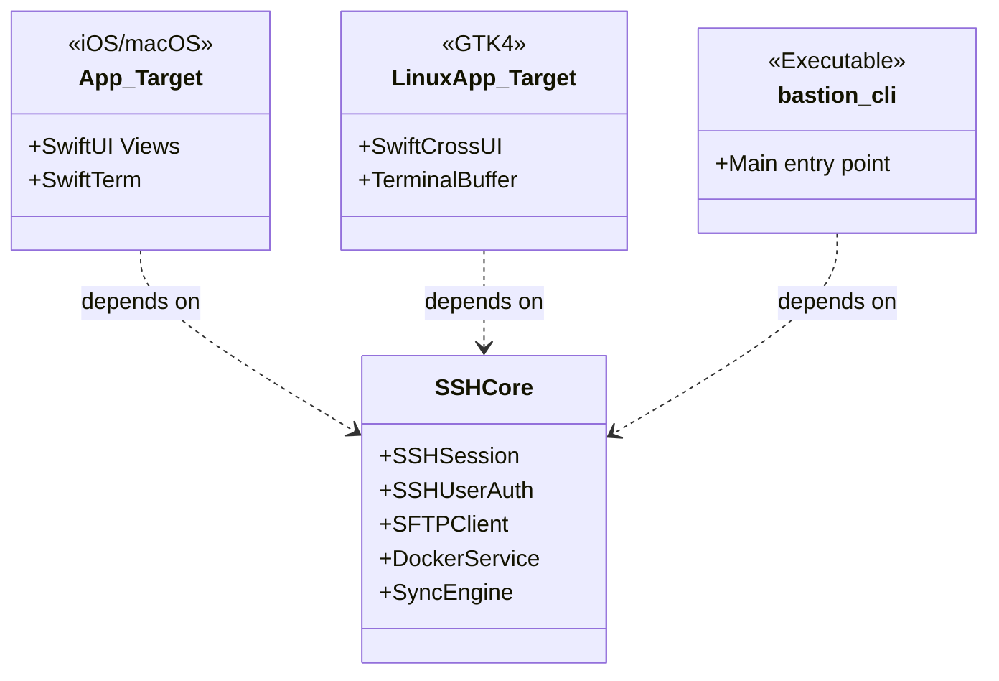

Relevant source files

The following files were used as context for generating this wiki page:

- [README.md](README.md)
- [VISION.md](VISION.md)
- [Package.swift](Package.swift)
- [AGENTS.md](AGENTS.md)
- [SECURITY.md](SECURITY.md)
- [App/project.yml](App/project.yml)

# Home & Overview

Bastion is a free, open-source, and standalone SSH client designed for multiple platforms including iOS, macOS, Linux, and Windows. Unlike many modern tools, Bastion is not a containerized application but a native executable built on top of [SwiftNIO SSH](https://github.com/apple/swift-nio-ssh). Its primary goal is to provide a high-performance, privacy-focused experience for system administrators, DevOps engineers, and Linux enthusiasts, offering features like SFTP, Docker management, and end-to-end encrypted synchronization without mandatory logins or subscriptions.

Sources: [README.md:1-8](README.md#L1-L8), [VISION.md:3-8](VISION.md#L3-L8), [AGENTS.md:3-5](AGENTS.md#L3-L5)

## Architecture & Core Philosophy

The project follows a "thin UI, thick core" architecture. The business logic is encapsulated in a pure Swift library called `SSHCore`, which is tested and compatible across all supported platforms. The user interface layer is platform-specific, utilizing native frameworks to ensure the best possible user experience on each device.

### Multi-Platform Strategy

| Component | Technology | Target Platforms |
| :--- | :--- | :--- |
| **Core Logic** | SwiftNIO (`SSHCore`) | All (Linux, macOS, iOS, Windows) |
| **Mobile/Desktop UI** | SwiftUI (`App/`) | iOS, iPadOS, macOS |
| **Linux UI** | SwiftCrossUI / GTK4 (`LinuxApp/`) | Linux Distributions |
| **Windows UI** | SwiftCrossUI / WinUI (`WindowsApp/`) | Windows |
| **Android UI** | Kotlin / Apache MINA SSHD | Android (Separate Implementation) |

Sources: [README.md:10-18](README.md#L10-L18), [CLAUDE.md:4-9](CLAUDE.md#L4-L9), [VISION.md:27-32](VISION.md#L27-L32)

### System Components Flow

The following diagram illustrates how different application targets interact with the shared `SSHCore` library and external services.

This diagram shows the relationship between platform-specific UI targets and the centralized `SSHCore` library.
Sources: [README.md:10-18](README.md#L10-L18), [README.md:65-125](README.md#L65-L125), [VISION.md:34-40](VISION.md#L34-L40)

## Key Features

### SSH and Terminal
Bastion aims to surpass competitors by focusing on UX parity with premium tools like Termius while remaining free. It supports standard SSH features such as Ed25519, ECDSA, RSA, and OpenSSH certificates. The terminal implementation supports multiple tabs, split views, and specialized mobile keyboards with Esc, Tab, and function keys.

Sources: [VISION.md:52-66](VISION.md#L52-L66), [README.md:66-70](README.md#L66-L70)

### SFTP and File Management
The SFTP client is a full-featured file manager. It supports drag-and-drop, permissions management (chmod/chown), and archive operations (Zip/Tar) performed over the exec channel to remain injection-safe.
Sources: [README.md:88-91](README.md#L88-L91), [VISION.md:87-90](VISION.md#L87-L90)

### Docker Integration
A standout feature is the native Docker management, allowing users to list, start, stop, restart, and view logs of containers on remote servers without requiring an agent on the host.
Sources: [README.md:92](README.md#L92), [VISION.md:83-85](VISION.md#L83-L85)

### Synchronization and Security
Synchronization is designed to be "serverless" and privacy-first.
*  **Encrypted Sync**: Uses `AES-256-GCM` with keys derived via `PBKDF2-HMAC-SHA256`.
*  **Transport Agnostic**: Syncs via simple files that can be placed in iCloud Drive, Dropbox, Syncthing, or Git.
*  **Identity Management**: Secrets are stored in the system Keychain (iOS/macOS) and never leave the device unencrypted.

Sources: [README.md:20-33](README.md#L20-L33), [SECURITY.md:28-40](SECURITY.md#L28-L40)

## Project Structure

The repository is organized to separate the cross-platform core from platform-specific UI implementations.

This class diagram highlights the dependency of various application targets on the `SSHCore` module.
Sources: [Package.swift:23-44](Package.swift#L23-L44), [App/project.yml:106-111](App/project.yml#L106-L111), [LinuxApp/Package.swift:15-20](LinuxApp/Package.swift#L15-L20)

### Directory Map
*  `Sources/SSHCore/`: Pure SwiftNIO implementation of SSH, SFTP, and Docker logic.
*  `App/`: Xcode project specification (`project.yml`) and SwiftUI code for Apple platforms.
*  `LinuxApp/`: A separate SwiftPM package for the Linux GUI to avoid dependency conflicts on stable toolchains.
*  `WindowsApp/`: Minimal initial implementation for Windows using WinUI.
*  `Tests/SSHCoreTests/`: Comprehensive end-to-end tests using an in-process SSH server.

Sources: [README.md:65-125](README.md#L65-L125), [AGENTS.md:3-8](AGENTS.md#L3-L8)

## Security Standards

Bastion implements a strict security policy to protect user credentials:
1.  **OAuth PKCE**: Authentication against cloud providers (Dropbox, Google, OneDrive) uses PKCE to avoid storing client secrets in the binary.
2.  **Local Encryption**: All host databases and keys are encrypted locally before any synchronization occurs.
3.  **No Public Disclosure**: Security vulnerabilities are managed via private reporting rather than public issues.

Sources: [SECURITY.md:1-25](SECURITY.md#L1-L25), [README.md:46-60](README.md#L46-L60)

## Conclusion
Bastion is positioned as a high-quality, open-source alternative to commercial SSH clients. By leveraging a shared Swift core and native UI layers, it provides a consistent and secure experience across mobile and desktop environments, specifically targeting users who value privacy and native performance without recurring costs.
