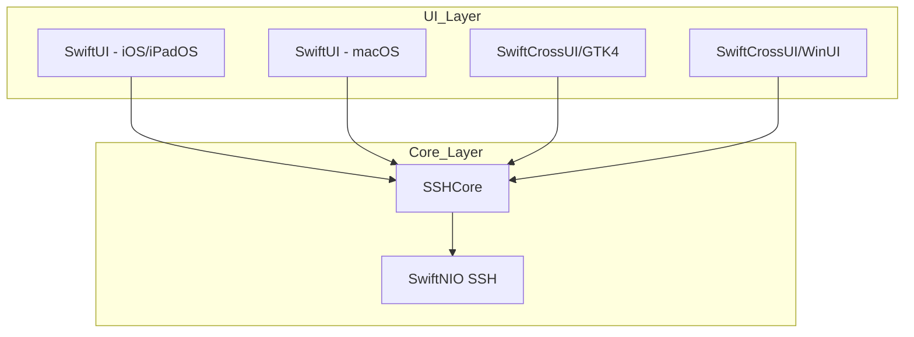
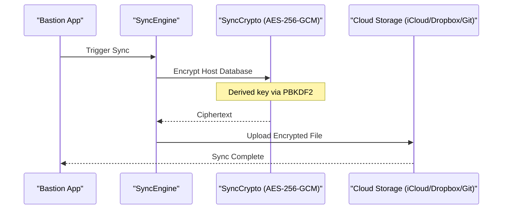

Relevant source files

The following files were used as context for generating this wiki page:

- [VISION.md](VISION.md)
- [README.md](README.md)
- [SECURITY.md](SECURITY.md)
- [CLAUDE.md](CLAUDE.md)
- [AGENTS.md](AGENTS.md)
- [Package.swift](Package.swift)

# Vision & Roadmap

The Bastion project is an ambitious initiative to create the fastest, most aesthetically pleasing, and privacy-friendly SSH client for iOS, macOS, Windows, and Linux. It is designed as a long-term platform rather than a single application, emphasizing 100% open-source availability (MIT license), no advertisements, no mandatory logins, and no subscriptions. All core features are intended to remain free, with potential revenue derived from voluntary cloud synchronization services.

The high-level architecture utilizes a shared core (`SSHCore`) built on SwiftNIO, ensuring that logic for SSH transport, authentication, and database management is consistent across all platforms. Only the UI layer is platform-specific, utilizing SwiftUI for Apple devices and SwiftCrossUI (GTK4/WinUI) for Linux and Windows.

Sources: [VISION.md:1-15](VISION.md#L1-L15), [README.md:1-10](README.md#L1-L10), [Package.swift:1-15](Package.swift#L1-L15)

## Core Architecture and Platform Strategy

The project follows a "Core-First" philosophy. The `SSHCore` library contains the essential business logic, which is tested on Linux and verified for Apple platforms. This modularity allows for a unified experience regardless of the host operating system.

The diagram above illustrates the separation between the platform-agnostic `SSHCore` and the platform-specific UI implementations.

Sources: [README.md:14-25](README.md#L14-L25), [VISION.md:27-35](VISION.md#L27-L35)

### Platform Roadmap Phases
The development is structured into sequential phases to manage resources effectively:

| Phase | Platform | Status/Technology |
| :--- | :--- | :--- |
| **Phase 1** | iPhone, iPad | SwiftUI (`App/`) |
| **Phase 2** | macOS | SwiftUI (Shared with iOS) |
| **Phase 3** | Linux | SwiftCrossUI/GTK4 (`LinuxApp/`) |
| **Phase 4** | Windows | SwiftCrossUI/WinUI (`WindowsApp/`) |
| **Future** | Android | Kotlin/Apache MINA SSHD (Separate port) |
| **Bonus** | tvOS | Dashboard/Docker view only |

Sources: [VISION.md:37-44](VISION.md#L37-L44), [VISION.md:155-185](VISION.md#L155-L185), [CLAUDE.md:1-15](CLAUDE.md#L1-L15)

## Key Features and Functional Vision

Bastion aims to surpass competitors like Termius by focusing on UX parity, speed, and advanced features like native Docker management and comprehensive SFTP support.

### SSH and Terminal
*  **Protocols:** Ed25519, ECDSA, RSA, OpenSSH Certificates, and Agent Forwarding.
*  **Terminal:** Multi-tab, Split View, True Color support, and customizable iPhone keyboards with programmable keys (Ctrl, Esc, Tab, etc.).
*  **Security:** Local encryption via AES-256-GCM. Keys never leave the device unencrypted. Integration with Face ID/Touch ID and Hardware-backed Secure Enclave where possible.

### Systems Management
*  **Dashboard:** Agent-less monitoring of CPU, RAM, Disk, Docker, and system temperatures via SSH probes.
*  **Docker:** Comprehensive container management including logs, restart/update actions, and shell access directly from the mobile client.
*  **SFTP:** A full file manager supporting drag-and-drop, permissions management (`chmod`/`chown`), and built-in syntax-highlighted editing for YAML, JSON, and Python.

Sources: [VISION.md:46-103](VISION.md#L46-L103), [README.md:33-50](README.md#L33-L50), [SECURITY.md:55-65](SECURITY.md#L55-L65)

## Synchronization and Security Logic

Bastion utilizes a "Sync without Login" model. The host database is merged deterministically between devices using a `SyncEngine` that employs last-write-wins logic and "gravestones" for deletions.

The sequence diagram shows the End-to-End Encryption (E2EE) flow where cloud providers only see encrypted blobs.

Sources: [README.md:27-40](README.md#L27-L40), [SECURITY.md:55-60](SECURITY.md#L55-L60)

## Development Roadmap (Version Milestones)

The project tracks progress through specific version targets:

### Version 0.1 (Current Focus)
*  Basic SSH transport and key management.
*  Host list implementation.
*  Initial Terminal and SFTP capabilities.

### Version 0.5
*  Host tagging and advanced grouping.
*  System Dashboard.
*  Snippet support and Face ID integration.
*  Import functionality for `~/.ssh/config`.

### Version 1.0
*  Full Docker support.
*  Integrated code editor.
*  Cross-platform synchronization.
*  Multi-session support and Split View.

### Version 2.0+
*  **Plugin System:** Allowing extensions for Proxmox, Kubernetes, and TrueNAS.
*  **Native Networking:** Built-in WireGuard and Tailscale support without external dependencies.
*  **Broad Packaging:** `.deb` and `.rpm` packages for Linux distribution.

Sources: [VISION.md:135-153](VISION.md#L135-L153), [VISION.md:188-210](VISION.md#L188-L210), [README.md:105-150](README.md#L105-L150)

## Implementation Constraints

The roadmap is governed by specific technical realities identified during development:
*  **Swift Versioning:** Linux GUI development requires Swift-toolchain > 6.1.3 due to specific compiler bugs in older versions.
*  **Android Divergence:** Unlike Apple/Linux/Windows targets, Android cannot use `SSHCore` (Swift) and must be a separate Kotlin implementation using Apache MINA SSHD.
*  **Windows UI:** The Windows GUI is in a minimal state, serving as a pipeline proof-of-concept while waiting for upstream SwiftNIO fixes.

Sources: [README.md:195-210](README.md#L195-L210), [CLAUDE.md:1-15](CLAUDE.md#L1-L15), [Package.swift:25-35](Package.swift#L25-L35)

The Bastion vision prioritizes a core that a system administrator uses every day, ensuring it is faster and simpler than existing commercial alternatives, while allowing specialized growth through a modular plugin architecture.

Sources: [VISION.md:212-220](VISION.md#L212-L220)
