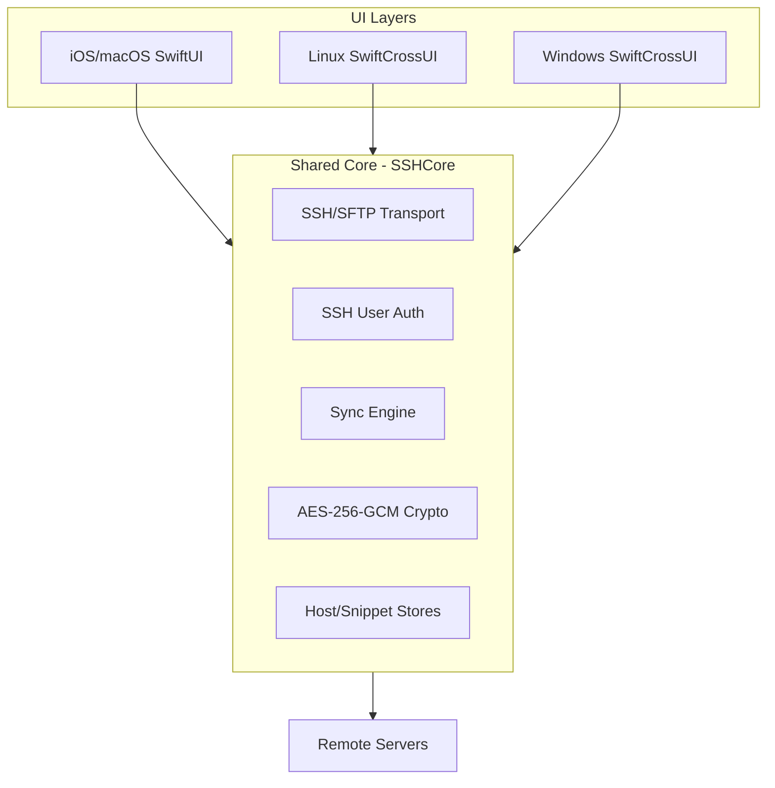
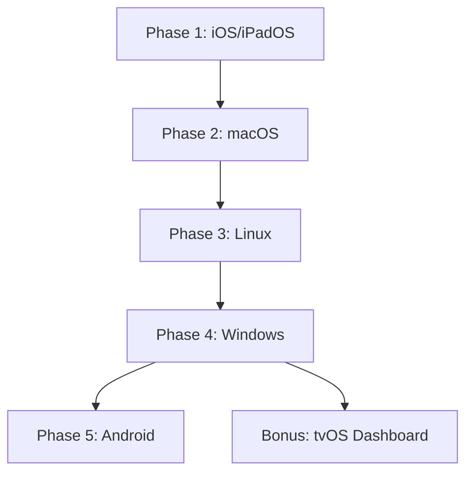

Relevant source files

The following files were used as context for generating this wiki page:

- [VISION.md](VISION.md)
- [README.md](README.md)
- [SECURITY.md](SECURITY.md)
- [AGENTS.md](AGENTS.md)
- [CLAUDE.md](CLAUDE.md)
- [Package.swift](Package.swift)

# Vision & Roadmap

The Bastion project is an ambitious, multi-year initiative to develop the fastest, most aesthetically pleasing, and privacy-friendly SSH client for iPhone, iPad, macOS, Windows, and Linux. The project is committed to being 100% open source under the MIT license, with no advertising, mandatory logins, or subscriptions. It is positioned as a free alternative to Termius, prioritizing superior user experience (UX) and native performance across all supported platforms.

Sources: [VISION.md:1-12](VISION.md#L1-L12), [README.md:1-5](README.md#L1-L5), [CLAUDE.md:3-8](CLAUDE.md#L3-L8)

## Core Philosophy and Architecture

Bastion is designed as a platform rather than a single application. It utilizes a shared core written in Swift, leveraging the `SwiftNIO SSH` library to ensure consistent behavior across Apple and desktop platforms. The architecture separates business logic into a cross-platform core (`SSHCore`) while maintaining thin, platform-specific UI layers.

### Structural Components

| Component | Responsibility | Technical Stack |
| :--- | :--- | :--- |
| **SSHCore** | SSH transport, authentication, sync engine, host database, and encryption. | Swift / SwiftNIO / swift-crypto |
| **App/** | Native UI for iOS, iPadOS, and macOS. | SwiftUI / SwiftTerm |
| **LinuxApp/** | Native UI for Linux environments. | SwiftCrossUI / GTK4 |
| **WindowsApp/** | Native UI for Windows (in development). | SwiftCrossUI / WinUIBackend |
| **Android/** | Separate port for Android devices. | Kotlin / Apache MINA SSHD |

Sources: [VISION.md:27-33](VISION.md#L27-L33), [README.md:9-15](README.md#L9-L15), [CLAUDE.md:3-8](CLAUDE.md#L3-L8)

### System Data Flow
The following diagram illustrates the relationship between the shared core and the platform-specific UI implementations.

The UI layers interact with `SSHCore` to perform operations, which in turn manages communication with remote servers and local encrypted storage. 

Sources: [VISION.md:27-33](VISION.md#L27-L33), [README.md:73-120](README.md#L73-L120), [Package.swift:27-37](Package.swift#L27-L37)

## Feature Roadmap

The development of Bastion is structured into progressive phases, moving from basic SSH functionality to advanced orchestration and plugin support.

### Development Phases

| Phase | Key Milestones |
| :--- | :--- |
| **v0.1** | Basic SSH, Key Management, Host List, Terminal, SFTP. |
| **v0.5** | Tagging, Dashboard (System Probe), Snippets, Biometrics (Face ID), `~/.ssh/config` import. |
| **v1.0** | Docker support, Built-in Editor, Multi-device Sync, Split View. |
| **v2.0** | Plugin system (Proxmox, K8s), Tailscale/WireGuard integration, Git integration. |

Sources: [VISION.md:109-130](VISION.md#L109-L130)

### Key Technical Features
*  **Encrypted Sync:** Host databases are merged deterministically using a `SyncEngine` with Last-Write-Wins logic and tombstones. Transport is E2E encrypted via AES-256-GCM.
*  **Docker Management:** Direct management of containers, images, volumes, and logs on remote servers via SSH without requiring a local agent.
*  **System Dashboard:** Real-time visualization of CPU, RAM, Disk, and Docker status retrieved via SSH probes.
*  **Port Forwarding:** Support for Local (-L), Remote (-R), and Dynamic (-D) forwarding.

Sources: [VISION.md:68-81](VISION.md#L68-L81), [README.md:21-30](README.md#L21-L30), [README.md:86-90](README.md#L86-L90)

## Platform Strategy

Bastion aims for broad cross-platform coverage while maintaining a "Native-First" approach for Apple devices.

While `SSHCore` is shared between Apple, Linux, and Windows, the Android implementation is a separate Kotlin-based app due to the lack of a Swift toolchain for Android, utilizing Apache MINA SSHD as its backend.

Sources: [VISION.md:39-44](VISION.md#L39-L44), [VISION.md:154-180](VISION.md#L154-L180), [CLAUDE.md:3-8](CLAUDE.md#L3-L8)

## Security and Integrity

Bastion follows a strict security policy where private keys and passwords never leave the device unencrypted.

*  **Local Encryption:** Keys and secrets are stored in the system Keychain (iOS/macOS) and never in plaintext on disk.
*  **OAuth Security:** External integrations (Dropbox, Google Drive, OneDrive) utilize OAuth2 with PKCE, ensuring no client secrets are embedded in the code.
*  **E2E Sync:** The `EncryptedFolderSyncProvider` ensures that even when using cloud storage for sync, the provider only sees ciphertext.

Sources: [SECURITY.md:55-66](SECURITY.md#L55-L66), [README.md:21-35](README.md#L21-L35), [AGENTS.md:12-14](AGENTS.md#L12-L14)

Bastion's roadmap emphasizes UX parity with premium competitors while maintaining a lightweight, plugin-extendable core. The ultimate goal is a completely standalone application that manages its own networking layer, including native WireGuard and Tailscale tunnels.

Sources: [VISION.md:132-137](VISION.md#L132-L137), [VISION.md:210-216](VISION.md#L210-L216)
