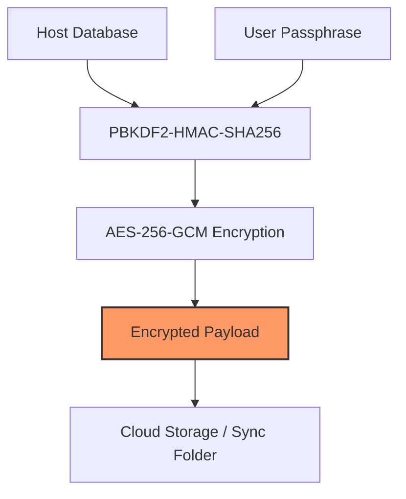
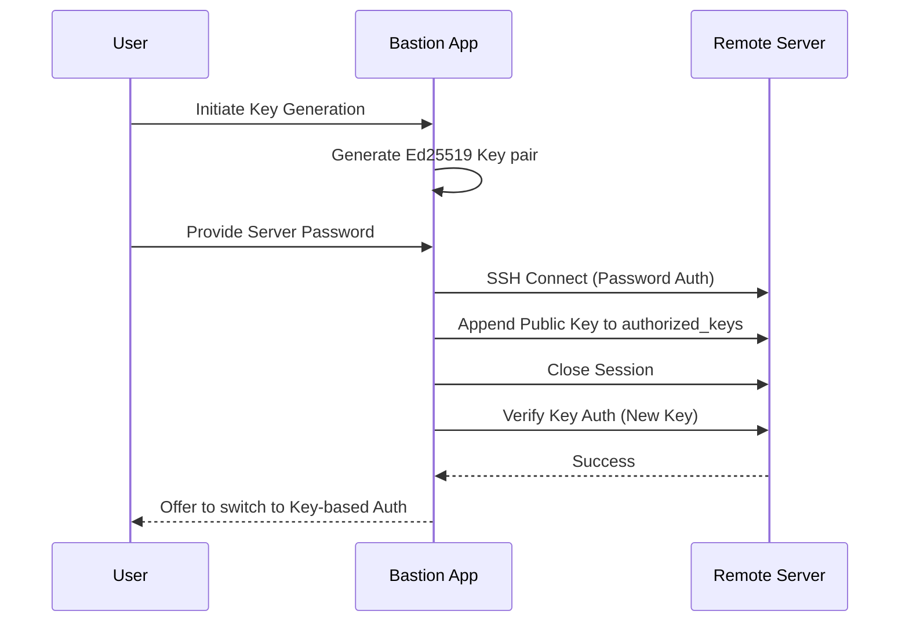

Relevant source files

The following files were used as context for generating this wiki page:

- [SECURITY.md](SECURITY.md)
- [VISION.md](VISION.md)
- [README.md](README.md)
- [AGENTS.md](AGENTS.md)
- [GULDSTANDARD.md](GULDSTANDARD.md)
- [App/project.yml](App/project.yml)
- [LinuxApp/Sources/bastion-gui/KeyDeployView.swift](LinuxApp/Sources/bastion-gui/KeyDeployView.swift)

# Security Policies

## Introduction
The Bastion project is an open-source SSH client designed with a core focus on privacy and security. The system architecture separates the core logic into `SSHCore`, which handles the sensitive SSH transport, authentication, and encryption tasks, while the platform-specific UI layers (iOS, macOS, Linux, Windows) interact with this core. The project adheres to a "standalone" philosophy where keys and sensitive credentials never leave the local device in an unencrypted state. 

Security policies within Bastion cover vulnerability reporting, local data protection through hardware-backed storage (Keychain/Secure Enclave), and End-to-End Encryption (E2EE) for cloud-based synchronization. The scope of these policies includes the `SSHCore` library, mobile and desktop applications, and the automation workflows within the repository.

Sources: [SECURITY.md:32-40](SECURITY.md#L32-L40), [VISION.md:88-92](VISION.md#L88-L92), [README.md:1-12](README.md#L1-L12)

## Vulnerability Reporting and Scope
Bastion maintains a private disclosure policy for security vulnerabilities. Discovered issues should not be reported through public GitHub issues but rather via private channels.

### Reporting Process
*  **Email:** [dev@denied.se]
*  **GitHub:** "Report a vulnerability" button under the Security tab.

| Stage | Timeframe |
| :--- | :--- |
| Initial acknowledgment | Within 48 hours |
| Assessment | Within 5 business days |
| Fix implementation | Based on severity |
| Public disclosure | After fix is released |

Sources: [SECURITY.md:3-23](SECURITY.md#L3-L23)

### In-Scope Components
The following components are subject to Bastion's security policy:
*  `Sources/SSHCore`: Handles SSH transport, authentication, host database, and sync encryption.
*  `App/`: iOS/macOS applications and OAuth account integrations.
*  `LinuxApp/`: Linux GUI.
*  GitHub Actions workflows and repository configurations.

Third-party dependencies such as SwiftNIO, SwiftNIO SSH, and SwiftCrossUI are considered out of scope, and vulnerabilities should be reported to their respective projects.

Sources: [SECURITY.md:27-39](SECURITY.md#L27-L39)

## Data Protection and Encryption
Bastion implements several layers of security to ensure that SSH keys, passwords, and tokens are protected both at rest and in transit.

### Local Storage and Keychain
Sensitive credentials, such as OAuth tokens and SSH private keys, are stored using system-level secure storage:
*  **Apple Platforms:** Uses the system Keychain and hardware-backed Secure Enclave where possible.
*  **Linux:** Currently, the Linux GUI does not use a Keychain and does not save passwords to disk.

Sources: [SECURITY.md:46-51](SECURITY.md#L46-L51), [VISION.md:88-90](VISION.md#L88-L90), [LinuxApp/Sources/bastion-gui/KeyDeployView.swift:14-18](LinuxApp/Sources/bastion-gui/KeyDeployView.swift#L14-L18)

### Sync Encryption (E2EE)
When synchronizing host databases across devices, Bastion uses an `EncryptedFolderSyncProvider` to ensure the payload is unreadable to cloud providers (e.g., Dropbox, Google Drive, iCloud).

*The diagram shows the transformation of raw database data into an encrypted payload using AES-256-GCM before it is uploaded to cloud storage.*

Sources: [README.md:33-40](README.md#L33-L40), [SECURITY.md:46-51](SECURITY.md#L46-L51)

## Authentication Security

### OAuth with PKCE
Bastion utilizes OAuth 2.0 with Proof Key for Code Exchange (PKCE) for third-party integrations (Dropbox, Google Drive, OneDrive). This approach ensures that the client app does not need to embed or carry secret client keys; only a public Client ID is stored in the source code.

Sources: [SECURITY.md:45-46](SECURITY.md#L45-L46), [README.md:58-62](README.md#L58-L62), [AGENTS.md:15](AGENTS.md#L15)

### SSH Key Deployment
The application provides a secure workflow for generating and deploying SSH keys. It emphasizes Ed25519 keys and includes verification steps before modifying local host profiles.

*The sequence illustrates the "Deploy and Verify" workflow which prevents accidental lockouts by verifying the new key before discarding password-based access.*

Sources: [LinuxApp/Sources/bastion-gui/KeyDeployView.swift:65-125](LinuxApp/Sources/bastion-gui/KeyDeployView.swift#L65-L125), [README.md:128-132](README.md#L128-L132)

## Repository and CI/CD Security
Bastion adheres to a "Guldstandard" (Gold Standard) for repository configuration to minimize the risk of credential leakage and ensure code integrity.

### Commit and Push Protection
*  **Secret Scanning:** GitHub secret scanning and push protection are enabled.
*  **No Secrets in Code:** Contributors are strictly forbidden from committing client secrets, tokens, or passphrases.
*  **Mandatory Sign-off:** Contributors must sign off on web-based commits.
*  **Branch Rules:** The `main` branch is protected, requiring Pull Requests for changes.

Sources: [GULDSTANDARD.md:40-52](GULDSTANDARD.md#L40-L52), [AGENTS.md:18-25](AGENTS.md#L18-L25)

### Code Analysis and Tooling
The repository uses automated tools to maintain security:
*  **Dependabot:** Automatically monitors and updates third-party dependencies.
*  **CodeQL:** Static analysis is enabled specifically for injection-sensitive areas like Docker command builders and SSH key parsers.
*  **App Sandbox:** The macOS application target enables App Sandbox with restricted network client permissions.

Sources: [SECURITY.md:52](SECURITY.md#L52), [GULDSTANDARD.md:76-80](GULDSTANDARD.md#L76-L80), [App/project.yml:158-161](App/project.yml#L158-L161)

## Conclusion
Bastion's security policy is rooted in the principle of local control. By leveraging platform-native secure storage, enforcing E2EE for synchronization, and utilizing modern authentication protocols like PKCE and Ed25519, the project provides a hardened environment for system administration. The rigid repository standards and automated security scanning further protect the integrity of the open-source codebase.
