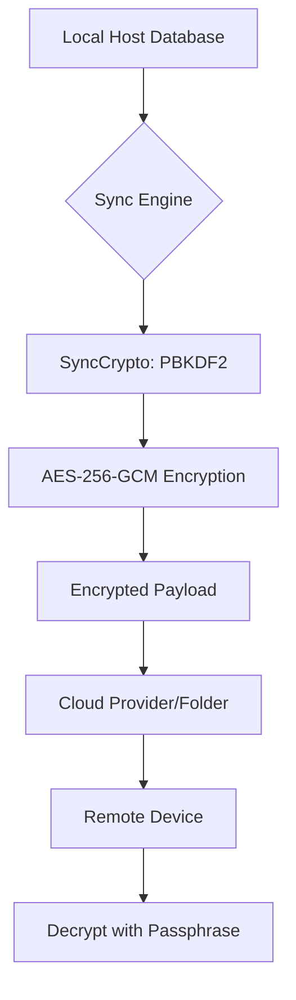
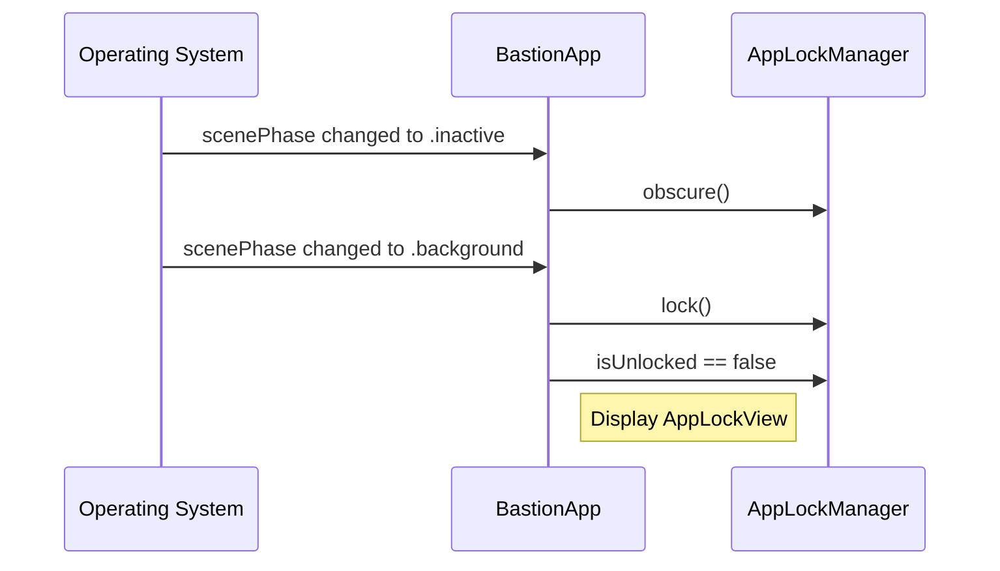

Relevant source files

The following files were used as context for generating this wiki page:

- [SECURITY.md](SECURITY.md)
- [VISION.md](VISION.md)
- [README.md](README.md)
- [GULDSTANDARD.md](GULDSTANDARD.md)
- [AGENTS.md](AGENTS.md)
- [App/BastionApp.swift](App/BastionApp.swift)

# Security Policies & Vulnerability Reporting

The Bastion project prioritizes security and privacy as core pillars of its architecture. As an open-source SSH client, the system is designed to handle sensitive credentials—including SSH keys, OAuth tokens, and passphrases—without ever exposing them unencrypted. The security policy defines a rigorous process for reporting vulnerabilities and establishes best practices for data handling to ensure that user secrets remain within the control of the local device or encrypted during synchronization.

The scope of these security measures covers the core SSH transport logic in `Sources/SSHCore`, the native applications for Apple, Linux, and Windows platforms, and the automated GitHub Actions workflows. Third-party dependencies, such as SwiftNIO and swift-crypto, are managed through automated tools like Dependabot to ensure timely updates.

Sources: [SECURITY.md:1-40](SECURITY.md#L1-L40), [VISION.md:110-115](VISION.md#L110-L115), [README.md:1-15](README.md#L1-L15)

## Vulnerability Reporting Process

Bastion maintains a private reporting channel for security researchers and users to disclose potential flaws without exposing them to the public prematurely.

### Disclosure Channels
Vulnerabilities should be reported via:
*  **Email:** Direct communication to [dev@denied.se].
*  **GitHub Security Tab:** Utilizing the "Report a vulnerability" button on the repository.

Sources: [SECURITY.md:5-15](SECURITY.md#L5-L15), [GULDSTANDARD.md:105-110](GULDSTANDARD.md#L105-L110)

### Response Timeline
The project adheres to a structured timeline for managing reported vulnerabilities to ensure timely fixes.

| Stage | Timeframe |
| :--- | :--- |
| Initial Acknowledgment | Within 48 hours |
| Assessment | Within 5 business days |
| Fix Implementation | Based on severity |
| Public Disclosure | After the fix is released |

Sources: [SECURITY.md:17-25](SECURITY.md#L17-L25)

## Data Security & Encryption Architecture

The system utilizes a multi-layered security approach to protect sensitive information, focusing on local storage safety and end-to-end (E2E) encryption for synchronization.

### Secure Storage (Keychain & Enclave)
On Apple platforms, all secrets such as OAuth tokens and synchronization passphrases are stored in the system's **Keychain**. The project also aims to utilize hardware-backed **Secure Enclave** where possible. Secrets are never stored in plaintext on the disk and are excluded from version control via `.gitignore`.

Sources: [SECURITY.md:46-55](SECURITY.md#L46-L55), [VISION.md:110-115](VISION.md#L110-L115), [README.md:120-130](README.md#L120-L130)

### Sync Engine & E2E Encryption
When host databases or settings are synchronized across devices, the data is encrypted before it leaves the device. The encryption uses **AES-256-GCM**, with keys derived from user-provided passphrases via **PBKDF2-HMAC-SHA256**. This ensures that cloud providers (such as Dropbox, Google Drive, or iCloud) only see ciphertext.

The diagram above illustrates the data flow where secrets are transformed into encrypted payloads before being transmitted to external storage providers.
Sources: [README.md:25-45](README.md#L25-L45), [SECURITY.md:46-50](SECURITY.md#L46-L50)

## Implementation Best Practices

The project enforces specific coding and configuration standards to prevent accidental credential leakage and ensure robust authentication.

### OAuth and PKCE
All OAuth2 integrations (Dropbox, Google, OneDrive) utilize **PKCE (Proof Key for Code Exchange)**. This architecture ensures that the client application does not need to store a client secret; only a public client ID is embedded in the source code (`App/OAuthProviders.swift`).

Sources: [SECURITY.md:46-50](SECURITY.md#L46-L50), [README.md:55-65](README.md#L55-L65), [AGENTS.md:10-15](AGENTS.md#L10-L15)

### Contributor Security Guidelines
1.  **Secret Management:** Never commit secrets, tokens, or passphrases.
2.  **Encryption Integrity:** Ensure keys/passwords never leave the device unencrypted.
3.  **Dependency Auditing:** Utilize Dependabot for automated version updates and security alerts.
4.  **Credential Exposure:** If a secret is accidentally exposed, it must be revoked immediately at the provider level, and the GitHub sensitive data removal guide must be followed.

Sources: [SECURITY.md:41-65](SECURITY.md#L41-L65), [GULDSTANDARD.md:70-80](GULDSTANDARD.md#L70-L80), [AGENTS.md:15-25](AGENTS.md#L15-L25)

## Privacy & Application Security Features

Beyond data encryption, the application includes features to protect the user interface and monitor application health securely.

### App Lock & Privacy Covers
The application implements an `AppLockManager` to handle biometric authentication (Face ID/Touch ID). When the application becomes inactive or moves to the background, a `PrivacyCoverView` or `AppLockView` is triggered to obscure sensitive terminal data.

The sequence diagram demonstrates how the application reacts to state changes to protect the UI from unauthorized viewing.
Sources: [App/BastionApp.swift:53-73](App/BastionApp.swift#L53-L73), [VISION.md:110-115](VISION.md#L110-L115)

### Privacy-Conscious Telemetry
The project uses Sentry for crash reporting but explicitly disables session replays to protect user privacy. Terminal output, credentials, and host details are never captured in telemetry.

| Feature | Configuration | Reason |
| :--- | :--- | :--- |
| Session Replay | Disabled (0.0 sample rate) | Privacy: Prevent capture of SSH output/keys |
| Traces Sample Rate | 0.1 | Performance monitoring |
| Profile App Starts | Enabled (.manual lifecycle) | App startup optimization |

Sources: [App/BastionApp.swift:15-45](App/BastionApp.swift#L15-L45)

## Conclusion
The security policy of Bastion ensures a "local-first" privacy model where the user maintains total control over their SSH keys and credentials. By combining system-level secure storage with robust E2E encryption for synchronization, the project mitigates risks associated with cloud storage and multi-device usage. Strict adherence to PKCE for OAuth and automated dependency scanning further hardens the application against modern attack vectors.
