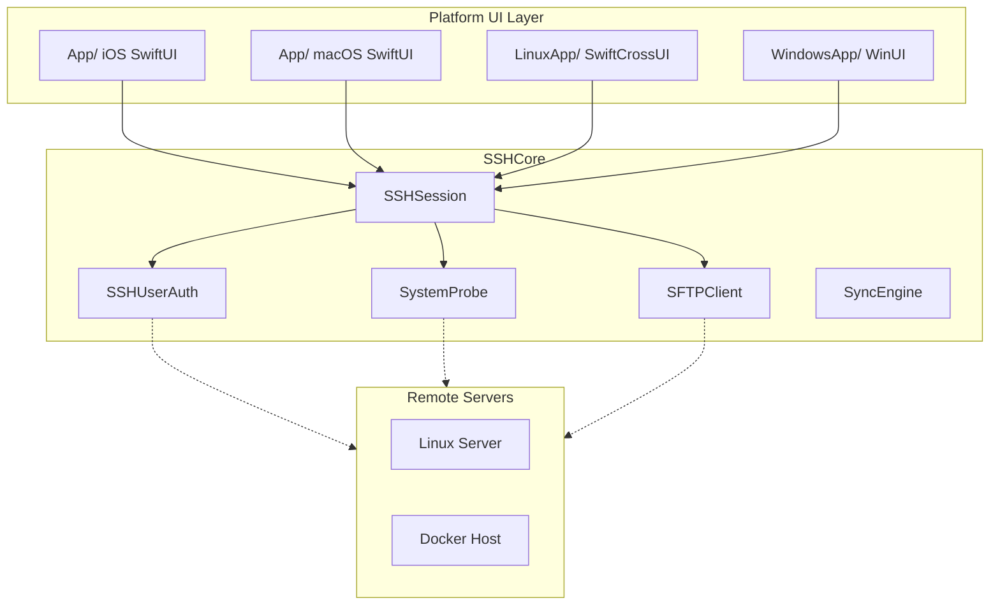
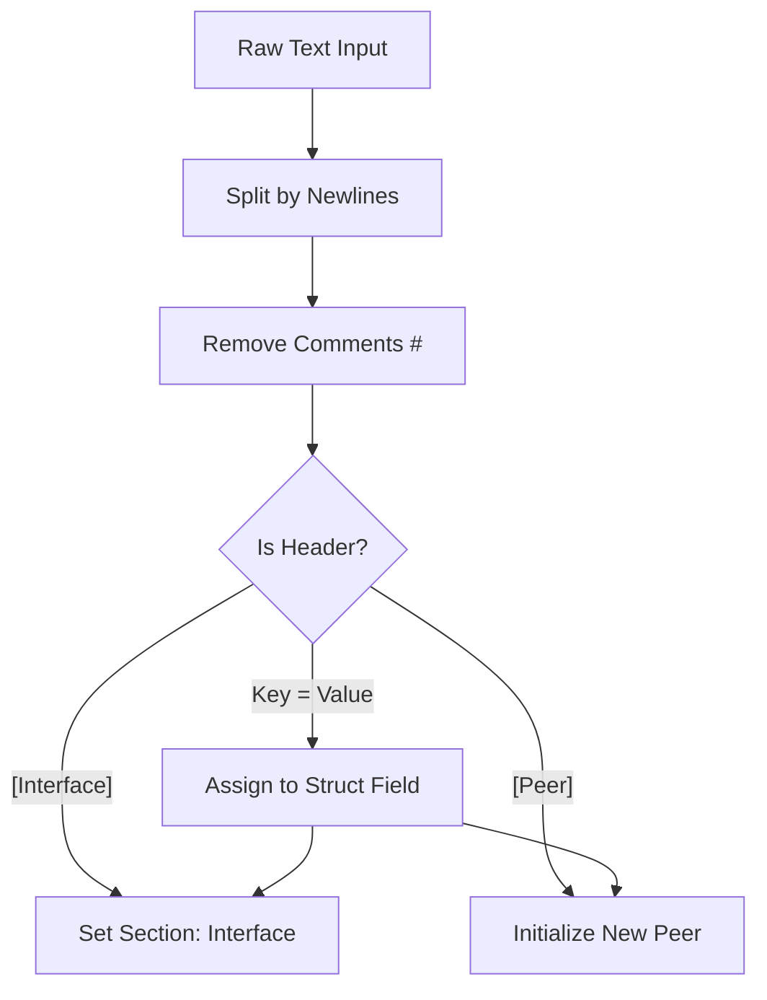

<details>
<summary>Relevant source files</summary>

The following files were used as context for generating this wiki page:

- [VISION.md](VISION.md)
- [README.md](README.md)
- [Package.swift](Package.swift)
- [Sources/SSHCore/SystemProbe.swift](Sources/SSHCore/SystemProbe.swift)
- [Sources/SSHCore/CommandLibrary.swift](Sources/SSHCore/CommandLibrary.swift)
- [Sources/SSHCore/WireGuardConfig.swift](Sources/SSHCore/WireGuardConfig.swift)
</details>

# Core Architecture (SSHCore)

`SSHCore` serves as the centralized, cross-platform business logic layer for the Bastion project. Built primarily using **SwiftNIO SSH**, it is designed to be a "standalone" core that functions identically across iOS, macOS, Linux, and Windows. While the user interface layer is platform-specific (SwiftUI for Apple platforms, SwiftCrossUI for Linux/Windows), all networking, protocol handling, and data parsing reside within `SSHCore`.

Sources: [README.md:5-10](README.md#L5-L10), [VISION.md:27-40](VISION.md#L27-L40)

The architecture prioritizes a "thin UI" approach, ensuring that critical features like SSH session management, SFTP operations, and system monitoring are thoroughly tested and portable. This allows for a consistent experience whether the application is running as a CLI tool or a native graphical application.

Sources: [README.md:10-15](README.md#L10-L15), [Package.swift:5-10](Package.swift#L5-L10)

## Component Overview

The `SSHCore` module is composed of several distinct functional areas, ranging from low-level protocol implementations to high-level system monitoring tools.

### High-Level Architecture Flow

The following diagram illustrates how `SSHCore` interacts with platform-specific UIs and remote servers:



Sources: [VISION.md:30-40](VISION.md#L30-L40), [README.md:80-140](README.md#L80-L140)

### Core Components and Responsibilities

| Component | Responsibility | Relevant Files |
| :--- | :--- | :--- |
| **SSHSession** | Manages connections, command execution, and interactive shells. | `SSHSession.swift` |
| **SFTPClient** | Handles file system operations over SSH (version 3). | `SFTPClient.swift`, `SFTPProtocol.swift` |
| **SystemProbe** | Agentless monitoring that parses remote system status (CPU, RAM, Docker). | `SystemProbe.swift` |
| **SyncEngine** | Deterministic merging of host databases with E2E encryption. | `SyncEngine.swift`, `SyncCrypto.swift` |
| **CommandLibrary** | A static reference of common sysadmin commands (Docker, Git, etc.). | `CommandLibrary.swift` |

Sources: [README.md:85-115](README.md#L85-L115)

## System Monitoring (SystemProbe)

The `SystemProbe` component provides an "agentless" dashboard capability. It executes a single concatenated SSH command to retrieve a variety of system metrics, which are then parsed into structured Swift data types.

### Data Flow: Remote to Dashboard

```mermaid
sequenceDiagram
    participant UI as Dashboard UI
    participant SP as SystemProbe
    participant SSH as SSHSession
    participant RM as Remote Server

    UI->>SP: requestSnapshot()
    SP->>SSH: run(SystemProbe.command)
    SSH->>RM: Execute: df; cat /proc/meminfo; docker ps...
    RM-->>SSH: Raw String Output
    SSH-->>SP: rawOutput
    Note over SP: parse() logic
    SP->>SP: Extract @@LOADAVG, @@MEM, @@DOCKER
    SP-->>UI: SystemSnapshot (Struct)
```

Sources: [Sources/SSHCore/SystemProbe.swift:42-65](Sources/SSHCore/SystemProbe.swift#L42-L65)

### Snapshot Data Structures
The parser transforms raw shell output into the `SystemSnapshot` struct, which includes:
- **LoadAverage**: 1, 5, and 15-minute averages.
- **MemoryInfo**: Total, available, and used bytes.
- **DiskUsage**: Per-mount statistics including capacity percentages.
- **DockerContainer**: Status and image information for remote containers.

Sources: [Sources/SSHCore/SystemProbe.swift:8-40](Sources/SSHCore/SystemProbe.swift#L8-L40)

## Command and Snippet Management

`SSHCore` distinguishes between static reference data and user-defined templates.

### Command Library
The `CommandLibrary` is a hardcoded set of common commands categorized by technology (e.g., Docker, Tailscale, systemd). Each entry includes a summary and optional documentation URLs.

Sources: [Sources/SSHCore/CommandLibrary.swift:10-25](Sources/SSHCore/CommandLibrary.swift#L10-L25)

### Variable Template System
Both the Command Library and user-defined Snippets support a `{{variable}}` syntax. The architecture allows these templates to be rendered with user input before execution.

```swift
// Example of a template with variables
// Category: Docker
"docker compose restart {{service}}"
```

Sources: [Sources/SSHCore/CommandLibrary.swift:45-47](Sources/SSHCore/CommandLibrary.swift#L45-L47)

## Networking and External Protocols

While the core focus is SSH, `SSHCore` includes support for related network configurations, specifically WireGuard.

### WireGuard Configuration
The `WireGuardConfig` component handles the parsing and serialization of `.conf` files. It supports the standard `[Interface]` and `[Peer]` sections used by `wg-quick`.

| Section | Key Fields |
| :--- | :--- |
| **Interface** | PrivateKey, Address, DNS, ListenPort, MTU, PreUp/PostUp scripts |
| **Peer** | PublicKey, AllowedIPs, Endpoint, PersistentKeepalive |

Sources: [Sources/SSHCore/WireGuardConfig.swift:11-50](Sources/SSHCore/WireGuardConfig.swift#L11-L50)

### WireGuard Parsing Logic
The parser is designed to be case-insensitive and handles multi-line accumulations for keys like `Address` or `AllowedIPs`.



Sources: [Sources/SSHCore/WireGuardConfig.swift:70-130](Sources/SSHCore/WireGuardConfig.swift#L70-L130)

## External Dependencies and Compatibility

The project relies on a specific set of libraries to maintain cross-platform support.

- **swift-nio-ssh**: The primary SSH implementation.
- **swift-nio**: Low-level networking (pinned to version 2.86.2 to avoid Windows compilation issues).
- **swift-crypto**: Provides cryptographic primitives like AES-256-GCM for sync encryption.

Sources: [Package.swift:20-35](Package.swift#L20-L35)

## Summary

`SSHCore` represents a robust, platform-agnostic foundation for the Bastion SSH client. By encapsulating protocol logic, system probing, and configuration management within a single Swift module, the project ensures that sophisticated features—such as agentless monitoring and E2E encrypted sync—are available consistently across mobile, desktop, and command-line interfaces. Its design allows the UI layers to remain purely declarative, focusing on presentation while the core handles the complexities of secure remote management.
