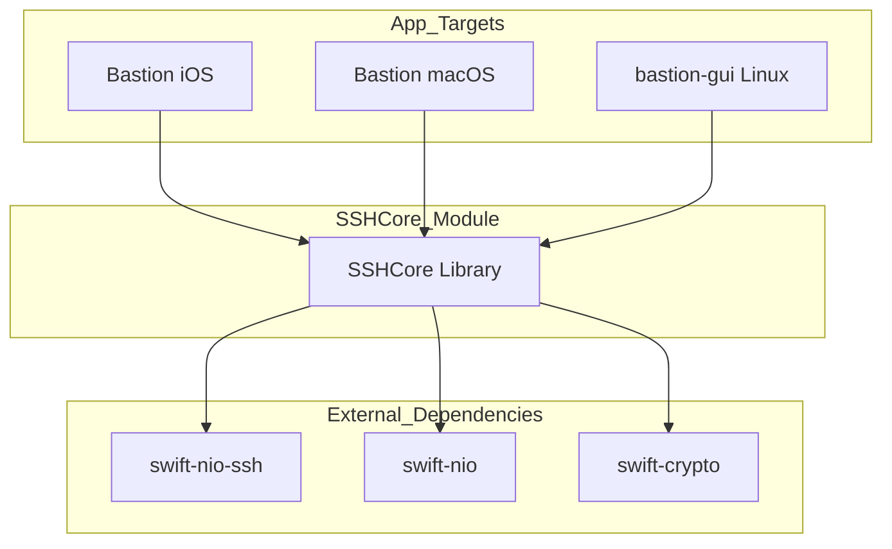

<details>
<summary>Relevant source files</summary>

The following files were used as context for generating this wiki page:

- [Package.swift](Package.swift)
- [README.md](README.md)
- [VISION.md](VISION.md)
- [Sources/SSHCore/SystemProbe.swift](Sources/SSHCore/SystemProbe.swift)
- [Sources/SSHCore/CommandLibrary.swift](Sources/SSHCore/CommandLibrary.swift)
- [Sources/SSHCore/WireGuardConfig.swift](Sources/SSHCore/WireGuardConfig.swift)
</details>

# Core Architecture (SSHCore)

The **SSHCore** module serves as the cross-platform backbone of the Bastion SSH client. It is a pure Swift implementation built on top of `swift-nio-ssh`, designed to provide consistent business logic across iOS, macOS, Linux, and Windows. By encapsulating all SSH transport, authentication, and system interaction logic within this core, the project ensures that only thin, platform-specific UI layers are required for different operating systems.

The scope of SSHCore includes session management, file transfers via SFTP, Docker container orchestration, and a deterministic synchronization engine for host databases. It acts as the "Engine" of the platform, verified through intensive testing on Linux and Apple platforms to ensure reliability and security without requiring external server dependencies for its test suite.

Sources: [README.md:1-15](README.md#L1-L15), [VISION.md:25-35](VISION.md#L25-L35), [Package.swift:5-15](Package.swift#L5-L15)

## Module Structure and Dependencies

The architecture is layered to separate the low-level network primitives from high-level administrative tools. It utilizes the `SwiftNIO` ecosystem for asynchronous I/O and `swift-crypto` for secure operations.

### Dependency Graph
The following diagram illustrates the relationship between the SSHCore target and its underlying library dependencies.



| Dependency | Purpose |
| :--- | :--- |
| `swift-nio-ssh` | Primary SSH transport and protocol implementation. |
| `swift-nio` | Event-driven network framework (NIOCore, NIOPosix). |
| `swift-crypto` | Cryptographic primitives for E2E encryption and key handling. |

Sources: [Package.swift:25-50](Package.swift#L25-L50), [README.md:18-35](README.md#L18-L35)

## Core Components

### Session and Transport Management
The primary entry point for remote interaction is `SSHSession`. It manages the lifecycle of a connection, including authentication (Passwords, Ed25519, OpenSSH Certificates) and execution of remote commands.

*  **SSHUserAuth**: Handles client authentication mechanisms.
*  **SSHShell**: Manages interactive PTY (Pseudo-Terminal) sessions.
*  **ExecHandler**: Streams output between `ByteBuffer` and SSH channels.
*  **PortForward**: Implements local (-L), remote (-R), and dynamic (-D) port forwarding.

Sources: [README.md:70-85](README.md#L70-L85)

### Host and Synchronization Engine
Bastion utilizes a "Sync without login" philosophy. The `SyncEngine` provides deterministic merging of host databases using Last-Write-Wins (LWW) and tombstones for deletions.

*  **HostStore**: A thread-safe, JSON-based persistent database for host metadata.
*  **SyncCrypto**: Provides End-to-End Encryption (E2E) using **AES-256-GCM** with keys derived via **PBKDF2-HMAC-SHA256**.
*  **SyncProvider**: Abstracted transport layers supporting local folders, iCloud, Dropbox, Google Drive, and OneDrive.

Sources: [README.md:37-55](README.md#L37-L55), [README.md:88-100](README.md#L88-L100)

## System Interaction and Probing

SSHCore includes a `SystemProbe` utility that performs "agentless" monitoring. It executes a combined string of commands in a single SSH round-trip to gather system metrics without requiring specialized software on the remote host.

### Data Flow: System Probe
The following sequence diagram demonstrates how the `SystemProbe` gathers and parses system data.

```mermaid
sequenceDiagram
    participant UI as UI Component
    participant SP as SystemProbe
    participant SSH as SSHSession
    participant Host as Remote Server

    UI->>SP: request snapshot()
    SP->>SSH: run(probeCommand)
    SSH->>Host: Exec concatenated commands
    Note right of Host: cat /proc/loadavg; df -kP; etc.
    Host-->>SSH: Raw String Output
    SSH-->>SP: Combined Output
    SP->>SP: parse(output)
    Note over SP: Split by @@SECTION markers
    SP-->>UI: SystemSnapshot (Struct)
```

The `SystemSnapshot` struct contains structured data for:
*  **LoadAverage**: 1, 5, and 15-minute intervals.
*  **MemoryInfo**: Total, available, and used bytes.
*  **DiskUsage**: Filesystem mounts and capacity percentages.
*  **DockerContainer**: Container IDs, names, images, and status.

Sources: [Sources/SSHCore/SystemProbe.swift:10-75](Sources/SSHCore/SystemProbe.swift#L10-L75)

## Command and Configuration Management

### Command Library
The `CommandLibrary` acts as a static reference for common administrative tasks across categories like Docker, Linux, Git, and networking tools. These entries can be converted into `Snippet` objects for execution.

```swift
// Example Entry in CommandLibrary.swift
.init(category: .docker, 
      command: "docker compose restart {{service}}", 
      summary: "Restart a service in Compose project",
      example: "docker compose restart web")
```

Sources: [Sources/SSHCore/CommandLibrary.swift:10-45](Sources/SSHCore/CommandLibrary.swift#L10-L45)

### Network Configuration Tools
SSHCore includes parsers for advanced network configurations, notably for **WireGuard**. The `WireGuardConfig` struct handles parsing and serialization of `.conf` files, adhering to `wg(8)` and `wg-quick(8)` standards.

| Section | Keys Handled |
| :--- | :--- |
| `[Interface]` | PrivateKey, Address, DNS, ListenPort, MTU, Table, PreUp, PostUp, FwMark. |
| `[Peer]` | PublicKey, PresharedKey, AllowedIPs, Endpoint, PersistentKeepalive. |

Sources: [Sources/SSHCore/WireGuardConfig.swift:15-50](Sources/SSHCore/WireGuardConfig.swift#L15-L50)

## Summary
The **SSHCore** architecture facilitates a truly cross-platform SSH client by centralizing complex networking and security logic. By utilizing a "local-first" data model with E2E-encrypted synchronization, it maintains user privacy while providing powerful features like agentless dashboard probing and integrated Docker management. This modular approach allows the Bastion project to expand into multiple platforms (iOS, macOS, Linux, Windows) while maintaining a single, highly-tested source of truth for its core functionality.

Sources: [VISION.md:150-165](VISION.md#L150-L165), [README.md:200-210](README.md#L200-L210)
