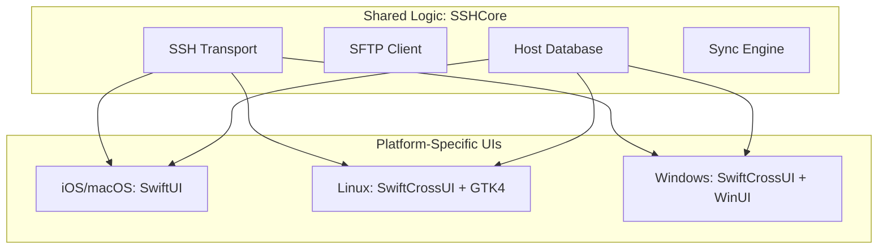
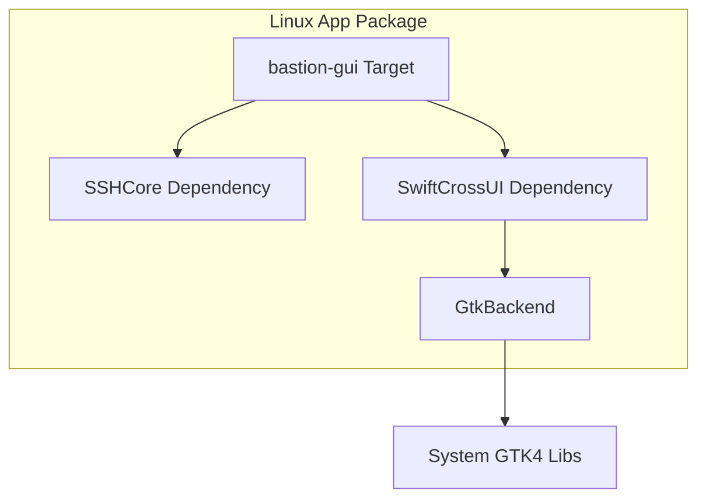

Relevant source files

The following files were used as context for generating this wiki page:

- [README.md](README.md)
- [VISION.md](VISION.md)
- [CLAUDE.md](CLAUDE.md)
- [App/project.yml](App/project.yml)
- [Package.swift](Package.swift)
- [App/BastionApp.swift](App/BastionApp.swift)
- [LinuxApp/Sources/bastion-gui/BastionGUIApp.swift](LinuxApp/Sources/bastion-gui/BastionGUIApp.swift)
- [WindowsApp/Sources/bastion-gui/BastionGUIApp.swift](WindowsApp/Sources/bastion-gui/BastionGUIApp.swift)

# Platform Integration Strategy

## Introduction
The Bastion project is designed as a cross-platform SSH client that prioritizes a shared core logic with platform-specific user interface layers. The primary objective is to maintain a "single source of truth" for business logic, networking, and security, while providing a native user experience across iOS, macOS, Linux, and Windows. This approach ensures that features like SSH session management, host databases, and deterministic synchronization remain consistent regardless of the host operating system.

The architecture is divided into a robust core library (`SSHCore`) built on SwiftNIO and several specialized application targets. While the core is strictly platform-agnostic, the UI layers utilize the most appropriate frameworks for each ecosystem: SwiftUI for Apple platforms and SwiftCrossUI for Linux and Windows.

Sources: [README.md:10-15](README.md#L10-L15), [VISION.md:23-28](VISION.md#L23-L28), [CLAUDE.md:3-8](CLAUDE.md#L3-L8)

## Core Architecture and Portability
The foundation of the integration strategy is `SSHCore`, a pure Swift library that handles the SSH protocol, SFTP, and data persistence. By using SwiftNIO SSH, the project achieves binary-level compatibility across different operating systems.

The diagram shows the relationship between the centralized `SSHCore` and the platform-specific UI implementations.

Sources: [README.md:120-170](README.md#L120-L170), [VISION.md:33-45](VISION.md#L33-L45), [Package.swift:10-30](Package.swift#L10-L30)

### Key Component Distribution
| Component | Implementation | Target Platforms |
| :--- | :--- | :--- |
| **Networking/SSH** | `SSHCore` (SwiftNIO SSH) | All |
| **Persistence** | `HostStore`, `SnippetStore` (JSON/File) | All |
| **Terminal UI** | SwiftTerm | Apple (iOS/macOS) |
| **Terminal UI** | Custom ANSI Interpreter | Linux/Windows |
| **Security** | Keychain / AES-256-GCM | All (Platform-native where possible) |

Sources: [README.md:120-195](README.md#L120-L195), [CLAUDE.md:3-10](CLAUDE.md#L3-L10)

## Platform-Specific Implementation Details

### Apple Ecosystem (iOS & macOS)
The Apple integration utilizes a unified SwiftUI codebase. A single Xcode project, managed via `XcodeGen`, generates targets for both iOS and macOS. This allows for sharing views like `HostListView` and `DashboardView` while handling platform differences (such as App Sandbox requirements on macOS) through conditional compilation and specific entitlement files.

*  **iOS Target:** Focuses on touch interactions and biometric security (Face ID/Touch ID).
*  **macOS Target:** Includes App Sandbox and outgoing network entitlements.
*  **Tooling:** Uses `project.yml` for project generation and Fastlane for TestFlight distribution.

Sources: [App/project.yml:18-170](App/project.yml#L18-L170), [README.md:245-255](README.md#L245-L255), [App/BastionApp.swift:3-10](App/BastionApp.swift#L3-L10)

### Linux Implementation
The Linux application is isolated into a separate SwiftPM package (`LinuxApp/`) to prevent GUI dependencies (like GTK4) from impacting the core build process on other platforms. It uses `SwiftCrossUI` with the `GtkBackend` to interface with the GTK4 system libraries.

The Linux build flow emphasizes the separation of the GUI dependencies from the root package to maintain build stability.

Sources: [LinuxApp/Package.swift:5-25](LinuxApp/Package.swift#L5-L25), [README.md:215-225](README.md#L215-L225), [LinuxApp/Sources/bastion-gui/BastionGUIApp.swift](LinuxApp/Sources/bastion-gui/BastionGUIApp.swift)

### Windows Implementation
Similar to Linux, the Windows version resides in its own package (`WindowsApp/`). It leverages `SwiftCrossUI` but switches the backend to `WinUIBackend`. The current strategy involves a "minimal first version" to verify the CI/CD pipeline on `windows-latest` runners before porting the full UI from the Linux version.

Sources: [WindowsApp/Package.swift:8-20](WindowsApp/Package.swift#L8-L20), [WindowsApp/Sources/bastion-gui/BastionGUIApp.swift:5-15](WindowsApp/Sources/bastion-gui/BastionGUIApp.swift#L5-L15)

### Android Strategy
Unlike the other platforms, Android is treated as a separate port. Because `SSHCore` is written in Swift and lacks a direct Android runtime equivalent, the Android implementation is built with Kotlin and uses the Apache MINA SSHD library instead of sharing the `SSHCore` logic.

Sources: [CLAUDE.md:3-8](CLAUDE.md#L3-L8), [VISION.md:105-120](VISION.md#L105-L120)

## Security and Authentication Integration
Platform integration extends to security hardware and system services. The strategy emphasizes using native secure storage (Keychain) on Apple platforms. On non-Apple platforms, non-secret host metadata may be stored in encrypted files, while credentials that must not be persisted (e.g. Linux passwords) are deliberately never written to disk.

*  **OAuth:** Uses PKCE-based flows to avoid storing client secrets within the apps.
*  **Encryption:** Employs AES-256-GCM with keys derived via PBKDF2-HMAC-SHA256 for end-to-end encrypted synchronization.
*  **Biometrics:** Integration with Face ID/Touch ID via `AppLockManager` on iOS.

Sources: [README.md:33-40](README.md#L33-L40), [App/BastionApp.swift:10-30](App/BastionApp.swift#L10-L30), [SECURITY.md:40-55](SECURITY.md#L40-L55)

## Conclusion
The Bastion platform integration strategy successfully balances code reusability with native performance. By anchoring all platforms to the `SSHCore` library, the project ensures that critical SSH and sync logic is only implemented once, while the modular app structure allows each platform to adopt its own UI paradigms and system-level integrations (like GTK on Linux or the Keychain on iOS). This tiered architecture facilitates rapid expansion to new platforms like Windows and Android while maintaining high technical standards for security and networking.

Sources: [README.md:12-20](README.md#L12-L20), [VISION.md:23-28](VISION.md#L23-L28), [CLAUDE.md:3-10](CLAUDE.md#L3-L10)
