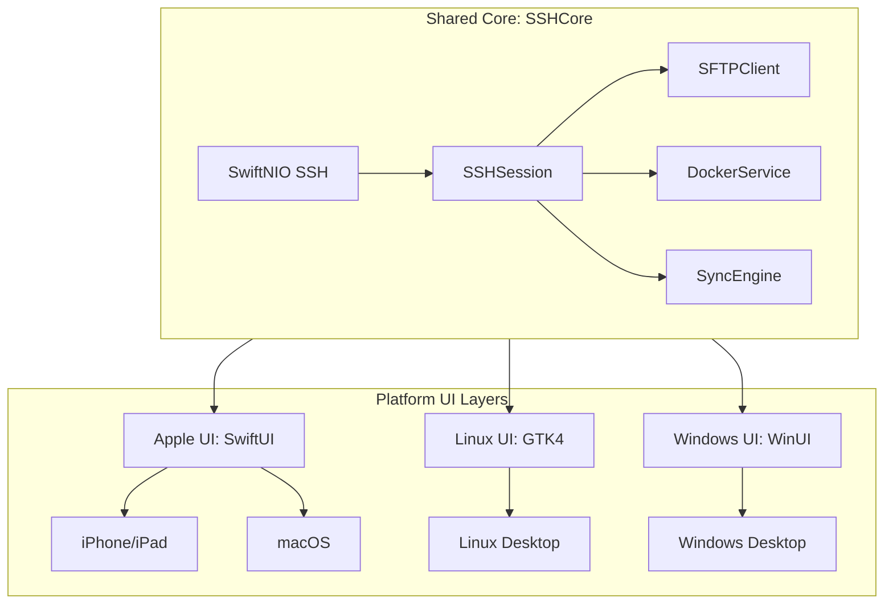
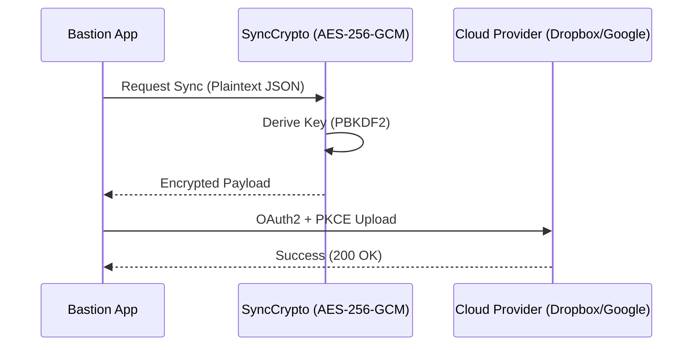

Relevant source files

The following files were used as context for generating this wiki page:

- [VISION.md](VISION.md)
- [README.md](README.md)
- [CLAUDE.md](CLAUDE.md)
- [App/project.yml](App/project.yml)
- [Package.swift](Package.swift)
- [LinuxApp/Package.swift](LinuxApp/Package.swift)
- [WindowsApp/Package.swift](WindowsApp/Package.swift)
- [App/BastionApp.swift](App/BastionApp.swift)

# Platform Integration Strategy

The Platform Integration Strategy for Bastion defines how the project maintains a shared, high-performance SSH core while delivering native user experiences across iOS, macOS, Linux, Windows, and Android. The primary architectural goal is to encapsulate all business logic, SSH transport, and security protocols within a unified "Core" layer, leaving only a thin, platform-specific UI layer for each target operating system.

Sources: [README.md:1-8](README.md#L1-L8), [VISION.md:23-28](VISION.md#L23-L28)

## Core-UI Separation Architecture

The architecture relies on a "Core-first" approach where the `SSHCore` library, built on `SwiftNIO SSH`, handles all non-visual tasks. This shared library is verified on Linux and Apple platforms to ensure consistency in behavior across different environments.

*The diagram shows the hierarchical relationship where the shared SSHCore feeds into distinct platform UI implementations.*

Sources: [README.md:12-19](README.md#L12-L19), [CLAUDE.md:1-5](CLAUDE.md#L1-L5)

### Key Shared Components
| Component | Description | File Path |
|---|---|---|
| **SSHSession** | Manages connections, authentication, and execution streams. | `Sources/SSHCore/SSHSession.swift` |
| **SyncEngine** | Deterministic merge logic for cross-device host database synchronization. | `Sources/SSHCore/SyncEngine.swift` |
| **SyncCrypto** | End-to-end encryption (AES-256-GCM) for cloud transport. | `Sources/SSHCore/SyncCrypto.swift` |
| **DockerService** | Orchestrates remote Docker containers via SSH channels. | `Sources/SSHCore/DockerService.swift` |

Sources: [README.md:46-95](README.md#L46-L95)

## Platform Implementation Details

### Apple Ecosystem (iOS and macOS)
The Apple targets use a shared SwiftUI codebase defined in a single Xcode project. Integration is managed via `XcodeGen`, which generates the `.xcodeproj` file from `project.yml`. The strategy leverages `SwiftTerm` for terminal emulation on these platforms because it supports UIKit/AppKit environments.

*  **iOS Target**: Specifically focuses on iPhone and iPad, utilizing biometrics (FaceID/TouchID) and a specialized terminal keyboard.
*  **macOS Target**: Includes App Sandbox entitlements and outgoing network permissions for SSH traffic.
*  **Commonality**: Both targets share the same `SSHCore` and `SwiftUI` views where possible, with a `Platform.swift` file handling minor alias differences.

Sources: [App/project.yml:21-135](App/project.yml#L21-L135), [VISION.md:46-51](VISION.md#L46-L51), [README.md:11-15](README.md#L11-L15)

### Linux and Windows (SwiftCrossUI)
For Linux and Windows, the strategy shifts to using `SwiftCrossUI`, which provides a cross-platform wrapper around native backends (`GTK4` for Linux and `WinUI` for Windows). 

*  **Linux Integration**: The Linux app is housed in a separate SwiftPM package (`LinuxApp/`) to prevent GUI dependencies from interfering with the root core library builds. It requires GTK4 system headers (`libgtk-4-dev`).
*  **Windows Integration**: Similar to Linux, the Windows app resides in `WindowsApp/`. A critical integration detail is the pinning of `swift-nio` to version `2.86.2` to resolve Windows-specific compilation errors related to strict concurrency.

Sources: [LinuxApp/Package.swift:5-15](LinuxApp/Package.swift#L5-L15), [WindowsApp/Package.swift:5-15](WindowsApp/Package.swift#L5-L15), [Package.swift:23-32](Package.swift#L23-L32)

### Android
Unlike the other platforms, Android is treated as a separate port. Because `SSHCore` is written in pure Swift and lacks a direct Android runtime equivalent in the current stack, the Android implementation utilizes a Kotlin-based architecture with `Apache MINA SSHD` as the transport layer.

Sources: [VISION.md:165-177](VISION.md#L165-L177), [CLAUDE.md:8-10](CLAUDE.md#L8-L10)

## External System Integrations

### Cloud Storage and Synchronization
Bastion integrates with multiple cloud providers for host database synchronization. The strategy employs a "Dumb Storage" model where the cloud provider only sees encrypted blobs.

*The sequence illustrates how data is encrypted locally before being transmitted to third-party providers.*

Sources: [README.md:27-40](README.md#L27-L40), [SECURITY.md:24-30](SECURITY.md#L24-L30)

### Native OS Extensions (Future Strategy)
The roadmap includes deep integration with native OS file managers to allow remote servers to be browsed as local drives:
1.  **Apple Finder/Files**: Implementation of `NSFileProviderReplicatedExtension` for iOS and macOS.
2.  **Windows Explorer**: Integration via `WinFsp` (FUSE for Windows) to mount SFTP hosts as network drives.

Sources: [VISION.md:237-260](VISION.md#L237-L260)

## Build and CI Strategy
The project uses GitHub Actions to automate the integration testing across all supported architectures (x86/amd64 and ARM64).

*  **Cross-platform CI**: Workflows verify `SSHCore` on both Linux and macOS runners.
*  **Automatic Signing**: The Apple integration uses `fastlane match` and App Store Connect API keys to handle provisioning profiles and certificates automatically for TestFlight distribution.
*  **Toolchain Sensitivity**: The Linux GUI requires Swift 6.5+ dev snapshots to bypass known compiler bugs in the `swift-mutex` dependency.

Sources: [README.md:120-155](README.md#L120-L155), [App/project.yml:102-115](App/project.yml#L102-L115), [VISION.md:215-225](VISION.md#L215-L225)

## Conclusion
Bastion's platform integration strategy centers on maintaining a strictly decoupled architecture. By isolating SSH logic in a platform-agnostic Swift core, the project achieves high code reuse across Apple, Linux, and Windows, while selectively using native toolsets (like Kotlin for Android or GTK4 for Linux) where language or framework constraints require specialized implementation.

Sources: [README.md:195-200](README.md#L195-L200), [VISION.md:315-325](VISION.md#L315-L325)
