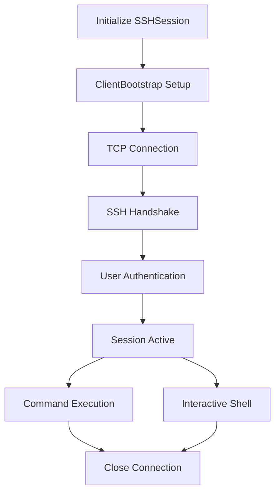
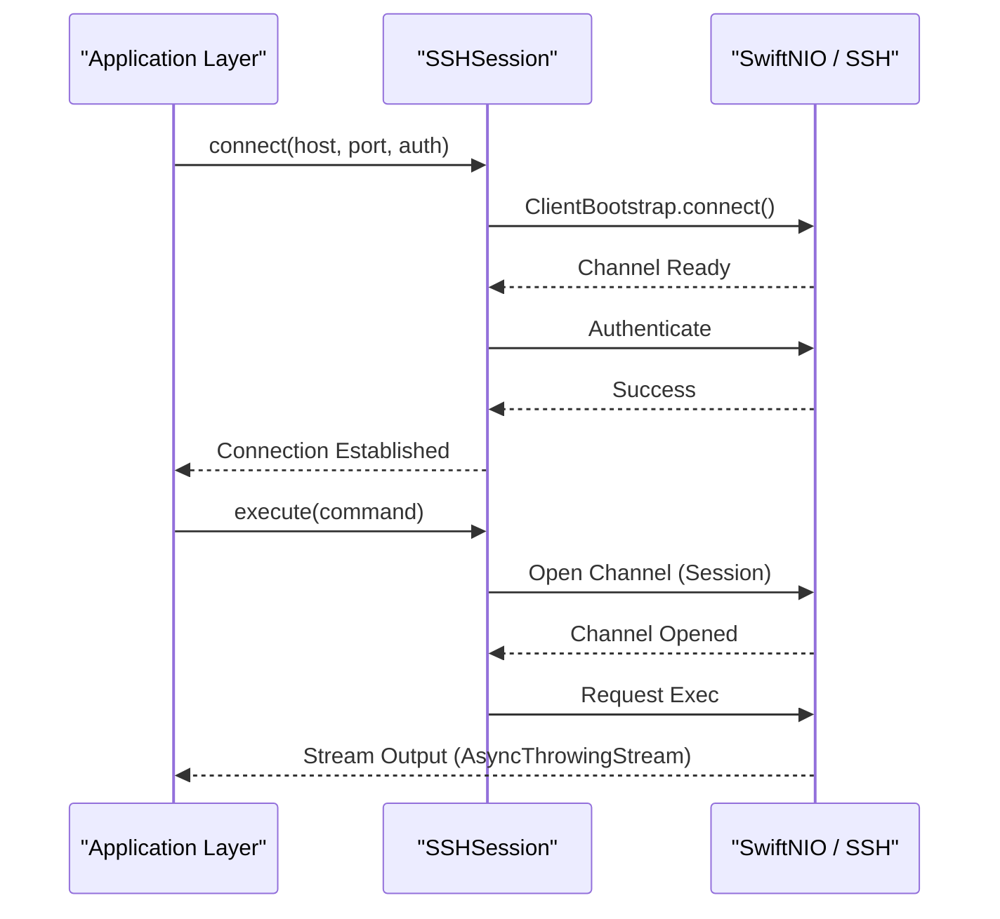
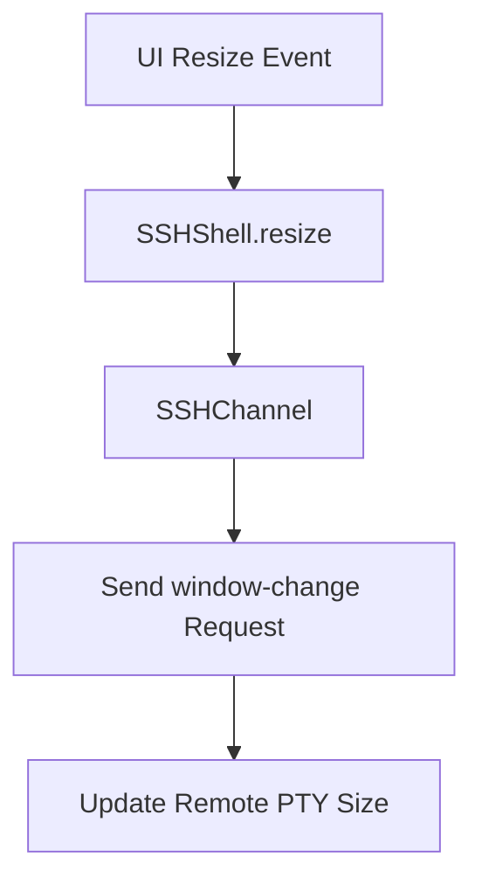

<details>
<summary>Relevant source files</summary>

The following files were used as context for generating this wiki page:

- [Sources/SSHCore/SSHSession.swift](Sources/SSHCore/SSHSession.swift)
- [Sources/SSHCore/SSHShell.swift](Sources/SSHCore/SSHShell.swift)
- [Sources/SSHCore/ExecHandler.swift](Sources/SSHCore/ExecHandler.swift)
- [Sources/SSHCore/GlueHandler.swift](Sources/SSHCore/GlueHandler.swift)
- [README.md](README.md)
- [VISION.md](VISION.md)
- [Package.swift](Package.swift)
</details>

# SSH Engine Implementation

The SSH Engine in Bastion is a cross-platform core built on [SwiftNIO SSH](https://github.com/apple/swift-nio-ssh). It serves as the unified business logic layer (`SSHCore`) used across iOS, macOS, Linux, and Windows platforms. The engine handles connection management, authentication, interactive shell sessions, and command execution, abstracting the underlying complex SSH protocol into high-level Swift concurrency-friendly APIs.

Sources: [README.md:9-11](README.md#L9-L11), [Package.swift:15-18](Package.swift#L15-L18)

## Core Architecture

The architecture is designed to separate the protocol-level handling (provided by SwiftNIO) from the application-specific session logic. `SSHCore` acts as the primary library, providing classes like `SSHSession` to manage the lifecycle of an SSH connection.

### Connection Lifecycle

The engine manages connections through a structured pipeline. It utilizes `NIOPosix` for transport and `NIOSSH` for the SSH protocol state machine.



The diagram above shows the typical flow from initialization to disconnection. Sources: [Sources/SSHCore/SSHSession.swift](Sources/SSHCore/SSHSession.swift), [README.md:56-61](README.md#L56-L61)

### Component Overview

| Component | Responsibility | File Path |
| :--- | :--- | :--- |
| `SSHSession` | Main entry point; handles connection, auth, and channel multiplexing. | `Sources/SSHCore/SSHSession.swift` |
| `SSHShell` | Manages interactive PTY sessions, terminal resizing, and input/output streams. | `Sources/SSHCore/SSHShell.swift` |
| `ExecHandler` | Bridges `ByteBuffer` data to `SSHChannelData` for command execution. | `Sources/SSHCore/ExecHandler.swift` |
| `GlueHandler` | Provides a pass-through bridge between two Channel pipelines. | `Sources/SSHCore/GlueHandler.swift` |

Sources: [README.md:56-65](README.md#L56-L65)

## Session Management (`SSHSession`)

`SSHSession` is the central coordinator. It provides asynchronous methods for connecting to remote hosts and initiating sub-channels.

### Key Features
- **Asynchronous API**: Uses `AsyncThrowingStream` for streaming output from commands.
- **Multiplexing**: Supports running multiple commands or shell sessions over a single TCP connection.
- **Authentication**: Supports passwords, Ed25519 seeds, and OpenSSH certificates.

Sources: [Sources/SSHCore/SSHSession.swift](Sources/SSHCore/SSHSession.swift), [README.md:56-57](README.md#L56-L57)



Sources: [Sources/SSHCore/SSHSession.swift](Sources/SSHCore/SSHSession.swift), [README.md:56-57](README.md#L56-L57)

## Interactive Shell Implementation

The `SSHShell` class handles interactive terminal sessions. It requests a Pseudo-Terminal (PTY) and manages the standard input/output/error streams.

### Interactive Features
- **PTY Allocation**: Requests a terminal environment with specific dimensions.
- **Dynamic Resizing**: Supports updating terminal window size during an active session.
- **Input Handling**: Forwards local terminal input to the remote host.

Sources: [Sources/SSHCore/SSHShell.swift](Sources/SSHCore/SSHShell.swift), [README.md:59](README.md#L59)

### Terminal Resizing Flow
When the UI window changes, the engine must notify the remote process.



Sources: [Sources/SSHCore/SSHShell.swift](Sources/SSHCore/SSHShell.swift)

## Command Execution and Data Handling

Command execution is managed via the `ExecHandler`. This handler acts as a bridge between the SwiftNIO channel and the high-level streams used by the application.

### ExecHandler Logic
The `ExecHandler` transforms incoming `SSHChannelData` into `ByteBuffer` objects that can be consumed by the UI or CLI. It handles both `stdout` and `stderr` streams, often merging them or keeping them distinct based on requirements.

Sources: [Sources/SSHCore/ExecHandler.swift](Sources/SSHCore/ExecHandler.swift), [README.md:60](README.md#L60)

### Pass-through with GlueHandler
In scenarios where two channels must be linked (e.g., proxying), the `GlueHandler` is used. It bridges two pipelines, ensuring that data received on one channel is immediately written to the other.

Sources: [Sources/SSHCore/GlueHandler.swift](Sources/SSHCore/GlueHandler.swift), [README.md:62](README.md#L62)

## Implementation Details

### Dependencies
The engine relies on specific versions of the Apple SwiftNIO stack to ensure stability across platforms, particularly Windows.

```swift
dependencies: [
    .package(url: "https://github.com/apple/swift-nio-ssh.git%22%2C from: "0.14.0"),
    .package(url: "https://github.com/apple/swift-nio.git%22%2C exact: "2.86.2"),
    .package(url: "https://github.com/apple/swift-crypto.git%22%2C from: "4.5.0"),
]
```

Sources: [Package.swift:23-35](Package.swift#L23-L35)

### Platform Support
- **Apple (iOS/macOS)**: Integrated via SwiftUI and `SwiftTerm`.
- **Linux**: Supported via CLI and GTK4-based GUI.
- **Windows**: Built using the `WinUIBackend` with specific NIO version pining to fix concurrency issues.

Sources: [README.md:13-20](README.md#L13-L20), [VISION.md:148-155](VISION.md#L148-L155)

## Conclusion
The SSH Engine implementation in Bastion provides a robust, asynchronous wrapper around the SwiftNIO SSH protocol. By centralizing logic in `SSHCore`, the project achieves high code reuse across disparate platforms while maintaining the performance and safety guarantees of the SwiftNIO framework. The system is designed to handle everything from simple one-off commands to complex, interactive terminal sessions with PTY support.

Sources: [README.md:9-11](README.md#L9-L11), [VISION.md:43-48](VISION.md#L43-L48)
