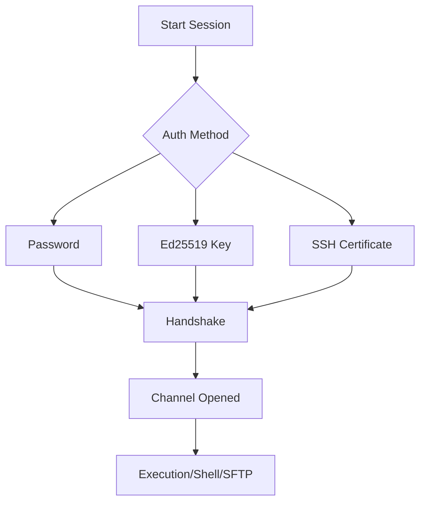
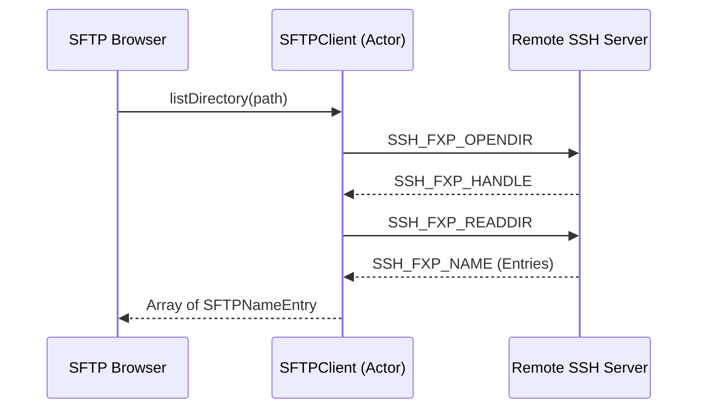

Relevant source files

The following files were used as context for generating this wiki page:

- [Sources/SSHCore/SSHSession.swift](Sources/SSHCore/SSHSession.swift)
- [Sources/SSHCore/ExecHandler.swift](Sources/SSHCore/ExecHandler.swift)
- [Sources/SSHCore/GlueHandler.swift](Sources/SSHCore/GlueHandler.swift)
- [Sources/SSHCore/SFTPClient.swift](Sources/SSHCore/SFTPClient.swift)
- [README.md](README.md)
- [VISION.md](VISION.md)

# SSH Engine Implementation

The SSH Engine in Bastion is a cross-platform implementation built on the `SwiftNIO SSH` framework. It serves as the project's core logic layer, abstracted into the `SSHCore` module. This engine enables secure connections, interactive shell sessions, command execution, and SFTP file management across iOS, macOS, Linux, and Windows using a shared Swift codebase.

Sources: [README.md:1-10](README.md#L1-L10), [VISION.md:73-81](VISION.md#L73-L81)

## Core Architecture and Components

The SSH engine follows a modular design where `SSHCore` handles the transport, authentication, and protocol-level interactions, while the UI layer remains platform-specific (SwiftUI for Apple platforms and SwiftCrossUI for others).

### Module Overview

| Component | Responsibility | Relevant Files |
| :--- | :--- | :--- |
| **SSHSession** | Manages connection lifecycle (connect, run, close). | `SSHSession.swift` |
| **ExecHandler** | Handles ByteBuffer to SSHChannelData streaming. | `ExecHandler.swift` |
| **GlueHandler** | Bridges two Channel pipelines for tunneling. | `GlueHandler.swift` |
| **SFTPClient** | Implements the SFTP protocol (v3) over SSH channels. | `SFTPClient.swift` |
| **SSHShell** | Manages interactive PTY-shells including resizing. | `README.md` (Layout section) |

Sources: [README.md:46-64](README.md#L46-L64), [VISION.md:83-88](VISION.md#L83-L88)

### Session Management
The engine utilizes `SSHSession` as the primary interface for establishing connections. It supports multiple authentication methods including passwords, Ed25519 seeds, and OpenSSH certificates.

Sources: [README.md:47-48](README.md#L47-L48), [SSHSession.swift](SSHSession.swift)

## Data Handling and Protocol Support

### Command Execution and Streaming
Execution is handled via the `ExecHandler`, which bridges SwiftNIO's `ByteBuffer` with `SSHChannelData`. This allows for asynchronous streaming of command output back to the UI.

*  **ExecHandler**: Acts as a child channel handler that processes incoming data chunks.
*  **Async Stream**: `SSHSession.execute()` returns an `AsyncThrowingStream`, allowing the UI to consume output in real-time.

Sources: [README.md:47-51](README.md#L47-L51), [ExecHandler.swift](ExecHandler.swift)

### SFTP Implementation
The SFTP implementation is built as a subsystem channel. It uses an actor-based `SFTPClient` to match request and response IDs asynchronously.

Sources: [README.md:61-62](README.md#L61-L62), [SFTPClient.swift](SFTPClient.swift)

## Cross-Platform Implementation Details

The engine is designed to be "standalone," meaning it does not rely on external `ssh` binaries but carries its own implementation via `SwiftNIO SSH`.

### Platform Compatibility

*  **Apple (iOS/macOS)**: Uses the `SSHCore` library within a SwiftUI app.
*  **Linux**: Built using a standard Swift toolchain, verified for both CLI and GUI (GTK4).
*  **Windows**: Utilizes `SwiftNIO`'s Windows support; targets are pinned to specific versions (e.g., `swift-nio 2.86.2`) to avoid strict concurrency compilation errors on the Windows platform.

Sources: [README.md:11-20](README.md#L11-L20), [Package.swift:22-35](Package.swift#L22-L35)

## Security Implementation

Security is a core pillar of the SSH Engine. Key features include:
*  **TOFU (Trust On First Use)**: Validation of host keys via `HostKeyValidator`.
*  **E2E Encryption**: For synced data, using AES-256-GCM with keys derived via PBKDF2-HMAC-SHA256.
*  **Local Storage**: Secrets like private keys are intended to stay on the device, often backed by the Hardware Secure Enclave or Keychain.

Sources: [README.md:27-33](README.md#L27-L33), [VISION.md:126-130](VISION.md#L126-L130)

## Conclusion

The SSH Engine Implementation in Bastion provides a robust, thread-safe, and asynchronous foundation for remote server management. By leveraging `SwiftNIO SSH`, the project maintains a single source of truth for protocol logic while enabling high-performance features like multi-session TabViews and integrated Docker management over SSH channels.

Sources: [README.md:46-70](README.md#L46-L70), [VISION.md:83-95](VISION.md#L83-L95)
