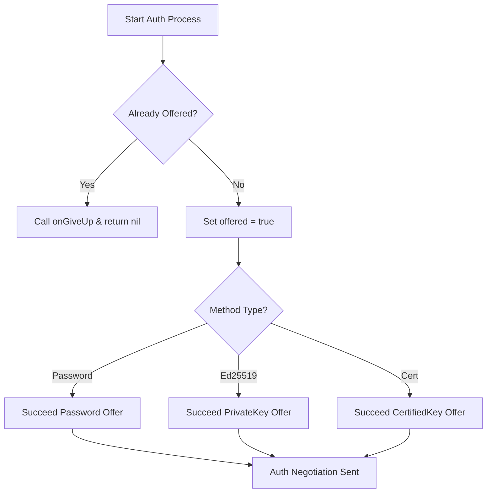
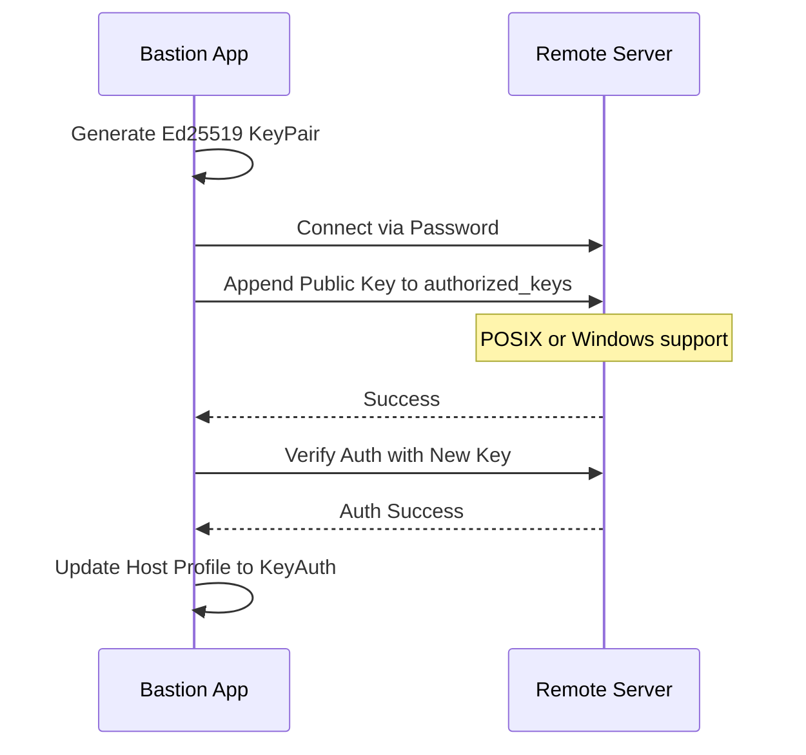

Relevant source files

The following files were used as context for generating this wiki page:

- [Sources/SSHCore/SSHUserAuth.swift](Sources/SSHCore/SSHUserAuth.swift)
- [Sources/SSHCore/KeyManagement.swift](Sources/SSHCore/KeyManagement.swift)
- [Sources/SSHCore/SSHKeyParser.swift](Sources/SSHCore/SSHKeyParser.swift)
- [Sources/SSHCore/OpenSSHCertificate.swift](Sources/SSHCore/OpenSSHCertificate.swift)
- [Sources/SSHCore/SSHAgentClient.swift](Sources/SSHCore/SSHAgentClient.swift)
- [SECURITY.md](SECURITY.md)
- [README.md](README.md)

# Authentication Systems

The Bastion project implements a robust and multi-faceted authentication architecture designed to handle secure SSH connections across various platforms. The system supports traditional password-based authentication, modern public-key cryptography (Ed25519), OpenSSH certificates, and integration with system-level agents. Security is a primary pillar of the architecture, ensuring that sensitive credentials like private keys and tokens never leave the device in an unencrypted state.

The core authentication logic resides within the `SSHCore` module, which utilizes the `swift-nio-ssh` library. This module acts as the cross-platform engine for iOS, macOS, Linux, and Windows, providing a unified way to manage `SSHUserAuth` delegates and key parsing utilities.

Sources: [README.md:1-10](README.md#L1-L10), [SECURITY.md:40-45](SECURITY.md#L40-L45), [Sources/SSHCore/SSHUserAuth.swift:7-13](Sources/SSHCore/SSHUserAuth.swift#L7-L13)

## Authentication Methods

Bastion supports several authentication strategies, managed through the `SSHAuth` enumeration. The system prioritizes security by utilizing hardware-backed storage like the iOS/macOS Keychain where available.

### Supported Auth Types

| Method | Description | Implementation Detail |
| :--- | :--- | :--- |
| **Password** | Traditional cleartext password authentication. | Handled via `NIOSSHUserAuthenticationOffer.Offer.password`. |
| **Ed25519 Seed** | Public-key auth using a raw 32-byte Ed25519 seed. | Uses `Curve25519.Signing.PrivateKey` for signing. |
| **Certificate** | OpenSSH Certificate authentication (v01). | Combines a private key seed with a certified public key. |
| **Agent** | Integration with local SSH agents. | Communicates via `$SSH_AUTH_SOCK`. |

Sources: [Sources/SSHCore/SSHUserAuth.swift:34-70](Sources/SSHCore/SSHUserAuth.swift#L34-L70), [README.md:55-60](README.md#L55-L60), [Sources/SSHCore/SSHAgentClient.swift](Sources/SSHCore/SSHAgentClient.swift)

### User Authentication Delegate

The `SSHUserAuth` class implements the `NIOSSHClientUserAuthenticationDelegate` protocol. It manages the sequence of authentication attempts. If a method fails, it triggers an `onGiveUp` callback to prevent the connection from hanging.

*This flow describes how the delegate provides a single authentication offer to the NIOSSH engine.*
Sources: [Sources/SSHCore/SSHUserAuth.swift:7-40](Sources/SSHCore/SSHUserAuth.swift#L7-L40)

## Key Management and Deployment

Bastion provides automated utilities for generating and deploying SSH keys to remote servers. This is handled by the `KeyManagement.swift` logic and associated UI models.

### Automated Key Deployment
The system can generate a new Ed25519 key pair and deploy the public key to a remote server's `authorized_keys` file using an existing password-based session. This process includes a verification step where the system attempts to log in using the new key before prompting the user to switch the host profile to key-based authentication.

*Sequence of the automated key generation and deployment flow.*
Sources: [Sources/SSHCore/KeyManagement.swift](Sources/SSHCore/KeyManagement.swift), [App/KeyDeployView.swift:65-100](App/KeyDeployView.swift#L65-L100)

### Security and Storage
- **Keychain Integration:** On Apple platforms, private keys are stored in the system Keychain. They are never stored in plaintext on the disk.
- **E2E Encryption:** When syncing host databases between devices, all credentials (including keys and passwords) are encrypted using **AES-256-GCM** with keys derived via **PBKDF2**.
- **Permissions:** Locally stored keys on Linux/macOS are set with `0o600` POSIX permissions to restrict access.

Sources: [SECURITY.md:40-55](SECURITY.md#L40-L55), [README.md:18-25](README.md#L18-L25), [App/KeyDeployView.swift:115-125](App/KeyDeployView.swift#L115-L125)

## Certificate-Based Authentication

The project includes specific support for `ssh-ed25519-cert-v01@openssh.com` certificates. The `OpenSSHCertificate` parser extracts key data, valid principals, and expiration dates.

### Certificate Verification Logic
When a certificate is used, Bastion:
1. Parses the certificate line to validate its internal structure.
2. Extracts the public key and signature.
3. Uses the `NIOSSHCertifiedPublicKey` structure from `swift-nio-ssh` to present the certificate to the server during the SSH handshake.

Note: While the client supports sending certificates, the internal `LoopbackServer` used for testing does not currently support receiving them, which is a known limitation documented in the project roadmap.

Sources: [Sources/SSHCore/OpenSSHCertificate.swift](Sources/SSHCore/OpenSSHCertificate.swift), [Sources/SSHCore/SSHUserAuth.swift:75-90](Sources/SSHCore/SSHUserAuth.swift#L75-L90)

## SSH Agent Integration

The `SSHAgentClient` allows Bastion to leverage identities managed by external SSH agents (like `ssh-agent` or 1Password).

- **Protocol:** Communicates over a Unix Domain Socket (provided by the environment variable `$SSH_AUTH_SOCK`).
- **Features:** 
  - Lists identities available in the agent.
  - Requests the agent to sign a challenge during the SSH handshake, ensuring the private key never enters Bastion's process memory.

Sources: [Sources/SSHCore/SSHAgentClient.swift](Sources/SSHCore/SSHAgentClient.swift), [README.md:95-100](README.md#L95-L100)

## OAuth and Cloud Sync

For cloud synchronization of host data (Dropbox, Google Drive, OneDrive), Bastion uses **OAuth2 with PKCE** (Proof Key for Code Exchange). 

- **Security:** The app carries no client secrets; only public Client IDs are stored in `App/OAuthProviders.swift`.
- **Flow:** Uses `ASWebAuthenticationSession` on Apple platforms for secure, browser-isolated login.
- **Scoping:** Authentication is limited to app-specific folders (e.g., `drive.appdata` for Google) to adhere to the principle of least privilege.

Sources: [README.md:27-45](README.md#L27-L45), [SECURITY.md:25-30](SECURITY.md#L25-L30)

The authentication systems in Bastion ensure a high degree of flexibility for technical users while maintaining strict security standards through hardware-backed storage, modern cryptographic protocols, and encrypted synchronization.
