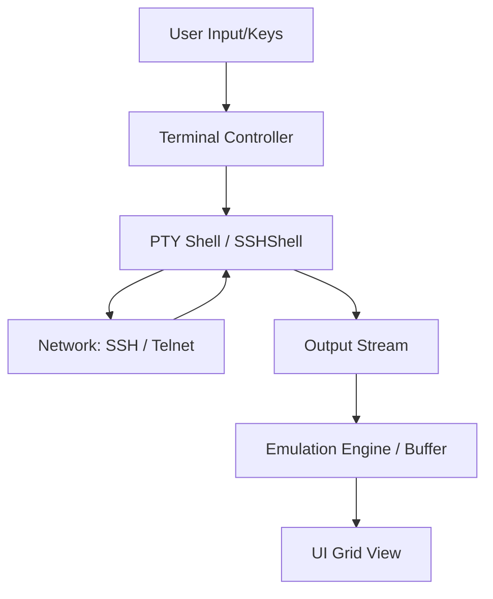
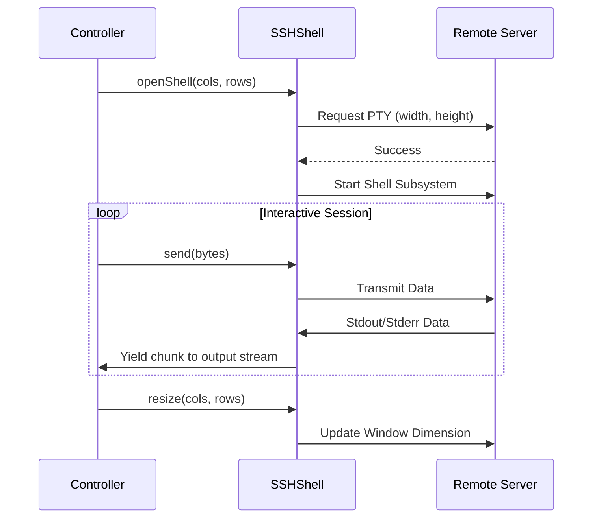

Relevant source files

The following files were used as context for generating this wiki page:

- [Sources/SSHCore/SSHShell.swift](Sources/SSHCore/SSHShell.swift)
- [App/TerminalView.swift](App/TerminalView.swift)
- [LinuxApp/Sources/bastion-gui/TerminalSessionView.swift](LinuxApp/Sources/bastion-gui/TerminalSessionView.swift)
- [LinuxApp/Sources/bastion-gui/TerminalBuffer.swift](LinuxApp/Sources/bastion-gui/TerminalBuffer.swift)
- [App/TerminalTheme.swift](App/TerminalTheme.swift)
- [App/TelnetTerminalView.swift](App/TelnetTerminalView.swift)
- [README.md](README.md)

# Terminal Emulation & PTY

Terminal Emulation and Pseudoterminal (PTY) support in Bastion provides the bridge between raw network protocols (SSH or Telnet) and the user interface. This system handles the bi-directional flow of data: capturing user input, transmitting it over an interactive PTY shell, and rendering the received escape-sequence-heavy output into a human-readable visual grid.

The project employs two distinct strategies based on the target platform. Apple-based platforms (iOS and macOS) leverage a mature third-party engine, while the Linux GUI implementation uses a custom-built VT100/ANSI parser designed for the project's specific UI framework.

## Architecture and Data Flow

The architecture follows a controller-based pattern where a platform-specific controller manages the lifecycle of the connection and the PTY shell, piping data between the network backend and the UI view.

### High-Level Data Flow

The diagram shows the bi-directional communication path where input is sent to the remote shell and output is processed by an emulation engine before display.
Sources: [App/TerminalView.swift:23-27](App/TerminalView.swift#L23-L27), [LinuxApp/Sources/bastion-gui/TerminalSessionView.swift:15-20](LinuxApp/Sources/bastion-gui/TerminalSessionView.swift#L15-L20)

### Core Components

| Component | Responsibility | Relevant Files |
| :--- | :--- | :--- |
| **SSHShell** | Manages the interactive PTY channel, including window resizing and I/O streams. | [Sources/SSHCore/SSHShell.swift](Sources/SSHCore/SSHShell.swift) |
| **SSHTerminalController** | Orchestrates the connection chain and handles data synchronization for Apple platforms. | [App/TerminalView.swift](App/TerminalView.swift) |
| **TerminalController** | Manages the PTY shell and custom buffer for the Linux GUI. | [LinuxApp/Sources/bastion-gui/TerminalSessionView.swift](LinuxApp/Sources/bastion-gui/TerminalSessionView.swift) |
| **TerminalBuffer** | A custom VT100/ANSI interpreter that maintains the character grid and cursor state. | [LinuxApp/Sources/bastion-gui/TerminalBuffer.swift](LinuxApp/Sources/bastion-gui/TerminalBuffer.swift) |
| **TerminalTheme** | Defines color schemes (background, foreground, ANSI colors) for the display. | [App/TerminalTheme.swift](App/TerminalTheme.swift) |

## Interactive PTY Shell (SSHShell)

The `SSHShell` class is the primary interface for interactive terminal sessions over SSH. It encapsulates the complexities of requesting a pseudoterminal from the remote server and managing the resulting data streams.

### Sequence of Operation

This diagram illustrates the initialization and maintenance of an interactive PTY session.
Sources: [Sources/SSHCore/SSHShell.swift](Sources/SSHCore/SSHShell.swift)

The shell supports standard interactive features:
*  **Window Resizing**: Communicates terminal dimension changes (rows/columns) to the remote process via the `resize(cols:rows:)` method. Sources: [Sources/SSHCore/SSHShell.swift:65-71](Sources/SSHCore/SSHShell.swift#L65-L71)
*  **Initial Commands**: Allows executing a startup command (e.g., `docker exec ...`) immediately upon opening the shell. Sources: [App/TerminalView.swift:125-126](App/TerminalView.swift#L125-L126), [LinuxApp/Sources/bastion-gui/TerminalSessionView.swift:34](LinuxApp/Sources/bastion-gui/TerminalSessionView.swift#L34)
*  **Async Output**: Provides an `AsyncThrowingStream` of output chunks, allowing the UI to reactively update as data arrives. Sources: [Sources/SSHCore/SSHShell.swift:51-63](Sources/SSHCore/SSHShell.swift#L51-L63)

## Platform Implementations

### iOS and macOS (Apple)
On Apple platforms, Bastion uses the `SwiftTerm` library for terminal emulation. The `SSHTerminalController` manages an `SSHConnectionChain` and feeds data into a `TerminalView`.

*  **View Integration**: Uses `UIViewRepresentable` (iOS) or `NSViewRepresentable` (macOS) to bridge the SwiftTerm view into SwiftUI. Sources: [App/TerminalView.swift:135-156](App/TerminalView.swift#L135-L156)
*  **Cleanup**: Implements `tearDown()` and `stop()` logic to prevent "orphan" sessions when a view is dismissed. Sources: [App/TerminalView.swift:186-191](App/TerminalView.swift#L186-L191)

### Linux (SwiftCrossUI)
The Linux implementation uses a custom `TerminalBuffer` because the target UI framework (`SwiftCrossUI`) lacks a native canvas or terminal widget.

*  **TerminalBuffer**: Implements a VT100/ANSI parser that handles cursor positioning, SGR (Select Graphic Rendition) for colors, and screen clearing. Sources: [LinuxApp/Sources/bastion-gui/TerminalBuffer.swift](LinuxApp/Sources/bastion-gui/TerminalBuffer.swift)
*  **Input Handling**: Since raw keyboard APIs are limited in the Linux GUI, input is handled via a `TextField` for lines and dedicated buttons for control keys (Esc, Tab, Arrows, Ctrl+C). Sources: [LinuxApp/Sources/bastion-gui/TerminalSessionView.swift:85-115](LinuxApp/Sources/bastion-gui/TerminalSessionView.swift#L85-L115)

## Terminal Theming

Bastion supports 25+ built-in color themes, including popular schemes like Dracula, Nord, Solarized, and Catppuccin.

*  **Structure**: Each `TerminalTheme` contains hex strings for background, foreground, cursor, selection, and the 16 standard ANSI colors. Sources: [App/TerminalTheme.swift:14-23](App/TerminalTheme.swift#L14-L23)
*  **Application**: Themes are parsed from "#RRGGBB" strings into platform-specific color objects using a shared `HexRGB` parser. Sources: [App/TerminalTheme.swift:123-144](App/TerminalTheme.swift#L123-L144), [App/TerminalView.swift:99-123](App/TerminalView.swift#L99-L123)

### Theme Configuration Table
| Field | Description | Type |
| :--- | :--- | :--- |
| `id` | Unique identifier for the theme. | String |
| `name` | Display name for the theme selector. | String |
| `background` | Primary terminal background color. | Hex String |
| `ansi` | Array of 16 colors (0-7 normal, 8-15 bright). | [String] |

Sources: [App/TerminalTheme.swift:14-23](App/TerminalTheme.swift#L14-L23)

## Telnet Support

While SSH uses a structured PTY request, Telnet support in Bastion is handled via a separate `TelnetSession`.

*  **Limitations**: The current Telnet implementation does not support size negotiation (RFC 1073 NAWS). It intentionally rejects all negotiated options for simplicity. Sources: [App/TelnetTerminalView.swift:10-15](App/TelnetTerminalView.swift#L10-L15)
*  **Architecture**: It mirrors the SSH pattern using a `TelnetTerminalController` to bridge the network session to the `TerminalView`. Sources: [App/TelnetTerminalView.swift:20-55](App/TelnetTerminalView.swift#L20-L55)

## Summary

Bastion's Terminal Emulation and PTY system is designed to be cross-platform while respecting the constraints of different UI frameworks. By abstracting the terminal logic into platform-agnostic controllers and utilizing specialized rendering engines (SwiftTerm for Apple, `TerminalBuffer` for Linux), it provides a consistent interactive experience across all supported operating systems.

The core of the system relies on the `SSHShell` class to manage remote PTY state, ensuring that interactive commands and terminal resizing function correctly regardless of the front-end implementation.
