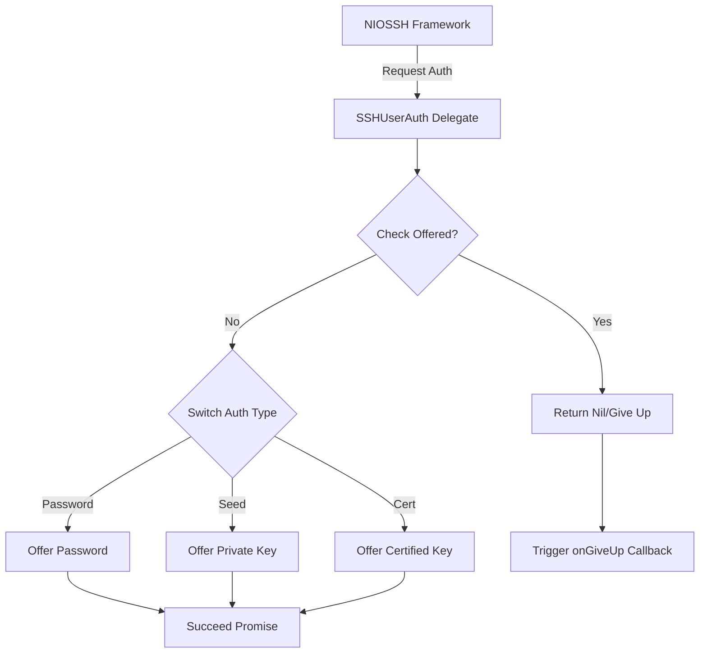
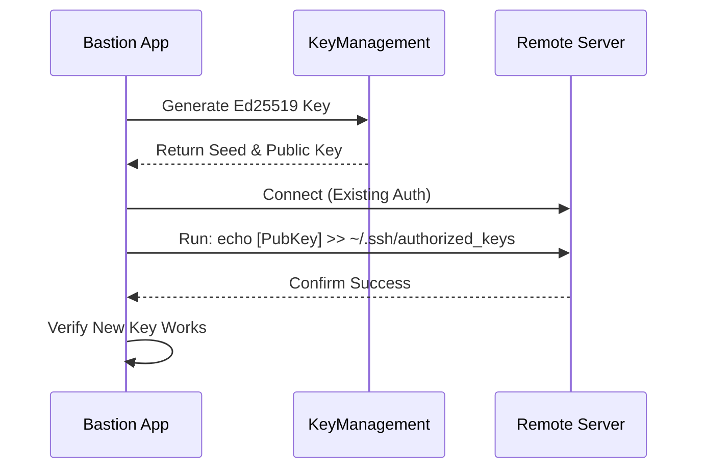

Relevant source files

The following files were used as context for generating this wiki page:

- [Sources/SSHCore/SSHUserAuth.swift](Sources/SSHCore/SSHUserAuth.swift)
- [Sources/SSHCore/SSHKeyParser.swift](Sources/SSHCore/SSHKeyParser.swift)
- [Sources/SSHCore/OpenSSHCertificate.swift](Sources/SSHCore/OpenSSHCertificate.swift)
- [Sources/SSHCore/SSHAgentClient.swift](Sources/SSHCore/SSHAgentClient.swift)
- [Sources/SSHCore/KeyManagement.swift](Sources/SSHCore/KeyManagement.swift)
- [SECURITY.md](SECURITY.md)
- [App/OAuthPKCE.swift](Sources/SSHCore/OAuthPKCE.swift)

# Authentication Systems

The Bastion project implements a multi-layered authentication architecture designed to handle secure remote access via SSH and synchronized data across platforms. The system's primary scope encompasses SSH client authentication (passwords, private keys, and certificates), hardware-backed security via system Keychains, and OAuth2 with PKCE for third-party cloud integrations.

At its core, the project prioritizes "End-to-End" security, ensuring that sensitive credentials like SSH keys and passphrases never leave the device in unencrypted form. Synchronization is secured using AES-256-GCM, while local storage leverages platform-specific secure enclaves where available.
Sources: [SECURITY.md:21-25](SECURITY.md#L21-L25), [VISION.md:75-78](VISION.md#L75-L78)

## SSH Authentication Delegate

The `SSHUserAuth` class serves as the central delegate for the `NIOSSH` framework, managing the lifecycle of an authentication attempt. It intercepts requests from the SSH server and offers credentials based on the configured `SSHAuth` type for a specific host.

### Supported Authentication Methods

| Method | Implementation Detail | Source |
| :--- | :--- | :--- |
| **Password** | Direct plaintext submission over the encrypted SSH channel. | [SSHUserAuth.swift:37-44](SSHUserAuth.swift#L37-L44) |
| **Ed25519 Key** | Uses a 32-byte raw seed to sign challenges. | [SSHUserAuth.swift:46-54](SSHUserAuth.swift#L46-L54) |
| **Certificate** | Combines an Ed25519 seed with an OpenSSH certificate line for CA-verified auth. | [SSHUserAuth.swift:56-89](SSHUserAuth.swift#L56-L89) |

The diagram shows how `SSHUserAuth` manages the state of an authentication attempt, ensuring each method is only tried once before giving up.
Sources: [SSHCore/SSHUserAuth.swift:30-89](SSHCore/SSHUserAuth.swift#L30-L89)

## SSH Key Management and Parsing

Bastion provides extensive utilities for generating, parsing, and deploying SSH keys. It focuses on the modern `ssh-ed25519` standard for performance and security.

### Key Parsing and Export
The system handles OpenSSH formatted private keys using the `OpenSSHPrivateKey` parser. It supports identifying encrypted keys (which currently throw a specific `.encrypted` error) and exporting raw seeds into the PEM-encoded format required by standard SSH tools.
Sources: [SSHKeyParser.swift:7-40](SSHKeyParser.swift#L7-L40)

### Key Deployment Flow
The `KeyManagement.swift` module facilitates the deployment of public keys to remote servers. This process typically involves connecting via an existing authentication method (like a password) to append the new public key to the server's `authorized_keys` file.

The sequence shows the "Deploy + Verify" pattern used to transition from password to key-based authentication.
Sources: [KeyManagement.swift:10-50](KeyManagement.swift#L10-L50), [App/KeyDeployView.swift:65-90](App/KeyDeployView.swift#L65-L90)

## SSH Agent Integration

For users who prefer to manage keys outside of the application, Bastion includes an `SSHAgentClient`. This component communicates over a Unix Domain Socket (defined by `$SSH_AUTH_SOCK`) to interact with the system's SSH agent.

**Key Features:**
*  **Identity Listing:** Queries the agent for all available public keys.
*  **Signature Requests:** Sends data to the agent to be signed by a private key, allowing authentication without the application ever seeing the private key material.
Sources: [SSHAgentClient.swift:12-45](SSHAgentClient.swift#L12-L45)

## OAuth2 and PKCE

For cloud synchronization services (Dropbox, Google Drive, OneDrive), Bastion implements **Proof Key for Code Exchange (PKCE)**. This ensures that the mobile and desktop clients can perform secure OAuth flows without embedding a "Client Secret" in the source code.

| Component | Description |
| :--- | :--- |
| **Code Verifier** | A high-entropy cryptographic random string. |
| **Code Challenge** | A SHA256 hash of the verifier, sent during the initial authorization request. |
| **State** | A random string used to prevent Cross-Site Request Forgery (CSRF). |

Sources: [SECURITY.md:22](SECURITY.md#L22), [Sources/SSHCore/OAuthPKCE.swift:5-25](Sources/SSHCore/OAuthPKCE.swift#L5-L25)

## Security and Compliance

The authentication system is bound by strict security policies defined in the project's core documentation:
1.  **No Secrets in Code:** Client IDs are public, but secrets and tokens are excluded from version control.
2.  **Encryption at Rest:** All keys and passwords are stored in the system Keychain (iOS/macOS) and are never stored in plaintext on disk.
3.  **Sync Encryption:** Data leaving the device for sync is encrypted with AES-256-GCM using a key derived via PBKDF2-HMAC-SHA256.
Sources: [SECURITY.md:20-30](SECURITY.md#L20-L30), [README.md:25-30](README.md#L25-L30)

## Conclusion

Bastion's authentication system is designed to be both flexible and highly secure. By supporting a wide array of SSH authentication methods—including modern certificates and agent forwarding—the architecture ensures that user credentials remain protected across all supported platforms. Synchronized data leaving the device is encrypted using AES-256-GCM with keys derived via PBKDF2-HMAC-SHA256, guaranteeing end-to-end confidentiality regardless of the cloud storage provider used. Separately, OAuth2 with PKCE (Proof Key for Code Exchange) protects the OAuth authorization-code flow itself when integrating with third-party cloud services like Dropbox, Google Drive, and OneDrive, ensuring that authorization codes cannot be intercepted during the OAuth exchange process.
