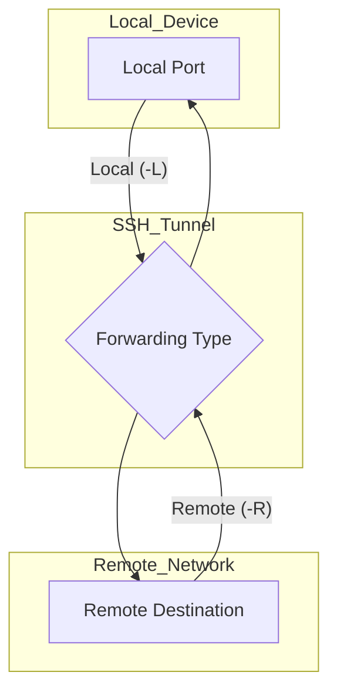
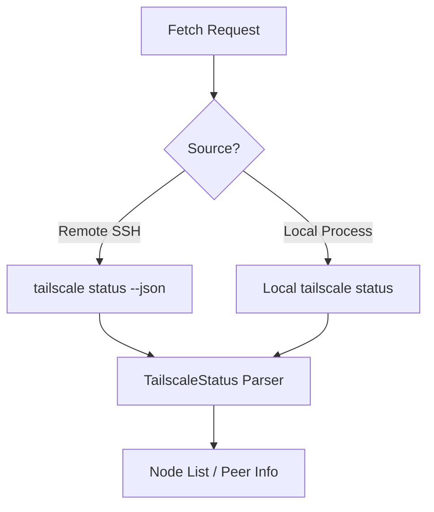

<details>
<summary>Relevant source files</summary>

The following files were used as context for generating this wiki page:

- [Sources/SSHCore/PortForward.swift](Sources/SSHCore/PortForward.swift)
- [Sources/SSHCore/WireGuardConfig.swift](Sources/SSHCore/WireGuardConfig.swift)
- [Sources/SSHCore/TailscaleStatus.swift](Sources/SSHCore/TailscaleStatus.swift)
- [Sources/SSHCore/GlueHandler.swift](Sources/SSHCore/GlueHandler.swift)
- [README.md](README.md)
- [VISION.md](VISION.md)
</details>

# Networking, Forwarding & Proxying

## Introduction
The Bastion project provides a robust networking suite focused on secure communication and data tunneling via SSH and supplementary VPN protocols. The core networking logic, contained within `SSHCore`, is designed to be cross-platform, utilizing SwiftNIO to ensure consistent behavior across iOS, macOS, Linux, and Windows. This system enables users to bridge local and remote networks through various port forwarding techniques and manage modern overlay network configurations.

The primary scope of this module includes SSH port forwarding (local, remote, and dynamic), proxying through Jump Hosts, and managing configurations for Tailscale and WireGuard. By integrating these features, Bastion serves as a versatile tool for system administrators and DevOps professionals to maintain secure access to infrastructure.

Sources: [VISION.md](VISION.md), [README.md:6-12](README.md#L6-L12)

## SSH Port Forwarding
SSH port forwarding is a fundamental feature of Bastion, allowing users to tunnel network traffic through an established SSH connection. The implementation supports both local and remote forwarding, as well as dynamic proxying.

### Local and Remote Forwarding
Local port forwarding (equivalent to `ssh -L`) allows a local port to be forwarded to a remote address and port via the SSH server. Conversely, remote port forwarding (equivalent to `ssh -R`) allows a port on the remote server to be forwarded back to a local address.



The logic for bridging these connections is handled by the `GlueHandler`, which bridges two `Channel` pipelines to allow data to flow directly through the SSH tunnel.

Sources: [Sources/SSHCore/PortForward.swift](Sources/SSHCore/PortForward.swift), [Sources/SSHCore/GlueHandler.swift](Sources/SSHCore/GlueHandler.swift), [README.md:73-74](README.md#L73-L74)

### ProxyJump and Connection Chaining
Bastion supports `ProxyJump`, enabling users to connect to a target server through one or more intermediate "jump hosts." This is implemented through the `SSHConnectionChain`, which manages the lifecycle of nested SSH sessions.

| Component | Description |
|---|---|
| `SSHConnectionChain` | Manages sequential connections from the local device to the target via intermediate hosts. |
| `GlueHandler` | A utility that bridges two SwiftNIO Channel pipelines to facilitate transparent data flow. |

Sources: [README.md:75](README.md#L75), [VISION.md](VISION.md)

## Overlay Networks: Tailscale & WireGuard
Beyond standard SSH capabilities, Bastion integrates with overlay network providers to simplify connectivity to private environments.

### Tailscale Integration
The system includes a `TailscaleStatus` parser that processes the output of `tailscale status --json`. This allows the application to discover nodes within a "tailnet" either locally or via a remote host over SSH.



Sources: [Sources/SSHCore/TailscaleStatus.swift](Sources/SSHCore/TailscaleStatus.swift), [README.md:112](README.md#L112)

### WireGuard Configuration
Bastion provides a comprehensive parser and serializer for WireGuard `.conf` files. This supports managing `[Interface]` and `[Peer]` sections, including keys, addresses, and routing rules. While the current implementation focuses on profile management, it follows the `wg-quick` convention for compatibility.

| Section | Key Fields |
|---|---|
| **Interface** | `PrivateKey`, `Address`, `DNS`, `ListenPort`, `MTU`, `Table`, `PreUp`, `PostUp` |
| **Peer** | `PublicKey`, `PresharedKey`, `AllowedIPs`, `Endpoint`, `PersistentKeepalive` |

Sources: [Sources/SSHCore/WireGuardConfig.swift:10-55](Sources/SSHCore/WireGuardConfig.swift#L10-L55), [README.md:108-110](README.md#L108-L110)

## Implementation Details

### Configuration Parsing
The `WireGuardConfig` utilizes a robust parsing logic that handles comments (initiated by `#`), case-insensitive keys, and comma-separated lists for fields like `Address` and `AllowedIPs`.

```swift
// Sources/SSHCore/WireGuardConfig.swift:68-85
public init(text: String) {
    var iface = Interface()
    var peerList: [Peer] = []
    var currentPeer: Peer?
    var section = Section.none
    
    for rawLine in text.split(whereSeparator: { $0 == "\n" || $0 == "\r" }) {
        let withoutComment = rawLine
            .split(separator: "#", maxSplits: 1, omittingEmptySubsequences: false)
            .first.map(String.init) ?? ""
        let line = withoutComment.trimmingCharacters(in: .whitespaces)
        guard !line.isEmpty else { continue }
        // ... section and key/value logic
    }
}
```

Sources: [Sources/SSHCore/WireGuardConfig.swift:68-85](Sources/SSHCore/WireGuardConfig.swift#L68-L85)

### Connection Security
Bastion adheres to strict security standards for networking:
*  **TOFU (Trust On First Use)**: Host keys are validated and stored in `KnownHosts` to prevent Man-In-The-Middle (MITM) attacks.
*  **Sandboxing**: The macOS target implements App Sandbox with the `com.apple.security.network.client` entitlement to allow outgoing SSH connections while maintaining system security.

Sources: [README.md:77-78](README.md#L77-L78), [App/project.yml:195-197](App/project.yml#L195-L197)

## Conclusion
The networking architecture of Bastion combines traditional SSH tunneling with modern VPN management. By utilizing a shared core (`SSHCore`) across all platforms, the project ensures that sophisticated features like port forwarding, jump host proxying, and overlay network discovery behave identically whether the user is on a mobile device or a desktop workstation.

Sources: [README.md:6-12](README.md#L6-L12), [VISION.md](VISION.md)
