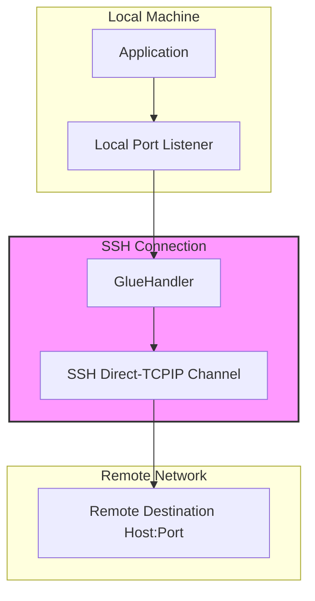
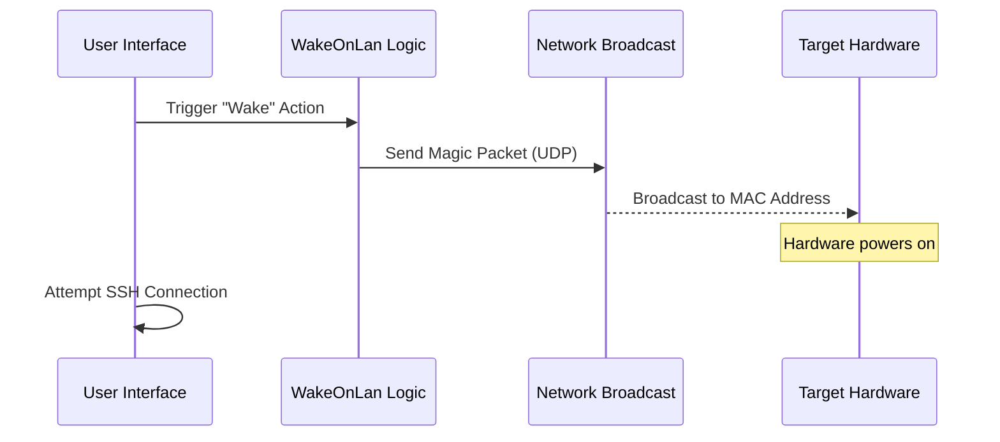

<details>
<summary>Relevant source files</summary>

The following files were used as context for generating this wiki page:

- [Sources/SSHCore/PortForward.swift](Sources/SSHCore/PortForward.swift)
- [README.md](README.md)
- [VISION.md](VISION.md)
- [LinuxApp/Sources/bastion-gui/PortForwardView.swift](LinuxApp/Sources/bastion-gui/PortForwardView.swift)
- [Sources/SSHCore/WireGuardConfig.swift](Sources/SSHCore/WireGuardConfig.swift)
- [App/HostListView.swift](App/HostListView.swift)
</details>

# Networking, Proxies & Port Forwarding

The Bastion project provides a robust networking suite designed to facilitate secure communication between local clients and remote servers. The primary focus of this module is to implement standard SSH tunneling capabilities, including local, remote, and dynamic port forwarding, while also integrating modern VPN protocols and legacy networking support.

This system is built upon the `SSHCore` library, which leverages SwiftNIO to ensure a consistent networking core across iOS, macOS, Linux, and Windows platforms. Beyond standard SSH features, the project incorporates WireGuard configuration management, Tailscale integration for network discovery, and legacy Telnet support for older network equipment.
Sources: [README.md:1-15](README.md#L1-L15), [VISION.md:130-150](VISION.md#L130-L150)

## SSH Port Forwarding

The core of Bastion's networking capability lies in its implementation of SSH port forwarding. This allows users to tunnel traffic securely through an established SSH connection.

### Forwarding Types
The system supports three primary modes of forwarding, managed via the `PortForward.swift` logic and exposed through the `PortForwardView.swift` UI in the Linux application:

| Type | SSH Flag | Description |
| :--- | :--- | :--- |
| **Local** | `-L` | Maps a local port on the client to a specific host and port accessible from the remote SSH server. |
| **Remote** | `-R` | Maps a port on the remote SSH server to a specific host and port accessible from the local client. |
| **Dynamic** | `-D` | Turns the SSH client into a SOCKS proxy server, allowing applications to route traffic through the SSH server to any destination. |

Sources: [Sources/SSHCore/PortForward.swift](Sources/SSHCore/PortForward.swift), [LinuxApp/Sources/bastion-gui/PortForwardView.swift](LinuxApp/Sources/bastion-gui/PortForwardView.swift)

### Architecture and Data Flow
The `PortForward.swift` module utilizes `GlueHandler` (derived from `swift-nio-ssh` examples) to bridge two NIO Channel pipelines together, allowing data to flow seamlessly between the local listener and the SSH tunnel.



The diagram shows the bridge created by `GlueHandler` between a local port listener and the SSH channel data.
Sources: [README.md:95-105](README.md#L95-L105), [Sources/SSHCore/PortForward.swift](Sources/SSHCore/PortForward.swift)

## Proxy & Network Integration

Bastion integrates with several third-party networking and proxy technologies to enhance connectivity and security.

### WireGuard Configuration
The `WireGuardConfig.swift` module provides a comprehensive parser and serializer for `.conf` files used by `wg-quick` and `wg setconf`. While it currently handles the management of profiles (including `[Interface]` and `[Peer]` sections), the actual establishment of tunnels is planned for future phases to avoid external dependencies.

**Key WireGuard Data Structures:**
*  `Interface`: Contains `PrivateKey`, `Address`, `DNS`, `ListenPort`, `MTU`, and `wg-quick` specific scripts (`PreUp`, `PostUp`, etc.).
*  `Peer`: Contains `PublicKey`, `AllowedIPs`, `Endpoint`, and `PersistentKeepalive`.

Sources: [Sources/SSHCore/WireGuardConfig.swift:5-60](Sources/SSHCore/WireGuardConfig.swift#L5-L60), [VISION.md:155-165](VISION.md#L155-L165)

### Tailscale and Discovery
Bastion includes support for Tailscale, allowing users to discover hosts within their "Tailnet." The `TailscaleDiscoveryView` in the iOS and Linux applications enables users to fetch node information (via `tailscale status --json`) and add them as saved hosts within the Bastion database.
Sources: [App/HostListView.swift:145-160](App/HostListView.swift#L145-L160), [README.md:130-140](README.md#L130-L140)

### ProxyJump
The architecture supports `ProxyJump`, enabling multi-hop SSH connections where the client connects to a destination server through one or more intermediate "jump hosts." This is managed by the `SSHConnectionChain` logic during the connection phase.
Sources: [VISION.md:60-65](VISION.md#L60-L65), [LinuxApp/Sources/bastion-gui/SFTPBrowserView.swift:50-65](LinuxApp/Sources/bastion-gui/SFTPBrowserView.swift#L50-L65)

## Legacy & Specialty Protocols

To support the diverse needs of system administrators and network engineers, Bastion includes specialized networking tools.

### Telnet Support
Recognizing that older network equipment (switches and routers) may not support SSH, the project includes a `Telnet` module. This is implemented as a separate session type (`TelnetTarget`) rather than an extension of the SSH core, as it is unencrypted and utilizes its own option negotiation protocol (RFC 854).
Sources: [VISION.md:165-175](VISION.md#L165-L175), [App/HostListView.swift:175-185](App/HostListView.swift#L175-L185)

### Wake-on-LAN (WoL)
The `HostListView.swift` implements a Wake-on-LAN feature. When a `macAddress` is associated with a host, the application can send a "magic packet" to trigger the hardware to wake from a powered-down state before attempting an SSH connection.



The sequence shows how the WoL feature acts as a precursor to the standard networking flow.
Sources: [App/HostListView.swift:230-250](App/HostListView.swift#L230-L250)

## Implementation Details

### Protocol Summary Table
| Protocol | Component | Security | Use Case |
| :--- | :--- | :--- | :--- |
| **SSH** | `SSHSession` | Encrypted (AES/Ed25519) | Primary secure remote access |
| **SFTP** | `SFTPClient` | Encrypted (over SSH) | Secure file transfer and management |
| **WireGuard** | `WireGuardConfig` | Encrypted (ChaCha20) | VPN tunnel configuration |
| **Telnet** | `TelnetTarget` | Unencrypted | Legacy device management |
| **S3** | `S3Client` | Signed (AWS SigV4) | Object storage interaction |

Sources: [README.md:90-120](README.md#L90-L120), [Sources/SSHCore/WireGuardConfig.swift](Sources/SSHCore/WireGuardConfig.swift), [App/HostListView.swift:180-200](App/HostListView.swift#L180-L200)

### Code Example: WireGuard Parsing

```swift
// Sources/SSHCore/WireGuardConfig.swift:80-95
let withoutComment = rawLine
    .split(separator: "#", maxSplits: 1, omittingEmptySubsequences: false)
    .first.map(String.init) ?? ""
let line = withoutComment.trimmingCharacters(in: .whitespaces)

if line.hasPrefix("["), line.hasSuffix("]") {
    let name = line.dropFirst().dropLast().trimmingCharacters(in: .whitespaces).lowercased()
    if name == "peer" {
        flushPeer()
        currentPeer = Peer()
        section = .peer
    }
}
```

Sources: [Sources/SSHCore/WireGuardConfig.swift:80-95](Sources/SSHCore/WireGuardConfig.swift#L80-L95)

## Conclusion
Networking in Bastion is defined by its "standalone" philosophy, aiming to provide full SSH tunneling and VPN capabilities without requiring external binaries or containers. By combining standard port forwarding with modern network discovery like Tailscale and robust configuration management for WireGuard, Bastion serves as a comprehensive networking hub for system administrators.
