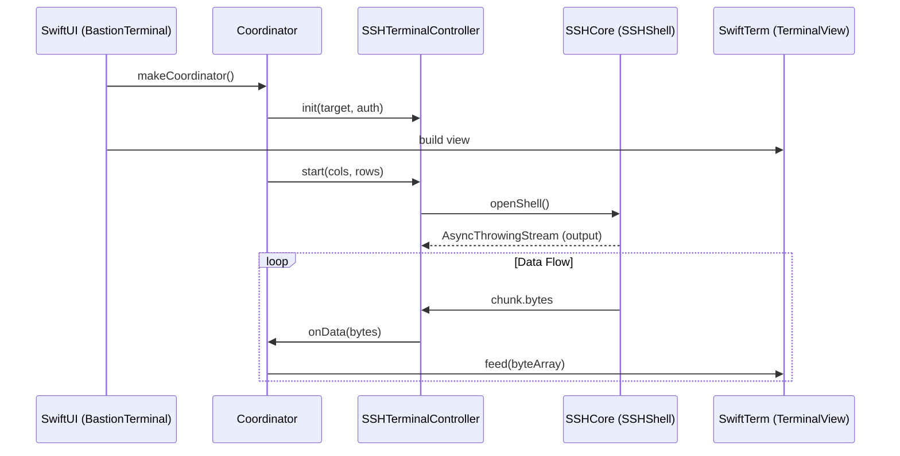
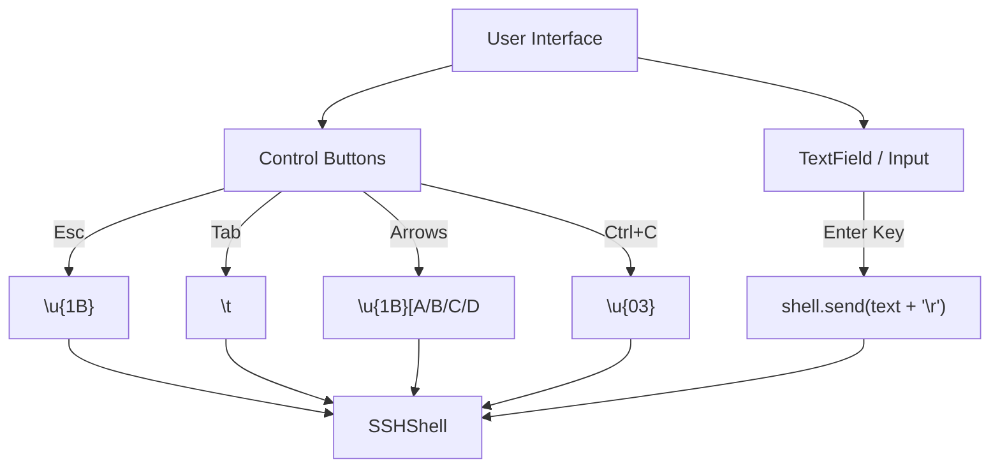

<details>
<summary>Relevant source files</summary>

The following files were used as context for generating this wiki page:

- [App/TerminalView.swift](App/TerminalView.swift)
- [App/TelnetTerminalView.swift](App/TelnetTerminalView.swift)
- [App/TerminalTheme.swift](App/TerminalTheme.swift)
- [LinuxApp/Sources/bastion-gui/TerminalBuffer.swift](LinuxApp/Sources/bastion-gui/TerminalBuffer.swift)
- [LinuxApp/Sources/bastion-gui/TerminalSessionView.swift](LinuxApp/Sources/bastion-gui/TerminalSessionView.swift)
- [LinuxApp/Sources/bastion-gui/TerminalGridView.swift](LinuxApp/Sources/bastion-gui/TerminalGridView.swift)
- [VISION.md](VISION.md)
</details>

# Terminal Emulation

Terminal Emulation in Bastion serves as the primary interactive interface for SSH and Telnet sessions. The system is designed to provide a high-performance, cross-platform experience by utilizing platform-specific rendering engines while maintaining a shared core logic. On Apple platforms (iOS and macOS), the project integrates with the [SwiftTerm](https://github.com/migueldeicaza/SwiftTerm) library, while on Linux, it implements a custom VT100/ANSI-compatible buffer and grid rendering system.

The emulation layer handles bidirectional data flow: translating remote server output (stdout) into visual character grids and converting local user input (keyboard events or button presses) into the appropriate escape sequences or raw bytes required by the remote Pseudo-Terminal (PTY).

Sources: [VISION.md:144-148](VISION.md#L144-L148), [App/TerminalView.swift:14-25](App/TerminalView.swift#L14-L25), [LinuxApp/Sources/bastion-gui/TerminalSessionView.swift:11-15](LinuxApp/Sources/bastion-gui/TerminalSessionView.swift#L11-L15)

## Architecture and Components

The terminal emulation architecture differs significantly between Apple platforms and Linux/Windows targets due to UI framework dependencies.

### Apple Platforms (iOS/macOS)
On Apple devices, the `SSHTerminalController` manages the lifecycle of the connection. It utilizes `UIViewRepresentable` (iOS) or `NSViewRepresentable` (macOS) to bridge the SwiftUI lifecycle with the `SwiftTerm.TerminalView`.



The Coordinator acts as the `TerminalViewDelegate`, handling events such as `send` (keyboard input) and `sizeChanged` (UI resizing), which are then propagated back to the `SSHShell`.

Sources: [App/TerminalView.swift:34-100](App/TerminalView.swift#L34-L100), [App/TerminalView.swift:168-200](App/TerminalView.swift#L168-L200)

### Linux Platform (GUI)
The Linux implementation uses a custom terminal stack because `SwiftTerm` is tied to Apple's UIKit/AppKit. The `TerminalController` on Linux manages a `TerminalBuffer`, which stores the state of the terminal grid (cursor position, colors, and character data).

| Component | Description |
| :--- | :--- |
| `TerminalBuffer` | An internal VT100/ANSI interpreter that maintains the character grid and handles SGR (Select Graphic Rendition) colors. |
| `TerminalGridView` | A view that renders the `TerminalBuffer` as Text runs. |
| `TerminalController` | Manages the `SSHShell` and feeds text data into the `TerminalBuffer`. |

Sources: [LinuxApp/Sources/bastion-gui/TerminalSessionView.swift:16-55](LinuxApp/Sources/bastion-gui/TerminalSessionView.swift#L16-L55), [LinuxApp/Sources/bastion-gui/TerminalBuffer.swift](LinuxApp/Sources/bastion-gui/TerminalBuffer.swift)

## Input Handling

Input handling varies by platform capability. On mobile and GTK-based Linux versions, physical keyboard API limitations are bypassed using virtual control buttons.

### Command and Control Sequences
For Linux, where raw keyboard events may be limited in `SwiftCrossUI`, the application provides explicit buttons for standard control sequences.



In Apple environments, the `TerminalViewDelegate` captures direct keyboard events and passes them to the shell via `controller.sendKeys(data)`.

Sources: [LinuxApp/Sources/bastion-gui/TerminalSessionView.swift:105-131](LinuxApp/Sources/bastion-gui/TerminalSessionView.swift#L105-L131), [App/TerminalView.swift:214-218](App/TerminalView.swift#L214-L218)

## Visual Styling and Themes

The emulation layer supports extensive customization through the `TerminalTheme` system. A theme defines colors for the background, foreground, cursor, selection, and the 16 standard ANSI colors.

### Hex Color Processing
Colors are defined as hex strings (e.g., `#282a36`) and parsed into `Double` RGB components (0.0 to 1.0) via the `HexRGB` structure. This allows consistent color representation across SwiftUI, SwiftTerm, and GTK-based views.

### Included Themes
The system includes several popular developer color schemes:
*  **Dracula** (Default)
*  **Nord**
*  **Solarized** (Dark/Light)
*  **Gruvbox**
*  **Tokyo Night**
*  **Catppuccin** (Mocha/Latte/Frappé/Macchiato)

Sources: [App/TerminalTheme.swift:17-100](App/TerminalTheme.swift#L17-L100), [App/TerminalTheme.swift:120-143](App/TerminalTheme.swift#L120-L143)

## Lifecycle Management

To prevent resource leaks, terminal controllers implement explicit teardown logic.

### Session Management
The `stop()` method is critical for closing the PTY shell and the underlying connection chain. An `isStopped` flag is used to ensure that late-arriving asynchronous connection tasks do not leave "orphan" sessions open after the view has been dismissed.

```mermaid
graph TD
    Start[start()] --> Connect[SSHConnectionChain.connect()]
    Connect --> CheckStop{isStopped?}
    CheckStop -- Yes --> CloseChain[chain.close]
    CheckStop -- No --> OpenShell[openShell()]
    OpenShell --> CheckStop2{isStopped?}
    CheckStop2 -- Yes --> CloseShell[shell.close]
    CheckStop2 -- No --> Stream[Process Output Stream]
```

Sources: [App/TerminalView.swift:70-95](App/TerminalView.swift#L70-L95), [LinuxApp/Sources/bastion-gui/TerminalSessionView.swift:57-78](LinuxApp/Sources/bastion-gui/TerminalSessionView.swift#L57-L78), [App/TelnetTerminalView.swift:34-60](App/TelnetTerminalView.swift#L34-L60)

## Protocol Support

While SSH is the primary focus, the emulation layer also supports Telnet for legacy network equipment.

*  **SSH Emulation:** Supports PTY resizing via `shell.resize(cols:rows:)`.
*  **Telnet Emulation:** Uses a `TelnetSession` but shares the same `TerminalView` logic on Apple platforms. It currently refuses all negotiated options (via `TelnetIACFilter`), resulting in no terminal size negotiation (NAWS) support.

Sources: [App/TelnetTerminalView.swift:10-25](App/TelnetTerminalView.swift#L10-L25), [App/TerminalView.swift:104-105](App/TerminalView.swift#L104-L105)

Terminal emulation in Bastion bridges the gap between low-level network protocols and high-level UI frameworks, ensuring that system administrators have a responsive and visually consistent environment across mobile and desktop platforms.
