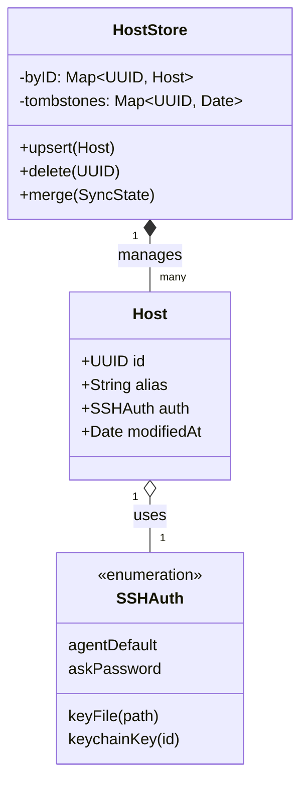
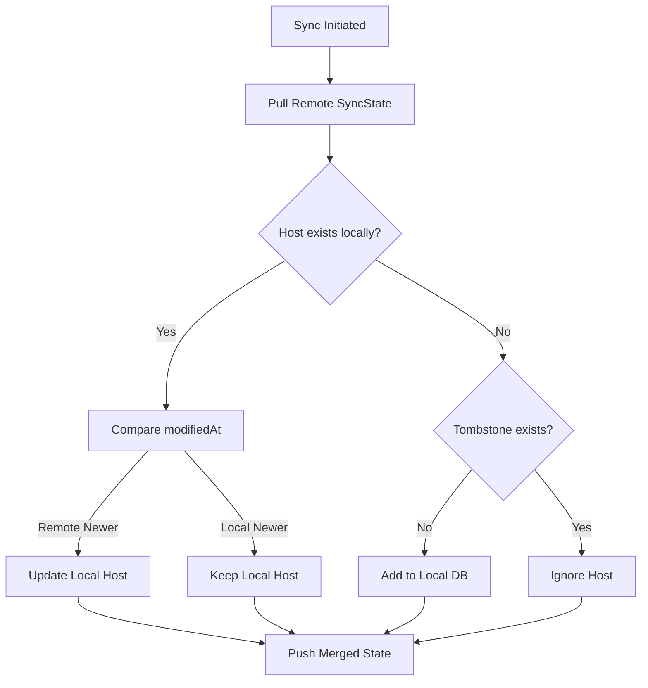
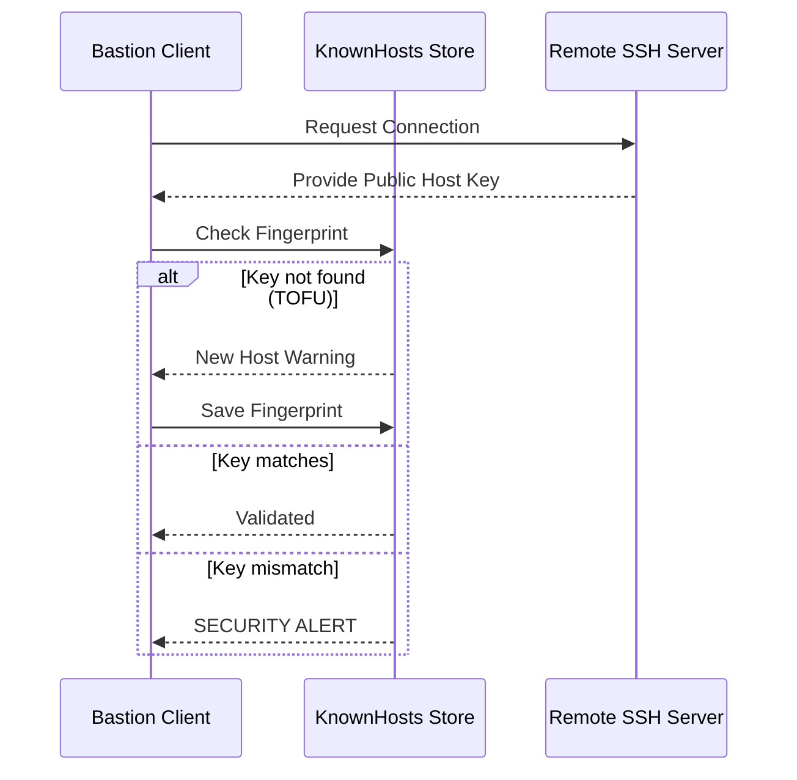

Relevant source files

The following files were used as context for generating this wiki page:

- [Sources/SSHCore/Host.swift](Sources/SSHCore/Host.swift)
- [Sources/SSHCore/HostStore.swift](Sources/SSHCore/HostStore.swift)
- [Sources/SSHCore/KnownHosts.swift](Sources/SSHCore/KnownHosts.swift)
- [Sources/SSHCore/SSHConfig.swift](Sources/SSHCore/SSHConfig.swift)
- [Sources/SSHCore/SyncEngine.swift](Sources/SSHCore/SyncEngine.swift)
- [README.md](README.md)

# Host Database & Configuration

The Host Database and Configuration system in Bastion serves as the central management layer for SSH connection metadata and security credentials. It provides a thread-safe, persistent storage mechanism for remote server details, tags, and authentication preferences while supporting deterministic synchronization across different platforms.

The system is architected around the `SSHCore` library, ensuring that the same logic for host management, `~/.ssh/config` parsing, and data synchronization is shared between iOS, macOS, Linux, and Windows applications. By using JSON-based storage instead of complex database engines, the project ensures cross-platform compatibility and human-readable backups.

Sources: [README.md:12-16](README.md#L12-L16), [Sources/SSHCore/HostStore.swift:9-13](Sources/SSHCore/HostStore.swift#L9-L13)

## Data Models

The core of the database is the `Host` structure, which contains all necessary information to establish a connection, alongside user-defined metadata for organization.

### The Host Entity
Each host is uniquely identified by a UUID and tracks its own modification history to facilitate conflict resolution during synchronization.

| Field | Type | Description |
|---|---|---|
| `id` | `UUID` | Unique identifier for the host entry. |
| `alias` | `String` | User-friendly name for the server. |
| `hostName` | `String` | The IP address or domain name of the remote host. |
| `user` | `String` | The SSH username for authentication. |
| `port` | `Int` | The destination port (defaults to 22). |
| `auth` | `SSHAuth` | The authentication method (Password, Key, Agent, etc.). |
| `tags` | `[String]` | A list of user-defined tags for grouping. |
| `modifiedAt` | `Date` | Timestamp of the last local modification. |

Sources: [Sources/SSHCore/Host.swift:7-35](Sources/SSHCore/Host.swift#L7-L35), [Sources/SSHCore/HostStore.swift:52-55](Sources/SSHCore/HostStore.swift#L52-L55)

### Host Hierarchy and Relationships
The following diagram illustrates the relationship between the storage layer, the host entity, and its authentication components.

The diagram shows how `HostStore` maintains a collection of `Host` objects and their deletion markers (tombstones). Sources: [Sources/SSHCore/HostStore.swift:11-14](Sources/SSHCore/HostStore.swift#L11-L14), [Sources/SSHCore/Host.swift:15-30](Sources/SSHCore/Host.swift#L15-L30)

## Persistence and Storage Architecture

Bastion uses a file-based JSON storage approach. The `HostStore` class manages access to this file, providing thread safety via `NSLock`.

### Storage Mechanics
*  **Pathing:** By default, hosts are stored at `~/.bastion/hosts.json`.
*  **Thread Safety:** All read and write operations are wrapped in an `NSLock.withLock` block to prevent data races in multi-session environments.
*  **Atomicity:** Writes are performed using atomic operations to ensure that the database file is not corrupted during a crash or power failure.
*  **Deletion Strategy:** Instead of simple removal, the system uses "tombstones"—records of deletion with a timestamp. This allows the `SyncEngine` to propagate deletions to other devices.

Sources: [Sources/SSHCore/HostStore.swift:16-18](Sources/SSHCore/HostStore.swift#L16-L18), [Sources/SSHCore/HostStore.swift:59-63](Sources/SSHCore/HostStore.swift#L59-L63), [Sources/SSHCore/HostStore.swift:110-117](Sources/SSHCore/HostStore.swift#L110-L117)

## Synchronization Engine

The synchronization system is designed to work without a central server, utilizing file-based transports like iCloud, Dropbox, or Syncthing.

### LWW-Element-Set Logic
Bastion implements a Last-Write-Wins (LWW) strategy for merging host data. When two versions of a host exist, the `SyncEngine` compares the `modifiedAt` timestamps.

This flow ensures deterministic outcomes across all devices without requiring a complex backend. Sources: [Sources/SSHCore/SyncEngine.swift:10-45](Sources/SSHCore/SyncEngine.swift#L10-L45), [Sources/SSHCore/HostStore.swift:95-101](Sources/SSHCore/HostStore.swift#L95-L101)

## SSH Configuration Integration

Bastion provides interoperability with standard OpenSSH environments by parsing `~/.ssh/config` files.

### The SSHConfig Parser
The `SSHConfig` parser recognizes standard keywords and translates them into internal `Host` objects. This allows users to import existing server lists seamlessly.

| Keyword | Host Mapping |
|---|---|
| `Host [alias]` | Maps to `Host.alias` |
| `HostName` | Maps to `Host.hostName` |
| `User` | Maps to `Host.user` |
| `Port` | Maps to `Host.port` |
| `IdentityFile` | Maps to `SSHAuth.keyFile` |

Sources: [Sources/SSHCore/SSHConfig.swift:15-40](Sources/SSHCore/SSHConfig.swift#L15-L40), [Sources/SSHCore/Host.swift:85-95](Sources/SSHCore/Host.swift#L85-L95)

### Known Hosts and Security
Security is maintained through host key validation. The `KnownHosts` manager stores fingerprints of seen host keys to prevent Man-in-the-Middle (MITM) attacks.

Sources: [Sources/SSHCore/KnownHosts.swift:10-30](Sources/SSHCore/KnownHosts.swift#L10-L30), [README.md:95-98](README.md#L95-L98)

## Summary
The Host Database & Configuration system provides a robust foundation for the Bastion SSH client. By combining thread-safe local storage (`HostStore`), a deterministic merge algorithm (`SyncEngine`), and compatibility with standard SSH configurations (`SSHConfig`), it enables a seamless experience for power users managing large server fleets across multiple platforms.
