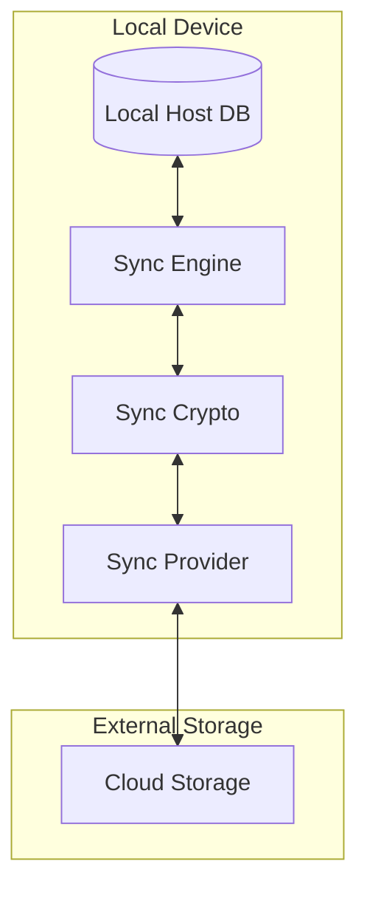
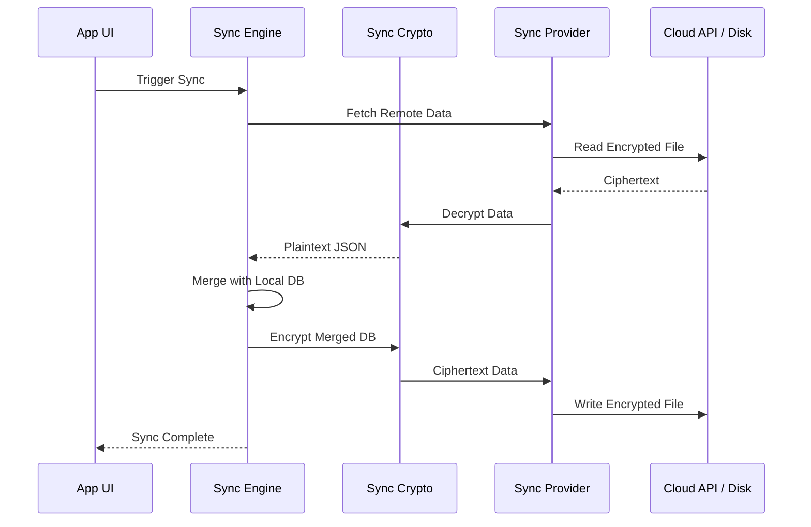

Relevant source files

The following files were used as context for generating this wiki page:

- [Sources/SSHCore/SyncEngine.swift](Sources/SSHCore/SyncEngine.swift)
- [Sources/SSHCore/SyncProvider.swift](Sources/SSHCore/SyncProvider.swift)
- [Sources/SSHCore/SyncCrypto.swift](Sources/SSHCore/SyncCrypto.swift)
- [App/SyncSettingsView.swift](App/SyncSettingsView.swift)
- [README.md](README.md)
- [SECURITY.md](SECURITY.md)
- [VISION.md](VISION.md)

# Sync Engine & End-to-End Encryption

## Introduction

The Sync Engine and End-to-End (E2E) Encryption system in Bastion provides a secure, decentralized mechanism for synchronizing the host database across multiple devices. The system is designed to operate without a central server or mandatory user accounts, allowing users to leverage existing storage providers like iCloud Drive, Dropbox, or Git repositories while maintaining absolute privacy.

The architecture ensures that sensitive data, including SSH keys and configuration metadata, never leaves the device in an unencrypted state. By utilizing robust cryptographic standards such as AES-256-GCM and PBKDF2, Bastion protects user data from being accessed by cloud storage providers or unauthorized third parties.

Sources: [README.md:21-25](README.md#L21-L25), [VISION.md:144-147](VISION.md#L144-L147), [SECURITY.md:50-54](SECURITY.md#L50-L54)

## Architecture and Data Flow

The synchronization process relies on three primary layers: the **Sync Engine**, which handles logical data merging; the **Sync Provider**, which manages physical transport; and the **Sync Crypto** layer, which ensures data confidentiality.

### Component Interaction

The following diagram illustrates the relationship between the local host database, the encryption layer, and the remote storage provider.

*Note: The Sync Engine processes logic on the local device before passing data through the encryption layer to the provider.*

Sources: [README.md:95-102](README.md#L95-L102), [SyncEngine.swift](SyncEngine.swift)

### Synchronization Workflow

Synchronization is deterministic and uses a "last-write-wins" strategy combined with "tombstones" to handle deletions. This ensures that even without a central coordinator, all devices eventually converge on the same state.

*Note: This flow ensures that only encrypted data is transmitted and stored externally.*

Sources: [README.md:21-24](README.md#L21-L24), [SyncEngine.swift](SyncEngine.swift)

## End-to-End Encryption (E2E)

Bastion employs industry-standard cryptographic primitives to ensure that the host database remains private.

### Cryptographic Implementation
*  **Encryption Algorithm:** AES-256-GCM (Galois/Counter Mode) for authenticated encryption.
*  **Key Derivation:** PBKDF2-HMAC-SHA256 is used to derive the encryption key from a user-provided passphrase.
*  **Integrity:** The system detects and rejects manipulated or corrupted files during the decryption process.

| Feature | Implementation |
| :--- | :--- |
| Encryption | AES-256-GCM |
| Key Stretching | PBKDF2 |
| Hashing | HMAC-SHA256 |
| Storage | System Keychain (iOS/macOS) |

Sources: [README.md:27-31](README.md#L27-L31), [SECURITY.md:50-54](SECURITY.md#L50-L54), [SyncCrypto.swift](SyncCrypto.swift)

### Secret Management
Secrets such as OAuth tokens, SSH keys, and the sync passphrase are never stored in plaintext on the disk. On Apple platforms (iOS and macOS), Bastion utilizes the system Keychain for secure storage.

Sources: [SECURITY.md:50-53](SECURITY.md#L50-L53), [SyncSettingsView.swift](SyncSettingsView.swift)

## Sync Providers

The system supports multiple transport mechanisms through the `SyncProvider` protocol. This abstraction allows the application to support various storage backends interchangeably.

### Supported Transport Methods
1.  **FolderSyncProvider:** Points to a local directory that is synchronized by an external service (e.g., iCloud Drive, Syncthing, or a local Git repository). Implemented in `Sources/SSHCore/SyncProvider.swift`.
2.  **DropboxSyncProvider:** Communicates directly with the Dropbox API using OAuth2 + PKCE. Implemented in `App/DropboxSyncProvider.swift`.
3.  **GoogleDriveSyncProvider:** Uses the `drive.appdata` scope to store data in a hidden app folder. Implemented in `App/GoogleDriveSyncProvider.swift`.
4.  **OneDriveSyncProvider:** Integrates with Microsoft Graph API using path-based storage. Implemented in `App/OneDriveSyncProvider.swift`.

### Provider Configuration

| Provider | Mechanism | Required Scope |
| :--- | :--- | :--- |
| Folder | Local File I/O | N/A |
| Dropbox | API (OAuth2 PKCE) | `files.content.write`, `files.content.read` |
| Google Drive | API (OAuth2 PKCE) | `drive.appdata` |
| OneDrive | API (OAuth2 PKCE) | `Files.ReadWrite.AppFolder`, `offline_access` |

Sources: [README.md:33-52](README.md#L33-L52), [SyncProvider.swift](SyncProvider.swift)

## Implementation Details

### Sync Engine Logic
The `SyncEngine` handles the deterministic merging of the host database. It maintains a state that tracks the modification time of entries and uses deletion markers (tombstones) to ensure that a deletion on one device is propagated to others rather than being overwritten by an older state.

Sources: [SyncEngine.swift](SyncEngine.swift), [README.md:21-24](README.md#L21-L24)

### User Interface Integration
The synchronization settings are managed via the `SyncSettingsView`. This view allows users to:
*  Enable or disable synchronization.
*  Select a sync provider.
*  Set or update the E2E encryption passphrase.
*  Manually trigger a sync operation.

Sources: [SyncSettingsView.swift](SyncSettingsView.swift), [App/project.yml:32-34](App/project.yml#L32-L34)

## Conclusion

The Sync Engine & End-to-End Encryption system provides a balance between convenience and security. By decoupling the synchronization logic from the storage provider and enforcing strict local encryption, Bastion allows users to maintain control over their data regardless of the cloud service utilized. The deterministic merge strategy ensures data consistency across the multi-platform ecosystem including iOS, macOS, and Linux.

Sources: [VISION.md:144-147](VISION.md#L144-L147), [README.md:21-31](README.md#L21-L31)
