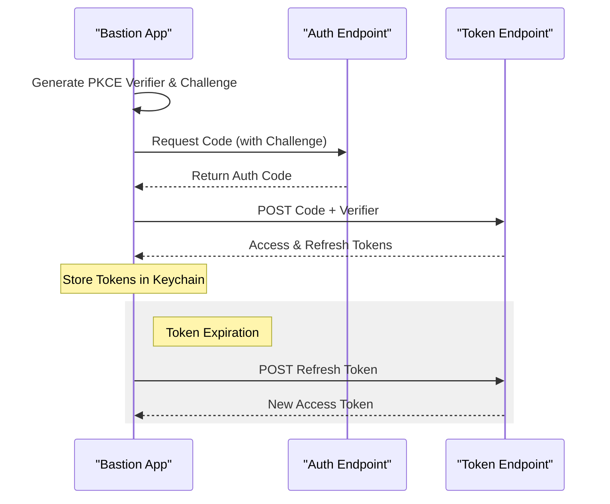
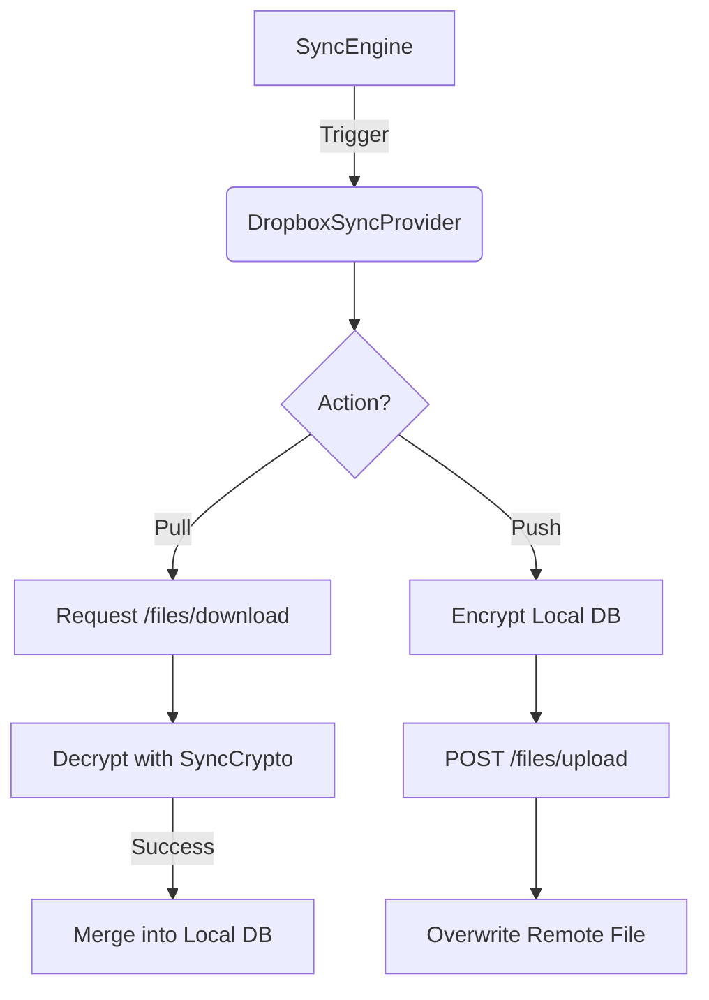

<details>
<summary>Relevant source files</summary>

The following files were used as context for generating this wiki page:

- [Sources/SSHCore/OAuthPKCE.swift](Sources/SSHCore/OAuthPKCE.swift)
- [App/OAuthProviders.swift](App/OAuthProviders.swift)
- [App/OAuthTokenStore.swift](App/OAuthTokenStore.swift)
- [App/DropboxSyncProvider.swift](App/DropboxSyncProvider.swift)
- [README.md](README.md)
- [SECURITY.md](SECURITY.md)
</details>

# Cloud Providers & OAuth Integrations

Bastion provides a robust framework for integrating with third-party cloud storage providers to facilitate encrypted synchronization of host databases. This system is designed to be "account-less" in terms of primary application usage, leveraging existing cloud accounts (Dropbox, Google Drive, OneDrive) solely as "dumb" storage targets for end-to-end (E2E) encrypted payloads.

The integration architecture prioritizes security by utilizing **OAuth 2.0 with Proof Key for Code Exchange (PKCE)**. This ensures that the application never handles or stores client secrets; instead, it relies on public client IDs and secure token exchange flows. All data sent to cloud providers is encrypted locally using AES-256-GCM before transmission.

Sources: [README.md:28-35](README.md#L28-L35), [SECURITY.md:52-57](SECURITY.md#L52-L57)

## OAuth Architecture & Security

Bastion implements the **PKCE (RFC 7636)** extension to OAuth 2.0, which is specifically designed for public clients like mobile and desktop applications. By generating a cryptographic `code_verifier` and a corresponding `code_challenge`, the app can securely exchange an authorization code for an access token without needing a pre-shared secret.

### OAuth Flow Sequence
The following diagram illustrates the token acquisition and refresh process used by the application:



Sources: [Sources/SSHCore/OAuthPKCE.swift](Sources/SSHCore/OAuthPKCE.swift), [App/OAuthTokenStore.swift:45-58](App/OAuthTokenStore.swift#L45-L58)

### Security Constraints
*  **Scoped Access**: The application strictly requests app-scopeless or folder-restricted permissions (e.g., Dropbox "App folder" or Google Drive `appdata`). It never requests access to the user's entire cloud account.
*  **Keychain Storage**: All sensitive data, including refresh tokens and access tokens, are stored in the system Keychain rather than in cleartext on the disk.
*  **PKCE Enforcement**: The core logic in `OAuthPKCE.swift` handles the generation of cryptographically secure random verifiers and SHA-256 challenges.

Sources: [SECURITY.md:52-65](SECURITY.md#L52-L65), [App/OAuthProviders.swift:7-13](App/OAuthProviders.swift#L7-L13)

## Supported Cloud Providers

The application defines a standard configuration structure for cloud providers. While the logic is modular, specific configurations are required for each service.

| Provider | Purpose | Scope Requested | Redirect URI |
| :--- | :--- | :--- | :--- |
| **Dropbox** | Syncing encrypted DB | `files.content.write`, `files.content.read` | `se.denied.bastion://oauth/dropbox` |
| **Google Drive** | Syncing encrypted DB | `https://www.googleapis.com/auth/drive.appdata` | `se.denied.bastion://oauth/googledrive` |
| **OneDrive** | Syncing encrypted DB | `Files.ReadWrite.AppFolder`, `offline_access` | `se.denied.bastion://oauth/onedrive` |

Sources: [App/OAuthProviders.swift:25-54](App/OAuthProviders.swift#L25-L54), [README.md:46-52](README.md#L46-L52)

## Token Management & Persistence

The `OAuthTokenStore` handles the lifecycle of OAuth tokens. It is designed to be thread-safe and can be called from background threads, which is necessary for the `SyncProvider` operations.

### Key Functions
*  **`validAccessToken(for:)`**: Retrieves a valid token, automatically triggering a silent refresh using the `refresh_token` if the current access token has expired.
*  **`save(_:for:)`**: Encodes the `StoredOAuthToken` into JSON and persists it to the Keychain.
*  **`synchronousRequest(_:)`**: A utility that wraps `URLSession` data tasks with a `DispatchSemaphore` to allow blocking network calls in background sync processes.

```swift
// Example of token refreshing logic
static func validAccessToken(for provider: OAuthProviderConfig) throws -> String {
    guard var token = load(for: provider) else { throw OAuthError.notLoggedIn }
    if token.isExpired, let refreshToken = token.refreshToken {
        token = try refresh(refreshToken, provider: provider)
        try save(token, for: provider)
    }
    return token.accessToken
}
```

Sources: [App/OAuthTokenStore.swift:24-52](App/OAuthTokenStore.swift#L24-L52)

## Dropbox Sync Implementation

The `DropboxSyncProvider` serves as a concrete implementation of the `SyncProvider` interface. It manages the transmission of the `SyncState` to and from the Dropbox API.

### Data Flow for Sync
1.  **Pull**: The provider sends a POST request to `/files/download`. If the file is found, it is decrypted via `SyncCrypto.open()` using a user-provided passphrase.
2.  **Push**: The `SyncState` is sealed into an encrypted payload via `SyncCrypto.seal()` and uploaded via `/files/upload` with an `overwrite` mode.



Sources: [App/DropboxSyncProvider.swift:15-45](App/DropboxSyncProvider.swift#L15-L45), [README.md:31-35](README.md#L31-L35)

## Implementation Status

| Feature | Status | Implementation Details |
| :--- | :--- | :--- |
| **OAuth PKCE Core** | ✅ Completed | Implemented in `Sources/SSHCore/OAuthPKCE.swift` |
| **Dropbox Integration** | ✅ Completed | Implemented in `App/DropboxSyncProvider.swift` |
| **Google Drive** | ✅ Completed | Implemented in `App/GoogleDriveSyncProvider.swift` |
| **OneDrive** | ✅ Completed | Implemented in `App/OneDriveSyncProvider.swift` |
| **S3 / AWS** | ⚠️ Planned | `S3Client.swift` exists for SigV4, but no OAuth-based UI yet |

Sources: [README.md:120-130](README.md#L120-L130), [App/DropboxSyncProvider.swift:10-14](App/DropboxSyncProvider.swift#L10-L14)

## Conclusion
The Cloud Provider system in Bastion enables secure, cross-platform synchronization by delegating storage to trusted providers while maintaining strict client-side encryption. By leveraging PKCE and Keychain-backed token management, the application ensures that user credentials and data remains protected throughout the OAuth lifecycle and sync process.
