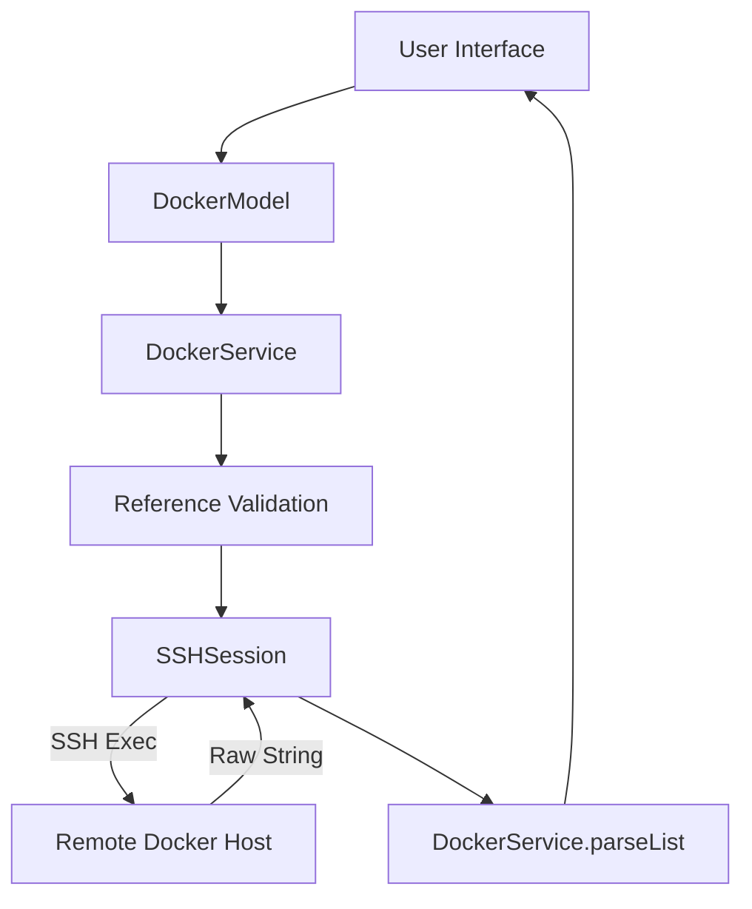
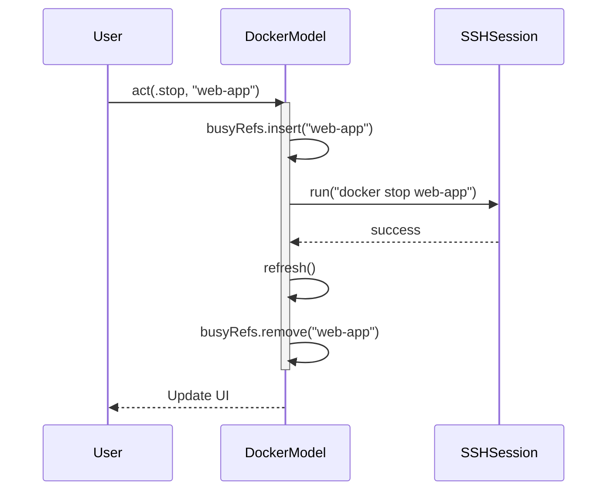

<details>
<summary>Relevant source files</summary>

The following files were used as context for generating this wiki page:

- [Sources/SSHCore/DockerService.swift](Sources/SSHCore/DockerService.swift)
- [App/DockerView.swift](App/DockerView.swift)
- [LinuxApp/Sources/bastion-gui/DockerView.swift](LinuxApp/Sources/bastion-gui/DockerView.swift)
- [Sources/SSHCore/SystemSnapshot.swift](Sources/SSHCore/SystemProbe.swift)
- [Tests/SSHCoreTests/DockerServiceTests.swift](Tests/SSHCoreTests/DockerServiceTests.swift)
- [VISION.md](VISION.md)
</details>

# Docker Management Features

## Introduction

The Docker Management Features in Bastion provide a native, agentless interface for managing Docker containers on remote servers via SSH. Unlike containerized solutions, Bastion is a standalone application that executes commands directly over an SSH session to interact with the Docker daemon on the target host. This allows users to list, start, stop, restart, and view logs of containers without requiring additional software installed on the remote machine.

Sources: [VISION.md:73-77](VISION.md#L73-L77), [README.md:9-11](README.md#L9-L11)

The system is designed for cross-platform compatibility, sharing a core logic layer (`SSHCore`) across iOS, macOS, and Linux, while utilizing platform-specific UI implementations like SwiftUI for Apple devices and SwiftCrossUI for Linux.

Sources: [README.md:16-21](README.md#L16-L21)

## Core Architecture and Data Flow

The architecture follows a layered approach where the UI triggers actions through a `DockerModel`, which interacts with the `DockerService` to build and execute SSH commands.

### Interaction Flow

1.  **User Request:** The user interacts with the UI (e.g., `DockerView`) to perform an action like "Start Container."
2.  **Model Coordination:** The `DockerModel` ensures a valid `SSHSession` is active.
3.  **Command Building:** `DockerService` generates a shell command string, validating container references to prevent shell injection.
4.  **SSH Execution:** The command is sent over the `SSHSession` to the remote host.
5.  **Parsing:** The raw string output from the remote host is parsed back into Swift data structures.



The diagram shows the end-to-end flow from user interaction to remote command execution and result parsing.
Sources: [Sources/SSHCore/DockerService.swift:54-72](Sources/SSHCore/DockerService.swift#L54-L72), [App/DockerView.swift:23-45](App/DockerView.swift#L23-L45)

## Docker Service Logic

The `DockerService` acts as the primary engine for generating validated Docker commands and parsing their output.

### Security and Validation
To prevent command injection, every container reference (ID or name) is validated against a strict regular expression `^[A-Za-z0-9][A-Za-z0-9_.-]*$`. This ensures that characters like `;`, `&`, or spaces cannot be used to execute arbitrary code.

Sources: [Sources/SSHCore/DockerService.swift:14-23](Sources/SSHCore/DockerService.swift#L14-L23), [Tests/SSHCoreTests/DockerServiceTests.swift:10-18](Tests/SSHCoreTests/DockerServiceTests.swift#L10-L18)

### Command Generation
`DockerService` constructs standard Docker CLI commands. For listing containers, it uses the `--format` flag to return piped data for reliable parsing.

| Action | Command Pattern |
| :--- | :--- |
| List Containers | `docker ps -a --format '{{.ID}}\|.Names\|.Image\|.Status' 2>/dev/null` |
| Start | `docker start [ref]` |
| Stop | `docker stop [ref]` |
| Restart | `docker restart [ref]` |
| Logs | `docker logs --tail [n] [ref] 2>&1` |
| Shell | `docker exec -it [ref] sh -c '...'` |

Sources: [Sources/SSHCore/DockerService.swift:27-52](Sources/SSHCore/DockerService.swift#L27-L52), [Tests/SSHCoreTests/DockerServiceTests.swift:21-30](Tests/SSHCoreTests/DockerServiceTests.swift#L21-L30)

### Data Models
The system uses the `DockerContainer` struct to represent remote container states.

```swift
public struct DockerContainer: Codable, Sendable, Equatable {
    public var id: String
    public var name: String
    public var image: String
    public var status: String

    public var isRunning: Bool { status.hasPrefix("Up") }
}
```

Sources: [Sources/SSHCore/SystemProbe.swift:31-40](Sources/SSHCore/SystemProbe.swift#L31-L40)

## User Interface Implementation

The project implements two primary views for Docker management, tailored to different platforms but sharing the same underlying model logic.

### Platform Specifics
- **Apple (iOS/macOS):** Uses `List` with a `Menu` for container actions. It utilizes `StateObject` for lifecycle management.
- **Linux (GTK4):** Uses `ScrollView` with inline buttons, as SwiftCrossUI currently lacks context menus or swipe actions for list rows.

Sources: [App/DockerView.swift:100-142](App/DockerView.swift#L100-L142), [LinuxApp/Sources/bastion-gui/DockerView.swift:106-138](LinuxApp/Sources/bastion-gui/DockerView.swift#L106-L138)

### State Management
The `DockerModel` manages the loading state, error messages, and a `busyRefs` set. The `busyRefs` set tracks containers currently undergoing an action (like restarting) to prevent UI race conditions and provide per-container progress indicators.



The sequence diagram illustrates how the model tracks "busy" states during asynchronous remote actions.
Sources: [App/DockerView.swift:61-75](App/DockerView.swift#L61-L75), [LinuxApp/Sources/bastion-gui/DockerView.swift:76-90](LinuxApp/Sources/bastion-gui/DockerView.swift#L76-L90)

## Container Logs and Shell Access

Bastion provides deeper integration for troubleshooting through logs and interactive shells.

- **Logs:** Fetches a tail (default 200 lines) of container logs. The UI displays these in a monospaced font sheet for readability.
- **Shell:** Facilitates an interactive PTY-shell inside a container. It attempts to use `bash` and falls back to `sh` if `bash` is unavailable.

Sources: [Sources/SSHCore/DockerService.swift:49-52](Sources/SSHCore/DockerService.swift#L49-L52), [App/DockerView.swift:150-170](App/DockerView.swift#L150-L170), [LinuxApp/Sources/bastion-gui/DockerView.swift:161-175](LinuxApp/Sources/bastion-gui/DockerView.swift#L161-L175)

## Summary

The Docker Management system in Bastion provides a secure, agentless way to oversee remote containers. By utilizing a shared core for command generation and validation, the application ensures consistent behavior across iOS, macOS, and Linux. The combination of strict reference validation and native UI components provides a robust tool for system administrators and DevOps professionals to manage their infrastructure directly from their preferred devices.
