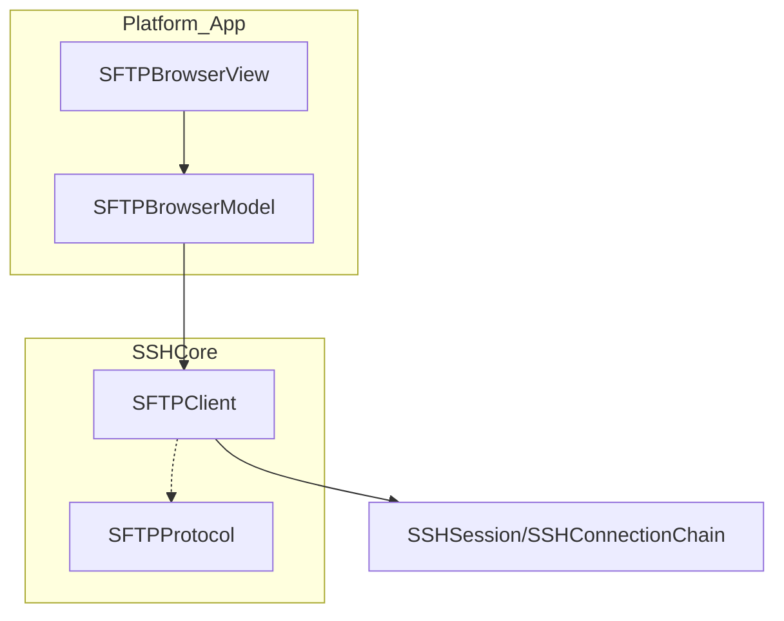
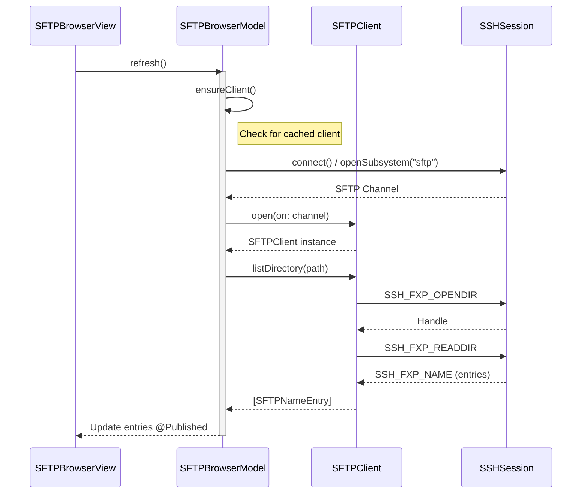

<details>
<summary>Relevant source files</summary>

The following files were used as context for generating this wiki page:

- [Sources/SSHCore/SFTPProtocol.swift](Sources/SSHCore/SFTPProtocol.swift)
- [Sources/SSHCore/SFTPClient.swift](Sources/SSHCore/SFTPClient.swift)
- [App/SFTPBrowserModel.swift](App/SFTPBrowserModel.swift)
- [App/SFTPBrowserView.swift](App/SFTPBrowserView.swift)
- [LinuxApp/Sources/bastion-gui/SFTPBrowserView.swift](LinuxApp/Sources/bastion-gui/SFTPBrowserView.swift)
- [VISION.md](VISION.md)
</details>

# SFTP & File Explorer

The **SFTP & File Explorer** is a core component of the Bastion project, providing a full-featured file manager that operates over the SSH File Transfer Protocol (SFTP) version 3. It allows users to browse remote directories, manage files and permissions, edit text content, and perform archive operations directly on a remote server. The system is designed with a cross-platform core (`SSHCore`) used by both the Apple-specific SwiftUI application and the Linux GTK-based GUI.

The implementation focuses on high performance and security, utilizing SwiftNIO for asynchronous networking and ensuring that sensitive data like credentials never leave the device unencrypted. Key features include drag-and-drop support on macOS, recursive directory uploads, and integration with remote archive tools like `tar` and `zip`.

Sources: [VISION.md:124-126](VISION.md#L124-L126), [App/SFTPBrowserView.swift:6-10](App/SFTPBrowserView.swift#L6-L10), [SFTPProtocol.swift](SFTPProtocol.swift)

## Architecture and Component Overview

The SFTP system is structured into three distinct layers: the Protocol layer (wire format), the Client layer (logic and channel management), and the Presentation layer (UI and state management).

### Component Hierarchy



The diagram above illustrates how the UI interacts with a specialized `SFTPBrowserModel`, which manages the lifecycle of an `SFTPClient`. The `SFTPClient` communicates over an SSH subsystem channel using types defined in `SFTPProtocol.swift`.

Sources: [SFTPClient.swift](SFTPClient.swift), [App/SFTPBrowserModel.swift](App/SFTPBrowserModel.swift), [LinuxApp/Sources/bastion-gui/SFTPBrowserView.swift](LinuxApp/Sources/bastion-gui/SFTPBrowserView.swift)

### Core Classes and Roles

| Component | Responsibility | Source File |
| :--- | :--- | :--- |
| `SFTPClient` | Manages the SFTP subsystem channel, request/response matching, and high-level file operations. | `SFTPClient.swift` |
| `SFTPBrowserModel` | Handles the UI state (current path, directory entries, error messages) and lazy-loading of connections. | `App/SFTPBrowserModel.swift` |
| `SFTPProtocol` | Defines SFTP message types (`SSH_FXP_*`), packet encoding/decoding, and file attributes. | `SFTPProtocol.swift` |
| `SFTPNameEntry` | Represents a single file or directory returned by the server, including its filename and attributes. | `SFTPProtocol.swift` |

## Data Flow and Lifecycle

The system employs a "lazy connect" pattern. An `SFTPClient` is not initialized until a file operation is requested. This connection is then cached and reused for subsequent operations (browsing, uploading, etc.) until the view disappears.

### Connection and Directory Listing Flow



The `SFTPBrowserModel` ensures that concurrent calls to file operations do not trigger multiple redundant connection attempts by caching the `connectingTask`.

Sources: [App/SFTPBrowserModel.swift:42-101](App/SFTPBrowserModel.swift#L42-L101), [SFTPClient.swift:18-45](SFTPClient.swift#L18-L45)

## File and Directory Operations

The File Explorer supports a wide range of POSIX-like operations. While SFTP v3 (the version implemented) primarily deals with numeric IDs, the client handles the complexities of path joining and attribute manipulation.

### Supported Operations

*  **Navigation:** Browsing directories and moving up the directory tree.
*  **File Manipulation:** Creating directories (`mkdir`), removing files (`remove`), removing directories (`rmdir`), and renaming.
*  **Permission Management:** Changing file modes (`chmod`) using octal notation and changing ownership (`chown`) via numeric UID/GID.
*  **Text Editing:** Reading file content as UTF-8 strings and writing updates back to the server. Binary files are detected and prevented from being saved as text to avoid data corruption.
*  **Archive Management:** Integration with `ArchiveOperations` to create and extract `.tar.gz` and `.zip` files on the remote host.

Sources: [App/SFTPBrowserModel.swift:129-218](App/SFTPBrowserModel.swift#L129-L218), [LinuxApp/Sources/bastion-gui/SFTPBrowserView.swift:115-200](LinuxApp/Sources/bastion-gui/SFTPBrowserView.swift#L115-L200)

### Drag-and-Drop Uploads (macOS/iOS)

The SwiftUI implementation supports dropping files and folders from the local system (e.g., Finder) directly into the current remote directory. The model performs a recursive upload, creating remote directories as needed.

```swift
// App/SFTPBrowserModel.swift:233-241
func uploadDropped(_ urls: [URL]) async {
    for url in urls {
        await uploadOne(url)
    }
    await refresh()
}
```

Sources: [App/SFTPBrowserModel.swift:233-278](App/SFTPBrowserModel.swift#L233-L278), [App/SFTPBrowserView.swift:132-140](App/SFTPBrowserView.swift#L132-L140)

## Protocol Implementation Details

The implementation follows the SFTP Version 3 specification. Messages are encapsulated in `SFTPPacket` structures consisting of a length header, a type identifier, and a payload.

### Packet Structure
An SFTP packet is encoded as:
1. `UInt32`: Length of the following data.
2. `UInt8`: Message Type (e.g., `SSH_FXP_INIT`, `SSH_FXP_OPEN`).
3. Payload: Data specific to the message type.

### Key Message Types (SFTP v3)

| Type | Raw Value | Purpose |
| :--- | :--- | :--- |
| `initMsg` | 1 | Client handshake to negotiate version. |
| `open` | 3 | Open a file for reading/writing. |
| `read` | 5 | Read data from an open file handle. |
| `write` | 6 | Write data to an open file handle. |
| `opendir` | 11 | Open a directory for listing. |
| `readdir` | 12 | Read entries from an open directory handle. |
| `setstat` | 9 | Modify attributes (permissions/ownership) of a path. |

Sources: [Sources/SSHCore/SFTPProtocol.swift:10-40](Sources/SSHCore/SFTPProtocol.swift#L10-L40), [SFTPClient.swift:115-150](SFTPClient.swift#L115-L150)

## Error Handling and Safety

The SFTP client includes several safety mechanisms:
1.  **Task Cancellation:** Ongoing connection tasks are cancelled when the view is dismissed to prevent leaking background SSH sessions.
2.  **Binary Detection:** When opening files for editing, the model attempts to decode bytes as UTF-8. If decoding fails, the file is marked as `isBinary` and editing is disabled.
3.  **Atomic State Management:** Using `@MainActor` and specific guard clauses, the system prevents race conditions where a client might be closed while an operation is still in progress.

Sources: [App/SFTPBrowserModel.swift:63-70](App/SFTPBrowserModel.swift#L63-L70), [App/SFTPBrowserModel.swift:301-314](App/SFTPBrowserModel.swift#L301-L314), [LinuxApp/Sources/bastion-gui/SFTPBrowserView.swift:210-217](LinuxApp/Sources/bastion-gui/SFTPBrowserView.swift#L210-L217)

The SFTP & File Explorer provides a robust interface for remote file management, abstracting the low-level SFTP protocol into a modern, reactive UI while maintaining cross-platform compatibility through a shared Swift core.
