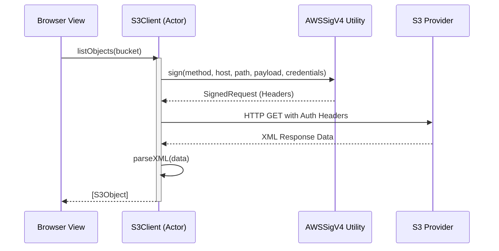
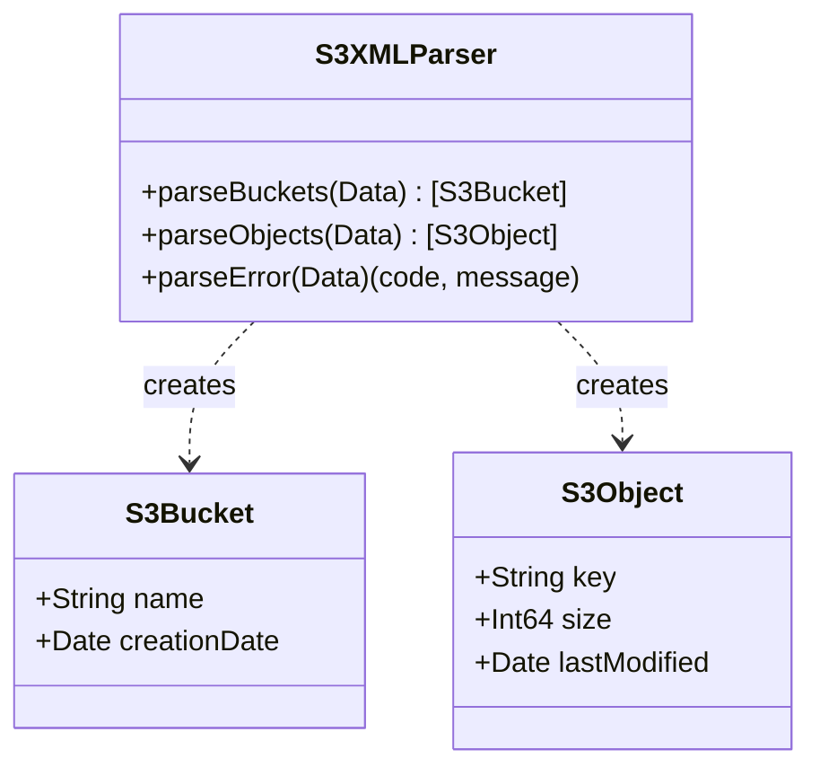

<details>
<summary>Relevant source files</summary>

The following files were used as context for generating this wiki page:

- [Sources/SSHCore/S3Client.swift](Sources/SSHCore/S3Client.swift)
- [Sources/SSHCore/S3ConnectionStore.swift](Sources/SSHCore/S3ConnectionStore.swift)
- [App/S3ConnectionView.swift](App/S3ConnectionView.swift)
- [LinuxApp/Sources/bastion-gui/S3BrowserView.swift](LinuxApp/Sources/bastion-gui/S3BrowserView.swift)
- [LinuxApp/Sources/bastion-gui/S3ConnectionEditView.swift](LinuxApp/Sources/bastion-gui/S3ConnectionEditView.swift)
- [Tests/SSHCoreTests/S3ClientTests.swift](Tests/SSHCoreTests/S3ClientTests.swift)
</details>

# Object Storage (S3) Integration

The Object Storage (S3) integration in Bastion provides a native interface for managing files and buckets across S3-compatible providers. Unlike consumer cloud integrations that rely on OAuth, this module uses AWS Signature Version 4 (SigV4) to authenticate directly with services like AWS S3, MinIO, Ceph RGW, and Hostup using user-provided Access Keys and Secret Keys.

The system is designed with a cross-platform core (`SSHCore`) that handles the cryptographic signing, XML parsing, and network requests, while specialized UI layers in SwiftUI (iOS/macOS) and SwiftCrossUI (Linux) provide the browsing and editing capabilities. The integration prioritizes technical users such as sysadmins and DevOps professionals by focusing on text-based file management, log viewing, and configuration editing.

Sources: [Sources/SSHCore/S3Client.swift:10-25](Sources/SSHCore/S3Client.swift#L10-L25), [App/S3ConnectionView.swift:23-28](App/S3ConnectionView.swift#L23-L28), [VISION.md](VISION.md)

## Architecture and Core Logic

The S3 integration is built on a three-tier architecture: persistence, protocol logic, and presentation.

### S3Client and SigV4 Authentication
The `S3Client` actor is the primary interface for all object storage operations. It utilizes a custom implementation of the AWS Signature Version 4 protocol to sign HTTP requests. This implementation is verified against reference vectors to ensure compatibility across different S3 providers. The client uses path-style URLs (e.g., `https://endpoint/bucket/key`) rather than virtual-hosted styles to ensure universal support among providers like Ceph.

Sources: [Sources/SSHCore/S3Client.swift:27-142](Sources/SSHCore/S3Client.swift#L27-L142), [Tests/SSHCoreTests/S3ClientTests.swift:30-45](Tests/SSHCoreTests/S3ClientTests.swift#L30-L45)

### Data Flow for S3 Requests
The following diagram illustrates the lifecycle of a signed S3 request:



The request flow involves generating a canonical request string, deriving a signing key from the secret key and metadata (date, region, service), and producing an HMAC-SHA256 signature for the `Authorization` header.

Sources: [Sources/SSHCore/S3Client.swift:80-120](Sources/SSHCore/S3Client.swift#L80-L120), [Sources/SSHCore/S3Client.swift:150-185](Sources/SSHCore/S3Client.swift#L150-L185)

## Data Models and Storage

The system manages S3 connections using a persistent JSON-based store.

### Configuration Schema
A `S3Connection` represents a saved endpoint and its associated credentials. These are stored in `~/.bastion/s3connections.json` using a thread-safe `S3ConnectionStore`.

| Field | Type | Description |
| :--- | :--- | :--- |
| `id` | UUID | Unique identifier for the connection. |
| `name` | String | User-defined label for the service. |
| `endpoint` | String | The full URL of the S3 service (e.g., `https://s3.hostup.se`). |
| `region` | String | The S3 region (defaulting to `us-east-1`). |
| `accessKeyID` | String | The public access key. |
| `secretAccessKey` | String | The private secret access key. |

Sources: [Sources/SSHCore/S3ConnectionStore.swift:11-38](Sources/SSHCore/S3ConnectionStore.swift#L11-L38), [Sources/SSHCore/S3ConnectionStore.swift:45-55](Sources/SSHCore/S3ConnectionStore.swift#L45-L55)

### XML Response Handling
S3 providers return XML for listing operations and error reporting. Bastion includes a SAX-based `S3XMLParser` using `Foundation.XMLParser` to decode these responses into native Swift structures.



Sources: [Sources/SSHCore/S3Client.swift:34-45](Sources/SSHCore/S3Client.swift#L34-L45), [Sources/SSHCore/S3Client.swift:220-250](Sources/SSHCore/S3Client.swift#L220-L250)

## User Interface and Browser Functionality

The browsing experience is split into two primary levels: the Bucket list and the Object list.

### S3BrowserModel
The `S3BrowserModel` manages the state of the UI, including navigation levels, loading indicators, and error messages. It provides methods for:
*  **Bucket Management:** Creating and deleting buckets.
*  **Object Management:** Listing, uploading, downloading, and deleting objects.
*  **Content Handling:** Specifically handles the distinction between UTF-8 text (editable) and binary data (view-only).

Sources: [App/S3ConnectionView.swift:23-75](App/S3ConnectionView.swift#L23-L75), [LinuxApp/Sources/bastion-gui/S3BrowserView.swift:25-80](LinuxApp/Sources/bastion-gui/S3BrowserView.swift#L25-L80)

### Content Viewing and Editing
The integration includes a pragmatic "v1" limitation where only text files can be edited within the app. Binary files are detected during the download process by attempting UTF-8 decoding; if decoding fails, the UI disables saving to prevent corrupting binary data with placeholder text strings.

Sources: [App/S3ConnectionView.swift:85-100](App/S3ConnectionView.swift#L85-L100), [App/S3ConnectionView.swift:300-330](App/S3ConnectionView.swift#L300-L330)

### Key UI Components
| Component | Responsibility |
| :--- | :--- |
| `S3ConnectionListView` | Lists saved configurations and allows adding/editing connections. |
| `S3ConnectionEditView` | Form for entering endpoint, region, and credentials. |
| `S3BrowserView` | Navigates between buckets and files; handles uploads and downloads. |
| `S3ObjectViewerSheet` | Specialized editor that disables saving for binary content. |

Sources: [App/S3ConnectionView.swift:110-150](App/S3ConnectionView.swift#L110-L150), [App/S3ConnectionView.swift:450-480](App/S3ConnectionView.swift#L450-L480), [LinuxApp/Sources/bastion-gui/S3BrowserView.swift:100-140](LinuxApp/Sources/bastion-gui/S3BrowserView.swift#L100-L140)

## Implementation Details

### Request Signing Code
The `AWSSigV4.sign` function generates the required headers for the S3 protocol.

```swift
// Sources/SSHCore/S3Client.swift:105-120
let canonicalRequest = [
    method,
    path,
    queryString,
    canonicalHeaders,
    signedHeaders,
    contentHash,
].joined(separator: "\n")

let credentialScope = "\(datestamp)/\(region)/s3/aws4_request"
let stringToSign = [
    "AWS4-HMAC-SHA256",
    amzDate,
    credentialScope,
    sha256Hex(Data(canonicalRequest.utf8)),
].joined(separator: "\n")
```

Sources: [Sources/SSHCore/S3Client.swift:105-120](Sources/SSHCore/S3Client.swift#L105-L120)

### Validation Logic
Connection validation ensures that the endpoint provided by the user includes both a scheme (e.g., `https://`) and a host. Without these, the client would fail silently or default to `localhost`.

Sources: [App/S3ConnectionView.swift:435-445](App/S3ConnectionView.swift#L435-L445)

## Conclusion
The S3 Integration provides a robust, developer-centric tool for managing object storage directly within Bastion. By implementing the AWS SigV4 protocol natively and providing tailored UI experiences for both mobile and desktop platforms, it allows users to manage remote configurations and logs without needing external cloud provider apps or browser consoles.
