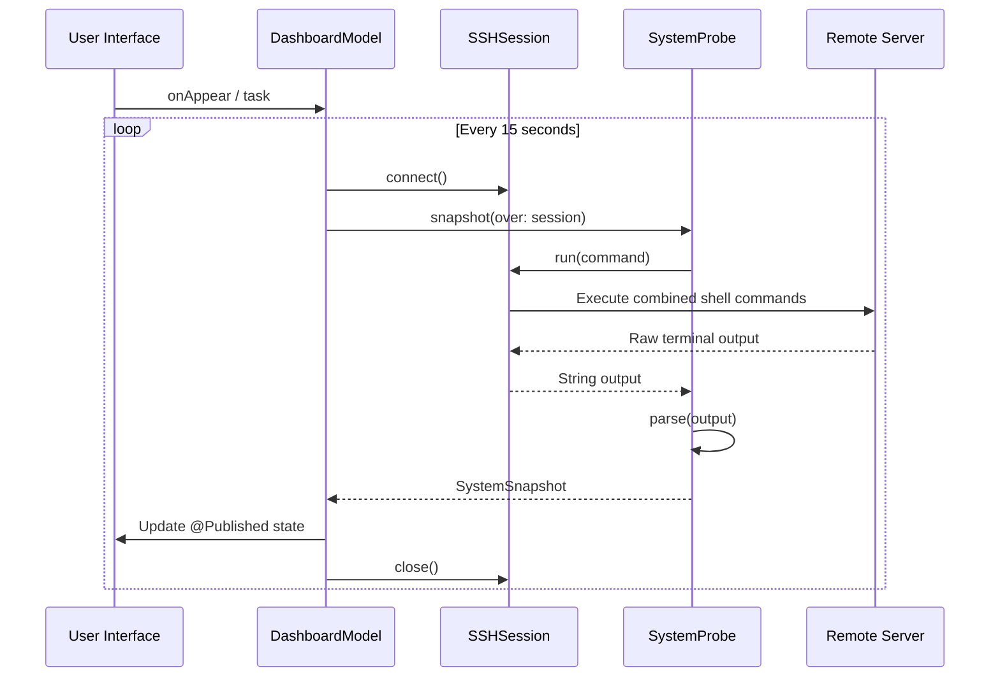
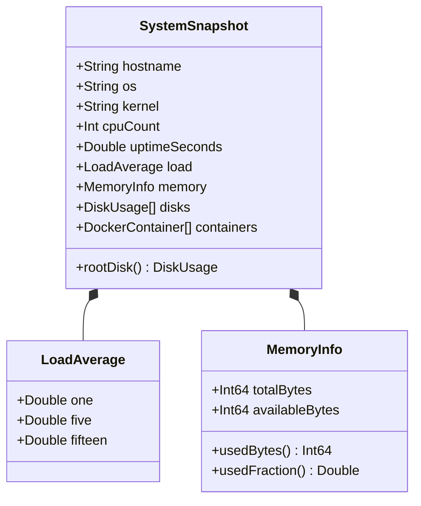

Relevant source files

The following files were used as context for generating this wiki page:

- [Sources/SSHCore/SystemProbe.swift](Sources/SSHCore/SystemProbe.swift)
- [App/DashboardView.swift](App/DashboardView.swift)
- [LinuxApp/Sources/bastion-gui/DashboardView.swift](LinuxApp/Sources/bastion-gui/DashboardView.swift)
- [Tests/SSHCoreTests/SystemProbeTests.swift](Tests/SSHCoreTests/SystemProbeTests.swift)
- [VISION.md](VISION.md)
- [README.md](README.md)

# System Dashboard & Probes

The System Dashboard and Probes module provides agentless monitoring of remote servers over SSH. By executing a combined set of standard Linux commands, the system generates a `SystemSnapshot` containing real-time metrics such as CPU load, memory utilization, disk space, and Docker container status. This functionality is integrated into both the iOS/macOS and Linux GUI applications to provide users with an immediate overview of server health upon connection.

Sources: [VISION.md:89-93](VISION.md#L89-L93), [Sources/SSHCore/SystemProbe.swift:5-8](Sources/SSHCore/SystemProbe.swift#L5-L8)

## Architecture and Data Flow

The dashboard system operates on a poll-based model where the client initiates a probe over an established SSH session. The logic is split between a core parsing engine (`SystemProbe`) and platform-specific view models that manage polling intervals and state updates.

### Probe Execution Flow

The following sequence diagram illustrates how the dashboard fetches and processes system data:

The system performs an agentless "round-trip" by sending a single concatenated command and parsing the resulting text. Sources: [Sources/SSHCore/SystemProbe.swift:50-60](Sources/SSHCore/SystemProbe.swift#L50-L60), [App/DashboardView.swift:18-24](App/DashboardView.swift#L18-L24), [LinuxApp/Sources/bastion-gui/DashboardView.swift:52-60](LinuxApp/Sources/bastion-gui/DashboardView.swift#L52-L60)

## The System Probe Engine

The `SystemProbe` is the core utility responsible for generating the command string and parsing raw terminal output into structured data.

### Combined Command
The probe uses a single multi-line command string punctuated by section markers (`@@NAME`) to allow the parser to differentiate between the output of various tools.

| Marker | Command | Purpose |
| :--- | :--- | :--- |
| `@@LOADAVG` | `cat /proc/loadavg` | CPU load averages (1, 5, 15 min) |
| `@@UPTIME` | `cat /proc/uptime` | System uptime in seconds |
| `@@MEM` | `cat /proc/meminfo` | Detailed memory statistics |
| `@@DF` | `df -kP` | Disk filesystem usage |
| `@@OS` | `cat /etc/os-release` | Operating system identification |
| `@@KERNEL` | `uname -sr` | Kernel version string |
| `@@HOST` | `cat /proc/sys/kernel/hostname` | System hostname |
| `@@NPROC` | `nproc` | Number of CPU cores |
| `@@DOCKER` | `docker ps --format ...` | Docker container list and status |

Sources: [Sources/SSHCore/SystemProbe.swift:53-65](Sources/SSHCore/SystemProbe.swift#L53-L65)

### Data Structures
The parser populates a `SystemSnapshot` struct, which is designed to be `Codable` and `Sendable` for cross-platform use and thread safety.

Sources: [Sources/SSHCore/SystemProbe.swift:10-48](Sources/SSHCore/SystemProbe.swift#L10-L48)

## Implementation Details

### Parsing Logic
The parser iterates through the raw output lines, switching the active section whenever it encounters the `@@` prefix. It employs specific sub-parsers for different formats, such as key-value pairs in `/proc/meminfo` or column-based data in `df` and `docker ps`.

*  **Memory Parsing:** Multiplies values from `/proc/meminfo` (usually in kB) by 1024 to store bytes.
*  **Disk Parsing:** Filters for the root mount (`/`) and common filesystems, ignoring `tmpfs` where appropriate in the UI.
*  **Docker Parsing:** Uses a pipe-delimited format (`|`) to safely split container ID, name, image, and status.

Sources: [Sources/SSHCore/SystemProbe.swift:75-135](Sources/SSHCore/SystemProbe.swift#L75-L135), [Tests/SSHCoreTests/SystemProbeTests.swift:34-45](Tests/SSHCoreTests/SystemProbeTests.swift#L34-L45)

### Dashboard State Management
Both iOS and Linux implementations use a `DashboardModel` to handle the lifecycle of the data. 

*  **Polling:** Data is refreshed every 15 seconds.
*  **Error Handling:** If a refresh (poll) fails after the initial data has been loaded, the system retains the previous successful snapshot rather than showing an error screen, ensuring a smooth user experience.
*  **Concurrency:** Uses Swift `async/await` and `Task.sleep(for:)` for non-blocking updates.

Sources: [App/DashboardView.swift:20-45](App/DashboardView.swift#L20-L45), [LinuxApp/Sources/bastion-gui/DashboardView.swift:14-25](LinuxApp/Sources/bastion-gui/DashboardView.swift#L14-L25)

## UI Representation
The dashboard visualizes metrics using a "Card" based layout.

| Component | UI Element | Logic |
| :--- | :--- | :--- |
| **System** | Information Rows | Displays Hostname, OS, Kernel, and formatted Uptime. |
| **Load** | Monospaced Text | Shows 1, 5, and 15-minute averages. |
| **Memory/Disk** | Progress Bar | Colors shift from accent to orange (>75%) or red (>90%). |
| **Docker** | Status List | Green circle for "Up" status, gray for others. |

Sources: [App/DashboardView.swift:85-135](App/DashboardView.swift#L85-L135), [LinuxApp/Sources/bastion-gui/DashboardView.swift:105-145](LinuxApp/Sources/bastion-gui/DashboardView.swift#L105-L145)

## Conclusion
The System Dashboard & Probes module provides a robust, agentless monitoring solution by leveraging standard Unix utilities and a centralized parsing engine. By decoupling the parsing logic in `SSHCore` from the platform-specific UI implementations, the project maintains consistency in system health reporting across iOS, macOS, and Linux.

Sources: [Sources/SSHCore/SystemProbe.swift](Sources/SSHCore/SystemProbe.swift), [README.md:104-105](README.md#L104-L105)
