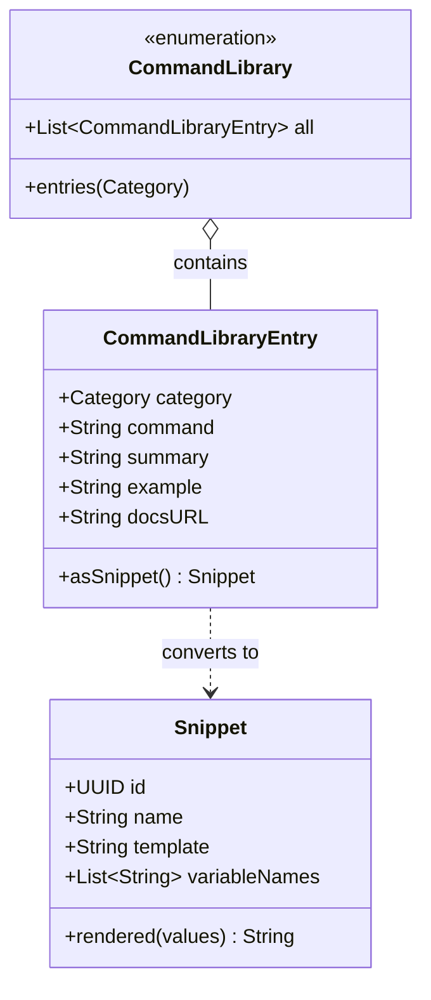
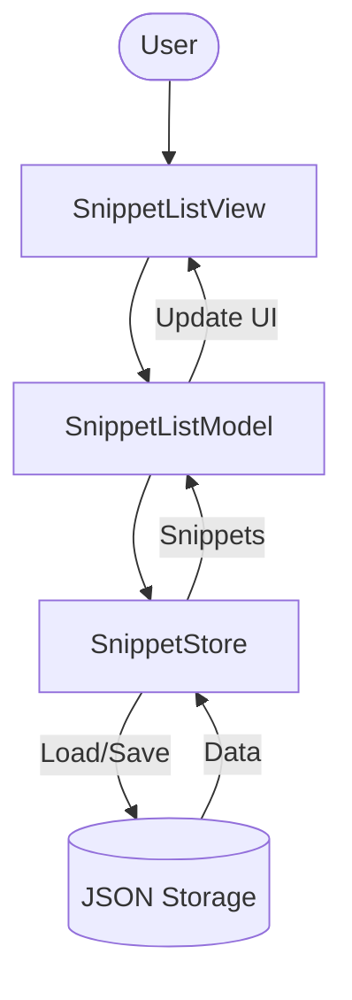
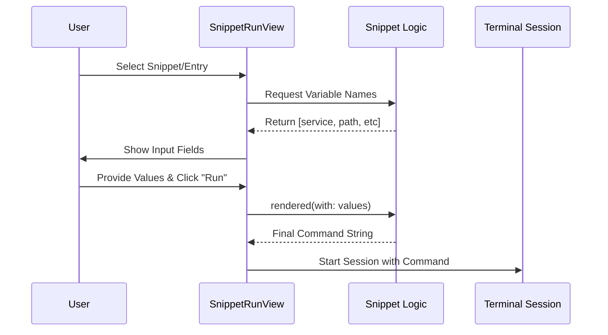

Relevant source files

The following files were used as context for generating this wiki page:

- [Sources/SSHCore/CommandLibrary.swift](Sources/SSHCore/CommandLibrary.swift)
- [Sources/SSHCore/SnippetStore.swift](Sources/SSHCore/SnippetStore.swift)
- [App/CommandLibraryView.swift](App/CommandLibraryView.swift)
- [App/SnippetListView.swift](App/SnippetListView.swift)
- [LinuxApp/Sources/bastion-gui/SnippetListView.swift](LinuxApp/Sources/bastion-gui/SnippetListView.swift)
- [Tests/SSHCoreTests/CommandLibraryTests.swift](Tests/SSHCoreTests/CommandLibraryTests.swift)
- [VISION.md](VISION.md)

# Command Library & Snippets

The **Command Library & Snippets** system in Bastion is designed to enhance user productivity by providing a repository of reusable, templated SSH commands. This system consists of two distinct but interoperable components: a static, built-in reference library for common administrative tasks and a persistent, user-managed store for custom snippets.

The primary goal of this feature is to allow users to execute complex commands—such as restarting Docker containers or checking system logs—without needing to manually type repetitive syntax. Both systems support a dynamic templating engine using a `{{variable}}` syntax, enabling users to input parameters at runtime before execution.

Sources: [VISION.md:86-95](VISION.md#L86-L95), [Sources/SSHCore/CommandLibrary.swift:8-13](Sources/SSHCore/CommandLibrary.swift#L8-L13)

## Core Data Models

The system architecture relies on two primary data structures within the `SSHCore` module that handle command representation and variable processing.

### CommandLibraryEntry
This struct represents a static reference command. It includes metadata such as category, a summary of the command's purpose, the command template itself, and optional examples or documentation URLs. It can be converted into a `Snippet` object to reuse the shared rendering logic.

Sources: [Sources/SSHCore/CommandLibrary.swift:14-34](Sources/SSHCore/CommandLibrary.swift#L14-L34)

### Snippet
A `Snippet` is the unit of execution for user-defined commands. It contains a `name` and a `template`. The template identifies variables using the `{{name}}` format, which are then extracted into a `variableNames` collection for UI prompting.

Sources: [App/SnippetListView.swift:76-118](App/SnippetListView.swift#L76-L118), [Sources/SSHCore/CommandLibrary.swift:42-44](Sources/SSHCore/CommandLibrary.swift#L42-L44)

### Data Relationship Diagram
The following diagram illustrates the relationship between the built-in library, user snippets, and the shared rendering logic.

Sources: [Sources/SSHCore/CommandLibrary.swift:14-48](Sources/SSHCore/CommandLibrary.swift#L14-L48), [App/SnippetListView.swift:10-15](App/SnippetListView.swift#L10-L15)

## Command Library Architecture

The `CommandLibrary` is a static reference engine built into the `SSHCore` framework. It serves as a "best practice" guide for system administrators, covering several technology stacks.

### Categories and Content
The library is organized into specific categories to facilitate quick navigation:

| Category | Typical Use Cases |
| :--- | :--- |
| **Docker** | Container management, Compose operations, logs, and system pruning. |
| **Linux** | Disk usage, systemd journal inspection, network ports, and kernel info. |
| **Git** | Log viewing, branch management, and remote fetching. |
| **Cloudflare** | Tunnel status and service management. |
| **Tailscale** | Node status, pinging, and IP discovery. |
| **WireGuard** | Interface management (up/down) and status. |
| **systemd** | Service status, restarts, and failed unit listing. |

Sources: [Sources/SSHCore/CommandLibrary.swift:16-24](Sources/SSHCore/CommandLibrary.swift#L16-L24), [Sources/SSHCore/CommandLibrary.swift:51-105](Sources/SSHCore/CommandLibrary.swift#L51-L105)

### Implementation Detail: Variable Handling
Commands in the library often use the `{{variable}}` syntax. For example, the command `docker compose restart {{service}}` triggers a UI input field for "service" when selected.

Sources: [Sources/SSHCore/CommandLibrary.swift:55](Sources/SSHCore/CommandLibrary.swift#L55), [App/SnippetListView.swift:94-106](App/SnippetListView.swift#L94-L106)

## Snippet Persistence & Management

While the Command Library is static, the `SnippetStore` provides a persistent layer for user-created content.

### SnippetStore Logic
The `SnippetStore` manages a JSON-based database of snippets. It supports standard CRUD (Create, Read, Update, Delete) operations. The store is designed to be thread-safe and acts as the source of truth for the `SnippetListView`.

Sources: [Sources/SSHCore/SnippetStore.swift](Sources/SSHCore/SnippetStore.swift), [App/SnippetListView.swift:10-15](App/SnippetListView.swift#L10-L15)

Sources: [App/SnippetListView.swift:10-15](App/SnippetListView.swift#L10-L15), [LinuxApp/Sources/bastion-gui/SnippetListView.swift:10-15](LinuxApp/Sources/bastion-gui/SnippetListView.swift#L10-L15)

## Execution Workflow

The process of running a command from either the library or the snippet store follows a unified execution flow.

### Variable Resolution and Rendering
When a user selects a command, the system checks for variables:
1.  **Detection:** The `variableNames` are extracted from the template.
2.  **User Input:** The `SnippetRunView` (iOS/macOS) or `snippetRunForm` (Linux) presents a form for variable entry.
3.  **Rendering:** The `rendered(with:)` function merges the user-provided values into the template.
4.  **Execution:** The resulting string is passed to a `ConnectRequest` and sent to the `SessionView` to be executed as the initial command in a new terminal session.

Sources: [App/SnippetListView.swift:76-118](App/SnippetListView.swift#L76-L118), [LinuxApp/Sources/bastion-gui/SnippetListView.swift:85-103](LinuxApp/Sources/bastion-gui/SnippetListView.swift#L85-L103)

Sources: [App/SnippetListView.swift:85-115](App/SnippetListView.swift#L85-L115), [App/CommandLibraryView.swift:42-50](App/CommandLibraryView.swift#L42-L50)

## Cross-Platform UI Implementation

The implementation of the snippets UI varies by platform but maintains consistent logic through `SSHCore`.

### Apple (iOS/macOS)
The `App/` directory utilizes SwiftUI. The `SnippetListView` and `CommandLibraryView` use `NavigationStack`, `Form`, and `Sheet` components. They interact with `SnippetListModel` which is a `@MainActor` observable object.

Sources: [App/SnippetListView.swift:17-74](App/SnippetListView.swift#L17-L74), [App/CommandLibraryView.swift:11-40](App/CommandLibraryView.swift#L11-L40)

### Linux (GTK4 via SwiftCrossUI)
The Linux implementation provides similar functionality but is tailored for the `SwiftCrossUI` framework. It uses a `List` with a selection binding (`selectedSnippetID`) and a conditional `snippetRunForm` that appears at the bottom of the view when a snippet is selected.

Sources: [LinuxApp/Sources/bastion-gui/SnippetListView.swift:23-83](LinuxApp/Sources/bastion-gui/SnippetListView.swift#L23-L83)

## Quality Assurance

The integrity of the Command Library is verified through unit tests in `Tests/SSHCoreTests/CommandLibraryTests.swift`. These tests ensure:
*  **Unique IDs:** Every entry in the static library has a unique identifier composed of its category and command string.
*  **Category Coverage:** All categories defined in the vision document are represented in the implementation.
*  **Rendering Accuracy:** The conversion from `CommandLibraryEntry` to `Snippet` correctly preserves variable detection and rendering capabilities.

Sources: [Tests/SSHCoreTests/CommandLibraryTests.swift:4-31](Tests/SSHCoreTests/CommandLibraryTests.swift#L4-L31)

## Conclusion

The Command Library & Snippets feature provides a powerful abstraction layer over raw SSH commands. By combining a static reference of community-standard commands with a flexible, variable-aware user snippet store, Bastion streamlines complex server management tasks across iOS, macOS, and Linux platforms.
