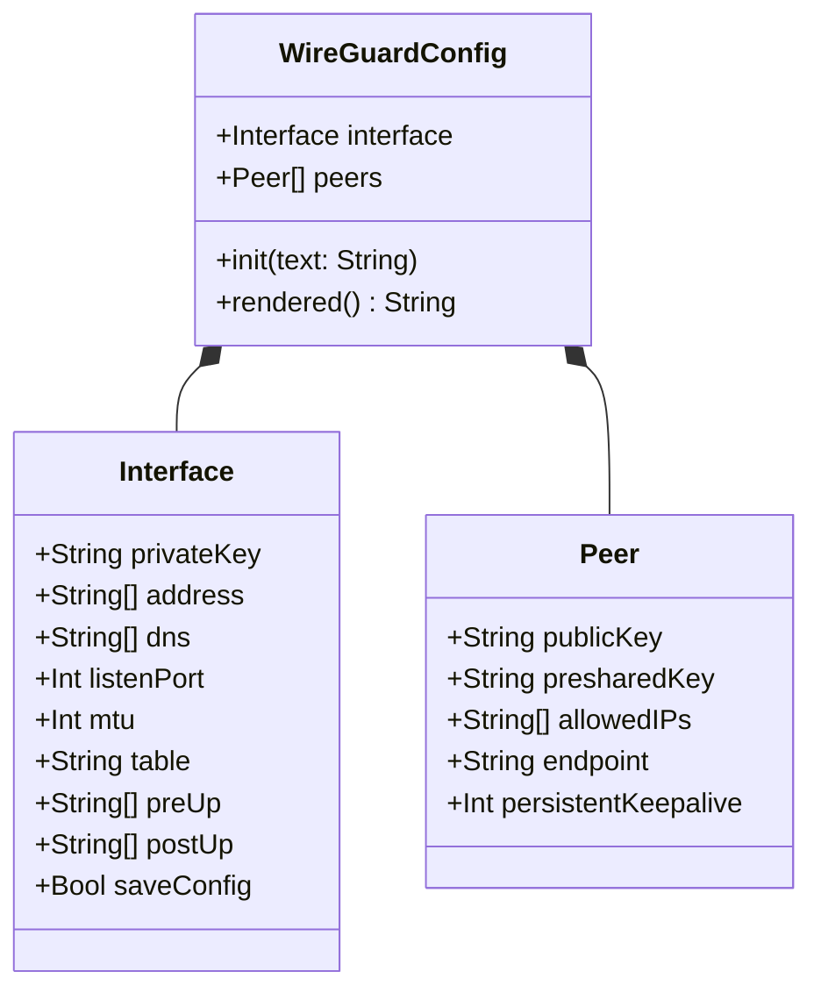
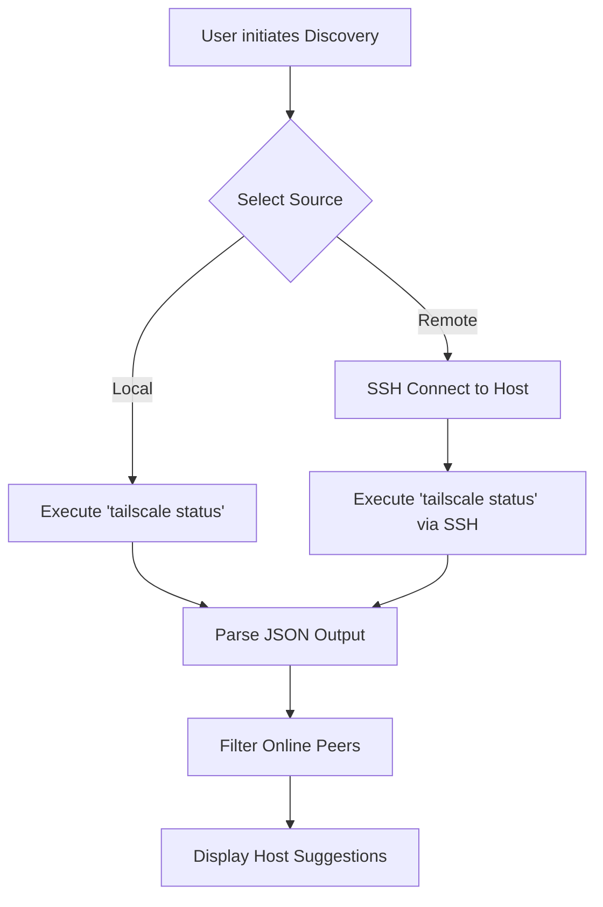

<details>
<summary>Relevant source files</summary>

The following files were used as context for generating this wiki page:

- [Sources/SSHCore/TailscaleStatus.swift](Sources/SSHCore/TailscaleStatus.swift)
- [Sources/SSHCore/WireGuardConfig.swift](Sources/SSHCore/WireGuardConfig.swift)
- [Sources/SSHCore/WireGuardProfileStore.swift](Sources/SSHCore/WireGuardProfileStore.swift)
- [App/TailscaleDiscoveryView.swift](App/TailscaleDiscoveryView.swift)
- [App/WireGuardProfileView.swift](App/WireGuardProfileView.swift)
- [LinuxApp/Sources/bastion-gui/TailscaleDiscoveryView.swift](LinuxApp/Sources/bastion-gui/TailscaleDiscoveryView.swift)
- [README.md](README.md)
</details>

# Network Integrations (WireGuard & Tailscale)

Bastion integrates with modern networking protocols to facilitate secure remote access and host discovery. The implementation focuses on managing WireGuard configurations and discovering hosts within Tailscale "tailnets." These integrations are primarily designed for profile management and administrative visibility rather than acting as a standalone VPN client for tunnel establishment.

The network integrations are split between the core logic in `SSHCore` and platform-specific UI components in the iOS/macOS and Linux applications. While the current scope (v1) focuses on parsing, storage, and remote status fetching, the project roadmap envisions future native tunnel establishment without external dependencies.

Sources: [Sources/SSHCore/WireGuardConfig.swift:5-8](Sources/SSHCore/WireGuardConfig.swift#L5-L8), [README.md:129-131](README.md#L129-L131)

## WireGuard Configuration Management

Bastion provides robust support for parsing and serializing WireGuard `.conf` files. This allows users to store and view VPN profiles within the app. The system supports standard `[Interface]` and `[Peer]` sections as defined by `wg(8)` and `wg-quick(8)`.

### Data Model
The configuration is structured into a `WireGuardConfig` object containing an `Interface` and an array of `Peer` objects.



The diagram above illustrates the hierarchical structure of a WireGuard configuration as implemented in the project.
Sources: [Sources/SSHCore/WireGuardConfig.swift:14-63](Sources/SSHCore/WireGuardConfig.swift#L14-L63)

### Parsing and Serialization
The parser is designed to be case-insensitive regarding keys and supports accumulation for repeated keys like `Address` or `AllowedIPs`. It handles comments starting with `#` and trims whitespace for compatibility with various configuration styles.

| Feature | Description |
| :--- | :--- |
| **Case Insensitivity** | Section headers like `[PEER]` and keys like `privatekey` are normalized to lowercase during parsing. |
| **Accumulation** | Multiple `Address` lines in a single interface are combined into an array. |
| **Comments** | Inline and full-line comments starting with `#` are stripped before processing. |
| **Serialization** | The `rendered()` function converts the object back into a standard `.conf` string format. |

Sources: [Sources/SSHCore/WireGuardConfig.swift:70-136](Sources/SSHCore/WireGuardConfig.swift#L70-L136), [Sources/SSHCore/WireGuardConfig.swift:144-171](Sources/SSHCore/WireGuardConfig.swift#L144-L171)

## Tailscale Discovery System

Tailscale integration is used to discover SSH-capable hosts within a user's tailnet. Bastion can fetch Tailscale status either from the local machine or via a remote SSH session.

### Discovery Workflow
Discovery allows users to find online peers and add them as Bastion hosts. The process varies based on the source:
1.  **Local Discovery:** Invokes the `tailscale status --json` command on the local machine (macOS/Linux only).
2.  **Remote Discovery:** Connects to an existing SSH host and executes `tailscale status --json` on that remote server.



The flowchart describes the data flow from initiation to displaying host suggestions in the UI.
Sources: [App/TailscaleDiscoveryView.swift:19-54](App/TailscaleDiscoveryView.swift#L19-L54), [Sources/SSHCore/TailscaleStatus.swift:1-10](Sources/SSHCore/TailscaleStatus.swift#L1-L10)

### Tailscale Data Handling
The `TailscaleStatus` struct parses the JSON output from the Tailscale CLI. It specifically looks for peers that are currently "Active" or online to provide useful SSH targets.

| Field | Type | Description |
| :--- | :--- | :--- |
| `Self.DNSName` | String | The FQDN of the local node. |
| `Peer.HostName` | String | The human-readable name of the peer. |
| `Peer.TailscaleIPs` | [String] | List of IP addresses associated with the peer. |
| `Peer.Online` | Bool | Flag indicating if the peer is currently reachable. |

Sources: [Sources/SSHCore/TailscaleStatus.swift:12-40](Sources/SSHCore/TailscaleStatus.swift#L12-L40)

## Implementation Details

### Profile Persistence
WireGuard profiles are stored persistently using `WireGuardProfileStore`. This store utilizes JSON files to save configuration data, following the same pattern as the `SnippetStore` and `HostStore`.

```swift
public struct WireGuardProfile: Codable, Identifiable, Sendable {
    public let id: UUID
    public var name: String
    public var config: WireGuardConfig
}
```

Sources: [Sources/SSHCore/WireGuardProfileStore.swift:5-15](Sources/SSHCore/WireGuardProfileStore.swift#L5-L15), [README.md:131-132](README.md#L131-L132)

### Platform-Specific Constraints
Network integration capabilities vary by platform due to OS-level sandboxing:
*  **iOS:** `fetchLocal()` for Tailscale is unavailable because `Foundation.Process` cannot be used in the iOS sandbox. Only remote discovery is supported.
*  **macOS/Linux:** Both local and remote discovery are supported.
*  **Tunneling:** Actual tunnel establishment (e.g., `wg-quick up`) is currently out of scope for the app itself as it typically requires root privileges or specific Network Extensions.

Sources: [App/TailscaleDiscoveryView.swift:29-41](App/TailscaleDiscoveryView.swift#L29-L41), [Sources/SSHCore/WireGuardConfig.swift:7-10](Sources/SSHCore/WireGuardConfig.swift#L7-L10)

## Conclusion
The Network Integrations in Bastion provide essential tools for managing WireGuard profiles and discovering Tailscale hosts. By supporting standard configuration formats and leveraging existing CLI tools via SSH, Bastion enables seamless transition between VPN management and SSH session initiation. Future updates aim to integrate native tunneling capabilities directly into the core library.
