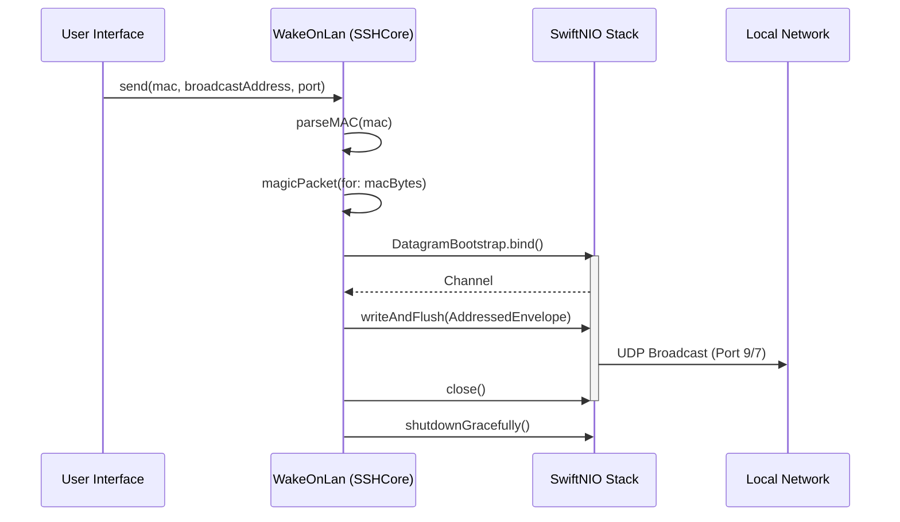
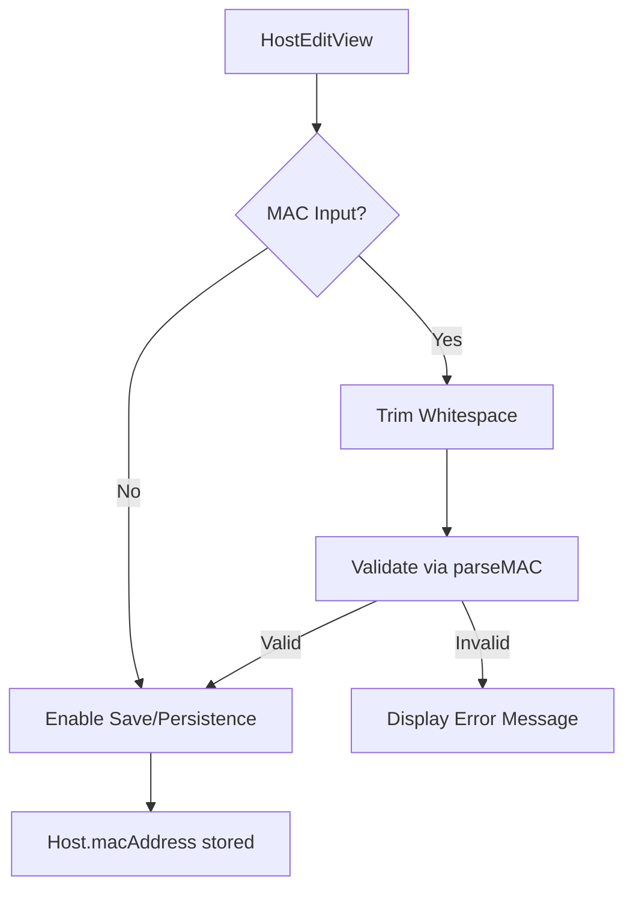

<details>
<summary>Relevant source files</summary>

The following files were used as context for generating this wiki page:

- [Sources/SSHCore/WakeOnLan.swift](Sources/SSHCore/WakeOnLan.swift)
- [Tests/SSHCoreTests/WakeOnLanTests.swift](Tests/SSHCoreTests/WakeOnLanTests.swift)
- [App/HostEditView.swift](App/HostEditView.swift)
- [LinuxApp/Sources/bastion-gui/HostEditView.swift](LinuxApp/Sources/bastion-gui/HostEditView.swift)
- [Sources/SSHCore/Host.swift](Sources/SSHCore/Host.swift)
</details>

# Wake on LAN Utility

The Wake on LAN (WoL) Utility within the Bastion project is a specialized module designed to wake up powered-off or sleeping machines on a local network by sending a "Magic Packet" via UDP broadcast. Unlike most features in the `SSHCore` library, this utility operates independently of the SSH protocol, providing a prerequisite step for users to wake their servers before establishing an SSH connection.

This utility is particularly relevant for homelab environments where servers may not be running 24/7. It is integrated into the host management interface, allowing users to store MAC addresses for specific servers and trigger wake commands directly from the application.

Sources: [Sources/SSHCore/WakeOnLan.swift:10-14](Sources/SSHCore/WakeOnLan.swift#L10-L14), [App/HostEditView.swift:145-151](App/HostEditView.swift#L145-L151)

## Architecture and Logic

The WoL utility is implemented as a stateless `enum` containing static methods for parsing MAC addresses, constructing the Magic Packet, and transmitting the data over the network using SwiftNIO.

### Logic Flow
1.  **MAC Parsing**: Converts string representations of MAC addresses (e.g., `AA:BB:CC:DD:EE:FF` or `aabbccddeeff`) into a 6-byte array.
2.  **Packet Construction**: Generates a 102-byte payload consisting of a 6-byte synchronization stream (0xFF) followed by the 6-byte MAC address repeated 16 times.
3.  **Network Transmission**: Utilizes `DatagramBootstrap` from SwiftNIO to bind a UDP socket and broadcast the packet to the specified network address (defaulting to `255.255.255.255`).

The following diagram illustrates the sequence of operations when waking a remote host:



The utility creates a short-lived `EventLoopGroup` for each call to minimize complexity for what is typically an infrequent, user-triggered action.
Sources: [Sources/SSHCore/WakeOnLan.swift:23-88](Sources/SSHCore/WakeOnLan.swift#L23-L88), [Tests/SSHCoreTests/WakeOnLanTests.swift:42-53](Tests/SSHCoreTests/WakeOnLanTests.swift#L42-L53)

## Components and Data Structures

### WakeOnLan Methods
The utility provides three primary static functions to handle the lifecycle of a WoL request.

| Function | Description | Return Type |
| :--- | :--- | :--- |
| `parseMAC(_:)` | Cleans and validates a MAC address string, converting it to `[UInt8]`. | `[UInt8]` |
| `magicPacket(for:)` | Constructs the 102-byte Magic Packet payload. | `[UInt8]` |
| `send(mac:broadcastAddress:port:)` | Orchestrates the networking to broadcast the packet. | `async throws` |

Sources: [Sources/SSHCore/WakeOnLan.swift:23-88](Sources/SSHCore/WakeOnLan.swift#L23-L88)

### Error Handling
The `WakeOnLanError` enum identifies common failure points during the process.

| Error Case | Description |
| :--- | :--- |
| `.invalidMACAddress(String)` | Thrown if the MAC address is the wrong length or contains non-hex characters. |
| `.invalidPort(Int)` | Thrown if the destination port is outside the valid range of `1...65535`. |

Sources: [Sources/SSHCore/WakeOnLan.swift:15-21](Sources/SSHCore/WakeOnLan.swift#L15-L21), [Tests/SSHCoreTests/WakeOnLanTests.swift:20-37](Tests/SSHCoreTests/WakeOnLanTests.swift#L20-L37)

## Integration with Host Management

The utility is integrated into the Host configuration screens across different platforms (iOS, macOS, and Linux). Users can optionally provide a MAC address when configuring a server.

### Configuration View Logic
- **Validation**: The UI provides live validation of the MAC address using `WakeOnLan.parseMAC`. If the address is invalid, the "Save" button is disabled, and an error message is displayed.
- **Persistence**: The MAC address is stored in the `macAddress` field of the `Host` struct.
- **Port Selection**: While port 9 (`discard`) is the standard, the utility also supports port 7.



Sources: [App/HostEditView.swift:145-156](App/HostEditView.swift#L145-L156), [LinuxApp/Sources/bastion-gui/HostEditView.swift:189-198](LinuxApp/Sources/bastion-gui/HostEditView.swift#L189-L198), [Sources/SSHCore/Host.swift](Sources/SSHCore/Host.swift)

## Technical Implementation Details

The implementation ensures that the packet conforms strictly to the documented Magic Packet format.

```swift
// Example of Magic Packet construction
public static func magicPacket(for mac: String) throws -> [UInt8] {
    let macBytes = try parseMAC(mac)
    var packet = [UInt8](repeating: 0xFF, count: 6)
    for _ in 0..<16 { packet.append(contentsOf: macBytes) }
    return packet
}
```

Sources: [Sources/SSHCore/WakeOnLan.swift:42-47](Sources/SSHCore/WakeOnLan.swift#L42-L47)

### Networking Configuration
To facilitate broadcasting, the UDP socket is configured with the `SO_BROADCAST` option. It binds to `0.0.0.0` to allow the operating system to select an appropriate local interface for the broadcast.
Sources: [Sources/SSHCore/WakeOnLan.swift:70-73](Sources/SSHCore/WakeOnLan.swift#L70-L73)

## Summary
The Wake on LAN Utility provides a crucial "pre-connection" feature for the Bastion SSH client. By leveraging SwiftNIO for UDP broadcasting and providing robust MAC address validation, it allows users to manage and wake their remote infrastructure directly from the same application used for terminal access and server management.
