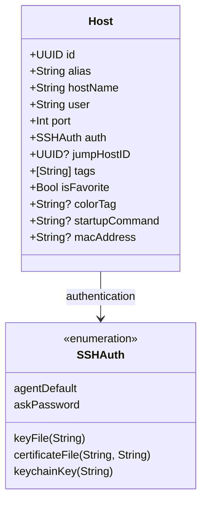
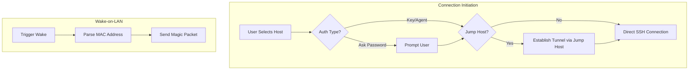

Relevant source files

The following files were used as context for generating this wiki page:

- [Sources/SSHCore/Host.swift](Sources/SSHCore/Host.swift)
- [Sources/SSHCore/HostStore.swift](https://github.com/blixten85/blixten85/bastion/blob/06476d6115a33c3c5d2442ef672196e0ae434172/Sources/SSHCore/HostStore.swift)
- [App/HostListView.swift](App/HostListView.swift)
- [App/HostEditView.swift](App/HostEditView.swift)
- [LinuxApp/Sources/bastion-gui/HostEditView.swift](LinuxApp/Sources/bastion-gui/HostEditView.swift)
- [README.md](README.md)
- [VISION.md](VISION.md)

# Host Database & Configurations

The Host Database & Configurations system serves as the central repository for managing remote server metadata, connection parameters, and authentication methods within the Bastion SSH client. It is designed to be cross-platform, utilizing a shared core implementation (`SSHCore`) across iOS, macOS, Linux, and Windows, while providing platform-specific user interfaces for host management.

The system emphasizes privacy and security, ensuring that sensitive data such as private keys and passwords are either stored in system-native secure storage (like the Apple Keychain) or encrypted before synchronization. It supports advanced networking features including ProxyJump (jump hosts), Wake-on-LAN, and tag-based organization.

Sources: [VISION.md:89-94](VISION.md#L89-L94), [README.md:1-5](README.md#L1-L5), [README.md:103-107](README.md#L103-L107)

## Data Models and Architecture

The primary data structure is the `Host` struct, which encapsulates all necessary information to establish an SSH connection. This includes identity information, network addressing, and UI-specific metadata like favorites and color coding.

### The Host Entity

The `Host` entity is uniquely identified by a UUID and contains fields for addressing (hostName, port), identity (user, alias), and categorization (tags, colorTag).

Sources: [Sources/SSHCore/Host.swift](Sources/SSHCore/Host.swift), [App/HostEditView.swift:145-168](App/HostEditView.swift#L145-L168)

### Host Persistence and Management

The `HostStore` class handles the persistence of these entities, typically using JSON-based storage for metadata. It provides thread-safe operations for CRUD (Create, Read, Update, Delete) actions and supports importing configurations from standard OpenSSH `config` files.

| Component | Responsibility |
|---|---|
| `HostStore` | Managing the lifecycle of host entries and persistence logic. |
| `HostListModel` | An observable class that bridges the `HostStore` to the UI, handling reactive updates. |
| `SyncEngine` | Handles deterministic merging of host databases between different devices. |

Sources: [README.md:106-107](README.md#L106-L107), [App/HostListView.swift:7-15](App/HostListView.swift#L7-L15), [README.md:121-121](README.md#L121)

## Authentication Methods

Bastion supports multiple authentication strategies, ranging from simple password prompts to hardware-backed identity management.

*  **Standard Agent:** Uses the default SSH agent or standard keys (e.g., `~/.ssh/id_ed25519`).
*  **Password:** Prompts the user for a password at the time of connection.
*  **Key Files:** Specifies local paths to private keys or certificates.
*  **Keychain Import:** Specifically for Apple platforms, allows importing private keys into the Secure Enclave/Keychain, ensuring they never leave the device unencrypted.

Sources: [App/HostEditView.swift:23-30](App/HostEditView.swift#L23-L30), [README.md:11-13](README.md#L11-L13)

## Advanced Configuration Features

### Networking and Connectivity

The system implements several advanced networking features to handle complex infrastructure requirements.

Sources: [App/HostEditView.swift:37-47](App/HostEditView.swift#L37-L47), [App/HostListView.swift:221-232](App/HostListView.swift#L221-L232), [LinuxApp/Sources/bastion-gui/HostEditView.swift:51-62](LinuxApp/Sources/bastion-gui/HostEditView.swift#L51-L62)

### Feature Summary Table

| Feature | Description | File Reference |
|---|---|---|
| **ProxyJump** | Supports connecting through a "Jump Host" (bastion server) to reach internal targets. | [App/HostEditView.swift:114](App/HostEditView.swift#L114) |
| **Wake-on-LAN** | Sends magic packets to a specified MAC address before attempting a connection. | [App/HostListView.swift:221](App/HostListView.swift#L221) |
| **Tags & Favorites** | Categorizes hosts for easier navigation and quick access. | [App/HostListView.swift:85](App/HostListView.swift#L85) |
| **Startup Commands** | Automatically executes a specific command (e.g., `tmux attach`) upon successful connection. | [App/HostEditView.swift:130](App/HostEditView.swift#L130) |
| **Color Coding** | Visual identification of servers using a defined color palette. | [App/HostListView.swift:277](App/HostListView.swift#L277) |

## Platform Specifics and Implementation

While `SSHCore` provides the logic, the UI implementation differs across platforms to adhere to native experience standards.

### Apple (iOS/macOS) Implementation
The Apple implementation utilizes `SwiftUI` and interacts with the `Keychain.swift` utility for secure storage. The `HostEditView` includes a `fileImporter` to bring private keys into the app's secure context.
Sources: [App/HostEditView.swift:1-10](App/HostEditView.swift#L1-L10), [App/HostEditView.swift:93-100](App/HostEditView.swift#L93-L100)

### Linux Implementation
The Linux version, built with `SwiftCrossUI` and GTK4, lacks the Apple Keychain integration. Consequently, it focuses on path-based key references or "imported elsewhere" markers for hosts synced from Apple devices.
Sources: [LinuxApp/Sources/bastion-gui/HostEditView.swift:1-10](LinuxApp/Sources/bastion-gui/HostEditView.swift#L1-L10), [LinuxApp/Sources/bastion-gui/HostEditView.swift:101-105](LinuxApp/Sources/bastion-gui/HostEditView.swift#L101-L105)

## Database Synchronization

Bastion employs an "Account-less" synchronization model. The host database is merged deterministically using a `SyncEngine` that employs Last-Write-Wins (LWW) logic and "tombstones" for deletions.

The transport layer is flexible, supporting:
1.  **Folder Sync:** Using a shared folder (iCloud, Dropbox, Syncthing) where the database is stored as an encrypted file (`bastion-sync.enc`).
2.  **Cloud APIs:** Direct integration with Dropbox, Google Drive, or OneDrive via OAuth2 + PKCE.

Regardless of the transport, data is end-to-end encrypted using **AES-256-GCM** with keys derived via **PBKDF2-HMAC-SHA256**.
Sources: [README.md:17-30](README.md#L17-L30), [App/HostListView.swift:42-55](App/HostListView.swift#L42-L55)

## Conclusion

The Host Database & Configurations system in Bastion provides a robust, cross-platform foundation for managing SSH environments. By separating core logic into `SSHCore` while allowing platform-specific UI and security implementations, the project achieves high portability and security. The inclusion of advanced features like ProxyJump and encrypted sync ensures it meets the needs of professional system administrators while remaining accessible to homelab enthusiasts.
