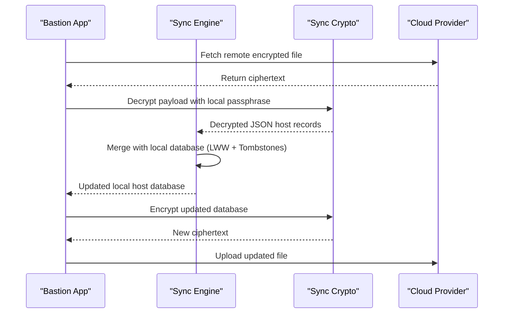

<details>
<summary>Relevant source files</summary>

The following files were used as context for generating this wiki page:

- [Sources/SSHCore/SyncEngine.swift](Sources/SSHCore/SyncEngine.swift)
- [Sources/SSHCore/SyncCrypto.swift](Sources/SSHCore/SyncCrypto.swift)
- [App/Keychain.swift](App/Keychain.swift)
- [App/SyncSettingsView.swift](App/SyncSettingsView.swift)
- [README.md](README.md)
- [SECURITY.md](SECURITY.md)
- [VISION.md](VISION.md)
</details>

# Sync Engine & End-to-End Encryption

The Sync Engine in Bastion is designed to provide cross-platform synchronization of the host database without requiring a central server or account. It utilizes a deterministic merging strategy to reconcile data across multiple devices and ensures that all sensitive information, such as SSH keys and passwords, remains protected through local end-to-end encryption (E2E) before leaving the device.

The system supports various storage backends, including local folders, iCloud Drive, Dropbox, Google Drive, and OneDrive. By treating the cloud provider as "dumb storage," the Sync Engine ensures that the service provider cannot read the synchronized data, as it only ever sees the encrypted ciphertext.

Sources: [README.md:21-35](README.md#L21-L35), [VISION.md:88-92](VISION.md#L88-L92)

## Architecture and Data Flow

The synchronization process involves three main layers: the deterministic merge logic, the encryption wrapper, and the transport provider. Data is transformed from local JSON records into an encrypted payload that is then written to the selected sync destination.

### Component Overview

| Component | Responsibility |
| :--- | :--- |
| `SyncEngine` | Handles the deterministic merging of host records using "last-write-wins" (LWW) logic and deletion tombstones. |
| `SyncCrypto` | Provides E2E encryption using AES-256-GCM with keys derived via PBKDF2-HMAC-SHA256. |
| `SyncProvider` | Abstract interface for different storage backends (e.g., `FolderSyncProvider`, `DropboxSyncProvider`). |
| `Keychain` | Securely stores the sync passphrase and OAuth tokens on the local system. |

Sources: [README.md:21-30](README.md#L21-L30), [SECURITY.md:52-54](SECURITY.md#L52-L54), [App/Keychain.swift](App/Keychain.swift)

### Synchronization Sequence

The following diagram illustrates the flow of data when a synchronization event is triggered.



The diagram shows the sequence of fetching, decrypting, merging, and re-uploading synchronized data. 
Sources: [README.md:21-35](README.md#L21-L35), [Sources/SSHCore/SyncEngine.swift](Sources/SSHCore/SyncEngine.swift)

## End-to-End Encryption (E2E)

Bastion enforces strict security protocols where keys and passwords never leave the device unencrypted. The encryption process uses industry-standard algorithms to ensure data integrity and confidentiality.

### Encryption Specifications

- **Algorithm**: AES-256-GCM (Galois/Counter Mode).
- **Key Derivation**: PBKDF2-HMAC-SHA256 is used to derive the encryption key from a user-provided passphrase.
- **Verification**: The system verifies the derived key against known test vectors.
- **Security Barrier**: Cloud providers only see the ciphertext; incorrect passphrases or tampered files are detected and rejected during the decryption phase.

Sources: [README.md:29-35](README.md#L29-L35), [SECURITY.md:52-54](SECURITY.md#L52-L54), [Sources/SSHCore/SyncCrypto.swift](Sources/SSHCore/SyncCrypto.swift)

### Key Management

Passphrases used for synchronization are stored in the system Keychain (iOS/macOS) rather than in plaintext on the disk. This ensures that even if the application binary is compromised, the sensitive sync credentials remain protected by the operating system's security features.

Sources: [SECURITY.md:65-67](SECURITY.md#L65-L67), [App/Keychain.swift](App/Keychain.swift)

## Deterministic Merging Logic

The `SyncEngine` manages data conflicts and deletions across multiple devices using a state-based synchronization model.

### Merge Strategy

1.  **Last-Write-Wins (LWW)**: Each record update is timestamped. During a merge, the record with the most recent timestamp is preserved.
2.  **Tombstones**: When a host is deleted, a "tombstone" (a deletion record with a timestamp) is created. This prevents deleted items from reappearing when syncing with another device that still possesses the old record.
3.  **JSON Persistence**: The host database is stored as a trådsäker (thread-safe) JSON structure in the `HostStore`.

Sources: [README.md:22-25](README.md#L22-L25), [README.md:83-85](README.md#L83-L85), [Sources/SSHCore/SyncEngine.swift](Sources/SSHCore/SyncEngine.swift)

## Sync Providers and OAuth

Bastion supports two primary methods for transport: folder-based syncing and direct account integration.

### Transport Options

| Method | Implementation | Details |
| :--- | :--- | :--- |
| **Synced Folder** | `FolderSyncProvider` | Uses a folder already synced by the OS (e.g., iCloud Drive, Syncthing, Git). Requires no OAuth within the app. |
| **Direct API** | `DropboxSyncProvider`, `GoogleDriveSyncProvider` | Uses OAuth2 with PKCE (`ASWebAuthenticationSession`) to write directly to an app-scoped folder. |

Sources: [README.md:37-52](README.md#L37-L52), [App/SyncSettingsView.swift](App/SyncSettingsView.swift)

### OAuth and Privacy

For providers like Dropbox and Google Drive, the application utilizes **PKCE-based OAuth**. The client ID is public, and the app never carries a hardcoded secret. Integration is limited to an app-specific folder (e.g., `drive.appdata` for Google Drive) rather than the entire user account to minimize the attack surface.

Sources: [SECURITY.md:50-51](SECURITY.md#L50-L51), [README.md:54-65](README.md#L54-L65)

## Implementation Details

### Data Structures

The `SyncEngine` typically operates on host metadata while leaving the heavy lifting of encryption to `SyncCrypto`.

```swift
// Example conceptual structure for encrypted payload
struct EncryptedSyncPayload: Codable {
    let salt: Data         // For PBKDF2
    let iv: Data           // For AES-GCM
    let ciphertext: Data   // Encrypted JSON host records
    let tag: Data          // Authentication tag for integrity
}
```

Sources: [Sources/SSHCore/SyncCrypto.swift](Sources/SSHCore/SyncCrypto.swift), [Sources/SSHCore/SyncEngine.swift](Sources/SSHCore/SyncEngine.swift)

### User Interface

The `SyncSettingsView` allows users to:
- Choose the sync provider (Folder, Dropbox, etc.).
- Input and securely store the sync passphrase.
- Trigger manual synchronization via a "Synka nu" button.
- Manage login/logout states for cloud accounts.

Sources: [App/SyncSettingsView.swift:101-105](App/SyncSettingsView.swift#L101-L105)

## Conclusion

The Sync Engine & End-to-End Encryption system in Bastion provides a robust, privacy-focused solution for maintaining a consistent host database across devices. By combining deterministic merging with strong AES-256-GCM encryption and Keychain storage, the system ensures that user data is synchronized efficiently without compromising security or relying on a centralized authority.
