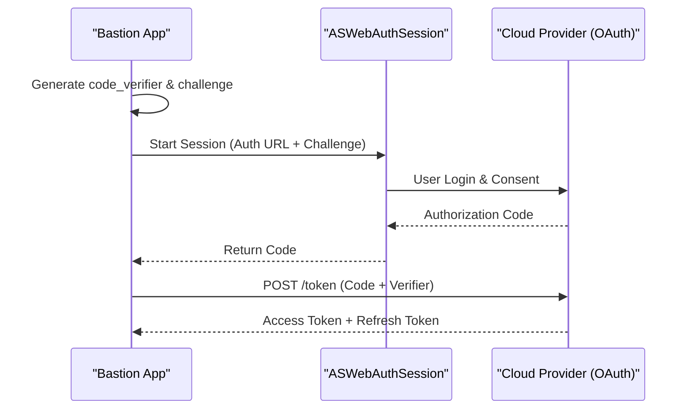
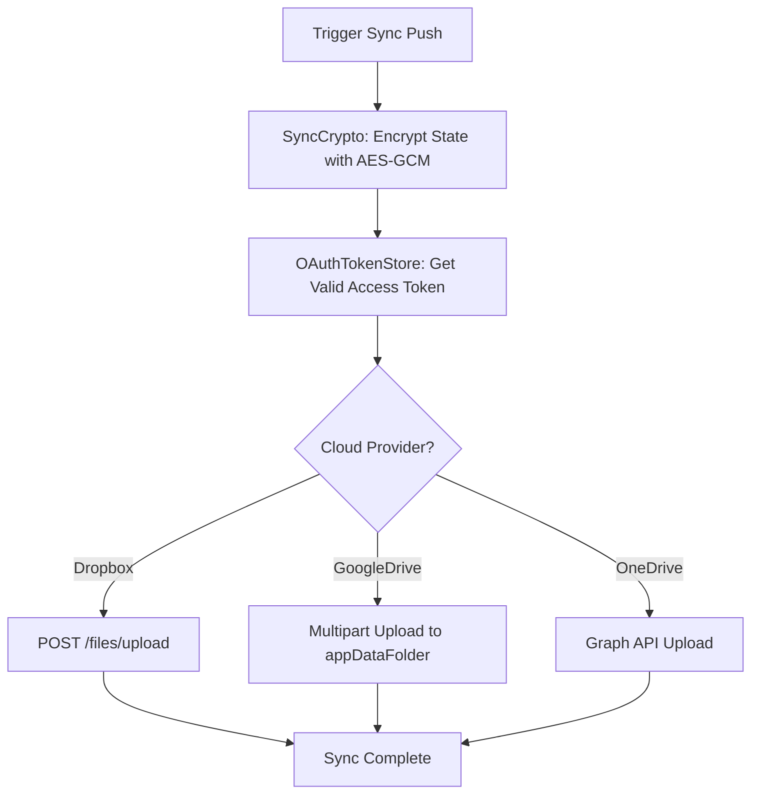

Relevant source files

The following files were used as context for generating this wiki page:

- [Sources/SSHCore/OAuthPKCE.swift](Sources/SSHCore/OAuthPKCE.swift)
- [App/OAuthAccountManager.swift](App/OAuthAccountManager.swift)
- [App/DropboxSyncProvider.swift](App/DropboxSyncProvider.swift)
- [App/GoogleDriveSyncProvider.swift](App/GoogleDriveSyncProvider.swift)
- [App/OneDriveSyncProvider.swift](App/OneDriveSyncProvider.swift)
- [App/OAuthProviders.swift](App/OAuthProviders.swift)
- [App/OAuthTokenStore.swift](App/OAuthTokenStore.swift)
- [README.md](README.md)
- [SECURITY.md](SECURITY.md)

# Cloud Providers & OAuth Integrations

Bastion implements a decentralized synchronization mechanism that leverages third-party cloud storage providers to store host databases. This system is designed to provide seamless cross-platform synchronization without requiring a centralized Bastion-specific account or server. Instead, users authenticate directly with providers like Dropbox, Google Drive, or OneDrive via OAuth2 with PKCE (Proof Key for Code Exchange).

All data transmitted to cloud providers is end-to-end encrypted using **AES-256-GCM**, ensuring that cloud providers only ever see ciphertext. The integration is restricted to "App Folder" or "App Data" scopes, meaning the application never requests access to the user's entire cloud storage.

Sources: [README.md:27-40](README.md#L27-L40), [SECURITY.md:38-40](SECURITY.md#L38-L40)

## OAuth Architecture & PKCE Implementation

The project utilizes OAuth 2.0 with PKCE (RFC 7636) to secure the authentication flow on mobile and desktop clients. By using PKCE, the app avoids the need to embed client secrets in the source code, as it relies on a dynamically generated code verifier and challenge.

### PKCE Flow
1. The client generates a random `code_verifier`.
2. A `code_challenge` is derived from the verifier using SHA-256 hashing.
3. The user is redirected to the provider's authorization endpoint with the challenge.
4. After user approval, the provider returns an authorization code.
5. The client exchanges the authorization code and the original `code_verifier` for access and refresh tokens.

The logic for generating the code verifier and hashing the challenge is contained within `OAuthPKCE.swift`.

Sources: [Sources/SSHCore/OAuthPKCE.swift:5-30](Sources/SSHCore/OAuthPKCE.swift#L5-L30), [App/OAuthAccountManager.swift:15-40](App/OAuthAccountManager.swift#L15-L40), [SECURITY.md:39-40](SECURITY.md#L39-L40)

## Supported Cloud Providers

Bastion supports three primary cloud providers for synchronization. Each provider configuration includes specific API endpoints and scopes restricted to application-specific directories.

| Provider | Scope | Redirect URI |
| :--- | :--- | :--- |
| **Dropbox** | `files.content.write`, `files.content.read` | `se.denied.bastion://oauth/dropbox` |
| **Google Drive** | `drive.appdata` | `se.denied.bastion://oauth/googledrive` |
| **OneDrive** | `Files.ReadWrite.AppFolder`, `offline_access` | `se.denied.bastion://oauth/onedrive` |

Sources: [App/OAuthProviders.swift:25-56](App/OAuthProviders.swift#L25-L56), [README.md:52-58](README.md#L52-L58)

## Token Management and Storage

OAuth tokens (Access and Refresh) are managed by the `OAuthTokenStore`. To ensure security, these tokens are stored in the system **Keychain** rather than plain text files.

### Token Lifecycle
- **Storage**: Tokens are encoded as JSON and stored in the Keychain using provider-specific keys.
- **Silent Refresh**: Before performing a sync operation, the `validAccessToken(for:)` function checks if the current access token is expired. If it is, it automatically uses the refresh token to obtain a new one.
- **Synchronous Requests**: Since synchronization providers (`SyncProvider`) operate synchronously, the token store uses `DispatchSemaphore` to wrap asynchronous `URLSession` data tasks into blocking calls.

Sources: [App/OAuthTokenStore.swift:20-65](App/OAuthTokenStore.swift#L20-L65), [App/OAuthTokenStore.swift:90-110](App/OAuthTokenStore.swift#L90-L110)

## Synchronization Providers

Each cloud provider implements the `SyncProvider` protocol, which defines `pull()` and `push(_:)` methods for interacting with the encrypted sync state.

### Dropbox Implementation
The `DropboxSyncProvider` uses the `/files/download` and `/files/upload` endpoints. It utilizes custom HTTP headers (`Dropbox-API-Arg`) to pass file paths and overwrite modes.
Sources: [App/DropboxSyncProvider.swift:25-50](App/DropboxSyncProvider.swift#L25-L50)

### Google Drive Implementation
Unlike Dropbox, Google Drive does not support direct path-based access for the `appDataFolder`. The `GoogleDriveSyncProvider` must:
1. Search for the file by name within the `appDataFolder` to retrieve a `fileID`.
2. Use the `fileID` to perform a `PATCH` (update) or `POST` (multipart create) operation.
Sources: [App/GoogleDriveSyncProvider.swift:20-45](App/GoogleDriveSyncProvider.swift#L20-L45)

### Sync Flow Diagram
The following diagram illustrates the data flow when pushing a local update to a cloud provider.

Sources: [App/DropboxSyncProvider.swift:42-55](App/DropboxSyncProvider.swift#L42-L55), [App/GoogleDriveSyncProvider.swift:34-40](App/GoogleDriveSyncProvider.swift#L34-L40), [README.md:32-37](README.md#L32-L37)

## Summary
The Cloud Provider and OAuth integration in Bastion ensures user privacy and data portability. By utilizing PKCE for authentication and the system Keychain for token storage, the app maintains a high security posture while allowing users to sync their host databases across devices via Dropbox, Google Drive, or OneDrive. All sync data is processed through `SyncCrypto` before leaving the device, keeping the contents opaque to the cloud storage providers.
