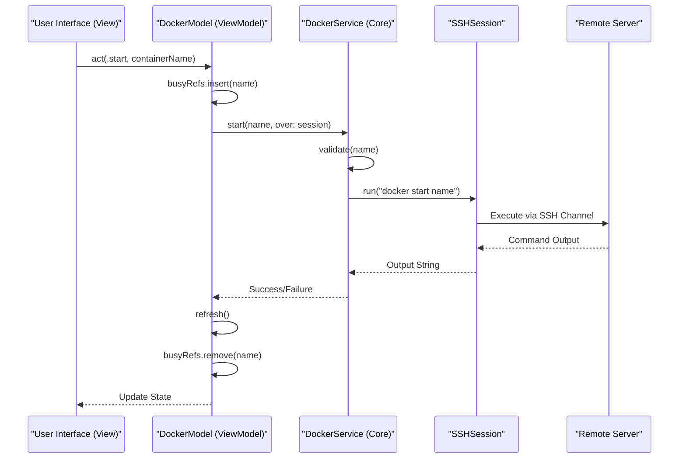
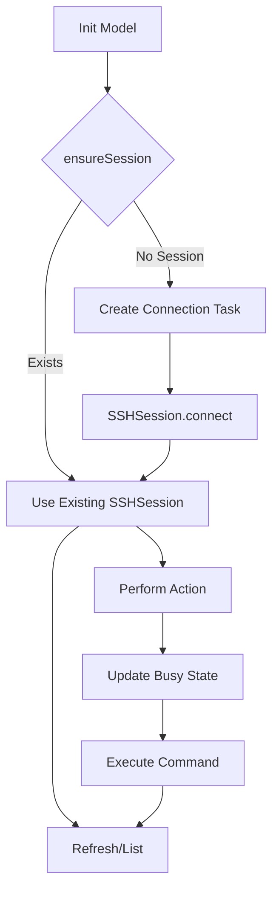

<details>
<summary>Relevant source files</summary>

The following files were used as context for generating this wiki page:

- [Sources/SSHCore/DockerService.swift](Sources/SSHCore/DockerService.swift)
- [App/DockerView.swift](App/DockerView.swift)
- [LinuxApp/Sources/bastion-gui/DockerView.swift](LinuxApp/Sources/bastion-gui/DockerView.swift)
- [Sources/SSHCore/SystemProbe.swift](Sources/SSHCore/SystemProbe.swift)
- [Tests/SSHCoreTests/DockerServiceTests.swift](Tests/SSHCoreTests/DockerServiceTests.swift)
- [VISION.md](VISION.md)
</details>

# Docker Management Module

The Docker Management Module in Bastion provides an agentless interface for managing Docker containers on remote servers exclusively over SSH. Unlike centralized management tools, Bastion communicates directly with the Docker CLI on the target host, allowing users to list, start, stop, and restart containers, as well as view logs and open interactive shells directly from the client application.

This module is designed to be lightweight and cross-platform, with the core logic residing in the `SSHCore` library while platform-specific UIs are implemented for iOS, macOS, and Linux. It emphasizes security through strict input validation to prevent command injection when interacting with the remote shell.

Sources: [VISION.md](VISION.md), [README.md](README.md), [Sources/SSHCore/DockerService.swift](Sources/SSHCore/DockerService.swift)

## Architecture and Data Flow

The architecture follows a clear separation between the presentation layer and the service layer. The `DockerService` acts as the primary engine, generating shell commands and parsing raw string output into structured data.

### Component Interaction
The following diagram illustrates the flow from a user action in the UI to the execution of a Docker command on the remote server.



Sources: [Sources/SSHCore/DockerService.swift:85-87](Sources/SSHCore/DockerService.swift#L85-L87), [App/DockerView.swift:55-70](App/DockerView.swift#L55-L70), [LinuxApp/Sources/bastion-gui/DockerView.swift:83-93](LinuxApp/Sources/bastion-gui/DockerView.swift#L83-L93)

## Core Data Structures

The module relies on the `DockerContainer` struct to represent the state of remote containers. This structure is shared across the `SystemProbe` (for dashboard snapshots) and the full `DockerService`.

### DockerContainer Model
| Field | Type | Description |
|---|---|---|
| `id` | `String` | The unique identifier of the container (short or long hex). |
| `name` | `String` | The assigned name of the container. |
| `image` | `String` | The Docker image the container is running. |
| `status` | `String` | Raw status string (e.g., "Up 3 days", "Exited (0)"). |
| `isRunning` | `Bool` | Computed property; returns true if status starts with "Up". |

Sources: [Sources/SSHCore/SystemProbe.swift:34-43](Sources/SSHCore/SystemProbe.swift#L34-L43), [Sources/SSHCore/DockerService.swift:58-63](Sources/SSHCore/DockerService.swift#L58-L63)

## Command Execution and Security

The `DockerService` utilizes a "Command Builder" pattern. To ensure security, every container reference (name or ID) is passed through a validation function before being embedded into a shell command. This prevents shell injection attacks such as `container_name; rm -rf /`.

### Input Validation
The validation logic uses a regular expression `^[A-Za-z0-9][A-Za-z0-9_.-]*$` to ensure only safe characters are used and that commands cannot start with a hyphen (to prevent flag injection).

```swift
// Sources/SSHCore/DockerService.swift:14-22
static let referencePattern = try! NSRegularExpression(pattern: "^[A-Za-z0-9][A-Za-z0-9_.-]*$")

public static func validate(_ ref: String) throws -> String {
    let range = NSRange(ref.startIndex..<ref.endIndex, in: ref)
    guard ref.count <= 128, referencePattern.firstMatch(in: ref, range: range) != nil else {
        throw DockerError.invalidReference(ref)
    }
    return ref
}
```

Sources: [Sources/SSHCore/DockerService.swift:11-22](Sources/SSHCore/DockerService.swift#L11-L22), [Tests/SSHCoreTests/DockerServiceTests.swift:5-18](Tests/SSHCoreTests/DockerServiceTests.swift#L5-L18)

### Command Mapping
The following table describes the commands generated by the service:

| Operation | Remote Command |
|---|---|
| **List** | `docker ps -a --format '{{.ID}}|{{.Names}}|{{.Image}}|{{.Status}}' 2>/dev/null` |
| **Start** | `docker start <validated_ref>` |
| **Stop** | `docker stop <validated_ref>` |
| **Restart** | `docker restart <validated_ref>` |
| **Logs** | `docker logs --tail <n> <validated_ref> 2>&1` |
| **Shell** | `docker exec -it <ref> sh -c 'command -v bash >/dev/null && exec bash \|\| exec sh'` |

Sources: [Sources/SSHCore/DockerService.swift:26-55](Sources/SSHCore/DockerService.swift#L26-L55)

## View Model Implementation (`DockerModel`)

The `DockerModel` (implemented for both iOS/macOS and Linux) manages the lifecycle of the Docker data. It handles asynchronous updates, connection pooling, and "busy" states for individual containers to provide a responsive UI.



### Key Logic:
- **Connection Caching**: `connectingTask` is cached so that simultaneous calls to `refresh()` or `act()` wait for the same connection attempt rather than spawning multiple SSH sessions.
- **Concurrency Safety**: Actions are performed using `MainActor` to ensure UI updates happen on the correct thread.
- **Error Handling**: Failed commands or connection issues are captured in `errorMessage` and displayed to the user.

Sources: [App/DockerView.swift:10-53](App/DockerView.swift#L10-L53), [LinuxApp/Sources/bastion-gui/DockerView.swift:12-81](LinuxApp/Sources/bastion-gui/DockerView.swift#L12-L81)

## Platform-Specific UI Components

While the core logic is shared, the UI implementation varies by platform:

### iOS and macOS (`App/DockerView.swift`)
- Utilizes a standard SwiftUI `List` with `Menu` for container actions (Start, Stop, Restart, Log, Shell).
- Uses `ContentUnavailableView` for empty states.
- Implements a `LogsSheet` for monospace, scrollable log viewing.

### Linux (`LinuxApp/Sources/bastion-gui/DockerView.swift`)
- Built with `SwiftCrossUI` and `GTK4`.
- Uses inline buttons per row because `SwiftCrossUI` lacks context menu/swipe action support.
- Implements container status indicators (Green for running, Gray for stopped).

Sources: [App/DockerView.swift:85-177](App/DockerView.swift#L85-L177), [LinuxApp/Sources/bastion-gui/DockerView.swift:100-184](LinuxApp/Sources/bastion-gui/DockerView.swift#L100-L184)

## Summary

The Docker Management Module provides a secure and efficient way to interact with remote Docker environments. By leveraging the existing SSH transport layer and implementing strict validation, it offers advanced features like real-time log streaming and interactive shell access without requiring an agent on the remote host.
