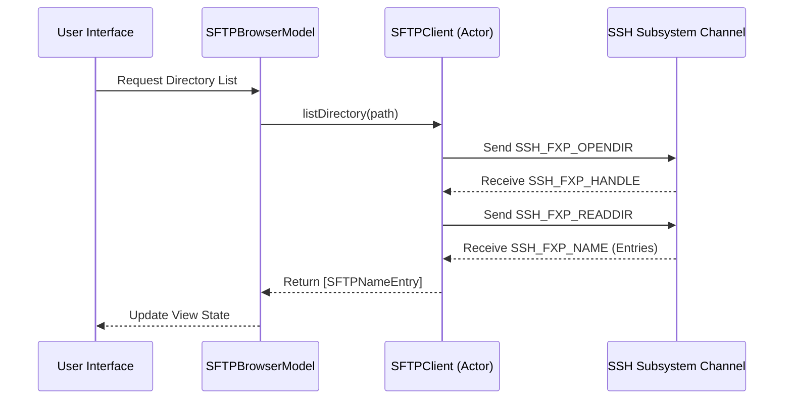
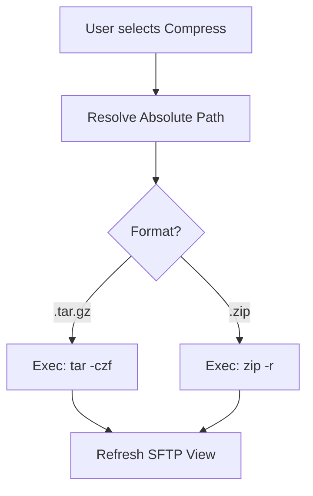

<details>
<summary>Relevant source files</summary>

The following files were used as context for generating this wiki page:

- [Sources/SSHCore/SFTPClient.swift](Sources/SSHCore/SFTPClient.swift)
- [Sources/SSHCore/SFTPProtocol.swift](Sources/SSHCore/SFTPProtocol.swift)
- [Sources/SSHCore/ArchiveOperations.swift](Sources/SSHCore/ArchiveOperations.swift)
- [App/SFTPBrowserView.swift](App/SFTPBrowserView.swift)
- [App/SFTPBrowserModel.swift](App/SFTPBrowserModel.swift)
- [LinuxApp/Sources/bastion-gui/SFTPBrowserView.swift](LinuxApp/Sources/bastion-gui/SFTPBrowserView.swift)
</details>

# SFTP & File Explorer

The SFTP & File Explorer system in Bastion provides a comprehensive interface for remote file management over the SSH File Transfer Protocol (SFTP). It enables users to browse directories, manage file permissions, edit text files, and perform archive operations directly on remote servers.

The system is built on a multi-layered architecture where a low-level protocol implementation (`SFTPProtocol.swift`) handles binary serialization, an actor-based client (`SFTPClient.swift`) manages request/response matching, and platform-specific views (`SFTPBrowserView.swift`) provide the user interface.

## System Architecture

The SFTP implementation follows a decoupled design where the protocol logic is separated from the transport and the UI. The `SFTPClient` acts as the central coordinator, utilizing an SSH subsystem channel to communicate with the remote server.

### Core Components

| Component | Description | Source |
| :--- | :--- | :--- |
| `SFTPClient` | An actor managing the SFTP session, handle allocation, and request/response matching. | [SFTPClient.swift](SFTPClient.swift) |
| `SFTPBrowserModel` | A platform-agnostic view model managing connection lifecycles and directory state. | [SFTPBrowserModel.swift](SFTPBrowserModel.swift) |
| `SFTPProtocol` | Defines the SFTP version 3 wire format, including message types and attribute encoding. | [SFTPProtocol.swift](SFTPProtocol.swift) |
| `ArchiveOperations` | Provides helper functions for remote `tar` and `zip` operations via SSH exec channels. | [ArchiveOperations.swift](ArchiveOperations.swift) |

### Data Flow Overview

The following diagram illustrates the flow of an SFTP request from the UI to the remote server and back.



Sources: [SFTPClient.swift:156-180](SFTPClient.swift#L156-L180), [SFTPBrowserModel.swift:76-85](SFTPBrowserModel.swift#L76-L85)

## SFTP Protocol Implementation

Bastion implements **SFTP Version 3**. The protocol layer handles the conversion between Swift structures and the binary format required by the SSH subsystem.

### Message Types
The protocol defines several message types for communication:
- **Requests**: `opendir`, `readdir`, `open`, `read`, `write`, `remove`, `rename`, `mkdir`, `rmdir`, `stat`, `setstat`.
- **Responses**: `version`, `status`, `handle`, `data`, `name`, `attrs`.

Sources: [SFTPProtocol.swift:10-35](SFTPProtocol.swift#L10-L35)

### File Attributes
The `SFTPFileAttributes` structure maps remote file metadata, including size, UID, GID, and POSIX permissions.

```swift
public struct SFTPFileAttributes: Sendable, Equatable {
    public var size: UInt64?
    public var uid: UInt32?
    public var gid: UInt32?
    public var permissions: UInt32?
    public var atime: UInt32?
    public var mtime: UInt32?
}
```

Sources: [SFTPProtocol.swift:101-108](SFTPProtocol.swift#L101-L108)

## File Management Operations

The explorer supports a wide array of file system manipulations. These are coordinated through the `SFTPBrowserModel` which manages the "Lazy Connect" pattern to prevent redundant session initialization.

### Directory Navigation and Manipulation
Users can navigate the file system using a breadcrumb-like path. The model tracks the `currentPath` and filters out `.` and `..` entries for a cleaner UI.
- **Create Directory**: Uses `SFTPClient.mkdir`.
- **Delete**: Supports both `SFTPClient.remove` (files) and `SFTPClient.rmdir` (directories).
- **Rename**: Uses `SFTPClient.rename`.

Sources: [SFTPBrowserModel.swift:108-146](SFTPBrowserModel.swift#L108-L146), [SFTPClient.swift:233-248](SFTPClient.swift#L233-L248)

### File Permissions (Chmod/Chown)
The system allows modifying POSIX permissions and ownership. SFTP Version 3 uses numerical IDs (UID/GID) rather than usernames for ownership changes.

| Operation | Parameter | Logic |
| :--- | :--- | :--- |
| `chmod` | Octal String (e.g., "755") | Converted to `UInt32` radix 8 and sent via `setPermissions`. |
| `chown` | Numerical UID/GID | Sent via `chown` using `SSH_FXP_SETSTAT`. |

Sources: [SFTPBrowserModel.swift:152-176](SFTPBrowserModel.swift#L152-L176), [SFTPClient.swift:211-224](SFTPClient.swift#L211-L224)

### Remote Archive Operations
Bastion integrates SSH command execution with SFTP to provide archive support without downloading files.



Sources: [ArchiveOperations.swift:10-35](ArchiveOperations.swift#L10-L35), [SFTPBrowserModel.swift:180-198](SFTPBrowserModel.swift#L180-L198)

## User Interface & Platform Support

The SFTP & File Explorer is implemented in both the main iOS/macOS application and the Linux GTK-based application.

### Native Features
- **Drag & Drop**: On macOS, users can drop files from Finder directly into the SFTP list to initiate an upload. The system uses `NSFileProvider` patterns (where applicable) and `startAccessingSecurityScopedResource` to manage sandbox permissions.
- **Text Editor**: A built-in `TextEditor` allows modifying files. The system checks if a file is binary by attempting UTF-8 decoding; if it fails, saving is disabled to prevent data corruption.
- **Context Menus**: Detailed actions like `chmod`, `chown`, and `Compress` are available via long-press or right-click.

Sources: [App/SFTPBrowserView.swift:130-145](App/SFTPBrowserView.swift#L130-L145), [App/SFTPBrowserModel.swift:93-104](App/SFTPBrowserModel.swift#L93-L104), [LinuxApp/Sources/bastion-gui/SFTPBrowserView.swift:230-245](LinuxApp/Sources/bastion-gui/SFTPBrowserView.swift#L230-L245)

### Error Handling
The system employs a centralized error reporting mechanism in the view models. Connectivity issues, permission denials, and protocol errors are captured and displayed via `errorMessage` properties, which are then rendered as `ContentUnavailableView` (iOS/macOS) or red labels (Linux).

Sources: [App/SFTPBrowserView.swift:51-54](App/SFTPBrowserView.swift#L51-L54), [SFTPBrowserModel.swift:65-73](SFTPBrowserModel.swift#L65-L73)

## Summary

The SFTP & File Explorer module provides a robust, cross-platform file management solution within Bastion. By combining a low-level SFTP protocol implementation with high-level SSH command execution for archiving, it offers a desktop-class file management experience on mobile and desktop platforms while ensuring technical accuracy and security through actor-based concurrency and protocol-strict implementations.
