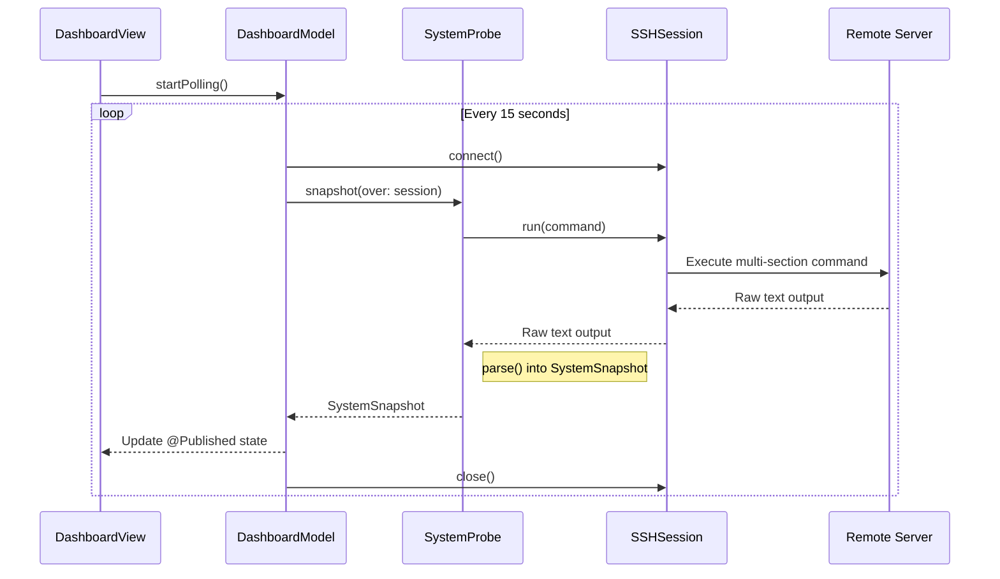
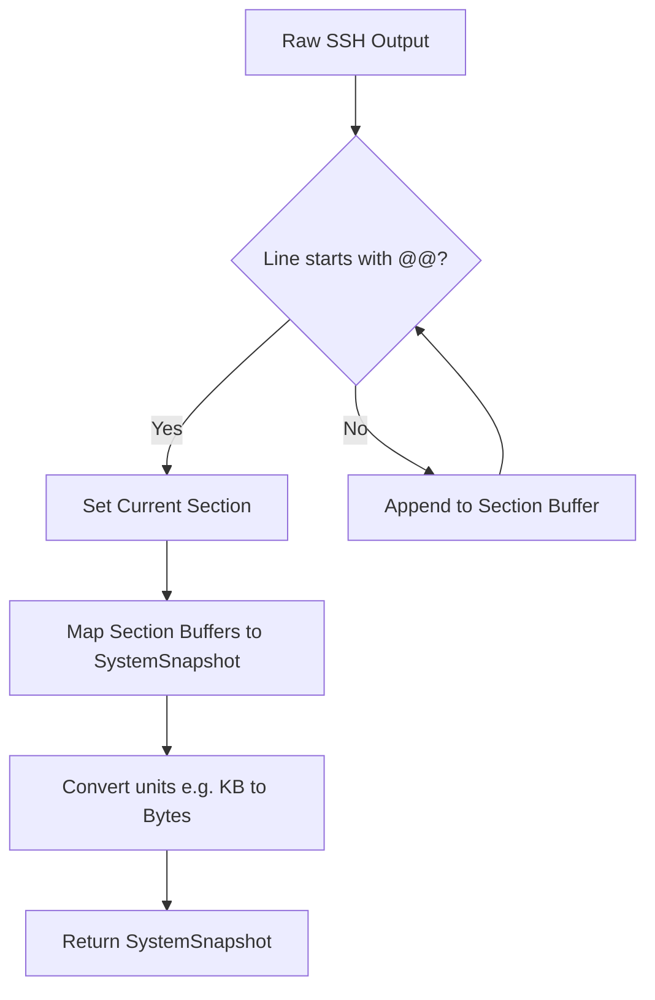

Relevant source files

The following files were used as context for generating this wiki page:

- [Sources/SSHCore/SystemProbe.swift](Sources/SSHCore/SystemProbe.swift)
- [App/DashboardView.swift](App/DashboardView.swift)
- [Tests/SSHCoreTests/SystemProbeTests.swift](Tests/SSHCoreTests/SystemProbeTests.swift)
- [LinuxApp/Sources/bastion-gui/DashboardView.swift](LinuxApp/Sources/bastion-gui/DashboardView.swift)
- [VISION.md](VISION.md)
- [README.md](README.md)

# System Probes & Dashboard

The System Probes and Dashboard system in Bastion provides agentless monitoring of remote servers over SSH. It allows users to view real-time metrics such as CPU load, memory usage, disk capacity, and Docker container status without requiring any specialized software installed on the target machine.

Sources: [VISION.md:88-91](VISION.md#L88-L91), [Sources/SSHCore/SystemProbe.swift:4-7](Sources/SSHCore/SystemProbe.swift#L4-L7)

## Architecture and Data Flow

The system follows a pull-based architecture where the Bastion client initiates a specialized SSH command, parses the resulting text output, and transforms it into a structured `SystemSnapshot`.

Sources: [App/DashboardView.swift:15-46](App/DashboardView.swift#L15-L46), [Sources/SSHCore/SystemProbe.swift:45-48](Sources/SSHCore/SystemProbe.swift#L45-L48), [LinuxApp/Sources/bastion-gui/DashboardView.swift:18-53](LinuxApp/Sources/bastion-gui/DashboardView.swift#L18-L53)

## SystemProbe Logic

The `SystemProbe` is the core engine responsible for command generation and output parsing. It utilizes a single concatenated string of commands separated by semicolons to minimize round-trips. Each command's output is prefixed with a section marker (e.g., `@@LOADAVG`) to facilitate parsing.

### Probe Commands
The probe executes the following Linux standard commands:
- `cat /proc/loadavg`: CPU load averages.
- `cat /proc/meminfo`: Detailed memory statistics.
- `df -kP`: Disk usage in POSIX-compliant format.
- `docker ps`: Container status and metadata.
- `uname -sr`, `nproc`, and `cat /etc/os-release`: System metadata.

Sources: [Sources/SSHCore/SystemProbe.swift:35-43](Sources/SSHCore/SystemProbe.swift#L35-L43)

### Data Structures

The system uses several Codable structures to represent server state:

| Structure | Fields | Description |
| :--- | :--- | :--- |
| `LoadAverage` | `one`, `five`, `fifteen` | CPU load over 1, 5, and 15 minute intervals. |
| `MemoryInfo` | `totalBytes`, `availableBytes` | Physical memory statistics. |
| `DiskUsage` | `filesystem`, `mount`, `sizeBytes`, `usedBytes` | Storage metrics per mount point. |
| `DockerContainer` | `id`, `name`, `image`, `status` | Metadata for running/stopped containers. |
| `SystemSnapshot` | `hostname`, `os`, `load`, `memory`, `disks`, etc. | Aggregated server state. |

Sources: [Sources/SSHCore/SystemProbe.swift:9-41](Sources/SSHCore/SystemProbe.swift#L9-L41)

## Dashboard Implementation

The Dashboard is implemented across different platforms (iOS/macOS and Linux) using a similar polling strategy but platform-specific UI frameworks.

### Polling Strategy
The `DashboardModel` manages the lifecycle of data retrieval. It uses an asynchronous loop that sleeps for a `pollInterval` of 15 seconds. It is designed to be resilient; if a periodic update fails after the initial load, the system retains the last known good data rather than showing an error screen.

Sources: [App/DashboardView.swift:15-53](App/DashboardView.swift#L15-L53), [LinuxApp/Sources/bastion-gui/DashboardView.swift:18-56](LinuxApp/Sources/bastion-gui/DashboardView.swift#L18-L56)

### UI Components (SwiftUI)
The visual representation utilizes a card-based layout:
- **Metrics Cards**: Use `ProgressView` to show memory and disk consumption. Colors change (Accent -> Orange -> Red) as usage crosses 75% and 90% thresholds.
- **Docker Card**: Lists containers with a status indicator (Green for "Up", Gray for others).
- **System Card**: Displays static info like OS version and uptime.

Sources: [App/DashboardView.swift:85-146](App/DashboardView.swift#L85-L146), [LinuxApp/Sources/bastion-gui/DashboardView.swift:87-152](LinuxApp/Sources/bastion-gui/DashboardView.swift#L87-L152)

## Parsing and Validation

Parsing is performed using string manipulation on the raw SSH output. The parser iterates through lines, identifying sections by their `@@` prefix and delegating specific parsing logic to private helpers like `parseLoad`, `parseMemory`, and `parseDisks`.

Sources: [Sources/SSHCore/SystemProbe.swift:52-121](Sources/SSHCore/SystemProbe.swift#L52-L121)

The reliability of this parsing is verified through unit tests using real-world fixtures from various Linux distributions to ensure that missing tools (like Docker or `nproc`) do not cause crashes but instead result in `nil` fields.

Sources: [Tests/SSHCoreTests/SystemProbeTests.swift:34-75](Tests/SSHCoreTests/SystemProbeTests.swift#L34-L75)

## Summary
The System Probes & Dashboard system provides a lightweight, agentless way to monitor remote infrastructure. By leveraging standard Linux utilities and structured SSH output, it provides critical system visibility with minimal overhead and high resilience to varied environment configurations.
