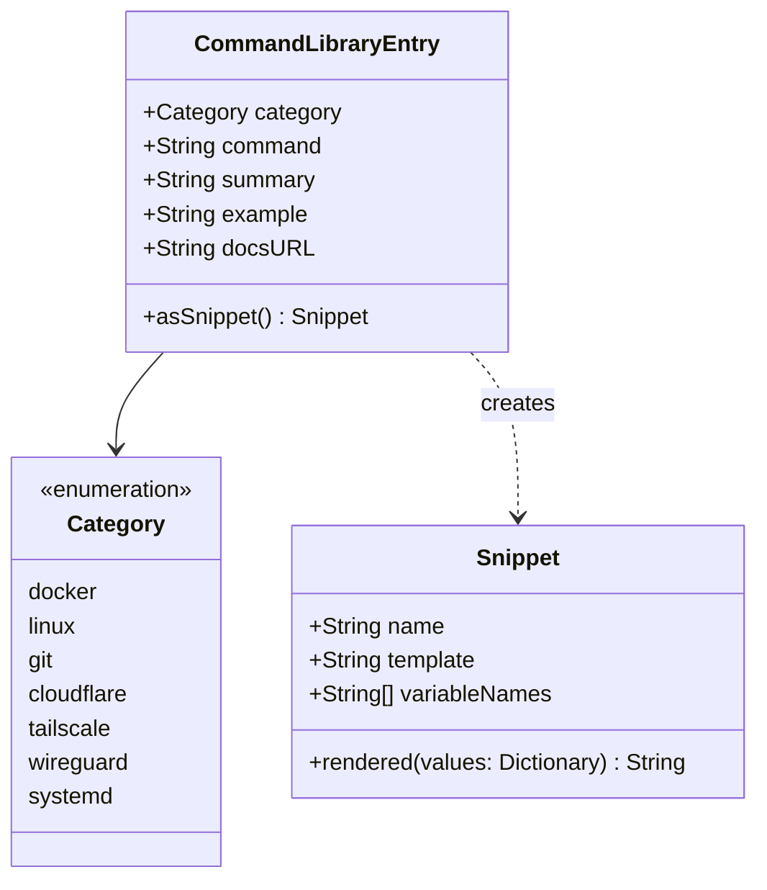

<details>
<summary>Relevant source files</summary>

The following files were used as context for generating this wiki page:

- [Sources/SSHCore/CommandLibrary.swift](Sources/SSHCore/CommandLibrary.swift)
- [App/CommandLibraryView.swift](App/CommandLibraryView.swift)
- [App/SnippetListView.swift](App/SnippetListView.swift)
- [LinuxApp/Sources/bastion-gui/SnippetListView.swift](LinuxApp/Sources/bastion-gui/SnippetListView.swift)
- [LinuxApp/Sources/bastion-gui/CommandLibraryView.swift](LinuxApp/Sources/bastion-gui/CommandLibraryView.swift)
- [Tests/SSHCoreTests/CommandLibraryTests.swift](Tests/SSHCoreTests/CommandLibraryTests.swift)
- [VISION.md](VISION.md)
</details>

# Command Library & Snippets

The **Command Library & Snippets** system in Bastion provides a powerful mechanism for managing, discovering, and executing frequently used shell commands. It consists of two primary components: a static, curated **Command Library** containing reference documentation for various technologies (Docker, Linux, Git, etc.) and a user-definable **Snippet** system for personal automation.

Both systems leverage a shared templating engine that identifies and renders variables within command strings (e.g., `{{variable}}`), allowing users to provide dynamic input before a command is dispatched to a remote host over SSH.

Sources: [VISION.md:86-93](VISION.md#L86-L93), [Sources/SSHCore/CommandLibrary.swift:1-12](Sources/SSHCore/CommandLibrary.swift#L1-L12)

## Architecture and Data Structures

The system is built on a unified model where static library entries can be treated as snippets to reuse variable rendering logic.

### Command Library Entry
The `CommandLibraryEntry` is a static structure containing reference data. It includes a category, the command template, a summary, and optional metadata such as example usage and documentation URLs.

### Snippets
A `Snippet` (represented via `CommandLibraryEntry.asSnippet` for library items) is the executable unit of the system. It identifies placeholders formatted as `{{name}}` and provides a `rendered(with:)` method to produce the final command string.



The diagram above shows the relationship between static library entries and the executable Snippet model. 

Sources: [Sources/SSHCore/CommandLibrary.swift:7-36](Sources/SSHCore/CommandLibrary.swift#L7-L36), [App/SnippetListView.swift:75-80](App/SnippetListView.swift#L75-L80)

## Command Library Categories

The Command Library is categorized to help system administrators quickly find relevant reference commands.

| Category | Description | Example Commands |
| :--- | :--- | :--- |
| **Docker** | Container management and Compose operations. | `docker ps -a`, `docker compose restart {{service}}` |
| **Linux** | System monitoring and file system utilities. | `df -h`, `ss -tlnp`, `free -h` |
| **Git** | Repository status and log management. | `git log --oneline -{{n}}`, `git branch -vv` |
| **Cloudflare** | Tunnel management and status. | `cloudflared tunnel list` |
| **Tailscale** | Network node status and diagnostic pings. | `tailscale status`, `tailscale ping {{host}}` |
| **WireGuard** | Interface and peer management. | `wg show`, `wg-quick up {{interface}}` |
| **systemd** | Service management and failure logs. | `systemctl status {{service}}`, `systemctl list-units --failed` |

Sources: [Sources/SSHCore/CommandLibrary.swift:42-101](Sources/SSHCore/CommandLibrary.swift#L42-L101), [Tests/SSHCoreTests/CommandLibraryTests.swift:11-15](Tests/SSHCoreTests/CommandLibraryTests.swift#L11-L15)

## Execution Flow and Variable Rendering

When a user selects a Snippet or a Command Library entry, the application initiates a "Run" flow. If the command template contains variables, the UI dynamically generates input fields for each unique placeholder.

```mermaid
flowchart TD
    Start[User selects Entry/Snippet] --> Parse[Extract {{variables}} from template]
    Parse --> Check{Variables exist?}
    Check -- Yes --> Form[Display Input Form]
    Form --> Input[User provides values]
    Input --> Render[Render final command string]
    Check -- No --> Render
    Render --> Execute[Open Terminal/Execute over SSH]
```

This flowchart illustrates the logic used to transform a template with placeholders into a concrete command for execution.

Sources: [App/SnippetListView.swift:93-130](App/SnippetListView.swift#L93-L130), [LinuxApp/Sources/bastion-gui/CommandLibraryView.swift:46-70](LinuxApp/Sources/bastion-gui/CommandLibraryView.swift#L46-L70)

### Variable Handling Details
- **Discovery**: Variables are identified by the `{{variable_name}}` syntax.
- **Rendering**: The `rendered(with:)` function performs string substitution.
- **State Management**: On Linux/GUI versions, `variableValues` are cleared upon changing selection to prevent values from leaking between different commands that might share variable names.

Sources: [LinuxApp/Sources/bastion-gui/CommandLibraryView.swift:30-33](LinuxApp/Sources/bastion-gui/CommandLibraryView.swift#L30-L33), [Tests/SSHCoreTests/CommandLibraryTests.swift:31-35](Tests/SSHCoreTests/CommandLibraryTests.swift#L31-L35)

## Implementation Across Platforms

The Command Library & Snippets feature is implemented natively across different platforms while sharing the core logic.

### iOS/macOS (SwiftUI)
The `CommandLibraryView` and `SnippetListView` use standard SwiftUI Lists and Sheets. Variable input is handled via `SnippetRunView`, which provides live previews of the rendered command.

### Linux/Windows (SwiftCrossUI)
The GUI implementation follows a similar pattern but adapts to the `SwiftCrossUI` framework. It uses a `List` with selection tracking and displays the `runForm` directly within the view or via a sheet, depending on the platform's UI conventions.

Sources: [App/CommandLibraryView.swift:10-50](App/CommandLibraryView.swift#L10-L50), [LinuxApp/Sources/bastion-gui/SnippetListView.swift:23-75](LinuxApp/Sources/bastion-gui/SnippetListView.swift#L23-L75), [LinuxApp/Sources/bastion-gui/CommandLibraryView.swift:11-40](LinuxApp/Sources/bastion-gui/CommandLibraryView.swift#L11-L40)

## Testing and Verification
The system is verified through automated tests to ensure data integrity and correct logic behavior:
- **Uniqueness**: All library entries must have unique IDs based on their category and command string.
- **Coverage**: Tests ensure all categories defined in the vision are represented in the static library.
- **Logic**: Verification that `asSnippet` correctly renders variables in the same manner as user-created snippets.

Sources: [Tests/SSHCoreTests/CommandLibraryTests.swift:5-36](Tests/SSHCoreTests/CommandLibraryTests.swift#L5-L36)

## Summary
The Command Library & Snippets module serves as a bridge between static documentation and active automation. By providing a curated list of common system administration commands alongside a flexible variable substitution engine, Bastion enables users to perform complex tasks quickly without manual command construction. This system is centralized in the `SSHCore` library, ensuring consistent behavior across iOS, macOS, Linux, and Windows clients.
