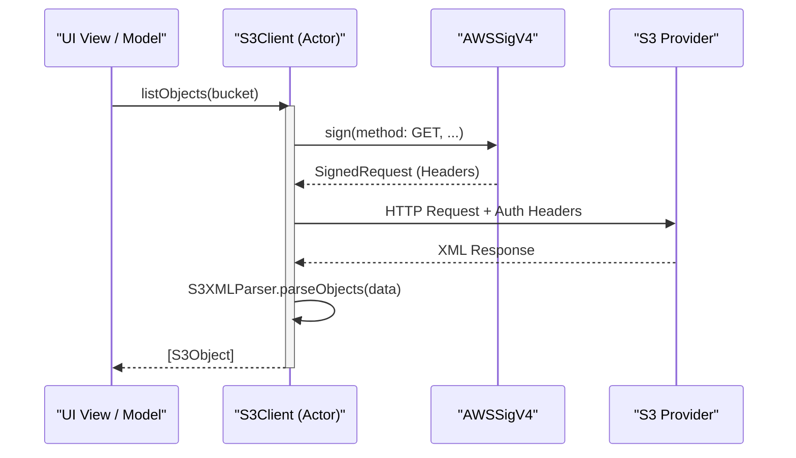
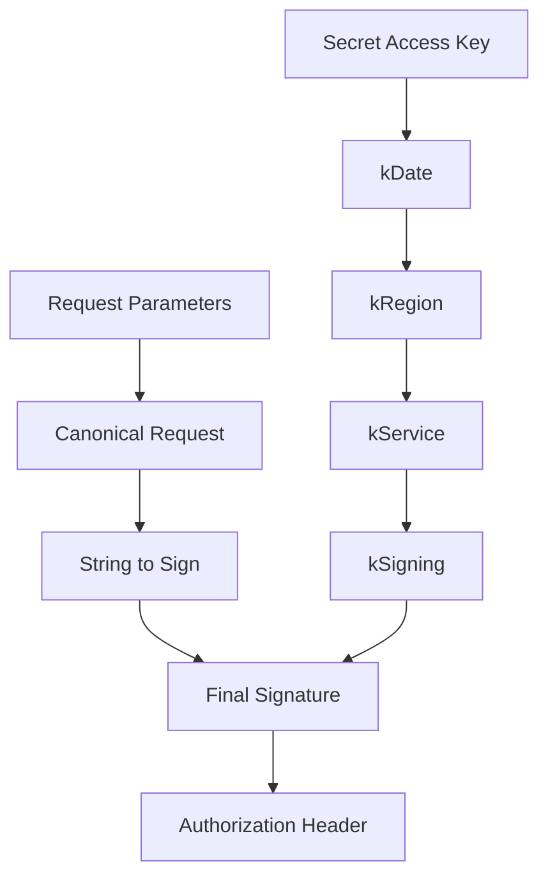
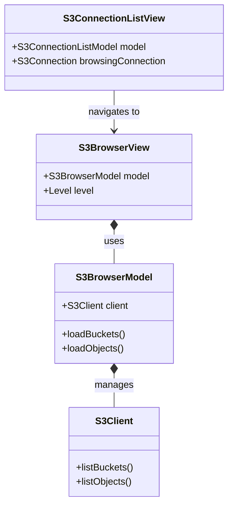

Relevant source files

The following files were used as context for generating this wiki page:

- [Sources/SSHCore/S3Client.swift](Sources/SSHCore/S3Client.swift)
- [Sources/SSHCore/S3ConnectionStore.swift](Sources/SSHCore/S3ConnectionStore.swift)
- [App/S3ConnectionView.swift](App/S3ConnectionView.swift)
- [LinuxApp/Sources/bastion-gui/S3BrowserView.swift](LinuxApp/Sources/bastion-gui/S3BrowserView.swift)
- [LinuxApp/Sources/bastion-gui/S3ConnectionEditView.swift](LinuxApp/Sources/bastion-gui/S3ConnectionEditView.swift)
- [Tests/SSHCoreTests/S3ClientTests.swift](Tests/SSHCoreTests/S3ClientTests.swift)

# S3 Object Storage Integration

The S3 Object Storage Integration in Bastion provides a native, standalone client for managing data stored in S3-compatible environments. This includes support for Amazon AWS S3 as well as alternative providers such as Ceph RGW, MinIO, and Hostup. The integration is designed to allow users to browse buckets, manage objects, and perform basic text-based file operations without requiring a separate management tool. Sources: [Sources/SSHCore/S3Client.swift:7-13](Sources/SSHCore/S3Client.swift#L7-L13), [LinuxApp/Sources/bastion-gui/S3BrowserView.swift:233-234](LinuxApp/Sources/bastion-gui/S3BrowserView.swift#L233-L234)

The system is built on a custom implementation of the AWS Signature Version 4 (SigV4) protocol, ensuring secure authentication using Access Key IDs and Secret Access Keys. It operates entirely on-device, storing connection metadata in a local JSON-based persistent store. Sources: [Sources/SSHCore/S3Client.swift:15-26](Sources/SSHCore/S3Client.swift#L15-L26), [Sources/SSHCore/S3ConnectionStore.swift:42-47](Sources/SSHCore/S3ConnectionStore.swift#L42-L47)

## Architecture and Components

The S3 integration is divided into a core logic layer (`SSHCore`) and platform-specific UI layers (iOS/macOS and Linux/GTK). 

### Core Logic (`S3Client` and `AWSSigV4`)
The `S3Client` actor serves as the primary interface for network operations. It utilizes `AWSSigV4` for request signing and `S3XMLParser` for handling S3-standard XML responses. It supports path-style URLs (`https://endpoint/bucket/key`) to ensure compatibility with various S3 providers that may not support virtual-hosted DNS. Sources: [Sources/SSHCore/S3Client.swift:28-30](Sources/SSHCore/S3Client.swift#L28-L30), [Sources/SSHCore/S3Client.swift:105-112](Sources/SSHCore/S3Client.swift#L105-L112)

### Persistence Layer (`S3ConnectionStore`)
Connections are persisted locally in a JSON file, typically located at `~/.bastion/s3connections.json`. This store manages `S3Connection` objects, which contain the endpoint, region, and authentication credentials. Sources: [Sources/SSHCore/S3ConnectionStore.swift:42-50](Sources/SSHCore/S3ConnectionStore.swift#L42-L50)

### Interaction Flow
The following diagram illustrates how a UI component interacts with the core S3 client to retrieve data.

*This diagram shows the flow of an object listing request, from the UI through the signing logic to the remote server.* Sources: [Sources/SSHCore/S3Client.swift:132-156](Sources/SSHCore/S3Client.swift#L132-L156), [Sources/SSHCore/S3Client.swift:207-212](Sources/SSHCore/S3Client.swift#L207-L212)

## Data Models

The integration relies on several key data structures to represent S3 entities and configuration.

### Connection and Credentials
| Model | Description | Fields |
| :--- | :--- | :--- |
| `S3Credentials` | Authentication pair for SigV4. | `accessKeyID`, `secretAccessKey` |
| `S3Connection` | Saved endpoint configuration. | `id`, `name`, `endpoint`, `region`, `accessKeyID`, `secretAccessKey` |
| `S3Bucket` | Representation of an S3 bucket. | `name`, `creationDate` |
| `S3Object` | Representation of a stored file. | `key`, `size`, `lastModified` |

Sources: [Sources/SSHCore/S3Client.swift:31-48](Sources/SSHCore/S3Client.swift#L31-L48), [Sources/SSHCore/S3ConnectionStore.swift:8-21](Sources/SSHCore/S3ConnectionStore.swift#L8-L21)

## Authentication and Security

Authentication is handled via the **AWS Signature Version 4** protocol. The implementation performs header-based authentication, specifically using `Authorization`, `x-amz-date`, and `x-amz-content-sha256` headers. Sources: [Sources/SSHCore/S3Client.swift:148-154](Sources/SSHCore/S3Client.swift#L148-L154)

### Signature Generation
The signature process involves creating a "Canonical Request," a "String to Sign," and a "Derived Signing Key" based on the secret access key and specific request parameters (date, region, service). Sources: [Sources/SSHCore/S3Client.swift:84-103](Sources/SSHCore/S3Client.swift#L84-L103)

*The SigV4 signing process derives a specific signing key through multiple HMAC-SHA256 steps to avoid using the secret key directly in the request.* Sources: [Sources/SSHCore/S3Client.swift:105-121](Sources/SSHCore/S3Client.swift#L105-L121)

## Supported Operations

The `S3Client` supports a standard set of operations for bucket and object management:

*  **Bucket Operations**: `listBuckets`, `createBucket`, `deleteBucket`. Sources: [Sources/SSHCore/S3Client.swift:165-179](Sources/SSHCore/S3Client.swift#L165-L179)
*  **Object Operations**: `listObjects`, `putObject`, `getObject`, `deleteObject`. Sources: [Sources/SSHCore/S3Client.swift:181-205](Sources/SSHCore/S3Client.swift#L181-L205)

### Text-Based Content Management
The current implementation (v1) focuses on text-based content management. In both the iOS and Linux GUIs, object viewing and uploading are restricted to UTF-8 text. If binary data is detected during a download, the UI displays a placeholder indicating that binary content cannot be edited to prevent data corruption. Sources: [App/S3ConnectionView.swift:65-74](App/S3ConnectionView.swift#L65-L74), [LinuxApp/Sources/bastion-gui/S3BrowserView.swift:65-67](LinuxApp/Sources/bastion-gui/S3BrowserView.swift#L65-L67)

## UI Implementation

The integration provides a two-level browsing experience:
1.  **Connection List**: Manages saved endpoints and credentials. Sources: [App/S3ConnectionView.swift:315-330](App/S3ConnectionView.swift#L315-L330), [LinuxApp/Sources/bastion-gui/S3BrowserView.swift:233-247](LinuxApp/Sources/bastion-gui/S3BrowserView.swift#L233-L247)
2.  **S3 Browser**: Navigates through a specific connection's buckets and objects. Sources: [App/S3ConnectionView.swift:115-130](App/S3ConnectionView.swift#L115-L130), [LinuxApp/Sources/bastion-gui/S3BrowserView.swift:93-105](LinuxApp/Sources/bastion-gui/S3BrowserView.swift#L93-L105)

### Component Relationships

*This diagram illustrates the relationship between the UI views and the underlying logic models.* Sources: [App/S3ConnectionView.swift:115-350](App/S3ConnectionView.swift#L115-L350), [LinuxApp/Sources/bastion-gui/S3BrowserView.swift:24-257](LinuxApp/Sources/bastion-gui/S3BrowserView.swift#L24-L257)

## Configuration and Persistence

Saved S3 connections are managed by the `S3ConnectionStore`. On Linux, this is a plain JSON storage, while the iOS/macOS targets are designed to align with the project's overall security vision of using system Keychains, though the current implementation persists keys within the JSON structure for cross-platform parity in initial versions. Sources: [Sources/SSHCore/S3ConnectionStore.swift:7-13](Sources/SSHCore/S3ConnectionStore.swift#L7-L13), [Sources/SSHCore/S3ConnectionStore.swift:42-50](Sources/SSHCore/S3ConnectionStore.swift#L42-L50)

| Option | Type | Default | Description |
| :--- | :--- | :--- | :--- |
| `name` | String | (Required) | Display name for the connection. |
| `endpoint` | String | (Required) | The URL of the S3 service (e.g., https://s3.amazonaws.com). |
| `region` | String | "us-east-1" | The AWS region identifier. |
| `accessKeyID` | String | (Required) | The public identifier for the S3 account. |
| `secretAccessKey`| String | (Required) | The private key used for request signing. |

Sources: [Sources/SSHCore/S3ConnectionStore.swift:14-21](Sources/SSHCore/S3ConnectionStore.swift#L14-L21), [LinuxApp/Sources/bastion-gui/S3ConnectionEditView.swift:14-20](LinuxApp/Sources/bastion-gui/S3ConnectionEditView.swift#L14-L20)

## Conclusion
The S3 Object Storage Integration provides a robust, developer-centric tool for managing cloud storage directly within the Bastion platform. By implementing a custom SigV4 signer and utilizing native XML parsing, the system maintains a lightweight footprint while ensuring high compatibility across diverse S3 providers.
