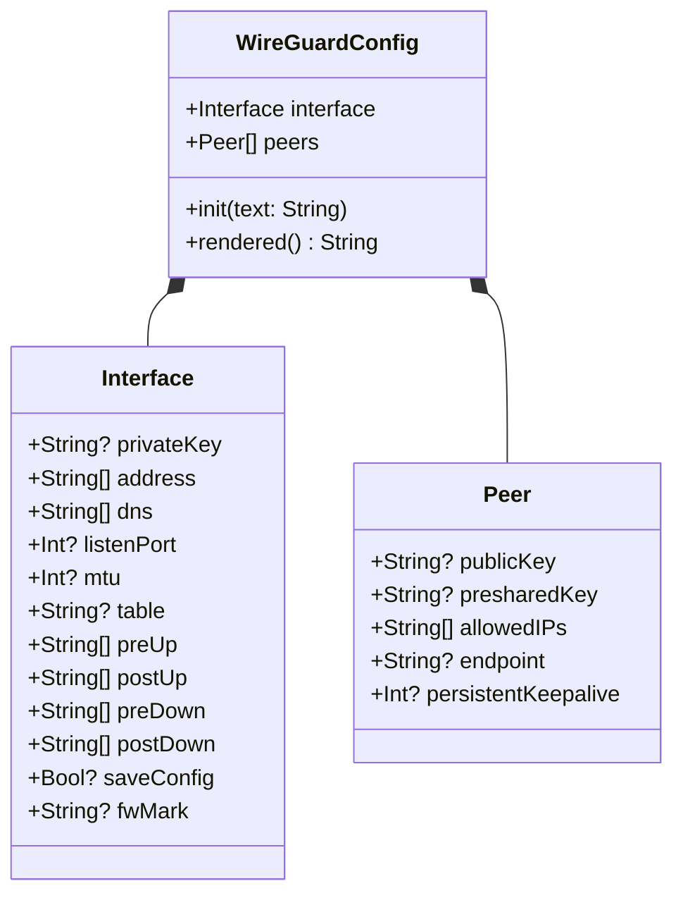
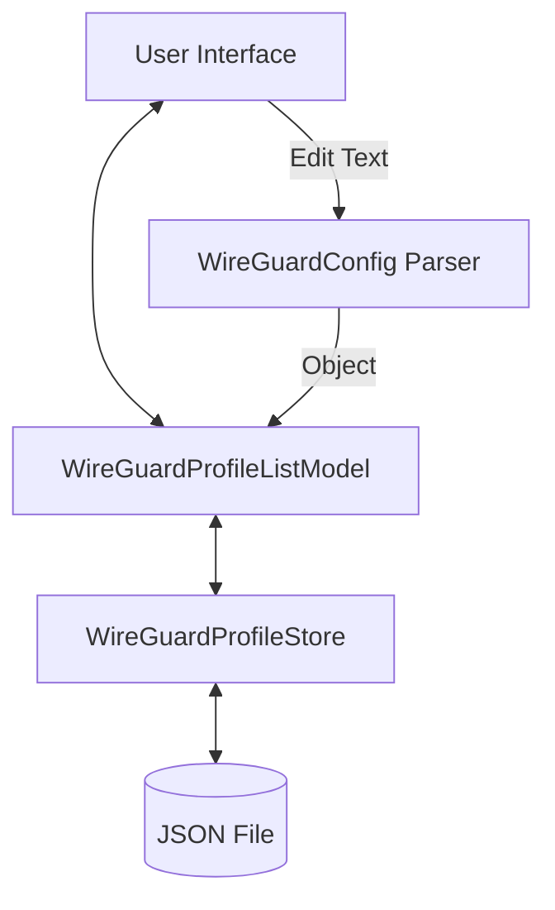

Relevant source files

The following files were used as context for generating this wiki page:

- [Sources/SSHCore/WireGuardConfig.swift](Sources/SSHCore/WireGuardConfig.swift)
- [Sources/SSHCore/WireGuardProfileStore.swift](Sources/SSHCore/WireGuardProfileStore.swift)
- [App/WireGuardProfileView.swift](App/WireGuardProfileView.swift)
- [LinuxApp/Sources/bastion-gui/WireGuardProfileEditView.swift](LinuxApp/Sources/bastion-gui/WireGuardProfileEditView.swift)
- [LinuxApp/Sources/bastion-gui/WireGuardProfileListView.swift](LinuxApp/Sources/bastion-gui/WireGuardProfileListView.swift)
- [Tests/SSHCoreTests/WireGuardConfigTests.swift](Tests/SSHCoreTests/WireGuardConfigTests.swift)
- [VISION.md](VISION.md)

# WireGuard Integration

## Introduction

The WireGuard integration in Bastion is designed to provide a comprehensive management system for WireGuard VPN profiles. The current scope (v1) focuses on the parsing, storage, and editing of `.conf` files compatible with `wg-quick` and `wg setconf`. It serves as a profile management tool rather than a tunnel establishment engine, which is identified as a future goal in the project roadmap to allow the app to establish tunnels without external dependencies.

Sources: [Sources/SSHCore/WireGuardConfig.swift:5-8](Sources/SSHCore/WireGuardConfig.swift#L5-L8), [VISION.md:144-147](VISION.md#L144-L147), [App/WireGuardProfileView.swift:22-25](App/WireGuardProfileView.swift#L22-L25)

## Data Models and Architecture

The integration is built upon three primary layers: the configuration parser (`WireGuardConfig`), the profile wrapper (`WireGuardProfile`), and the persistence layer (`WireGuardProfileStore`).

### WireGuard Configuration Structure
The configuration is split into `Interface` and `Peer` structures, mirroring the standard WireGuard configuration format.

The diagram shows the relationship between the main configuration object and its sub-sections as defined in the source code.
Sources: [Sources/SSHCore/WireGuardConfig.swift:13-64](Sources/SSHCore/WireGuardConfig.swift#L13-L64)

### Profile and Persistence
A `WireGuardProfile` acts as a container that associates a unique ID, a user-friendly name, and a modification timestamp with a `WireGuardConfig`. These profiles are managed by the `WireGuardProfileStore`, which handles JSON-based persistence to disk at `~/.bastion/wireguard.json`. In the current v1 implementation, all profile data including WireGuard private keys and preshared keys is stored in plaintext JSON for cross-platform compatibility. This follows the same approach as `S3ConnectionStore` and represents a deliberate v1 scope limitation: Linux and Windows do not yet have a Keychain-equivalent abstraction in the codebase. Future iterations are planned to migrate sensitive key material to platform-specific secure storage (system Keychain on Apple platforms) while retaining non-sensitive profile metadata in the JSON file.

| Component | Description |
|---|---|
| `WireGuardProfile` | Codable and Identifiable structure for stored profiles. Contains the full `WireGuardConfig` including private keys. |
| `WireGuardProfileStore` | Thread-safe manager for CRUD operations on profiles. Persists to JSON with filesystem permissions (0700). |
| `defaultPath` | Standard storage location: `~/.bastion/wireguard.json`. |

**Security Note:** Users should ensure appropriate filesystem permissions (0700) are set on the `~/.bastion` directory to restrict access to profile files containing sensitive key material.

Sources: [Sources/SSHCore/WireGuardProfileStore.swift:6-33](Sources/SSHCore/WireGuardProfileStore.swift#L6-L33)

## Configuration Parsing and Serialization

The system includes a custom parser that handles `.conf` files. It is case-insensitive regarding keys and supports both single values and comma-separated lists (e.g., `Address`, `DNS`, `AllowedIPs`).

### Parsing Logic
1. **Comment Handling**: Lines starting with `#` are ignored. The parser is designed to handle empty subsequences correctly to ensure commented lines are not misidentified as active configuration.
2. **Sectioning**: The parser identifies `[Interface]` and `[Peer]` headers to scope subsequent key-value pairs.
3. **Accumulation**: Certain keys, such as `Address` or `PostUp`, accumulate values rather than overwriting them if they appear multiple times.

Sources: [Sources/SSHCore/WireGuardConfig.swift:75-144](Sources/SSHCore/WireGuardConfig.swift#L75-L144), [Tests/SSHCoreTests/WireGuardConfigTests.swift:93-102](Tests/SSHCoreTests/WireGuardConfigTests.swift#L93-L102)

### Rendering
The `rendered()` function performs the inverse of parsing, generating a standard WireGuard `.conf` string. It follows `wg-quick` conventions for field ordering.

Sources: [Sources/SSHCore/WireGuardConfig.swift:150-176](Sources/SSHCore/WireGuardConfig.swift#L150-L176)

## User Interface Implementation

The integration provides native views for both iOS/macOS (SwiftUI) and Linux (SwiftCrossUI/GTK4).

### Data Flow
Both platforms utilize a `WireGuardProfileListModel` as an `ObservableObject` to bridge the UI with the `WireGuardProfileStore`.

This diagram represents the flow of data from the raw text input in the UI to the persistent storage on disk.
Sources: [App/WireGuardProfileView.swift:7-16](App/WireGuardProfileView.swift#L7-L16), [LinuxApp/Sources/bastion-gui/WireGuardProfileListView.swift:7-16](LinuxApp/Sources/bastion-gui/WireGuardProfileListView.swift#L7-L16)

### View Components

| View | Purpose | Platform |
|---|---|---|
| `WireGuardProfileListView` | Displays a list of profiles with summary info (first address and peer count). | iOS, macOS, Linux |
| `WireGuardProfileEditView` | Provides a `TextEditor` for raw `.conf` editing and a `TextField` for the profile name. | iOS, macOS, Linux |
| `FileImporter` | Allows iOS/macOS users to import existing `.conf` files directly. | iOS/macOS Only |

Sources: [App/WireGuardProfileView.swift:26-118](App/WireGuardProfileView.swift#L26-L118), [LinuxApp/Sources/bastion-gui/WireGuardProfileEditView.swift:12-45](LinuxApp/Sources/bastion-gui/WireGuardProfileEditView.swift#L12-L45)

## Technical Implementation Details

### Configuration Summary Calculation
The UI generates a brief summary for each profile to improve navigation. It extracts the first interface address and the total count of peers.
Sources: [App/WireGuardProfileView.swift:62-66](App/WireGuardProfileView.swift#L62-L66), [LinuxApp/Sources/bastion-gui/WireGuardProfileListView.swift:63-67](LinuxApp/Sources/bastion-gui/WireGuardProfileListView.swift#L63-L67)

### Persistence Safety
The `WireGuardProfileStore` uses an `NSLock` to ensure thread-safe access to the profile dictionary. Writing to disk is performed atomically via `Data.write(to:options:)` with `.atomic`.
Sources: [Sources/SSHCore/WireGuardProfileStore.swift:23-74](Sources/SSHCore/WireGuardProfileStore.swift#L23-L74)

## Summary
The WireGuard Integration provides a robust foundation for managing VPN configurations within Bastion. By focusing on standard `.conf` compatibility and reliable local persistence, it enables users to organize their network environment metadata alongside their SSH hosts. Future iterations aim to expand this into a full networking tunnel provider.
