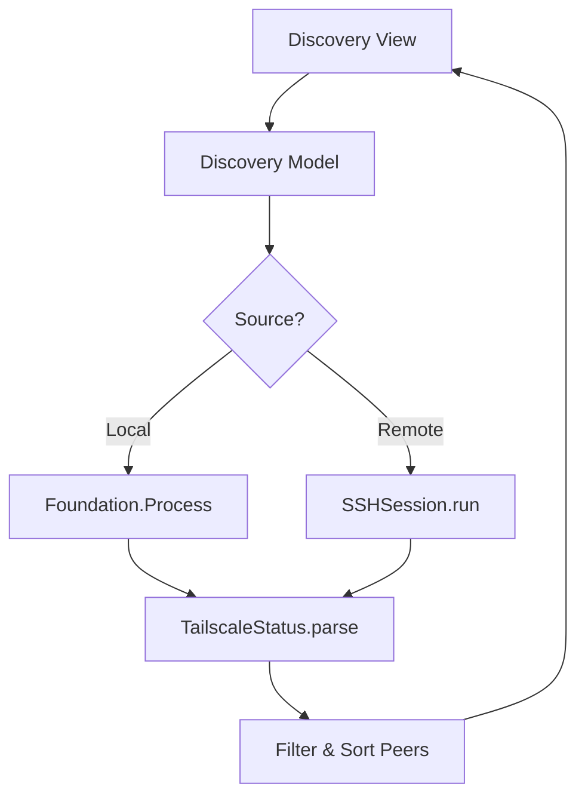
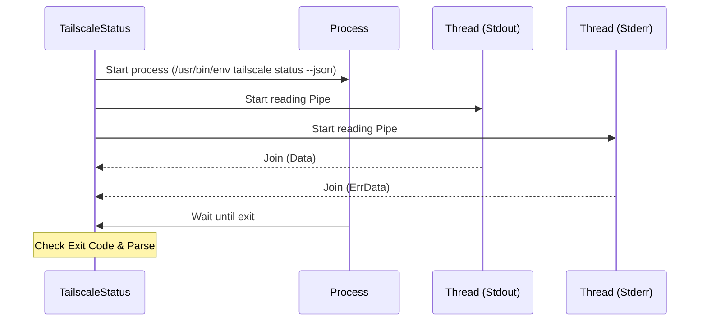

<details>
<summary>Relevant source files</summary>

The following files were used as context for generating this wiki page:

- [Sources/SSHCore/TailscaleStatus.swift](Sources/SSHCore/TailscaleStatus.swift)
- [App/TailscaleDiscoveryView.swift](App/TailscaleDiscoveryView.swift)
- [LinuxApp/Sources/bastion-gui/TailscaleDiscoveryView.swift](LinuxApp/Sources/bastion-gui/TailscaleDiscoveryView.swift)
- [Tests/SSHCoreTests/TailscaleStatusTests.swift](Tests/SSHCoreTests/TailscaleStatusTests.swift)
- [Sources/SSHCore/CommandLibrary.swift](Sources/SSHCore/CommandLibrary.swift)
- [README.md](README.md)
- [VISION.md](VISION.md)
</details>

# Tailscale Discovery Integration

The Tailscale Discovery Integration in Bastion allows users to browse and import SSH hosts directly from their Tailscale network (Tailnet). This feature automates the process of adding new servers by querying the Tailscale daemon for peer information, rather than requiring manual entry of IP addresses and hostnames.

The integration supports two primary methods for retrieving Tailnet status:
1.  **Local Discovery:** Querying the local Tailscale daemon running on the same machine as the Bastion application (supported on macOS and Linux).
2.  **Remote Discovery:** Querying a Tailscale daemon on a remote server via an established SSH session.

Sources: [Sources/SSHCore/TailscaleStatus.swift:7-12](Sources/SSHCore/TailscaleStatus.swift#L7-L12), [App/TailscaleDiscoveryView.swift:10-15](App/TailscaleDiscoveryView.swift#L10-L15), [VISION.md:200-202](VISION.md#L200-L202)

## Architecture and Data Flow

The integration is built on a decoupled architecture where `SSHCore` handles the parsing and execution logic, while platform-specific UI layers (SwiftUI for Apple, SwiftCrossUI for Linux) handle user interaction.

### Data Acquisition Flow
The system retrieves Tailnet data by executing the `tailscale status --json` command. This command provides a JSON representation of the current node and all known peers.



The diagram shows the flow from the user interface through the discovery model to either a local process execution or a remote SSH command, culminating in JSON parsing and host suggestions.
Sources: [Sources/SSHCore/TailscaleStatus.swift:58-70](Sources/SSHCore/TailscaleStatus.swift#L58-L70), [App/TailscaleDiscoveryView.swift:18-50](App/TailscaleDiscoveryView.swift#L18-L50), [LinuxApp/Sources/bastion-gui/TailscaleDiscoveryView.swift:18-47](LinuxApp/Sources/bastion-gui/TailscaleDiscoveryView.swift#L18-L47)

### Tailscale JSON Schema
The integration maps specific fields from the Tailscale JSON output to internal Swift structures.

| Swift Field | JSON Key | Description |
| :--- | :--- | :--- |
| `hostName` | `HostName` | The short hostname of the peer. |
| `dnsName` | `DNSName` | The MagicDNS name (e.g., `server.tailnet.ts.net`). |
| `os` | `OS` | The operating system of the peer. |
| `tailscaleIPs` | `TailscaleIPs` | List of Tailscale IP addresses (IPv4/IPv6). |
| `online` | `Online` | Boolean indicating if the peer is currently reachable. |

Sources: [Sources/SSHCore/TailscaleStatus.swift:14-27](Sources/SSHCore/TailscaleStatus.swift#L14-L27), [Tests/SSHCoreTests/TailscaleStatusTests.swift:11-34](Tests/SSHCoreTests/TailscaleStatusTests.swift#L11-L34)

## Core Logic and Implementation

### Parsing and Filtering
The `TailscaleStatus` struct handles the decoding of the JSON payload and provides a computed property, `suggestedHosts`, to filter relevant connection targets.

*  **Online Filter:** Only peers with `online: true` are included.
*  **Address Resolution:** The logic prioritizes `dnsName` (MagicDNS) for stability, falling back to `hostName` if the DNS name is empty.
*  **IP Selection:** It retrieves the first available IP from the `tailscaleIPs` array.
*  **Sorting:** Suggestions are sorted alphabetically by hostname.

Sources: [Sources/SSHCore/TailscaleStatus.swift:45-56](Sources/SSHCore/TailscaleStatus.swift#L45-L56), [Tests/SSHCoreTests/TailscaleStatusTests.swift:65-71](Tests/SSHCoreTests/TailscaleStatusTests.swift#L65-L71)

### Local Execution (macOS & Linux)
On non-iOS platforms, the system uses `Foundation.Process` to run the local `tailscale` binary. To avoid deadlocks when reading large JSON payloads, Bastion implements a concurrent pipe reading strategy using a `ResultThread` utility.



The sequence diagram illustrates the concurrent reading of stdout and stderr to prevent OS pipe buffer saturation and subsequent deadlocks.
Sources: [Sources/SSHCore/TailscaleStatus.swift:81-115](Sources/SSHCore/TailscaleStatus.swift#L81-L115), [Sources/SSHCore/TailscaleStatus.swift:131-155](Sources/SSHCore/TailscaleStatus.swift#L131-L155)

## Platform Specifics

The integration adapts to platform constraints, specifically regarding security sandboxing.

### iOS Constraints
iOS apps cannot spawn arbitrary subprocesses via `Foundation.Process`. Consequently, the "Local Device" discovery option is disabled on iOS. Users on iOS must use a remote SSH host as the discovery proxy to scan the Tailnet.
Sources: [App/TailscaleDiscoveryView.swift:25-38](App/TailscaleDiscoveryView.swift#L25-L38), [Sources/SSHCore/TailscaleStatus.swift:76-79](Sources/SSHCore/TailscaleStatus.swift#L76-L79)

### Linux Implementation
The Linux GUI (built with SwiftCrossUI) mirrors the macOS logic but uses `SSHConnectionChain` to handle jump hosts during remote discovery.

| Feature | iOS | macOS | Linux |
| :--- | :--- | :--- | :--- |
| **Local Discovery** | No | Yes | Yes |
| **Remote Discovery** | Yes | Yes | Yes |
| **UI Framework** | SwiftUI | SwiftUI | SwiftCrossUI (GTK4) |

Sources: [LinuxApp/Sources/bastion-gui/TailscaleDiscoveryView.swift:28-40](LinuxApp/Sources/bastion-gui/TailscaleDiscoveryView.swift#L28-L40), [App/TailscaleDiscoveryView.swift:105-115](App/TailscaleDiscoveryView.swift#L105-L115)

## Reference Commands
For manual troubleshooting or CLI usage, the `CommandLibrary` includes standard Tailscale commands used by administrators.

```swift
// Example entries from CommandLibrary
.init(category: .tailscale, command: "tailscale status", summary: "Connected nodes in Tailscale network + status"),
.init(category: .tailscale, command: "tailscale ping {{host}}", summary: "Ping over Tailscale (shows path)"),
.init(category: .tailscale, command: "tailscale ip -4", summary: "This device's Tailscale IP")
```

Sources: [Sources/SSHCore/CommandLibrary.swift:85-92](Sources/SSHCore/CommandLibrary.swift#L85-L92)

## Summary
The Tailscale Discovery Integration provides a seamless way to populate Bastion's host database by leveraging Tailscale's status APIs. By supporting both local process execution and remote SSH-based discovery, the system ensures flexibility across mobile and desktop environments while maintaining a strict focus on "agentless" operations (no Bastion-specific agent required on the servers).

Sources: [README.md:85-88](README.md#L85-L88), [VISION.md:200-202](VISION.md#L200-L202)
