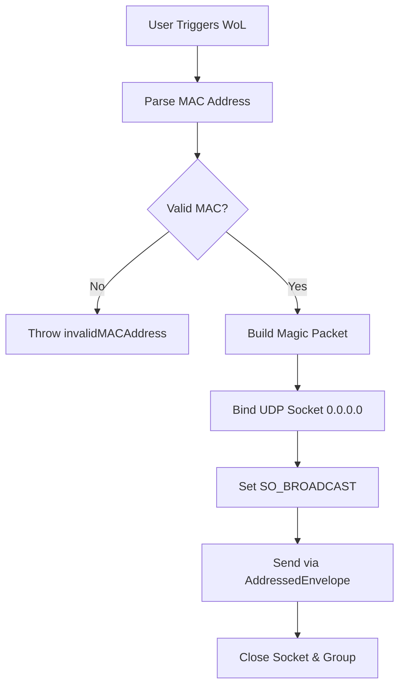
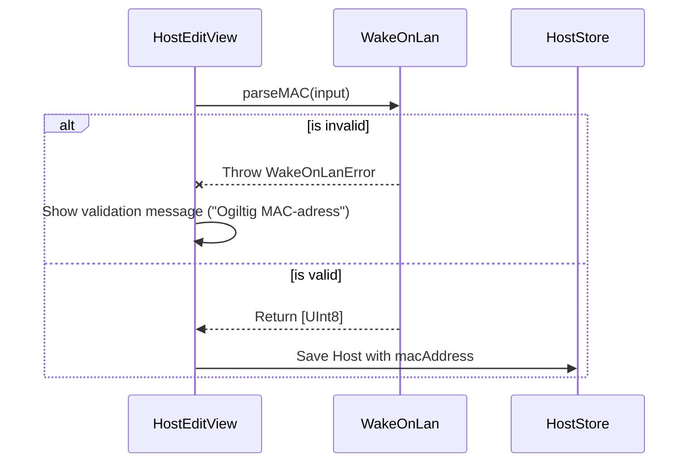

<details>
<summary>Relevant source files</summary>

The following files were used as context for generating this wiki page:

- [Sources/SSHCore/WakeOnLan.swift](Sources/SSHCore/WakeOnLan.swift)
- [App/HostEditView.swift](App/HostEditView.swift)
- [Tests/SSHCoreTests/WakeOnLanTests.swift](Tests/SSHCoreTests/WakeOnLanTests.swift)
- [LinuxApp/Sources/bastion-gui/HostEditView.swift](LinuxApp/Sources/bastion-gui/HostEditView.swift)
- [Sources/SSHCore/CommandLibrary.swift](Sources/SSHCore/CommandLibrary.swift)
- [VISION.md](VISION.md)
</details>

# Wake on LAN Utility

The Wake on LAN (WoL) Utility in the Bastion project is a specialized networking tool designed to wake suspended or powered-off machines on a local network. Unlike the core SSH functionality of the project, this utility operates using pure UDP broadcasts. Its primary purpose is to allow home-lab users and system administrators to wake a server before attempting an SSH connection.

Sources: [Sources/SSHCore/WakeOnLan.swift:8-12](Sources/SSHCore/WakeOnLan.swift#L8-L12), [VISION.md](VISION.md)

## Technical Architecture

The utility is implemented as a stateless engine within the `SSHCore` library. It handles the transformation of a string-based MAC address into a standard "Magic Packet" and manages the asynchronous network transmission via UDP.

### Core Logic Flow
The process follows a strict validation and transformation pipeline:
1. **MAC Parsing**: Sanitizes input strings (removing `:` or `-`) and validates hex characters.
2. **Packet Construction**: Builds a 102-byte payload consisting of a 6-byte sync stream (`0xFF`) followed by the target MAC address repeated 16 times.
3. **Network Dispatch**: Uses `NIOPosix` to bind a UDP socket and broadcast the packet to a specific network address.

Sources: [Sources/SSHCore/WakeOnLan.swift:23-50](Sources/SSHCore/WakeOnLan.swift#L23-L50), [Tests/SSHCoreTests/WakeOnLanTests.swift:51-60](Tests/SSHCoreTests/WakeOnLanTests.swift#L51-L60)



The diagram shows the logic flow from user input to the final UDP broadcast.
Sources: [Sources/SSHCore/WakeOnLan.swift:63-88](Sources/SSHCore/WakeOnLan.swift#L63-L88)

## Data Models and Components

### WakeOnLan Engine
The utility provides static methods for handling the WoL lifecycle:

| Function | Parameters | Description |
| :--- | :--- | :--- |
| `parseMAC(_:)` | `mac: String` | Converts MAC formats (e.g., `AA:BB:CC:DD:EE:FF`) into `[UInt8]`. |
| `magicPacket(for:)` | `mac: String` | Generates the 102-byte Magic Packet payload. |
| `send(mac:broadcastAddress:port:)` | `mac`, `broadcastAddress`, `port` | Asynchronously dispatches the packet via UDP. |

Sources: [Sources/SSHCore/WakeOnLan.swift:23](Sources/SSHCore/WakeOnLan.swift#L23), [Sources/SSHCore/WakeOnLan.swift:45](Sources/SSHCore/WakeOnLan.swift#L45), [Sources/SSHCore/WakeOnLan.swift:63](Sources/SSHCore/WakeOnLan.swift#L63)

### Error Handling
Specific errors are defined to ensure visibility into failure points:
- `invalidMACAddress(String)`: Thrown when a MAC address is not 12 hex characters or contains invalid symbols.
- `invalidPort(Int)`: Thrown if the port is outside the `1...65535` range, preventing platform-specific modulo wrapping that might send packets to incorrect ports.

Sources: [Sources/SSHCore/WakeOnLan.swift:13-20](Sources/SSHCore/WakeOnLan.swift#L13-L20), [Tests/SSHCoreTests/WakeOnLanTests.swift:29-41](Tests/SSHCoreTests/WakeOnLanTests.swift#L29-L41)

## User Interface Integration

The WoL utility is integrated into the host management views across different platforms (iOS, macOS, and Linux). It allows users to store a MAC address alongside host metadata.

### Data Storage and Validation
When editing a host, the UI provides a field for the MAC address. Validation occurs "live" to prevent saving malformed data.



This diagram illustrates the validation sequence during host creation or editing.
Sources: [App/HostEditView.swift:229-246](App/HostEditView.swift#L229-L246), [LinuxApp/Sources/bastion-gui/HostEditView.swift:186-200](LinuxApp/Sources/bastion-gui/HostEditView.swift#L186-L200)

### Multi-Platform Implementation Details
- **iOS/macOS**: Uses `Form` sections with specific validation labels and symbols (`exclamationmark.triangle`).
- **Linux**: Uses a `ScrollView` containing `TextField` components, utilizing `SwiftCrossUI` for rendering.
- **Port Selection**: While standard WoL uses port 9 (`discard`), the utility supports arbitrary port selection to accommodate non-standard server configurations.

Sources: [App/HostEditView.swift:167-175](App/HostEditView.swift#L167-L175), [LinuxApp/Sources/bastion-gui/HostEditView.swift:161-167](LinuxApp/Sources/bastion-gui/HostEditView.swift#L161-L167)

## Implementation Example: Magic Packet Construction
The utility ensures the packet format strictly adheres to the technical specification of 6 sync bytes followed by 16 repetitions of the target MAC.

```swift
// Sources/SSHCore/WakeOnLan.swift:45-50
public static func magicPacket(for mac: String) throws -> [UInt8] {
    let macBytes = try parseMAC(mac)
    var packet = [UInt8](repeating: 0xFF, count: 6)
    for _ in 0..<16 { packet.append(contentsOf: macBytes) }
    return packet
}
```

Sources: [Sources/SSHCore/WakeOnLan.swift:45-50](Sources/SSHCore/WakeOnLan.swift#L45-L50)

## Testing and Verification
The utility is verified through comprehensive unit tests that simulate real network conditions:
- **MAC Parsing**: Tests cover colon-separated, dash-separated, and separator-less formats.
- **UDP Delivery**: Uses an in-process `DatagramBootstrap` and `Receiver` to capture and verify that the magic packet sent over `127.0.0.1` exactly matches the expected memory layout.
- **Boundary Conditions**: Explicit tests for port range validation (e.g., rejecting port 70,000).

Sources: [Tests/SSHCoreTests/WakeOnLanTests.swift:7-86](Tests/SSHCoreTests/WakeOnLanTests.swift#L7-L86)

## Summary
The Wake on LAN Utility serves as a bridge between management and connectivity, allowing Bastion to initiate server availability. By using a short-lived `EventLoopGroup` for each request, the utility maintains low complexity while ensuring high reliability for user-triggered wake actions.

Sources: [Sources/SSHCore/WakeOnLan.swift:59-62](Sources/SSHCore/WakeOnLan.swift#L59-L62)
