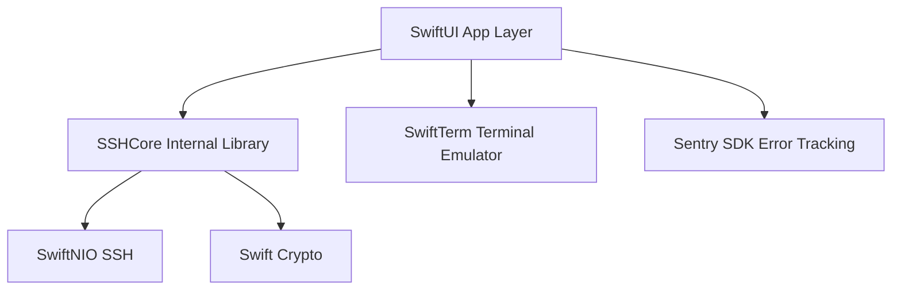
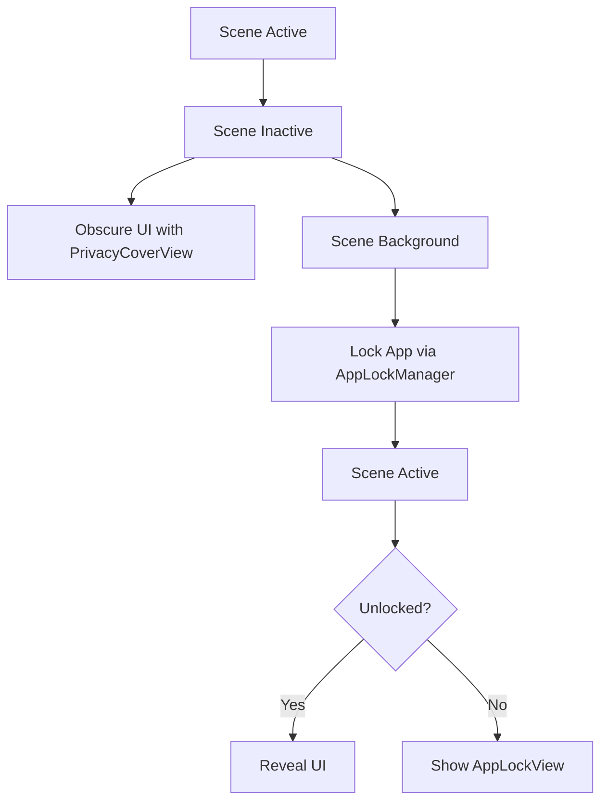
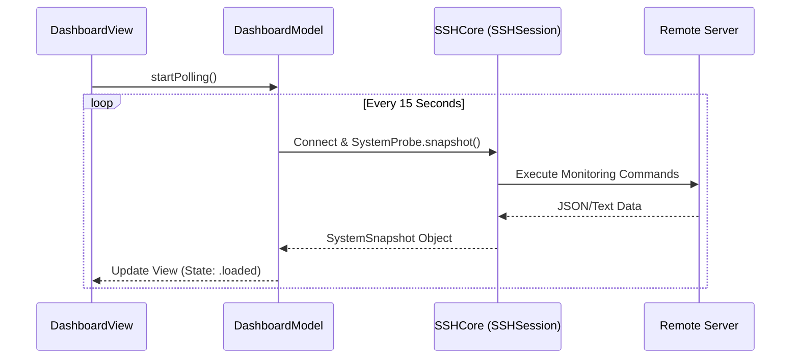

Relevant source files

The following files were used as context for generating this wiki page:

- [App/BastionApp.swift](App/BastionApp.swift)
- [App/project.yml](App/project.yml)
- [App/TerminalView.swift](App/TerminalView.swift)
- [App/DashboardView.swift](App/DashboardView.swift)
- [README.md](README.md)
- [VISION.md](VISION.md)

# Apple Platforms (iOS & macOS) UI

The Apple Platforms UI for the Bastion project is a native implementation built using **SwiftUI**, targeting iOS and macOS. While the application's core logic resides in a platform-agnostic library called `SSHCore`, the UI layer is designed to provide a high-performance, native experience that follows Apple's Human Interface Guidelines. The iOS implementation represents Phase 1 of the project's development, with macOS as Phase 2.

Sources: [README.md:10-14](README.md#L10-L14), [VISION.md:46-49](VISION.md#L46-L49), [App/project.yml:8-10](App/project.yml#L8-L10)

## Architecture and Build System

The Apple UI is managed via a shared codebase structured to support both iOS and macOS targets from a single directory. The project uses **XcodeGen** to generate the `.xcodeproj` file from a `project.yml` specification, ensuring the project structure remains version-controlled in text format.

### Target Configurations
The build system defines two primary application targets:
*  **Bastion (iOS):** Targets iOS 17.0+ for iPhone and iPad.
*  **Bastion-macOS:** Targets macOS 14.0+ with App Sandbox and outgoing network entitlements enabled.

Sources: [App/project.yml:1-12](App/project.yml#L1-L12), [App/project.yml:115-120](App/project.yml#L115-L120)

### Dependency Graph
The Apple UI integrates several external and internal packages to provide specialized functionality:

The diagram shows the hierarchy of dependencies where the SwiftUI layer bridges specialized libraries with the internal business logic.
Sources: [App/project.yml:13-25](App/project.yml#L13-L25), [Package.swift:23-35](Package.swift#L23-L35)

## Core UI Components

### Application Lifecycle and Security
The entry point of the application is `BastionApp.swift`, which manages global state, including error reporting through Sentry and application-level security via `AppLockManager`.

| Component | Responsibility |
| :--- | :--- |
| `BastionApp` | Main entry point; configures Sentry and root view hierarchy. |
| `AppLockManager` | Handles biometric/passcode locking and UI obscuring. |
| `HostListView` | The primary navigation hub for managing saved server connections. |

Sources: [App/BastionApp.swift:10-20](App/BastionApp.swift#L10-L20), [App/BastionApp.swift:51-60](App/BastionApp.swift#L51-L60)

The application implements a privacy-first approach to UI state, particularly when transitioning to the background:

This flow ensures sensitive terminal data and credentials are not visible in the app switcher.
Sources: [App/BastionApp.swift:68-75](App/BastionApp.swift#L68-L75)

### Terminal Emulator Integration
Terminal functionality is provided by bridging the `SSHCore.SSHShell` logic with the `SwiftTerm` library. Because `SwiftTerm` depends on UIKit (iOS) or AppKit (macOS), this component is excluded from the Linux and Windows builds.

*  **SSHTerminalController:** A `@MainActor` class that manages the SSH connection chain and pumps data between the shell and the UI.
*  **BastionTerminal:** A `UIViewRepresentable` (iOS) or `NSViewRepresentable` (macOS) struct that allows SwiftUI to host the native terminal view.
*  **Theme Engine:** Supports custom terminal themes including background, cursor, and ANSI 16-color palettes.

Sources: [App/TerminalView.swift:23-45](App/TerminalView.swift#L23-L45), [App/TerminalView.swift:110-125](App/TerminalView.swift#L110-L125)

### Dashboard and System Monitoring
The `DashboardView` provides a visual overview of remote system health without requiring an interactive terminal session. It uses a polling mechanism to fetch snapshots via `SystemProbe`.

The dashboard displays metrics such as CPU Load, Memory usage, Disk utilization, and Docker container status.
Sources: [App/DashboardView.swift:10-35](App/DashboardView.swift#L10-L35), [App/DashboardView.swift:85-110](App/DashboardView.swift#L85-L110)

## Integration with Apple Platform Features

The UI leverages specific platform capabilities to enhance security and usability:

*  **Keychain:** Sensitive data like sync passphrases and OAuth tokens are stored in the system Keychain.
*  **Sandboxing:** macOS builds enable the App Sandbox with `com.apple.security.network.client` to allow SSH traffic while restricting other system access.
*  **Asset Management:** The `AppIcon.appiconset` includes dedicated icons for iPhone, iPad (supporting various scales), and macOS (from 16x16 up to 1024x1024).
*  **Orientation Support:** The iOS app is configured to support all orientations on both iPhone and iPad to facilitate split-view multitasking.

Sources: [App/project.yml:128-132](App/project.yml#L128-L132), [App/project.yml:58-70](App/project.yml#L58-L70), [App/Assets.xcassets/AppIcon.appiconset/Contents.json:1-30](App/Assets.xcassets/AppIcon.appiconset/Contents.json#L1-L30), [README.md:94-96](README.md#L94-L96)

## Conclusion
The Apple Platforms UI of Bastion serves as a robust SwiftUI implementation that translates the low-level SSH capabilities of `SSHCore` into a modern user experience. By utilizing `XcodeGen` for project management and integrating native components like `SwiftTerm` and `Keychain`, the app provides a secure and performant environment for system administrators on iOS and macOS.

Sources: [VISION.md:155-165](VISION.md#L155-L165), [README.md:175-180](README.md#L175-L180)
