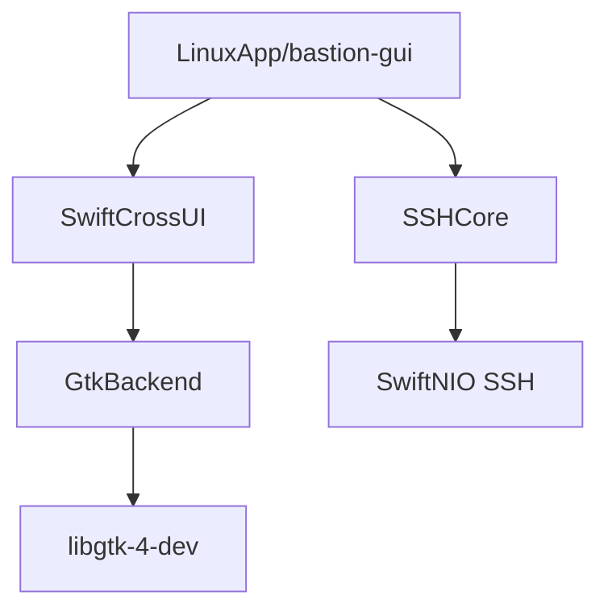

Relevant source files

The following files were used as context for generating this wiki page:

- [LinuxApp/Package.swift](LinuxApp/Package.swift)
- [LinuxApp/Sources/bastion-gui/BastionGUIApp.swift](LinuxApp/Sources/bastion-gui/BastionGUIApp.swift)
- [README.md](README.md)
- [VISION.md](VISION.md)
- [CLAUDE.md](CLAUDE.md)

# Linux Desktop UI

The Linux Desktop UI for Bastion is a native graphical interface built to provide a first-class SSH client experience on Linux distributions. It is part of the project's Phase 3 development goal to extend Bastion's core SSH capabilities—shared across iOS, macOS, and Windows—to the Linux desktop environment. The application is designed to be independent of containers, running as a standalone desktop app.

Sources: [VISION.md:33](VISION.md#L33), [README.md:1-5](README.md#L1-L5)

## Architecture and Frameworks

The Linux UI is decoupled from the core logic to ensure the same `SSHCore` library can be reused across different platforms. While the core is built using **SwiftNIO SSH**, the Linux-specific UI layer utilizes **SwiftCrossUI** with a **GTK4** backend.

### Component Stack
The application is structured as a separate Swift Package Manager (SPM) project located in the `LinuxApp/` directory. This separation prevents UI-specific dependencies like GTK from interfering with the core library builds on other platforms.

| Layer | Component | Description |
|---|---|---|
| **UI Framework** | SwiftCrossUI | A cross-platform UI framework for Swift. |
| **Rendering Backend** | GTK4 (`GtkBackend`) | The specific backend used for Linux rendering. |
| **Business Logic** | `SSHCore` | The shared library handling SSH, SFTP, and encryption. |
| **Data Storage** | `HostStore` | JSON-based storage for host configurations (`~/.bastion/hosts.json`). |

Sources: [README.md:12-15](README.md#L12-L15), [LinuxApp/Package.swift:7-14](LinuxApp/Package.swift#L7-L14), [LinuxApp/Sources/bastion-gui/BastionGUIApp.swift:5-10](LinuxApp/Sources/bastion-gui/BastionGUIApp.swift#L5-L10)

### Dependency Flow
The Linux application depends directly on `GtkBackend` rather than `DefaultBackend` to avoid compilation issues with Windows-specific headers (WinUI) on Linux systems.

The diagram shows the relationship between the Linux executable, the UI framework, and the shared core logic.
Sources: [LinuxApp/Package.swift:19-28](LinuxApp/Package.swift#L19-L28), [README.md:135-142](README.md#L135-L142)

## Core UI Components

The Linux GUI implements several key views to match the functionality provided on Apple platforms, tailored for the GTK desktop environment.

### Main Navigation
The application uses a `NavigationSplitView` as its primary layout structure. This provides a sidebar for the host list and a detail area for dashboards or terminal sessions.

*  **HostListView**: Displays saved servers grouped by tags.
*  **HostDetailView**: A multi-functional area containing the connection "gate" (password/key prompt), system dashboard, and terminal access.
*  **ContentView**: The root view container for the application.

Sources: [README.md:104-108](README.md#L104-L108), [LinuxApp/Sources/bastion-gui/BastionGUIApp.swift:11-16](LinuxApp/Sources/bastion-gui/BastionGUIApp.swift#L11-L16)

### Terminal Implementation
Unlike the iOS/macOS versions which use `SwiftTerm`, the Linux UI implements a custom terminal rendering engine because `SwiftTerm` requires UIKit/AppKit.

*  **TerminalBuffer**: A custom VT100/ANSI interpreter that handles cursor movement, SGR colors, and erasures. It is verified by extensive unit tests.
*  **TerminalGridView**: Renders the text buffer using merged text runs, as GTK via SwiftCrossUI does not utilize a Canvas for this purpose.
*  **TerminalSessionView**: Manages the persistent PTY shell and handles keyboard input, including control keys (Ctrl+C, Tab, Esc) and navigation keys (Home, End, PageUp/Down).

Sources: [README.md:113-118](README.md#L113-L118), [App/TerminalView.swift:8-12](App/TerminalView.swift#L8-L12)

### Specialized Views
| View | Purpose |
|---|---|
| **DashboardView** | Renders remote system snapshots (CPU, RAM, Disk, Docker) using an auto-polling model. |
| **SFTPBrowserView** | Provides a file manager interface for remote operations like renaming, deleting, and navigating. |
| **PortForwardView** | Manages local, remote, and dynamic port forwarding (-L, -R, -D). This is currently unique to the Linux/Windows GUI implementations. |
| **KeyDeployView** | Handles the generation and deployment of SSH keys to remote `authorized_keys` files. |

Sources: [README.md:109-125](README.md#L109-L125)

## Build and Deployment

### Toolchain Requirements
The Linux GUI requires a specific Swift toolchain environment due to compiler bugs in stable versions (e.g., Swift 6.1.3) when building `swift-mutex`.
*  **Minimum Version**: Swift 6.5-dev (or newer than 6.1.3).
*  **System Dependencies**: `libgtk-4-dev` and `pkg-config`.

Sources: [README.md:130-136](README.md#L130-L136), [LinuxApp/Package.swift:7-12](LinuxApp/Package.swift#L7-L12)

### Packaging Goals
While currently built via `swift build`, the project's roadmap includes broader packaging support for various Linux distributions:
*  **.deb packages**: For Debian and Ubuntu.
*  **.rpm packages**: For RHEL and Fedora.
*  **Architecture Support**: x86/amd64 and ARM64 (specifically targeting Raspberry Pi).

Sources: [VISION.md:175-182](VISION.md#L175-L182)

The Linux Desktop UI provides a native GTK4 implementation of the Bastion SSH client, ensuring that Linux users have access to the same dashboard, Docker management, and SFTP features as other platforms while maintaining a lightweight, standalone footprint.
