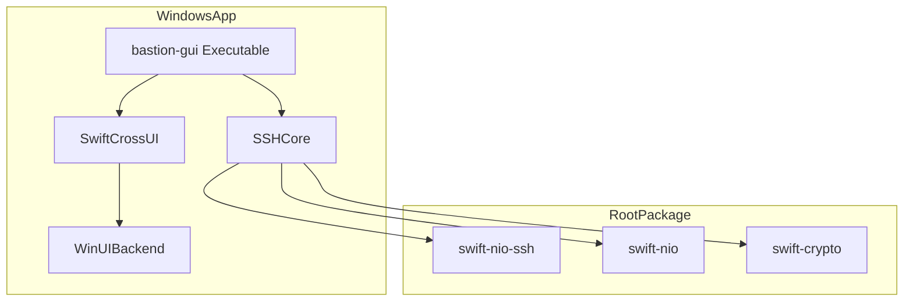

<details>
<summary>Relevant source files</summary>

The following files were used as context for generating this wiki page:

- [WindowsApp/Package.swift](WindowsApp/Package.swift)
- [WindowsApp/Sources/bastion-gui/BastionGUIApp.swift](WindowsApp/Sources/bastion-gui/BastionGUIApp.swift)
- [README.md](README.md)
- [VISION.md](VISION.md)
- [Package.swift](Package.swift)
- [LinuxApp/Package.swift](LinuxApp/Package.swift)
</details>

# Windows Desktop UI

The Windows Desktop UI for Bastion represents the Phase 4 implementation of the project's cross-platform strategy. It is designed to provide a native graphical interface for Windows users while leveraging the shared core business logic found in the `SSHCore` module. This module ensures that features like SSH connectivity, SFTP, and host management remain consistent across all supported platforms, including iOS, macOS, and Linux.

Currently, the Windows implementation is in a "minimal first version" state. It serves as a proof-of-concept for the build pipeline and continuous integration (CI) via GitHub Actions, ensuring the project compiles on Windows environments before full feature parity is achieved by porting views from the Linux/GTK implementation.

Sources: [VISION.md:36](VISION.md#L36), [README.md:144-150](README.md#L144-L150), [WindowsApp/Sources/bastion-gui/BastionGUIApp.swift:5-11](WindowsApp/Sources/bastion-gui/BastionGUIApp.swift#L5-L11)

## Architecture and Technology Stack

The Windows application is structured as a standalone Swift Package Manager (SwiftPM) project located in the `WindowsApp/` directory. This separation prevents Windows-specific dependencies from interfering with the builds of other platforms that may not have the necessary headers or toolchains.

### Dependency Graph
The Windows UI relies on `SwiftCrossUI` to provide a declarative UI framework similar to SwiftUI, using the `WinUIBackend` to interface with native Windows controls.



The diagram shows the relationship between the Windows-specific GUI package and the shared core libraries.
Sources: [WindowsApp/Package.swift:10-21](WindowsApp/Package.swift#L10-L21), [Package.swift:23-30](Package.swift#L23-L30)

### Build Requirements
Developing and building the Windows UI requires specific tools and environment configurations:
*  **Swift for Windows**: Required to compile the Swift source code.
*  **Windows SDK 10.0.17763**: Necessary for compilation.
*  **WindowsAppSDK Runtime**: Required for execution.
*  **Swift Package Manager**: Used for dependency management and building the `.executableTarget`.

Sources: [README.md:200-205](README.md#L200-L205), [WindowsApp/Package.swift:1-5](WindowsApp/Package.swift#L1-L5)

## Implementation Status

The current implementation is deliberately minimal, focusing on verifying the CI pipeline (`.github/workflows/windows-gui.yml`) on `windows-latest` runners.

### Core Components
| Component | Status | Description |
|-----------|--------|-------------|
| `BastionGUIApp` | Functional | The `@main` entry point for the Windows application. Sets default window size (900x560). |
| `ContentView` | Functional | A placeholder view displaying the number of saved hosts and a status message. |
| `HostStore` | Integrated | Leverages the shared core to access the persistent host database. |
| `WinUIBackend` | Integrated | Provides the rendering engine for SwiftCrossUI on Windows. |

Sources: [WindowsApp/Sources/bastion-gui/BastionGUIApp.swift:13-37](WindowsApp/Sources/bastion-gui/BastionGUIApp.swift#L13-L37), [README.md:144-150](README.md#L144-L150)

### Host Data Access
The Windows UI accesses the same host database as other versions of the application. The `ContentView` demonstrates this by initializing a `HostStore` to count the number of saved hosts.

```swift
// WindowsApp/Sources/bastion-gui/BastionGUIApp.swift:24-34
struct ContentView: View {
    private var hostCount: Int {
        HostStore().all().count
    }

    var body: some View {
        VStack(spacing: 12) {
            Text("Bastion för Windows").font(.title2)
            Text("\(hostCount) sparade värdar").foregroundColor(.gray)
            Text("Fullständigt UI porteras hit i ett senare steg.").foregroundColor(.gray)
        }
        .padding()
    }
}
```

Sources: [WindowsApp/Sources/bastion-gui/BastionGUIApp.swift:24-34](WindowsApp/Sources/bastion-gui/BastionGUIApp.swift#L24-L34)

## Future Roadmap

The long-term vision for the Windows UI involves achieving feature parity with the macOS and Linux versions. Key planned developments include:

*  **View Porting**: Migrating complex views (such as the Terminal, Docker dashboard, and SFTP browser) from the `LinuxApp` implementation to Windows.
*  **Native Explorer Integration**: Utilizing **WinFsp** (Windows File System Proxy) to mount SFTP hosts as network drives within Windows Explorer, backed by the `SSHCore.SFTPClient`.
*  **Local Testing**: Transitioning from CI-only verification to local development on Windows machines.
*  **Packaging**: Future support for `.msi` or similar Windows installers to facilitate distribution.

Sources: [VISION.md:154-165](VISION.md#L154-L165), [README.md:144-150](README.md#L144-L150), [README.md:213-220](README.md#L213-L220)

## Conclusion

The Windows Desktop UI is a critical component of Bastion's cross-platform ecosystem. By utilizing `SwiftCrossUI` and `WinUIBackend`, the project maintains a single Swift-based codebase for logic while providing a native user experience on Windows. While currently in a foundational phase, the infrastructure is established to support a full-featured SSH and SFTP client on the Windows platform.
