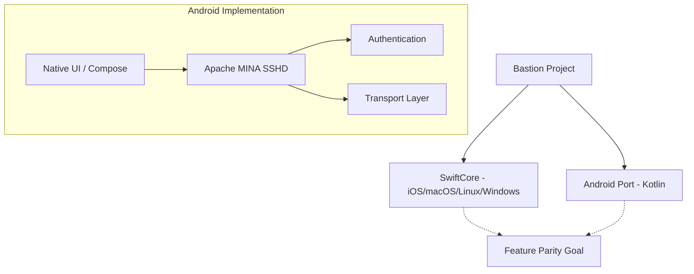

<details>
<summary>Relevant source files</summary>

The following files were used as context for generating this wiki page:

- [Android/app/src/main/AndroidManifest.xml](Android/app/src/main/AndroidManifest.xml)
- [Android/app/src/main/kotlin/se/denied/bastion/ssh/BastionSshSession.kt](Android/app/src/main/kotlin/se/denied/bastion/ssh/BastionSshSession.kt)
- [VISION.md](VISION.md)
- [CLAUDE.md](CLAUDE.md)
- [README.md](README.md)
</details>

# Android Client Implementation

The Android client for Bastion is a native implementation designed to bring the project's cross-platform SSH capabilities to the Android ecosystem. Unlike the iOS, macOS, and Linux versions which share a common Swift-based core (`SSHCore`), the Android client is a separate port written in Kotlin and Java. This architectural decision was made because `SSHCore` is pure Swift and does not have a direct Android counterpart.

The primary purpose of the Android client is to achieve feature parity with existing competitors like Termius by providing a professional, native experience. It aims to eliminate the "platform gap" for developers and system administrators who operate in platform-agnostic environments.

Sources: [VISION.md:126-135](VISION.md#L126-L135), [CLAUDE.md:1-8](CLAUDE.md#L1-L8)

## Architecture and Core Library

The Android implementation deviates from the project's standard "Shared Swift Core" model. While other platforms utilize Apple's `swift-nio-ssh`, the Android client leverages the **Apache MINA SSHD** library. This introduces a separate maintenance requirement for SSH features such as certificate authentication, agent protocols, and SFTP.

### Component Overview

| Component | Technology | Description |
| :--- | :--- | :--- |
| **Language** | Kotlin / Java | Native Android development language. |
| **SSH Core** | Apache MINA SSHD | The underlying library for SSH transport and protocol handling. |
| **Build System** | Gradle | Standard Android build automation tool. |
| **UI Framework** | Jetpack Compose | Potential UI framework (via Skip.tools transpilation or native Kotlin). |

Sources: [VISION.md:143-155](VISION.md#L143-L155), [CLAUDE.md:5-8](CLAUDE.md#L5-L8), [README.md:165-167](README.md#L165-L167)

### Platform Integration Logic

The following diagram illustrates the relationship between the Android client and the broader Bastion ecosystem:



The Android client is a "separate port" that aims for functional alignment with the shared Swift core.
Sources: [CLAUDE.md:1-8](CLAUDE.md#L1-L8), [VISION.md:132-135](VISION.md#L132-L135)

## Implementation Details

### Permissions and Configuration
The Android client requires standard networking permissions to establish remote SSH connections. These are defined in the manifest file.

```xml
<manifest xmlns:android="http://schemas.android.com/apk/res/android">
    <uses-permission android:name="android.permission.INTERNET" />

    <application
        android:label="Bastion"
        android:allowBackup="false" />
</manifest>
```

Sources: [Android/app/src/main/AndroidManifest.xml:1-7](Android/app/src/main/AndroidManifest.xml#L1-L7)

### Build and Tooling
The project uses the Gradle wrapper for consistent builds across different development environments. 

*  **Requirements:** JDK 17+ and Android SDK command-line tools.
*  **Environment:** Configuration is managed via `Android/local.properties` (not committed to the repository).

Sources: [CLAUDE.md:11-13](CLAUDE.md#L11-L13)

### Development Strategies
Two potential paths for the Android implementation were identified:
1.  **Skip (skip.tools):** Transpiling SwiftUI to Kotlin/Compose to reuse the `App/` layer's view logic.
2.  **Separate Kotlin App:** A fully independent implementation using Apache MINA SSHD or JSch, which is the current path indicated in the codebase documentation.

Sources: [VISION.md:139-155](VISION.md#L139-L155)

## Feature Roadmap

The Android client is sequenced after the initial phases (iOS, macOS, Linux, and Windows). Key areas of focus for the Android port include:

*  **Terminal Emulation:** Providing a high-quality terminal experience comparable to the iOS/macOS SwiftTerm implementation.
*  **Docker Management:** Handling remote Docker containers via SSH, a standout feature of the Bastion platform.
*  **SFTP Support:** Full file management capabilities including Drag & Drop, permissions, and text editing.
*  **Security:** Utilizing hardware-backed security where possible and ensuring keys never leave the device unencrypted.

Sources: [VISION.md:44-48](VISION.md#L44-L48), [VISION.md:83-93](VISION.md#L83-L93), [VISION.md:111-115](VISION.md#L111-L115)

## Conclusion

The Android client represents Bastion's commitment to being a truly cross-platform tool for system administrators. By utilizing Apache MINA SSHD, the implementation ensures robust SSH capabilities on Android, even though it requires a separate code path from the Swift-based core used on other platforms. This implementation ensures that the "Bastion" experience—focused on speed, aesthetics, and privacy—is available to the entire mobile developer community.

Sources: [VISION.md:126-135](VISION.md#L126-L135), [CLAUDE.md:5-8](CLAUDE.md#L5-L8)
