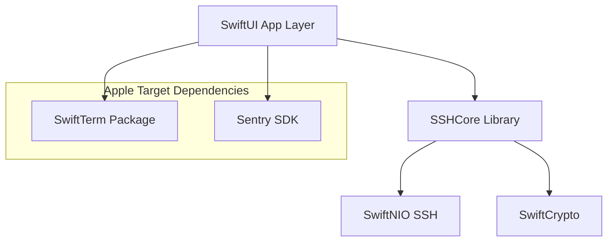
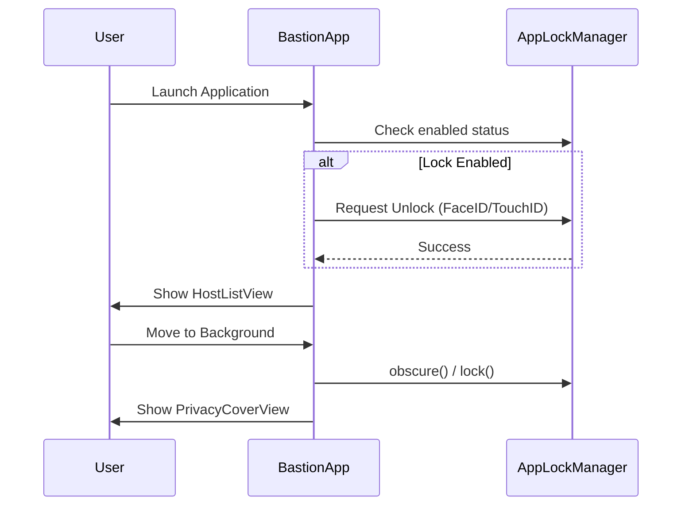
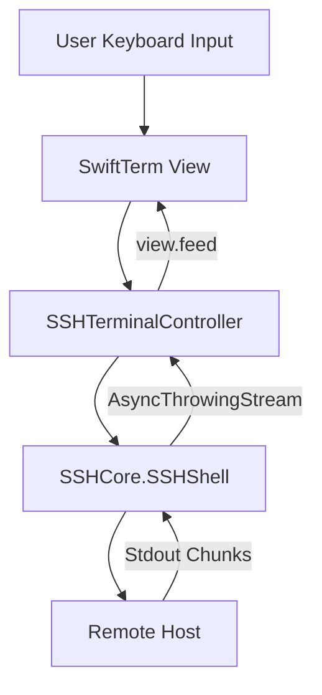

Relevant source files

The following files were used as context for generating this wiki page:

- [App/project.yml](App/project.yml)
- [App/BastionApp.swift](App/BastionApp.swift)
- [App/TerminalView.swift](App/TerminalView.swift)
- [README.md](README.md)
- [VISION.md](VISION.md)
- [App/Assets.xcassets/AppIcon.appiconset/Contents.json](App/Assets.xcassets/AppIcon.appiconset/Contents.json)

# Apple Platforms (iOS and macOS) UI

## Introduction

The Apple Platforms UI for Bastion is a unified interface layer built using SwiftUI, targeting both iOS and macOS. This module serves as a thin UI wrapper around the shared `SSHCore` logic, which handles the complex SSH, SFTP, and synchronization operations. The goal of the Apple-specific UI is to provide a high-performance, native experience that follows Apple's Human Interface Guidelines (HIG) while maintaining a single codebase for iPhone, iPad, and Mac.

Sources: [README.md:143-145](README.md#L143-L145), [VISION.md:86-88](VISION.md#L86-L88), [App/project.yml:1-8](App/project.yml#L1-L8)

## Project Architecture and Build System

Bastion utilizes `XcodeGen` to manage its Apple-specific project structure. The `App/project.yml` file defines two distinct targets—`Bastion` (iOS) and `Bastion-macOS` (macOS)—which share the same source code. This approach allows for platform-specific configurations, such as separate entitlements for macOS App Sandboxing and distinct orientation settings for iOS.

### Build Targets and Configurations

| Target | Platform | Capabilities / Settings |
| :--- | :--- | :--- |
| **Bastion** | iOS | iPhone/iPad support, Manual Code Signing, Sentry Integration |
| **Bastion-macOS** | macOS | App Sandbox (Network Client), OAuth URL schemes, standard Mac UI |

Sources: [App/project.yml:17-40](App/project.yml#L17-L40), [App/project.yml:116-130](App/project.yml#L116-L130), [README.md:143-145](README.md#L143-L145)

### Dependency Graph
The Apple UI relies on external packages for terminal emulation and telemetry, while linking to the local `SSHCore` library for core functionality.

Sources: [App/project.yml:105-114](App/project.yml#L105-L114), [App/project.yml:150-154](App/project.yml#L150-L154), [Package.swift:23-32](Package.swift#L23-L32)

## Application Lifecycle and Security

The entry point for the Apple application is `BastionApp.swift`. It manages the global application state, including security features like biometrics and telemetry initialization.

### App Lock and Privacy
Bastion implements an `AppLockManager` to handle biometrics (Face ID/Touch ID) and a privacy cover. The UI automatically obscures content when the application moves to the background or becomes inactive to prevent sensitive terminal data from appearing in the app switcher.

Sources: [App/BastionApp.swift:9-15](App/BastionApp.swift#L9-L15), [App/BastionApp.swift:54-62](App/BastionApp.swift#L54-L62), [VISION.md:126-128](VISION.md#L126-L128)

### Telemetry (Sentry)
Sentry is integrated primarily for the iOS target to track application starts, performance profiling, and error logging. Profiling is managed manually to ensure accurate measurement of the root view rendering.

Sources: [App/BastionApp.swift:18-47](App/BastionApp.swift#L18-L47), [App/project.yml:110-111](App/project.yml#L110-L111)

## Terminal Implementation

The terminal interface is powered by `SwiftTerm`, which is integrated into SwiftUI via `UIViewRepresentable` (iOS) and `NSViewRepresentable` (macOS).

### SSHTerminalController
The `SSHTerminalController` bridges `SSHCore.SSHShell` with the `SwiftTerm` view. It handles:
- **Data Streaming:** Converting `SSHCore` byte chunks into the terminal feed.
- **User Input:** Routing keyboard events and terminal escapes to the remote shell.
- **Resizing:** Notifying the remote PTY when the local terminal window size changes.
- **Initial Commands:** Automatically executing snippets (e.g., `docker exec`) upon connection.

Sources: [App/TerminalView.swift:34-56](App/TerminalView.swift#L34-L56), [App/TerminalView.swift:145-155](App/TerminalView.swift#L145-L155), [README.md:188-193](README.md#L188-L193)

### Terminal Themes
The UI supports custom terminal themes including background colors, caret (cursor) colors, and the full 16 ANSI color palette. These are parsed from hex strings and applied to the native terminal engine.

Sources: [App/TerminalView.swift:101-125](App/TerminalView.swift#L101-L125)

## View Components and Layout

The Apple UI follows a modular structure where specific views are responsible for different aspects of server management.

| Component | Purpose |
| :--- | :--- |
| **HostListView** | The root view displaying saved servers grouped by tags. |
| **DashboardView** | Renders system snapshots (CPU, RAM, Disk, Docker) for a host. |
| **TerminalView** | Provides the interactive command-line interface. |
| **SFTPBrowserView** | File manager supporting drag-and-drop, permissions, and archives. |
| **SyncSettingsView** | Configures E2E-encrypted synchronization (iCloud, Dropbox, etc.). |

Sources: [README.md:143-171](README.md#L143-L171), [VISION.md:94-118](VISION.md#L94-L118)

## Conclusion

The Apple Platforms UI for Bastion provides a robust, native implementation of a professional SSH client. By utilizing SwiftUI and a shared core architecture, it achieves platform-native performance while ensuring feature parity between iOS and macOS. Key features like biometrically secured access, a high-performance terminal emulator, and native build targets via XcodeGen make it a high-tier tool for system administrators and DevOps professionals.

Sources: [VISION.md:145-149](VISION.md#L145-L149), [README.md:204-206](README.md#L204-L206)
