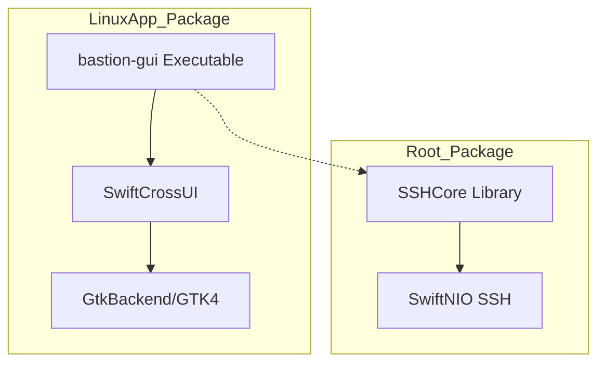

<details>
<summary>Relevant source files</summary>

The following files were used as context for generating this wiki page:

- [LinuxApp/Package.swift](LinuxApp/Package.swift)
- [LinuxApp/Sources/bastion-gui/BastionGUIApp.swift](LinuxApp/Sources/bastion-gui/BastionGUIApp.swift)
- [README.md](README.md)
- [VISION.md](VISION.md)
- [Package.swift](Package.swift)
- [GULDSTANDARD.md](GULDSTANDARD.md)
</details>

# Linux Desktop UI

The Linux Desktop UI for Bastion is a native graphical interface designed to provide a high-performance SSH client experience on Linux distributions. It is built using **SwiftCrossUI** with the **GTK4** backend, allowing for a cross-platform architecture where the user interface layer remains thin while sharing a common core logic with iOS, macOS, and Windows versions.

The primary purpose of the Linux implementation is to offer a standalone application (not container-based) that manages remote servers, Docker containers, and SFTP file transfers directly from the desktop. It utilizes the shared `SSHCore` library, which is based on `swift-nio-ssh`, ensuring consistent protocol handling across all supported platforms.

Sources: [README.md:1-15](README.md#L1-L15), [LinuxApp/Sources/bastion-gui/BastionGUIApp.swift:4-10](LinuxApp/Sources/bastion-gui/BastionGUIApp.swift#L4-L10)

## Architecture and Integration

The Linux application is structured as a separate Swift Package Manager (SwiftPM) project located in the `LinuxApp/` directory. This separation is intentional to prevent GUI-specific dependencies, such as GTK4 and SwiftCrossUI, from impacting the core library's ability to build on platforms or toolchains that do not support them.

### Component Relationship
The Linux UI acts as a consumer of the `SSHCore` library. While the core handles SSH transport, authentication, and host database management, the `bastion-gui` executable target manages the windowing, event loops, and rendering via GTK4.



The diagram shows the dependency flow where the Linux GUI executable depends on SwiftCrossUI for rendering and SSHCore for backend logic.
Sources: [LinuxApp/Package.swift:5-25](LinuxApp/Package.swift#L5-L25), [README.md:112-120](README.md#L112-L120)

## Core UI Components

The Linux GUI implements several specialized views to mirror the functionality of the iOS and macOS versions. These views are orchestrated within the `BastionGUIApp` and its primary `ContentView`.

| Component | Description | Reference File |
| :--- | :--- | :--- |
| **NavigationSplitView** | The main layout structure providing a host list and a detail area. | `README.md` |
| **HostListModel** | A wrapper for the host database, utilizing `HostStore` for persistence. | `README.md` |
| **TerminalSessionView** | Handles the interactive PTY shell with support for control keys and ANSI color. | `README.md` |
| **DockerView** | Provides management for containers, logs, and shell access on remote hosts. | `README.md` |
| **SFTPBrowserView** | A file manager interface for navigating and manipulating remote filesystems. | `README.md` |
| **TerminalBuffer** | A custom VT100/ANSI interpreter developed specifically for the Linux GUI. | `README.md` |

Sources: [README.md:120-145](README.md#L120-L145), [LinuxApp/Sources/bastion-gui/BastionGUIApp.swift:12-20](LinuxApp/Sources/bastion-gui/BastionGUIApp.swift#L12-L20)

## Technical Requirements and Toolchain

Building the Linux GUI requires specific system headers and a modern Swift toolchain due to known compiler issues with certain dependencies.

*  **System Dependencies:** Requires `libgtk-4-dev` and `pkg-config`.
*  **Toolchain Version:** A Swift toolchain newer than **6.1.3** is required. The stable 6.1.3 toolchain (default in Ubuntu 24.04) suffers from a compiler crash when building the `swift-mutex` dependency used by SwiftCrossUI.
*  **Backend Specification:** The project explicitly depends on `GtkBackend` rather than `DefaultBackend` to avoid Windows-specific headers (WinUI) that cause build failures on Linux environments.

### Build Process

```bash
apt-get install libgtk-4-dev pkg-config
cd LinuxApp
swift build --product bastion-gui
```

Sources: [README.md:162-178](README.md#L162-L178), [LinuxApp/Package.swift:5-15](LinuxApp/Package.swift#L5-L15)

## Data Persistence and Synchronization

On Linux, the application stores its configuration and host database in a standardized location.

*  **Host Database:** Stored at `~/.bastion/hosts.json`.
*  **Authentication:** Unlike the Apple platforms that use Keychain, the Linux version lacks a native Keychain implementation in the current `AuthResolver`, resulting in `nil` for keychain-based keys.
*  **Synchronization:** Supports E2E-encrypted sync using `SyncEngine` via a `FolderSyncProvider`. This allows users to point the application to a synced folder (e.g., Dropbox or Syncthing) to share host data across devices without a central server.

Sources: [README.md:18-25](README.md#L18-L25), [README.md:144-148](README.md#L144-L148), [LinuxApp/Sources/bastion-gui/BastionGUIApp.swift:5-10](LinuxApp/Sources/bastion-gui/BastionGUIApp.swift#L5-L10)

## Features and Functionality

The Linux UI aims for feature parity with the mobile counterparts, with some platform-specific extensions:

### Port Forwarding
The Linux GUI includes a `PortForwardView` which enables local (`-L`), remote (`-R`), and dynamic (`-D`) port forwarding. This feature allows the desktop client to tunnel network traffic through SSH sessions.

### Key Management
The `KeyDeployView` provides an interface to generate, deploy, and verify SSH keys. It allows users to transition a host from password-based authentication to key-based authentication once the deployment is successful.

### Tailscale Integration
The `TailscaleDiscoveryView` allows the application to suggest hosts from a Tailnet (either local or via a remote host) and add them to the internal host database.

Sources: [README.md:140-146](README.md#L140-L146), [VISION.md:155-165](VISION.md#L155-L165)

## Summary

The Linux Desktop UI serves as a critical pillar of Bastion's cross-platform strategy. By utilizing a Swift-native stack with GTK4, it provides a performant, standalone desktop experience that remains synchronized with other devices through E2E-encrypted file-based transport. Its architecture ensures that the complex SSH and terminal logic is shared via `SSHCore` while maintaining a platform-appropriate native look and feel.

Sources: [VISION.md:38-45](VISION.md#L38-L45), [README.md:1-10](README.md#L1-L10)
