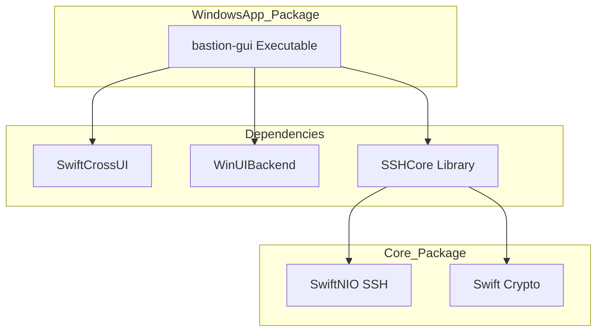

<details>
<summary>Relevant source files</summary>

The following files were used as context for generating this wiki page:

- [WindowsApp/Package.swift](WindowsApp/Package.swift)
- [WindowsApp/Sources/bastion-gui/BastionGUIApp.swift](WindowsApp/Sources/bastion-gui/BastionGUIApp.swift)
- [Package.swift](Package.swift)
- [README.md](README.md)
- [VISION.md](VISION.md)
</details>

# Windows Desktop UI

The Windows Desktop UI for Bastion is a native graphical user interface built using the **SwiftCrossUI** framework with the **WinUIBackend**. It represents Phase 4 of the project's development plan, aiming to provide a first-class SSH client experience on Windows that shares the same core logic (`SSHCore`) as the iOS, macOS, and Linux versions.

The implementation is currently housed in a separate Swift Package Manager (SPM) package within the `WindowsApp/` directory. This separation is intentional to prevent platform-specific dependencies, such as WinUI headers, from interfering with the cross-platform builds of the core library on other operating systems. Sources: [VISION.md:46](VISION.md#L46), [README.md:120](README.md#L120), [WindowsApp/Package.swift:5-10](WindowsApp/Package.swift#L5-L10)

## Architecture and Frameworks

The Windows application follows a decoupled architecture where the UI layer is a thin wrapper around the cross-platform `SSHCore` library.

### Technical Stack
*  **Language:** Swift
*  **UI Framework:** [SwiftCrossUI](https://github.com/moreSwift/swift-cross-ui) (v0.8.0+)
*  **Backend:** `WinUIBackend`
*  **Core Logic:** `SSHCore` (local package dependency)
*  **Toolchain:** Swift 5.10+ (Windows-compatible)

Sources: [WindowsApp/Package.swift:12-16](WindowsApp/Package.swift#L12-L16), [WindowsApp/Sources/bastion-gui/BastionGUIApp.swift:1-12](WindowsApp/Sources/bastion-gui/BastionGUIApp.swift#L1-L12)

### Dependency Structure
The Windows GUI relies on a specific set of dependencies to bridge the gap between Swift code and native Windows UI components.



*The diagram shows the hierarchical relationship between the Windows executable and its supporting libraries.* Sources: [WindowsApp/Package.swift:18-24](WindowsApp/Package.swift#L18-L24), [Package.swift:25-30](Package.swift#L25-L30)

## Implementation Details

### Application Entry Point
The application is defined using the `@main` attribute on the `BastionGUIApp` struct. It initializes a `WindowGroup` titled "Bastion" with a default window size of 900x560.

```swift
@main
struct BastionGUIApp: App {
    var body: some Scene {
        WindowGroup("Bastion") {
            ContentView()
        }
        .defaultSize(width: 900, height: 560)
    }
}
```

Sources: [WindowsApp/Sources/bastion-gui/BastionGUIApp.swift:14-23](WindowsApp/Sources/bastion-gui/BastionGUIApp.swift#L14-L23)

### Current Capabilities
As of the current development phase, the Windows UI is in a "minimal first version" state. It serves primarily as a proof-of-concept for the CI/CD pipeline and the Swift toolchain on Windows.

| Component | Description | Status |
|---|---|---|
| **Host Integration** | Accesses the shared `HostStore` to count saved servers. | Functional |
| **View Layout** | Minimal `VStack` displaying app title and host count. | Functional |
| **SSH Core** | Compiles and links against the SwiftNIO-based core. | Functional |
| **Full UI** | Complex views (Terminal, SFTP, Docker) from Linux/iOS. | Pending Portering |

Sources: [WindowsApp/Sources/bastion-gui/BastionGUIApp.swift:25-41](WindowsApp/Sources/bastion-gui/BastionGUIApp.swift#L25-L41), [README.md:120-123](README.md#L120-L123)

## Build and Deployment

Building the Windows UI requires the Swift for Windows toolchain and specific Windows SDK components.

### Build Requirements
1.  **Swift Toolchain:** Swift 5.10 or newer.
2.  **Windows SDK:** Version 10.0.17763 (compilation).
3.  **Runtime:** WindowsAppSDK-runtime (execution).
4.  **Package Versioning:** Specifically pins `swift-nio` to version 2.86.2 to avoid `Sendable/IPPROTO` compilation errors triggered by Swift 6 strict concurrency mode on Windows.

Sources: [Package.swift:15-23](Package.swift#L15-L23), [README.md:200-205](README.md#L200-L205)

### Build Command
The application can be built using the Swift Package Manager from the `WindowsApp` directory:

```powershell
cd WindowsApp
swift build --product bastion-gui
```

Sources: [README.md:195-198](README.md#L195-L198)

## Future Roadmap
The vision for the Windows platform includes deep integration with the operating system, specifically targeting the native file explorer.

*  **Windows Explorer Integration:** Integration via **WinFsp** (Windows File System Proxy) to mount SFTP hosts as network drives.
*  **UI Parity:** Porting functional views (Terminal, SFTP browser, Docker management) from the Linux GTK implementation.
*  **Native WireGuard:** Ability to establish WireGuard/Tailscale tunnels directly within the Windows app without external dependencies.

Sources: [VISION.md:162-172](VISION.md#L162-L172), [README.md:120-123](README.md#L120-L123)

The Windows Desktop UI ensures that Bastion remains a "standalone" app—downloadable and executable directly on the desktop without requiring containers or complex environments. Sources: [README.md:1-5](README.md#L1-L5)
