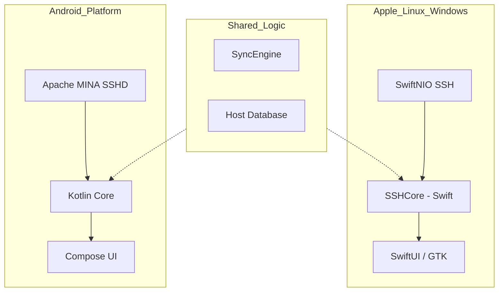
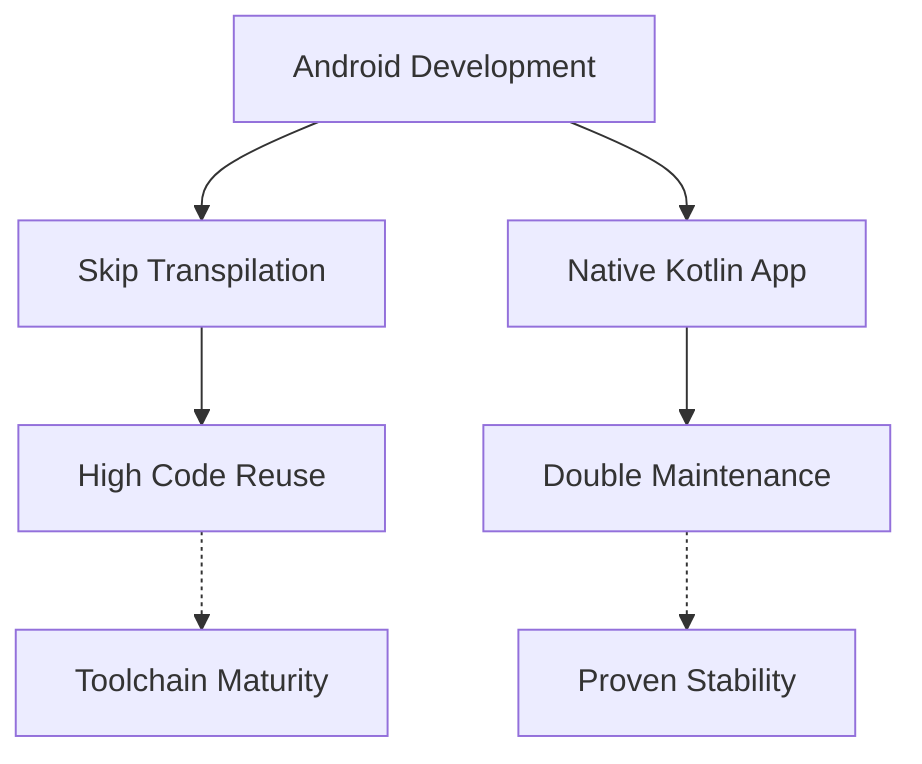

Relevant source files

The following files were used as context for generating this wiki page:

- [Android/app/src/main/AndroidManifest.xml](Android/app/src/main/AndroidManifest.xml)
- [Android/gradlew.bat](Android/gradlew.bat)
- [VISION.md](VISION.md)
- [CLAUDE.md](CLAUDE.md)
- [README.md](README.md)
- [ROADMAP.md](ROADMAP.md)

# Android Client Implementation

The Android client for Bastion represents a significant architectural departure from the core Apple, Linux, and Windows implementations. While other platforms share a unified core library (`SSHCore`) written in Swift and based on SwiftNIO, the Android implementation is a standalone port developed in Kotlin using the Gradle build system. This separation is necessary because the Swift-based `SSHCore` lacks a native Android equivalent, leading the project to adopt different technical foundations for the Android ecosystem.

The primary purpose of the Android client is to achieve broad cross-platform parity with competitors like Termius. The implementation focuses on providing a first-class mobile experience for system administrators and DevOps professionals, ensuring that the project's vision of a free, open-source, and independent SSH client is accessible to Android users without the gaps typically found in cross-platform tools.

Sources: [VISION.md:144-150](VISION.md#L144-L150), [CLAUDE.md:5-9](CLAUDE.md#L5-L9), [README.md:118-121](README.md#L118-L121)

## Architectural Foundation

Unlike the Apple and Linux versions which utilize the shared `SSHCore` library, the Android client is built as a separate Kotlin-based application. It leverages different underlying technologies for its networking and SSH capabilities.

### Core Technology Stack
The Android implementation is defined by three primary technical choices:
*  **Language:** Kotlin.
*  **Build System:** Gradle (utilizing `gradlew.bat` for Windows-based builds and standard Gradle wrappers).
*  **SSH Engine:** Apache MINA SSHD (or JSch), chosen as a JVM-compatible alternative to the SwiftNIO SSH implementation used on other platforms.

The following diagram illustrates the relationship between the Android client and the rest of the Bastion ecosystem:

This diagram shows that while high-level logic like the Sync Engine and Host Database are shared in principle, the Android client maintains a separate implementation stack (Kotlin/Apache MINA) compared to the Swift-based core used by other targets.

Sources: [CLAUDE.md:5-9](CLAUDE.md#L5-L9), [VISION.md:154-162](VISION.md#L154-L162), [Android/gradlew.bat](Android/gradlew.bat)

## Permissions and Manifest

The Android application is configured with minimal permissions initially, focusing on essential network access required for SSH connectivity. The `AndroidManifest.xml` defines the application identity and basic requirements.

| Element | Attribute | Value | Description |
| :--- | :--- | :--- | :--- |
| `uses-permission` | `android:name` | `android.permission.INTERNET` | Required for establishing SSH connections to remote servers. |
| `application` | `android:label` | Bastion | The display name of the application. |
| `application` | `android:allowBackup` | false | Security setting to prevent unauthorized backups of sensitive SSH data. |

Sources: [Android/app/src/main/AndroidManifest.xml:2-6](Android/app/src/main/AndroidManifest.xml#L2-L6)

## Implementation Challenges and Development Paths

The Android client is identified as the "only platform in the backlog" that does not reuse the `SSHCore` code directly. This necessitates a "double maintenance burden" where features like certificate authentication, agent protocols, and SFTP must be implemented separately for both the Swift core and the Android Kotlin client.

### Potential Evolution Paths
The project has identified two potential paths for the Android implementation's future:
1.  **Skip (skip.tools):** A path involving transpiling SwiftUI and Swift code into Kotlin/Compose. This would theoretically allow for higher code reuse but requires evaluation of its maturity for complex terminal rendering and PTY handling.
2.  **Separate Kotlin App:** The current path, using a native JVM-compatible SSH library like Apache MINA SSHD or JSch. This is the more proven route but requires manual parity with the Swift implementation.

Sources: [VISION.md:151-167](VISION.md#L151-L167), [CLAUDE.md:7-9](CLAUDE.md#L7-L9)

## Build Configuration

The Android project is managed via Gradle. The repository includes standard wrappers to ensure build consistency across different development environments.

*  **JDK Requirement:** JDK 17+ is mandatory for building the Android client.
*  **Build Scripts:** The project includes `gradlew.bat` to support developers on Windows environments, handling the initialization of the Gradle environment and the processing of project arguments.
*  **Local Properties:** Sensitive build-time configurations such as the `Android SDK` path are managed via `local.properties`, which is excluded from version control for security.

Sources: [CLAUDE.md:16-17](CLAUDE.md#L16-L17), [Android/gradlew.bat:1-50](Android/gradlew.bat#L1-L50)

## Conclusion

The Android Client Implementation is a critical component of Bastion's cross-platform strategy, aimed at providing a robust alternative to commercial clients like Termius. While it currently operates as a separate Kotlin-based codebase using Apache MINA SSHD rather than the project's shared Swift core, it remains focused on delivering the same core value of secure, free, and open-source SSH access to mobile users.
