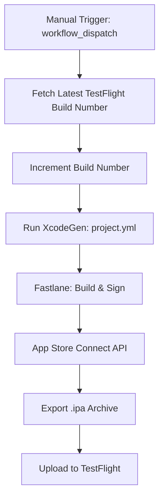
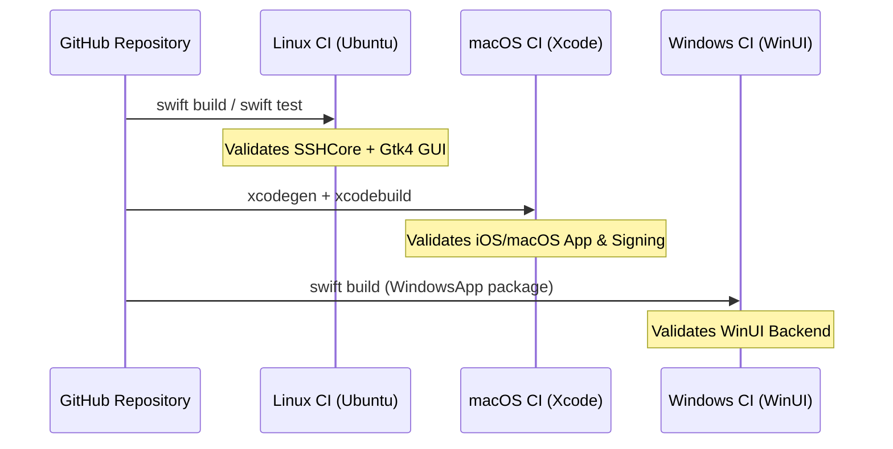

Relevant source files

The following files were used as context for generating this wiki page:

- [App/project.yml](App/project.yml)
- [README.md](README.md)
- [GULDSTANDARD.md](GULDSTANDARD.md)
- [CLAUDE.md](CLAUDE.md)
- [Package.swift](Package.swift)
- [VISION.md](VISION.md)

# CI/CD Pipelines & TestFlight Publishing

## Introduction
The Bastion project utilizes a robust CI/CD infrastructure designed to support its multi-platform nature, covering iOS, macOS, Linux, and Windows. The primary objective is to ensure that the core SSH logic (`SSHCore`) remains stable across all targets while providing automated pathways for publishing Apple-specific applications to TestFlight. 

The pipeline architecture relies heavily on GitHub Actions for automation, leveraging specialized runners for different operating systems. This includes macOS runners for Xcode-based builds and signing, as well as Linux and Windows runners for cross-platform validation. This automation allows developers to build and distribute the application without requiring a local Mac for every step of the publishing process.

Sources: [README.md:1-15](README.md#L1-L15), [README.md:204-209](README.md#L204-L209), [VISION.md:100-110](VISION.md#L100-L110)

## GitHub Actions & Workflow Automation
The project implements a "Guldstandard" (Gold Standard) for repository configuration, which includes a suite of standard GitHub Action workflows. These workflows handle routine maintenance, security scanning, and platform-specific builds.

### Standard Workflows
The project employs eight standard workflow files for general repository health:
*  `auto-commit.yml` / `auto-label.yml`: Automated repository maintenance.
*  `auto-merge.yml` / `auto-rebase.yml`: Pull request management.
*  `auto-release.yml`: Automated version tagging and releases.
*  `ci-autofix.yml`: Automated code style or linting fixes.
*  `security-alerts-sync.yml` / `codeql.yml`: Security monitoring and static analysis.

Sources: [GULDSTANDARD.md:14-17](GULDSTANDARD.md#L14-L17), [GULDSTANDARD.md:73-77](GULDSTANDARD.md#L73-L77)

### Platform-Specific CI
CI tasks are divided by platform targets to ensure the `SSHCore` library remains buildable and tested everywhere:
*  **macOS CI**: Verified via `swiftpm-macos` and `xcodegen-and-build` jobs.
*  **Linux CI**: Verified via `linuxapp-build` to ensure compatibility with GTK4/SwiftCrossUI.
*  **Windows CI**: Verified via `windows-gui.yml` using `windows-latest` runners to validate the WinUI backend.

Sources: [GULDSTANDARD.md:26-30](GULDSTANDARD.md#L26-L30), [README.md:188-193](README.md#L188-L193), [CLAUDE.md:12-14](CLAUDE.md#L12-L14)

## TestFlight Publishing Pipeline
The project uses a specialized workflow (`.github/workflows/testflight.yml`) to automate the submission of iOS builds to Apple's TestFlight. This process is triggered manually via `workflow_dispatch`.

### Automated Build & Signing
The publishing pipeline bypasses the need for local manual signing by using the App Store Connect API together with `fastlane match`. `match` retrieves the encrypted certificates and provisioning profiles from the `bastion-certificates` repository over SSH (via a dedicated deploy key) and decrypts them with a shared passphrase, letting GitHub Actions runners manage signing dynamically.

The following diagram illustrates the TestFlight publishing flow:

*This flow shows the transition from manual trigger to the final upload on Apple's servers.*

Sources: [README.md:204-211](README.md#L204-L211), [App/project.yml:1-10](App/project.yml#L1-L10)

### Required Secrets for Publishing
To enable automated TestFlight uploads, specific secrets must be configured in GitHub Actions:

| Secret Name | Description | Source |
|:---|:---|:---|
| `APP_STORE_CONNECT_TEAM_ID` | 10-character Developer Portal Team ID | Developer Portal -> Membership |
| `APP_STORE_CONNECT_KEY_ID` | API Key ID from App Store Connect | Users and Access -> Integrations |
| `APP_STORE_CONNECT_ISSUER_ID` | Issuer ID for the API Key | Users and Access -> Integrations |
| `APP_STORE_CONNECT_KEY_CONTENT` | Base64 encoded `.p8` API key file | Downloaded from App Store Connect |
| `MATCH_PASSWORD` | Passphrase to decrypt the `match` certificate/profile repository | Shared secret set up with `match` |
| `MATCH_DEPLOY_KEY` | SSH deploy key granting read access to the `bastion-certificates` repository | GitHub deploy key for `bastion-certificates` |
| `SENTRY_AUTH_TOKEN` | Auth token used to upload dSYMs/release info to Sentry | Sentry project settings |

Sources: [README.md:213-222](README.md#L213-L222), [.github/workflows/testflight.yml:12-73](.github/workflows/testflight.yml#L12-L73)

## Project Configuration with XcodeGen
The project uses `XcodeGen` to manage `Bastion.xcodeproj`. This ensures that the project file is easily versioned and can be generated on the fly during CI/CD processes.

### Target Definitions
The `project.yml` file defines two primary Apple targets:
1.  **Bastion (iOS)**: Targeted at iPhone and iPad (Device Family 1,2), requiring iOS 17.0+.
2.  **Bastion-macOS**: Targeted at macOS 14.0+, utilizing App Sandbox with `com.apple.security.network.client` permissions.

### Provisioning Styles
The project uses **Manual** code signing in its configuration to ensure consistency during CI builds. This avoids "No devices" errors in headless environments which typically plague automatic signing attempts.

Sources: [App/project.yml:10-20](App/project.yml#L10-L20), [App/project.yml:68-85](App/project.yml#L68-L85), [App/project.yml:130-140](App/project.yml#L130-L140)

## Cross-Platform Validation Logic
Because `SSHCore` is the foundation for all platforms, the CI/CD pipeline must validate it against multiple Swift environments.

*The sequence demonstrates how a single repository update triggers concurrent validation across three distinct platform environments.*

Sources: [README.md:144-150](README.md#L144-L150), [README.md:162-170](README.md#L162-L170), [README.md:188-195](README.md#L188-L195), [CLAUDE.md:1-10](CLAUDE.md#L1-L10)

## Conclusion
The CI/CD and TestFlight publishing infrastructure of Bastion provides a scalable way to maintain a complex cross-platform Swift project. By centralizing core logic in `SSHCore` and using `XcodeGen` for project management, the project ensures that automated pipelines can handle everything from security auditing to App Store distribution with minimal manual intervention.

Sources: [README.md:225-228](README.md#L225-L228), [VISION.md:120-125](VISION.md#L120-L125)
