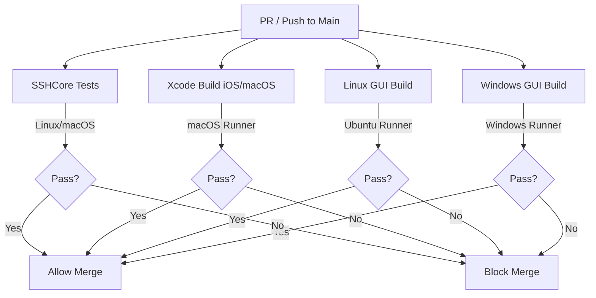
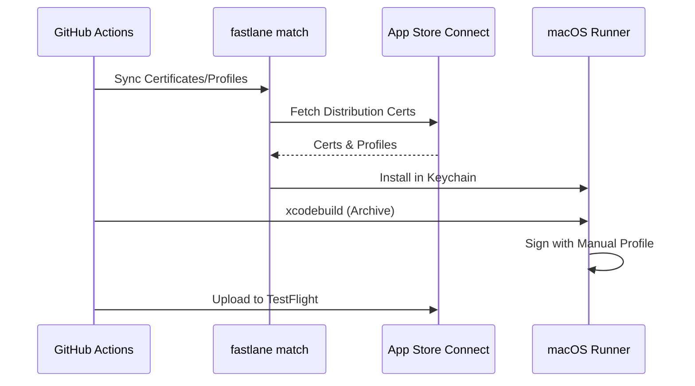

Relevant source files

The following files were used as context for generating this wiki page:

- [App/project.yml](App/project.yml)
- [README.md](README.md)
- [GULDSTANDARD.md](GULDSTANDARD.md)
- [SECURITY.md](SECURITY.md)
- [AGENTS.md](AGENTS.md)
- [CLAUDE.md](CLAUDE.md)

# CI/CD Pipelines & TestFlight Automation

## Introduction
The Bastion project utilizes a robust CI/CD infrastructure designed to maintain code quality across its cross-platform architecture, covering iOS, macOS, Linux, and Windows. The automation strategy focuses on verifying the core logic within the `SSHCore` library while providing specialized pipelines for platform-specific GUI applications.

A significant component of this system is the TestFlight automation, which allows for building, signing, and uploading the iOS and macOS applications directly from GitHub Actions without requiring a local Mac. This ensures that the latest features are always available for testing in a consistent and reproducible environment.

Sources: [README.md:168-185](README.md#L168-L185), [CLAUDE.md:8-13](CLAUDE.md#L8-L13)

## CI/CD Pipeline Architecture
The project employs several GitHub Actions workflows to handle continuous integration across different environments. These pipelines are triggered by pull requests and manual dispatches, ensuring that the main branch remains stable.

### Core and Platform Verification
The following diagram illustrates the high-level flow of the CI/CD verification process for different components of the repository.

The project enforces a "Guldstandard" for its repository configuration, which includes a specific "Protect main" branch ruleset. This ruleset requires specific status checks to pass before merging is allowed.

Sources: [GULDSTANDARD.md:28-36](GULDSTANDARD.md#L28-L36), [README.md:139-145](README.md#L139-L145), [CLAUDE.md:8-13](CLAUDE.md#L8-L13)

### Specialized Workflows
The automation suite includes several standard and project-specific workflows:

| Workflow File | Purpose |
|---|---|
| `xcode.yml` | Builds iOS and macOS targets using a macOS runner. |
| `linuxapp-build` | Verifies the SwiftCrossUI/GTK4 Linux application. |
| `windows-gui.yml` | Compiles the Windows-specific GUI via a `windows-latest` runner. |
| `codeql.yml` | Performs security scanning for injection vulnerabilities. |
| `testflight.yml` | Handles automated distribution to Apple TestFlight. |

Sources: [GULDSTANDARD.md:17-26](GULDSTANDARD.md#L17-L26), [GULDSTANDARD.md:73-77](GULDSTANDARD.md#L73-L77), [README.md:158-161](README.md#L158-L161)

## TestFlight & Code Signing Automation
The TestFlight automation is a manual workflow (`workflow_dispatch`) that leverages Fastlane and the App Store Connect API to manage the complex signing and upload process.

### Automated Signing Logic
The project uses **Manual Code Signing** within the CI environment to avoid dependency on registered test devices, which is a common limitation of automatic signing on headless runners.

Sources: [README.md:168-185](README.md#L168-L185), [App/project.yml:52-78](App/project.yml#L52-L78)

### Required Configuration Secrets
To enable TestFlight uploads, specific secrets must be configured in the GitHub repository settings.

| Secret Name | Description |
|---|---|
| `APP_STORE_CONNECT_TEAM_ID` | 10-character Team ID from the Developer Portal. |
| `APP_STORE_CONNECT_KEY_ID` | API Key ID from App Store Connect. |
| `APP_STORE_CONNECT_ISSUER_ID` | API Issuer ID from App Store Connect. |
| `APP_STORE_CONNECT_KEY_CONTENT` | Base64 encoded `.p8` API key content. |

Sources: [README.md:175-184](README.md#L175-L184)

## Security and Compliance
Automation also extends to security monitoring and compliance. The project utilizes `CodeQL` for scanning injection-sensitive areas such as Docker command builders and SSH key parsers.

*  **Dependabot:** Automatically monitors and updates third-party dependencies like `SwiftNIO` and `SwiftTerm`.
*  **Secret Scanning:** Enforces push protection to prevent credentials or private keys from being committed to the repository.
*  **Export Compliance:** The build process is configured via `project.yml` to set `ITSAppUsesNonExemptEncryption` to `false` during the archive process to satisfy App Store requirements automatically.

Sources: [GULDSTANDARD.md:70-77](GULDSTANDARD.md#L70-L77), [SECURITY.md:5-24](SECURITY.md#L5-L24), [App/project.yml:45-48](App/project.yml#L45-L48)

## Conclusion
The Bastion project's CI/CD and TestFlight automation provide a professional-grade release pipeline. By combining cross-platform test suites with advanced Apple distribution automation, the project maintains high velocity while ensuring that security and stability standards are met across all supported operating systems.
