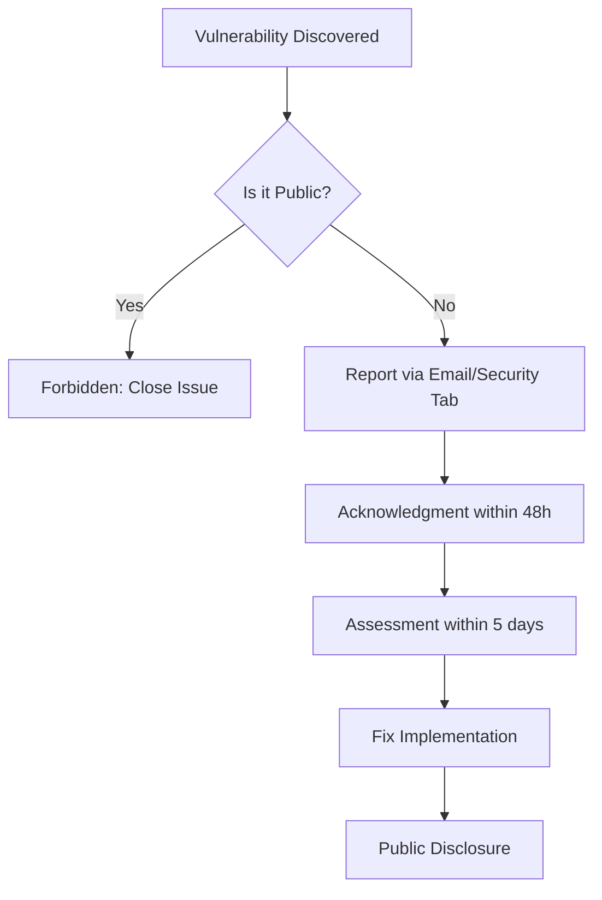
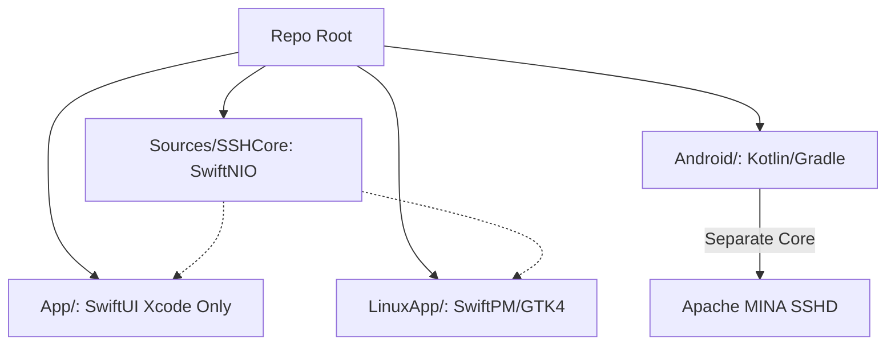

Relevant source files

The following files were used as context for generating this wiki page:

- [AGENTS.md](AGENTS.md)
- [CLAUDE.md](CLAUDE.md)
- [GULDSTANDARD.md](GULDSTANDARD.md)
- [VISION.md](VISION.md)
- [SECURITY.md](SECURITY.md)
- [README.md](README.md)

# AI Agents & Contributor Rules

The Bastion project establishes a strict framework for both human contributors and AI agents to ensure code quality, security, and architectural consistency across its multi-platform SSH client. As the project utilizes a shared core (`SSHCore`) built on SwiftNIO while supporting diverse UI layers (SwiftUI for Apple, GTK4 for Linux, and Kotlin for Android), these rules prevent fragmentation and maintain the project's "free and open" philosophy.

Contributors and AI agents must adhere to specific technical conventions, such as PKCE-based OAuth and local-only encryption, to uphold the project's high security standards. These rules are codified in various "Gold Standard" documents that align Bastion with other repositories in the organization.

Sources: [VISION.md:1-12](VISION.md#L1-L12), [README.md:1-10](README.md#L1-L10), [AGENTS.md:1-10](AGENTS.md#L1-L10)

## Contributor Guidelines & Repository Standards

The project follows a "Gold Standard" configuration to ensure consistency across all organizational repositories. This includes a mandatory set of files, GitHub configuration settings, and automated workflows.

### Mandatory Repository Files
Every repository must include the following files to meet the standard:
- `LICENSE` (MIT)
- `SECURITY.md`
- `AGENTS.md`
- `CLAUDE.md`
- `.github/FUNDING.yml` (GitHub Sponsors + PayPal)

Sources: [GULDSTANDARD.md:8-18](GULDSTANDARD.md#L8-L18)

### Branch Protection & Pull Requests
The `main` branch is protected by specific rulesets:
- **Pull Requests Required**: All changes must go through a PR; direct pushes to `main` are forbidden.
- **Status Checks**: CI jobs (e.g., `swiftpm-macos`, `linuxapp-build`) must pass before merging.
- **Merge Methods**: Squash, rebase, and standard merges are all allowed.

Sources: [GULDSTANDARD.md:29-38](GULDSTANDARD.md#L29-L38), [AGENTS.md:18-25](AGENTS.md#L18-L25)

## AI Agent Operation Rules

AI agents (such as Claude) are provided with specific "Allowed" and "Forbidden" actions to ensure they act as helpful assistants without compromising repository integrity.

### Agent Permissions
| Category | Action |
|---|---|
| **Allowed** | Create branches, modify code, run tests, open PRs |
| **Forbidden** | Push directly to main, merge PRs, delete branches, modify secrets, change GitHub settings |

Sources: [AGENTS.md:18-28](AGENTS.md#L18-L28)

### Development Workflow for Agents
Agents must prioritize the following when modifying the codebase:
1.  **Core Testing**: New functionality in `SSHCore` must include tests in `Tests/SSHCoreTests`.
2.  **Platform Awareness**: `App/` is Xcode-only and cannot be verified via `swift build` on Linux; `LinuxApp/` is a separate package to avoid dependency bloat.
3.  **Code Concentration**: Keep PRs focused and never include unrelated changes.

Sources: [AGENTS.md:12-16](AGENTS.md#L12-L16), [CLAUDE.md:10-14](CLAUDE.md#L10-L14)

## Security Rules for Contributors

Security is a primary pillar of the Bastion project. Specific implementation rules are enforced to ensure secrets and private data are never compromised.

### Encryption & Secret Handling
- **No Unencrypted Secrets**: Keys, passphrases, and tokens must never leave the device okrypterat.
- **Local Storage**: Secrets must be stored in the system Keychain (iOS/macOS) and never in cleartext on disk.
- **OAuth Implementation**: All OAuth integrations must use PKCE (RFC 7636); client secrets are strictly forbidden in the source code.
- **E2E Encryption**: Synced data must be encrypted using AES-256-GCM with keys derived via PBKDF2-HMAC-SHA256.

Sources: [AGENTS.md:15-16](AGENTS.md#L15-L16), [SECURITY.md:47-55](SECURITY.md#L47-L55), [README.md:24-30](README.md#L24-L30)

### Security Reporting Flow
The following diagram illustrates the protocol for reporting vulnerabilities:

Sources: [SECURITY.md:3-20](SECURITY.md#L3-L20)

## Technical Conventions & Build Rules

The project architecture requires strict adherence to language-specific build systems to maintain cross-platform compatibility.

*Note: While Apple and Linux share the Swift SSHCore, Android uses a separate implementation due to Swift's lack of Android parity.*

Sources: [CLAUDE.md:3-7](CLAUDE.md#L3-L7), [README.md:108-140](README.md#L108-L140)

### Build Standards
- **Standard Toolchain**: `swift test` must pass in the repository root for any core changes.
- **Dependency Management**: Bastion uses Dependabot for version updates (a deviation from the organizational standard of Renovate).
- **Code Scanning**: CodeQL is enabled for Bastion to detect injection vulnerabilities in sensitive areas like the Docker command builder and SSH key parser.

Sources: [AGENTS.md:31](AGENTS.md#L31), [GULDSTANDARD.md:73-77](GULDSTANDARD.md#L73-L77)

## Conclusion
The contributor rules for Bastion are designed to protect its open-source mission while enabling rapid development across multiple platforms. By enforcing strict security practices, such as PKCE for OAuth and mandatory local encryption, and defining clear boundaries for AI agents, the project ensures that contributions remain high-quality and safe for the system administrator target audience.

Sources: [VISION.md:1-12](VISION.md#L1-L12), [AGENTS.md:1-5](AGENTS.md#L1-L5)
